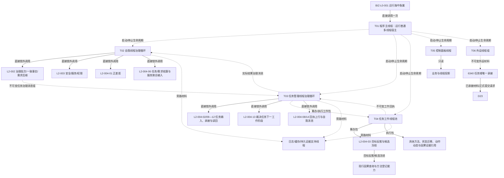

# BIZ-MAP-001 目标业务图到冻结函数与能力证据映射

更新时间：2026-08-16

## 1. 状态与连接类型

目标函数状态：`当前复用 / 适配扩展 / 待新增 / 待核`。目标设计不证明实现；能力目录的静态证据仍须按当前签名、所有权和运行验证重新核对。

连接类型固定为：

```text
直接函数调用：同一线程、队列锁外、同步取得值式结果
异步消息后继：发送阶段结束，接收线程以后独立消费
只读投影：只读且不反写机器事实
支持线程旁路：工程证据 / 缓存 / 日志，失败不改写业务结果
```

## 1.1 2026-08-13 数据服务接口重基线增量

本节是后续新施工的优先口径。下文既有映射保留为历史目标分解证据，其中按旧 L1 通用访问模式、旧世界入口或旧初始化入口形成的接口判断，不得直接用于新计划、详细设计或代码施工。新业务叶必须先按以下顺序落到强类型公开数据服务：

```text
业务叶函数
-> 强类型对象与完整请求 / 结果 DTO
-> 具名公开数据服务
-> 公开操作
-> 一致性、幂等和事务边界
-> 当前 ABI 状态
```

### I1 最小目标函数与能力映射

| 业务节点 / 叶函数 | 目标函数完整签名 | 所需强类型能力 | 具名公开服务与操作 | 裁决 | 完成边界 |
| --- | --- | --- | --- | --- | --- |
| `SYSTEM-WORLD-TREE-ROOT-PUBLISH-I1` 系统具名场景树根建立与正式读回发布 | `系统世界树根初始化结果 初始化并发布系统世界树根(普通应用上下文& 上下文, const 系统世界树根初始化请求& 请求) noexcept` | 当前场景树结构登记、`L2场景树根建立请求`、`L2场景树身份`、当前完整 `L2场景树事实`、调用方拥有的值式发布材料 | 经 A1 取得同实例 `L2场景结构服务`；依次调用 `读取当前场景树结构登记`、`建立场景树根`、再次 `读取当前场景树结构登记`、`读取场景树` | **I1 v0.6 已实现 provider并接正式启动**。正式结果 `88b29a79`、退出 `d4c65e40`、清理 `f5eff1bd`；物理实现为 DTO `.h`、普通应用所属 `.inl` 单源模板和薄 wrapper | `运行普通程序` 已映射失败阶段14并把同次成功结果交I2；阶段15永久缺号；后继16/17/18分账 |
| `SELF-WORLD-TREE-ROOT-CONSUME-I2` 正式再读回并发布自我世界树根消费材料 | `自我世界树根消费结果 消费并发布自我世界树根(普通应用上下文& 上下文, const 自我世界树根消费请求& 请求) noexcept` | 同次 I1 `已发布根`、当前登记、当前整树、值式消费材料 | 每次经 A1 getter取得同实例 R1；`读取当前场景树结构登记`、`读取场景树`；I2 零根写 | **I2 v0.2 已实现 provider并接正式启动**。结果 `73896e43`、补验 `aacf8643`、退出 `1afd3eb0`、清理 `d03f54c9`；异请求读前冲突，同请求每次两读 | `运行普通程序` 已映射失败阶段16，成功后当前固定阶段17；不实现阶段18、方法、线程、宿主或恢复 |
| `SELF-FORM` 真实自我形成与共同截止发布 | `真实自我形成结果 真实自我形成提供者::形成(const 真实自我形成请求& 请求) noexcept` | 本次 I2 根材料、固定项目角色、五个固定幂等身份、角色化存在、两个树内场景、成员与宿主正反向事实 | 经 A1 同实例取得最终 `L2存在结构服务`、`L2场景结构服务`；调用角色预读/新增、树内场景新增、成员新增、宿主新增和共同截止正式读回 | **最终 E-ROLE/S-HOST/R1/A1/I2 ABI 已发布；SELF-FORM v0.2 BIZ/详细设计合同已冻结，生产 provider 待实现**。跨 owner 五步不伪造原子事务；每步保存完整请求并原样重放 | 失败阶段17；成功只交阶段18。不得调用角色/宿主替换退出，不接纳外部既有角色，不实现阶段18、方法、线程或跨进程恢复 |
| `CONCEPT-ONTOLOGY-ROOTS-PRODUCTION-INIT` 四个语言无关概念本体根生产初始化 | `四本体根生产初始化结果 四本体根生产初始化提供者::初始化(const 四本体根生产初始化请求& 请求) noexcept` | 四个具名非零互异幂等身份、全部当前根组、逐角色完整根读回、首次幂等 / 首次期望代次持久见证、共享直接上位关系类型枚举空组、最终事实截止和值式发布材料 | 经唯一 `L2概念结构聚合服务::取得L2概念结构服务()` 取得同一 C1；读取全部当前根、按缺失角色建立、逐角色正式读回、最终再次读取全组 | **BIZ DTO / provider 候选已形成；root-only C1 v0.2 / 单服务 A1 精确需求已发 DATA，实现结果待发布**。三个公开操作不限制每根为仅三事实；选择在首个 DATA 调用前锁定；每角色每调用最多一次漂移重组；禁止直达 L1、复制 CRUD、按语言 / 词性建根或缓存替代读回 | SELF-FORM 成功后进入；失败阶段18。阶段内零 deadline、语言、词条、词性、普通概念、二次特征、动态扫描和因果候选；方法根、线程、投影、信号、宿主均 NOT_RUN |
| `TARGET-STATE-CONTRACT-DEFINITION-CONSUME` 目标状态合同定义消费 | `目标状态合同定义读取结果 需求目标事实提供者::读取目标状态合同与值域定义(const 目标状态合同定义读取请求& 请求) const noexcept` | 合同版本、规则版本、非零G0、目标合同身份、目标特征定义身份、完整目标合同 / 特征定义 / 目标判断比较注册和值式回显 | 经普通应用现有 const 聚合 getter取得同一 `L2结构聚合服务`并构造 provider；依次显式调用`读取完整目标状态合同`、`读取完整统一特征定义`、`读取当前特征比较注册` | **DATA三入口与概念本体根C1均已发布退出；BIZ v0.1设计候选已形成，provider待实现；普通应用持有 / 专用getter为后继NOT_RUN**。第一笔目标缺失 / 退出分账；后两笔缺失为静态防御；只闭合I64标量有序比较，零L1、零写、零缓存 | 本叶不读取宿主当前事实、不执行目标差距比较、不裁决目标等价；代码计划只等待当前DATA代码段及普通应用 / 根工程 / 构建资源释放后激活，不依赖概念聚合业务语义 |
| `TARGET-HOST-CURRENT-FEATURE-FACTS-CONSUME` 目标宿主同截止当前特征事实消费 | `目标宿主当前特征事实读取结果 需求目标事实提供者::读取目标宿主同截止当前特征事实(const 目标宿主当前特征事实读取请求& 请求) const noexcept` | 非零G0、预期场景树、目标场景 / 宿主 / 特征定义、树归属、完整场景 / 存在、唯一特征实例及当前值 | 复用上一叶同一 provider 和同一 `L2结构聚合服务`；固定调用 `读取场景树归属`、`读取完整场景`、`读取完整存在`、`按存在读取全部当前特征` | **现有 DATA ABI 足够；BIZ v0.1 设计候选形成，代码待上一叶结果后串行扩展**。同宿主同定义零项 / 多项 / 空当前值分账；四读同一 G0，零状态 / 动态、零L1、零写、零缓存 | BIZ-L3-004-01-01 v0.3 先读合同再调用本叶；差距比较、需求CRUD、普通应用专用getter / 持有及系统闭环 NOT_RUN |
| `TARGET-CURRENT-FACTS-COMPOSE` 需求目标当前事实组合 | `需求目标当前事实结果 需求目标事实提供者::读取需求目标当前事实(const 需求目标当前事实请求& 请求) const noexcept` | 父合同 / 规则版本、非零G0、场景树 / 场景 / 宿主 / 目标合同 / 特征定义五个身份、两个 L4 完整值式材料 | 在同一 `需求目标事实提供者` 中恰一次调用 `读取目标状态合同与值域定义`，再以正式回显定义恰一次调用 `读取目标宿主同截止当前特征事实`；逐字段互证后一次形成完整材料 | **BIZ-L3-004-01-01 v0.3 父组合合同已冻结；代码待两个 L4 前驱真实结果、退出、临时专项清理及同两文件释放后串行扩展**。零 DATA 直达、零写、零重试、零缓存、零截止重选；所有非成功零部分材料 | 不新增 DATA 接口，不修改《数据服务最终需求清单》；目标差距比较、需求 / 任务 CRUD、普通应用持有 / getter / 装配、T02 接线和系统闭环 NOT_RUN |
| `TARGET-GAP-REGISTERED-COMPARE-CONSUME` 注册比较目标差距消费 | `目标差距比较结果 特征判断收束服务::按注册比较合同裁决目标差距(const 目标差距比较请求& 请求) const noexcept` | 非零比较请求身份、完整 `需求目标当前事实结果`、目标合同允许关系位、当前 I64、正式比较注册和同一 G0 | 新服务只持同实例 `L2特征结构服务`；固定构造目标判断、左当前事实 / 右目标状态、预期注册算法族 / 版本及 `具名关系 | 差异材料=6`，恰一次调用 `比较特征` | **DATA 比较 ABI 已实现退出；BIZ-L3-004-01-02 v0.2 与消费合同已冻结，代码待三个目标事实前驱结果后实施**。完整 DATA 结果原样承载；差异不可表示或注册不支持位6为不可比较，不降级仅关系成功；零注册预读、零算法直调、零写 | 不新增 DATA 接口、不修改最终需求清单；父正差距组合、需求 / 任务 CRUD、普通应用持有 / getter / 装配、T02 和系统闭环 NOT_RUN |
| `TARGET-POSITIVE-GAP-CONFIRM-COMPOSE` 当前正差距确认组合 | `需求正差距结果 需求目标裁决服务::确认当前正差距(const 需求正差距请求& 请求) const noexcept` | 父版本、非零G0、五个目标身份、比较请求身份、完整目标当前事实与完整目标差距比较结果 | 新组合服务按值持有目标事实 provider和判断收束服务；恰一次读目标当前事实，再恰一次裁决注册比较，逐字段互证后形成四类业务结果 | **BIZ-L2-004-01 v0.2 合同已冻结，代码待两个子服务真实结果后实施**。函数允许需求尚未建立，零需求身份 / 结构 / owner、零 DATA / L1 直达、零写 / 重试 / 缓存 / 截止重选；旧 `需求业务服务`归属退出 | 不新增 DATA 接口、不修改最终需求清单；普通应用持有 / getter / 装配、T02接线、需求建立、任务树和系统闭环 NOT_RUN |
| `METHOD-REGISTRY-ROOT-PRODUCTION-INIT` 唯一方法登记根生产初始化 | `方法登记根生产初始化结果 方法登记根生产初始化提供者::初始化(const 方法登记根生产初始化请求& 请求) noexcept` | 非零方法登记根幂等身份、方法登记根角色与完整根、首次幂等 / 首次期望代次见证、每次实际请求与结果证据、最终恰一根事实和值式发布材料 | 需求经唯一 `L2方法结构聚合服务::取得L2方法结构服务()` 取得同实例服务；调用“读取全部当前方法登记根”“建立方法登记根”“按角色读取当前方法登记根”，最终再次读取全组 | **BIZ 目标图、详细设计与计划合同已冻结；DATA 能力和 DTO 仅预冻结语义，最终物理模块、完整签名与字段布局待 DATA 正式发布后机械匹配**。发布未知优先原请求重放；只有明确零变化事实代次漂移且根仍缺失时才以同一幂等身份重组一次；正常重复零预期写但每次完整读回 | 阶段18成功后进入，任一非成功映射阶段19；成功后只允许调用 `BIZ-L3-001-03-11`。METHOD 本叶不创建线程、不开放治理运行门；BIZ源码、编译、装配、正式启动失败映射19及 DATA 实现均 NOT_RUN；方法首、默认方法、生命周期、概念支持和语言不在本叶 |
| `SELF-THREAD-PRODUCTION-CREATE-AND-PARK` 唯一自我线程生产创建并停门 | `自我线程生产创建结果 自我线程::创建并使自我线程停在治理运行门(const 自我线程生产创建请求& 请求) noexcept` | 本轮 I2 根消费材料、SELF-FORM 真实自我事实、线程逻辑身份、运行代次、有界邮箱、独立关闭门、进入 / 停门 / 完成见证和唯一线程租约 | BIZ 运行期基础设施；调用私有 `自我线程::线程入口()`，生命周期端口仅最佳努力投影；**不调用 DATA-L1—L5 服务** | 创建意图在首个线程前锁定；同意图调用完整串行，成功重复零新线程；失败锁存停止、唤醒、完成见证后 join；诊断超时零 detach且租约守恒 | 方法登记根成功后进入，任一非成功映射阶段20；成功只证明线程停在关闭治理门且治理邮箱零冻结批次。源码为未登记、未编译预 ABI 候选；SELF-FORM最终DTO、生命周期端口、工程登记、装配、构建、动态专项和正式启动接线均 NOT_RUN |

### 当前公开服务基座

当前主线已存在六个 `L2...结构服务`、R1 v0.2、A1、I1 v0.6 和 I2 v0.2 provider；I1/I2 已接正式启动并形成 14/16/17 连续失败分账。这些事实不证明真实自我已经形成，也不证明真实自我、四本体根或方法登记根生产初始化已经成功；三者非成功分别映射阶段 17、18、19。方法登记根现有 R1 与 R2—R10 设计 / 计划链只作 DATA 内部复用输入，不等于本叶所需的 L2 方法结构生产服务、聚合 getter 或 BIZ provider 已发布。

新设计不得把六组直接 getter 写成 A1 的替代入口。A1 正式实现透明持有六个同实例服务引用、零 DTO 解释、零写入所有权；I1 与 I2 均只经 A1 getter消费同实例 R1。

## 2. L0 与活动 L1 线程所有者函数

| 图身份 | 唯一根函数完整签名 | 物理位置 | 裁决 | 直接下层 |
| --- | --- | --- | --- | --- |
| BIZ-L0-001 | `程序运行结果 运行海中鱼巣(const 启动选项& 选项)` | `海中鱼巣/启动.应用程序.ixx` | 适配扩展，现有模式路由可复用 | BIZ-L1-T01 或具名专项 |
| BIZ-L1-T01 | `程序运行结果 运行普通多线程宿主(const 启动选项& 选项)` | `海中鱼巣/启动.程序运行宿主.ixx` | 待新增；现有停止信号、普通宿主和线程壳可组合 | 线程启动 / 停止 L2 |
| BIZ-L1-T02 v0.2 | `自我治理循环退出结果 自我线程::运行治理循环() noexcept`（预冻结） | `海中鱼巣/线程/创建.自我线程.ixx` | 父图已重基线；自我线程私有持有邮箱与唯一路由，普通应用装配稳定 provider 借用；当前线程入口尚未运行循环 | L2-002-01—08、L2-003、L2-004 自我侧；装配与真实接线属后继 |
| BIZ-L1-T03 | `void 任务管理线程::运行治理循环() noexcept` | `海中鱼巣/线程/任务管理线程.ixx` | 适配扩展；已有强类型队列、执行调度与上行相邻能力，需增加工作种类裁决 | L2-004 管理侧 |
| BIZ-L1-T04 | `void 任务工作线程::运行工作循环() noexcept` | `海中鱼巣/线程/任务工作线程.ixx` | 适配扩展；已有执行类受控消费入口，需增加筹办类分支 | L2-004-03/07 |
| BIZ-L1-T05 | `void 控制面板线程::运行只读消息循环() noexcept` | `海中鱼巣/线程/控制面板线程.ixx` | 待新增；复用现有窗口和投影能力 | UI / 投影 / 控制消息 L2 |
| BIZ-L1-T06 | `void 外设线程::运行采集循环() noexcept` | `海中鱼巣/线程/外设线程.ixx` | 待新增统一入口；现有采样材料线程只覆盖部分线程壳 | 外设采集 / 材料发布 L2 |

跨线程业务顺序不由任一 L1 根函数独占，统一读取 `BIZ-MAIN-001_自我治理到需求任务方法结果结算_目标业务流程图_v0.2.md`；其每个阶段再落到本表中的单函数合同。

## 3. 已冻结 L2 的线程归属

| 图身份 | 唯一根函数完整签名 | 物理位置 | 父线程 | 连接类型 | 裁决 |
| --- | --- | --- | --- | --- | --- |
| BIZ-L2-001-01 v0.2 | `普通应用装配结果 构造普通应用上下文(const 普通应用配置& 配置)` | `海中鱼巣/装配.普通应用.ixx` | T01 | 直接 | 现行 L1 / DATA-L2 结构装配继续复用；目标新增 BIZ-L3-001-01-01 的 T02 运行上下文候选装配，成功后普通应用唯一持有生命周期、时间、共享事实截止和自我线程所有权链；代码未实施 |
| BIZ-L2-001-02 | `停止信号安装结果 安装程序停止信号(程序信号安装函数 安装函数) noexcept` | `海中鱼巣/启动.程序运行宿主.ixx` | T01 | 直接 | 当前复用 |
| BIZ-L2-001-03 | `系统初始化结果 初始化普通系统(const 系统初始化端口& 端口, const 系统初始化请求& 请求)` | `海中鱼巣/领域/初始化.系统.ixx` | T01 | 直接 | 现行链由 L3-001-03-00/07/08/09/10/11 分别冻结 I1、I2、SELF-FORM、四本体根、方法登记根和唯一自我线程创建停门；当前代码仍由 `运行普通程序` 直接编排 I1/I2，聚合根函数未实现；03-11 不新增 DATA 服务，消费最终 I2 / SELF-FORM 值式材料并映射阶段20 |
| BIZ-L2-001-04 | `支持线程组启动结果 启动支持线程组(const 支持线程组启动请求& 请求)` | `海中鱼巣/启动.线程组协调.ixx` | T01 | 支持旁路 | 待新增 |
| BIZ-L2-001-05 | `任务工作线程池启动结果 启动任务工作线程池(const 任务工作线程池启动请求& 请求)` | `海中鱼巣/启动.线程组协调.ixx` | T01 -> T04 | 线程池启动 | 适配扩展 |
| BIZ-L2-001-06 | `任务管理线程启动结果 启动任务管理线程(const 任务管理线程启动请求& 请求)` | `海中鱼巣/启动.线程组协调.ixx` | T01 -> T03 | 线程启动 | 适配扩展 |
| BIZ-L2-001-07 | `外设线程组启动结果 启动外设线程组(const 外设线程组启动请求& 请求)` | `海中鱼巣/启动.线程组协调.ixx` | T01 -> T06 | 线程组启动 | 适配扩展 |
| BIZ-L2-001-08 | `自我治理开放结果 开放自我线程治理循环(const 自我治理开放请求& 请求)` | `海中鱼巣/启动.线程组协调.ixx` | T01 -> T02 | 运行门开放 | 待新增 |
| BIZ-L2-001-09 | `控制面板线程启动结果 按模式启动控制面板线程(const 控制面板线程启动请求& 请求)` | `海中鱼巣/启动.线程组协调.ixx` | T01 -> T05 | 线程启动或无需启动 | 待新增 |
| BIZ-L2-001-10 | `程序停止等待结果 等待程序停止请求(const 程序停止等待请求& 请求)` | `海中鱼巣/启动.程序运行宿主.ixx` | T01 | 直接 | 待新增 |
| BIZ-L2-001-11 | `自我停发结果 请求自我线程停止产生新任务意图(const 自我停发请求& 请求)` | `海中鱼巣/启动.分阶段停止.ixx` | T01 -> T02 | 分阶段停止 | 待新增 |
| BIZ-L2-001-12 | `任务管理停发结果 请求任务管理停止新派发(const 任务管理停发请求& 请求)` | `海中鱼巣/启动.分阶段停止.ixx` | T01 -> T03 | 分阶段停止 | 待新增 |
| BIZ-L2-001-13 | `在途生产者收口结果 收口并连接外设线程组与任务工作线程池(const 在途生产者收口请求& 请求)` | `海中鱼巣/启动.分阶段停止.ixx` | T01 -> T06/T04 | 在途收口 | 待新增 |
| BIZ-L2-001-14 | `治理线程收口结果 排空结果上行并连接任务管理自我和控制面板线程(const 治理线程收口请求& 请求)` | `海中鱼巣/启动.分阶段停止.ixx` | T01 -> T03/T02/T05 | 治理收口 | 待新增 |
| BIZ-L2-001-15 | `支持线程组收口结果 刷新并连接支持线程组(支持线程租约组&& 线程租约组, const 支持线程组收口请求& 请求)` | `海中鱼巣/启动.分阶段停止.ixx` | T01 | 支持旁路收口 | 待新增；只读刷新后移动租约停止连接 |
| BIZ-L2-002-01 v0.2 | `自我治理批次组合结果 自我治理批次路由::冻结当前治理批次(const 自我治理批次组合请求& 请求) noexcept` | `海中鱼巣/线程/路由.自我治理批次.ixx` | T02 | 直接 | 待新增；有状态路由接管邮箱值式批次，同批补证重试零再次读邮箱；v0.1 已被替代 |
| BIZ-L2-002-02 | `自我治理一致事实结果 运行期只读查询组合器::读取自我治理一致事实(const 自我治理一致事实请求& 请求) const` | `海中鱼巣/领域/组合.运行期只读查询.ixx` | T02 | 直接只读 | 适配扩展 |
| BIZ-L2-002-03 | `治理批次分类结果 自我治理批次路由::复核并分类治理批次(const 治理批次分类请求& 请求) const` | `海中鱼巣/线程/路由.自我治理批次.ixx` | T02 | 直接 | 适配扩展；保持邮箱冻结顺序 |
| BIZ-L2-002-04 | `治理输入事实复核结果 自我治理领域路由::复核治理输入绑定事实(const 治理输入事实复核请求& 请求) const` | `海中鱼巣/线程/自我治理领域路由.ixx` | T02 | 直接只读 | 适配扩展 |
| BIZ-L2-002-05 | `生存控制输入裁决结果 自我治理裁决服务::裁决生存控制输入(const 生存控制输入裁决请求& 请求) const` | `海中鱼巣/领域/服务.自我治理裁决.ixx` | T02 | 直接 | 待新增 |
| BIZ-L2-002-06 | `需求父链重判结果 需求业务服务::重判需求父链与活动集(const 需求父链重判请求& 请求)` | `海中鱼巣/领域/服务.需求.ixx` | T02 | 直接 | 适配扩展 |
| BIZ-L2-002-07 | `自我治理后继裁决结果 自我治理裁决服务::裁决主需求与生存控制后继(const 自我治理后继裁决请求& 请求) const` | `海中鱼巣/领域/服务.自我治理裁决.ixx` | T02 | 直接 | 待新增 |
| BIZ-L2-002-08 | `任务治理消息组提交结果 任务治理下行桥::提交任务治理消息组(const 任务治理消息组提交请求& 请求) const` | `海中鱼巣/线程/任务治理下行桥.ixx` | T02 -> T03 | 异步消息组 | 待新增 |
| BIZ-L2-003-01 | `安全维护结果 分层安全维护服务::评估并维护安全层(const 安全维护请求& 请求)` | `海中鱼巣/领域/服务.分层安全维护.ixx` | T02 | 直接 | 当前复用；禁止新建第二套安全维护入口 |
| BIZ-L2-003-02 | `服务生存维护结果 服务生存治理服务::维护服务与生存安全(const 服务生存维护请求& 请求)` | `海中鱼巣/领域/服务.服务生存治理.ixx` | T02 | 直接 | 待新增；五项直接下层函数已冻结到L3-003-02 |
| BIZ-L2-003-03 | `任务执行权限结果 任务执行权限服务::计算任务执行权限(const 任务执行权限请求& 请求) const` | `海中鱼巣/领域/服务.任务执行权限.ixx` | T02 | 直接 | 待新增；复用现行安全权限能力并由L3-003-03补齐根权限和统一排序 |
| BIZ-L2-003-04 | `服务合同建立结果 服务合同服务::建立服务合同并结算预支(const 服务合同建立请求& 请求)` | `海中鱼巣/领域/服务.服务合同.ixx` | T02 | 直接 | 待新增；合同、预算、30%预支和服务值同事务 |
| BIZ-L2-004-01 | `需求正差距结果 需求目标裁决服务::确认当前正差距(const 需求正差距请求& 请求) const noexcept` | `海中鱼巣/领域/服务.需求目标裁决.ixx` | T02 | 直接 | v0.2 当前有效；按值持有目标事实 provider与判断收束服务，在同一 G0 恰两次 BIZ 调用形成完整正差距证据；旧需求服务归属退出，代码待两个子服务结果 |
| BIZ-L2-004-02 | `需求任务树结果 需求任务方法组合器::建立或复用需求任务树(const 需求任务树请求& 请求) const` | `海中鱼巣/领域/组合.需求任务方法.ixx` | T03 | 直接 | 适配扩展 |
| BIZ-L2-004-03 | `任务筹办闭合结果 任务筹办服务::筹办并冻结方法候选(const 任务筹办请求& 请求)` | `海中鱼巣/领域/服务.任务筹办.ixx` | T04 | 直接；输入来自筹办工作包 | 待新增 |
| BIZ-L2-004-04 | `任务工作调度结果 任务工作调度路由::派发一个不可变任务工作包(const 任务工作调度请求& 请求) const` | `海中鱼巣/线程/路由.任务工作调度.ixx` | T03 -> T04 | 异步筹办 / 执行工作包 | 适配扩展；复用执行类队列机制 |
| BIZ-L2-004-05 | `任务实际结果回读结果 运行期只读查询组合器::独立回读任务实际结果(const 任务实际结果回读请求& 请求) const` | `海中鱼巣/领域/组合.运行期只读查询.ixx` | T03 | 直接只读 | 适配扩展 |
| BIZ-L2-004-06 | `需求服务结算结果 需求服务结算组合器::结算需求并形成服务结算输入(const 需求服务结算请求& 请求) const` | `海中鱼巣/领域/组合.需求服务结算.ixx` | T02 | 直接 | 待新增；只写需求并形成值式服务聚合输入，任务结果已由T03发布 |
| BIZ-L2-004-07 | `任务工作线程受控消费结果 任务工作线程::消费并推进一个不可变任务工作包(任务工作调度路由& 调度路由, std::uint64_t 当前时间戳)` | `海中鱼巣/线程/任务工作线程.ixx` | T04 | 直接；按异步工作包种类调用筹办或执行 | 适配扩展 |
| BIZ-L2-004-08 | `任务管理上行处理结果 任务管理上行桥::上报一条任务工作结果(const 任务工作结果回执& 回执, std::uint64_t 当前时间戳)` | `海中鱼巣/线程/任务管理上行桥.ixx` | T03 | 直接；输入来自共享结果队列的筹办 / 执行回执 | 适配扩展；增加筹办分支并解除具体线程耦合 |
| BIZ-L2-004-09 | `任务管理输入取出结果 任务管理线程::取出一个不可变任务管理输入()` | `海中鱼巣/线程/任务管理线程.ixx` | T03 | 直接；锁内多源输入仲裁 | 适配扩展；复用队列取出并补公平性、停止与排空 |
| BIZ-L2-004-10 | `外设报告承接结果 任务外设材料承接服务::按6340承接一条外设报告(const 外设报告承接请求& 请求)` | `海中鱼巣/领域/服务.任务外设材料承接.ixx` | T03 | 直接；外设报告一次承接 | 待新增；复用外设协议与任务读取 |
| BIZ-L2-004-11 | `任务承接活动路径读回结果 运行期只读查询组合器::完整读回任务承接与需求活动路径(const 任务承接活动路径读回请求& 请求) const` | `海中鱼巣/领域/组合.运行期只读查询.ixx` | T03 | 直接只读 | 适配扩展；任务、来源需求和活动路径互证 |
| BIZ-L2-004-12 | `父任务等待重判结果 任务业务服务::重判父任务等待条件与活动阻塞项(const 父任务等待重判请求& 请求)` | `海中鱼巣/领域/服务.任务.ixx` | T03 | 直接 | 适配扩展；父等待和活动阻塞同事务发布 |
| BIZ-L2-004-13 | `任务下一工作阶段结果 任务业务服务::裁决任务下一工作阶段(const 任务下一工作阶段请求& 请求) const` | `海中鱼巣/领域/服务.任务.ixx` | T03 | 直接只读裁决 | 适配扩展；唯一裁决筹办、执行、等待或收口 |
| BIZ-L2-004-14 | `自我治理消息提交结果 任务管理上行桥::提交自我治理消息(const 自我治理消息提交请求& 请求)` | `海中鱼巣/线程/任务管理上行桥.ixx` | T03 -> T02 | 异步消息 | 适配扩展；复用有界邮箱并保持同一消息重发 |
| BIZ-L2-004-15 | `线程故障材料提交结果 线程生命周期上报器::提交任务工作线程故障材料(const 任务工作线程故障提交请求& 请求)` | `海中鱼巣/线程/上报.线程生命周期.ixx` | T04 | 支持旁路 | 待新增；线程故障不裁决任务失败 |
| BIZ-L2-005-01 | `控制面板窗口创建结果 控制面板窗口端口::创建并显示控制面板窗口(const 控制面板窗口创建请求& 请求)` | `海中鱼巣/界面/控制面板窗口.cpp` | T05 | 直接 | 适配扩展；UI 载体不是业务事实 |
| BIZ-L2-005-02 | `线程故障材料提交结果 线程生命周期上报器::提交控制面板线程故障消息(const 控制面板线程故障提交请求& 请求)` | `海中鱼巣/线程/上报.线程生命周期.ixx` | T05 | 支持旁路 | 待新增；不裁决业务失败 |
| BIZ-L2-005-03 | `控制面板只读投影结果 控制面板投影服务::读取控制面板只读投影(const 控制面板只读投影请求& 请求) const` | `海中鱼巣/领域/控制面板服务.h` | T05 | 直接只读 | 适配扩展；同截止版本值式组合 |
| BIZ-L2-005-04 | `控制面板显示结果 控制面板窗口端口::显示只读投影(const 控制面板显示请求& 请求)` | `海中鱼巣/界面/控制面板窗口.cpp` | T05 | 直接 | 适配扩展；人读显示不反写 |
| BIZ-L2-005-05 | `程序控制消息提交结果 程序控制消息桥::提交程序控制消息(const 程序控制消息提交请求& 请求)` | `海中鱼巣/线程/程序控制消息桥.ixx` | T05 -> T01 | 异步消息 | 待新增；当前只允许请求停止 |
| BIZ-L2-005-06 | `控制面板窗口关闭结果 控制面板窗口端口::关闭控制面板窗口(const 控制面板窗口关闭请求& 请求)` | `海中鱼巣/界面/控制面板窗口.cpp` | T05 | 直接 | 适配扩展；只收口当前窗口实例 |
| BIZ-L2-006-01 | `外设原始采集结果 外设采集端口::采集一次外设原始材料(const 外设原始采集请求& 请求)` | `海中鱼巣/适配/端口.外设采集.ixx` | T06 | 直接 | 待新增通用合同；具体适配器复用 |
| BIZ-L2-006-02 | `外设诊断缺口提交结果 外设报告发布桥::提交外设诊断或缺口消息(const 外设诊断缺口提交请求& 请求)` | `海中鱼巣/线程/外设报告发布桥.ixx` | T06 | 支持旁路 / 异步报告 | 待新增；不可舍弃类别进入强类型报告 |
| BIZ-L2-006-03 | `强类型外设报告形成结果 外设报告形成服务::时间对齐并形成强类型外设报告(const 强类型外设报告形成请求& 请求) const` | `海中鱼巣/领域/服务.外设报告形成.ixx` | T06 | 直接 | 待新增；具体外设主题适配 |
| BIZ-L2-006-04 | `外设材料发布结果 外设报告发布桥::发布外设材料(const 外设材料发布请求& 请求)` | `海中鱼巣/线程/外设报告发布桥.ixx` | T06 -> T03 | 异步消息 | 待新增；唯一物理队列、同材料精确重试 |

## 3.1 已冻结的启动协调 L3

| 图身份 | 唯一根函数完整签名 | 物理位置 | 父图 | 裁决 |
| --- | --- | --- | --- | --- |
| BIZ-L3-001-03-01 | 历史冻结函数合同 | 历史物理位置，仅保留证据 | L2-001-03（历史） | 已退出当前初始化链；不得施工、改名或自动改挂03-10；未来后继须独立重新设计 |
| BIZ-L3-001-03-02 | 历史冻结函数合同 | 历史物理位置，仅保留证据 | L2-001-03（历史） | 已退出当前初始化链；不得施工、改名或自动改挂03-11；未来后继须独立重新设计 |
| BIZ-L3-001-03-03 | 历史冻结函数合同 | 历史物理位置，仅保留证据 | L2-001-03（历史） | 已退出当前初始化链；不得施工、改名或自动改挂03-11；未来后继须独立重新设计 |
| BIZ-L3-001-03-04 | 历史冻结函数合同 | 历史物理位置，仅保留证据 | L2-001-03（历史） | 已退出当前初始化链；不得施工、改名或自动改挂03-11；未来后继须独立重新设计 |
| BIZ-L3-001-03-05 | 历史失效函数合同 | 历史物理位置，仅保留证据 | L2-001-03（历史） | 已由 BIZ-L3-001-03-09 正式替代；旧四对象领域、关系12和固定生命周期状态语义不得复用 |
| BIZ-L3-001-03-08 | `真实自我形成结果 真实自我形成提供者::形成(const 真实自我形成请求& 请求) noexcept` | `海中鱼巣/业务/提供者.真实自我形成.ixx` | L2-001-03 | 待新增；最终 DATA ABI 已机械绑定，五步原请求收敛和共同截止发布由 SELF-FORM v0.2 冻结 |
| BIZ-L3-001-03-09 | `四本体根生产初始化结果 四本体根生产初始化提供者::初始化(const 四本体根生产初始化请求& 请求) noexcept` | `海中鱼巣/业务/提供者.四本体根生产初始化.ixx` | L2-001-03 | BIZ 详细设计、DTO、`.inl` 和 provider 候选已形成；C1 v0.2 / 单服务 A1 精确公开合同已交 DATA，实现、编译、装配和接线仍待正式结果 |
| BIZ-L3-001-03-10 | `方法登记根生产初始化结果 方法登记根生产初始化提供者::初始化(const 方法登记根生产初始化请求& 请求) noexcept` | `海中鱼巣/业务/提供者.方法登记根生产初始化.ixx` | L2-001-03 | BIZ 目标图、详细设计与计划合同已冻结；DATA 的同实例方法结构聚合 getter、三项根能力和 DTO 仅为预冻结需求，最终物理 ABI 待正式发布后机械匹配；BIZ源码、编译、装配和正式启动失败映射19 NOT_RUN |
| BIZ-L3-001-01-01 | `自我治理运行上下文装配结果 装配自我治理运行上下文(const L2结构聚合服务& 结构聚合服务, const 普通应用配置& 配置) noexcept` | `海中鱼巣/装配.普通应用.ixx` | L2-001-01 v0.2 | 待新增模块私有函数；签发三个进程内身份、绑定具名事实范围版本，依次构造生命周期服务、单调适配器、完整秒服务、事实版本服务和唯一自我线程对象；构造期零 DATA 调用、零线程启动、零路由冻结调用 |
| BIZ-L3-001-03-11 | `自我线程生产创建结果 自我线程::创建并使自我线程停在治理运行门(const 自我线程生产创建请求& 请求) noexcept` | `海中鱼巣/线程/创建.自我线程.ixx` | L2-001-03 | 待新增；最终施工须消费 BIZ-L3-001-01-01 已装配的同一自我线程对象与稳定 provider 借用。只消费本轮 I2 / SELF-FORM 值式材料，邮箱后立即构造唯一路由，再调用私有线程入口并以内部见证、关闭门、零冻结批次和唯一租约证明成功；任一非成功映射阶段20；无 DATA 服务需求 |
| BIZ-L4-001-03-11-01 | `void 自我线程::线程入口() noexcept` | `海中鱼巣/线程/创建.自我线程.ixx` | L3-001-03-11 | 待新增私有入口；只发布进入、停门和完成见证，在门开放前零治理邮箱消费；生命周期消息只作投影 |
| BIZ-L3-001-03-06 | 历史冻结函数合同 | 历史物理位置，仅保留证据 | L2-001-03（历史） | 已退出当前初始化链；不得施工、改名或自动改挂03-10；未来后继须独立重新设计 |
| BIZ-L4-001-03-02-01 | 历史冻结函数合同 | 历史物理位置，仅保留证据 | L3-001-03-02（历史） | 已退出当前初始化链；不得施工或自动改挂03-11 |
| BIZ-L4-001-03-02-02 | 历史冻结函数合同 | 历史物理位置，仅保留证据 | L3-001-03-02（历史） | 已退出当前初始化链；不得施工或自动改挂03-11 |
| BIZ-L4-001-03-02-03 | 历史冻结函数合同 | 历史物理位置，仅保留证据 | L3-001-03-02（历史） | 已退出当前初始化链；不得施工或自动改挂03-11 |
| BIZ-L4-001-03-02-04 | 历史冻结函数合同 | 历史物理位置，仅保留证据 | L3-001-03-02（历史） | 已退出当前初始化链；不得施工或自动改挂03-11 |
| BIZ-L4-001-03-05-01 | 历史失效函数合同 | 历史物理位置 | L3-001-03-05（历史） | 不得继续新增或适配；由 BIZ-L3-001-03-09 的“读取全部当前本体根”公开能力需求取代 |
| BIZ-L4-001-03-05-02 | 历史失效函数合同 | 历史物理位置 | L3-001-03-05（历史） | 不得继续新增或适配；由 BIZ-L3-001-03-09 的“建立一个本体根”公开能力需求取代 |
| BIZ-L4-001-03-05-03 | 历史失效函数合同 | 历史物理位置 | L3-001-03-05（历史） | 固定生命周期状态组不属于现行四本体根合同 |
| BIZ-L4-001-03-05-04 | 历史失效函数合同 | 历史物理位置 | L3-001-03-05（历史） | 关系12不承载四本体根永久活跃语义 |
| BIZ-L4-001-03-05-05 | 历史失效函数合同 | 历史物理位置 | L3-001-03-05（历史） | 由 BIZ-L3-001-03-09 的逐角色读回与最终全组读回需求取代 |
| BIZ-L4-001-03-06-01 | 历史冻结函数合同 | 历史物理位置，仅保留证据 | L3-001-03-06（历史） | 已退出当前初始化链；不得施工或自动改挂03-10 |
| BIZ-L4-001-03-06-02 | 历史冻结函数合同 | 历史物理位置，仅保留证据 | L3-001-03-06（历史） | 已退出当前初始化链；不得施工或自动改挂03-10 |
| BIZ-L4-001-03-06-03 | 历史冻结函数合同 | 历史物理位置，仅保留证据 | L3-001-03-06（历史） | 已退出当前初始化链；不得施工或自动改挂03-10 |
| BIZ-L4-001-04-00-01 | `支持线程候选创建结果 创建支持线程候选(const 支持线程候选创建请求& 请求, 支持线程入口端口& 入口端口, 线程生命周期发布端口& 生命周期端口) noexcept` | `海中鱼巣/线程/候选.支持线程.ixx` | L3-001-04-01—03 | `fd1c8852` 已实现；进程级身份墓碑守卫防止第二物理线程，只接收一个具名入口端口，租约只允许移动构造；8110 非接受只形成诊断降级 |
| BIZ-L4-001-04-00-02 | `支持线程进入等待结果 等待支持线程进入见证(const 支持线程候选租约& 候选租约, const 支持线程进入等待请求& 请求) noexcept` | `海中鱼巣/线程/候选.支持线程.ixx` | L3-001-04-01—03 | `fd1c8852` 已实现；只读内部见证，不读 8110 投影，完成未进入为内部不一致，超时不消费租约 |
| BIZ-L4-001-04-00-03 | `支持线程候选回收结果 停止并连接支持线程启动候选(支持线程候选租约&& 候选租约, const 支持线程候选回收请求& 请求) noexcept` | `海中鱼巣/线程/候选.支持线程.ixx` | L3-001-04-01—03 | `fd1c8852` 已实现；request_stop 后由 SUPPORT 包装收束入口终态并安全 join，零 detach |
| BIZ-L4-001-04-01-01 | `支持线程入口结果 事件日志线程入口::运行线程入口(std::stop_token 停止令牌)` | `海中鱼巣/线程/运行.事件日志线程.ixx` | L3-001-04-01 | v0.2 待新增模块私有 override；队列等待取出与人读事件日志写入端口均为模块私有辅助。只消费独立有界 MPSC / 单消费者事件摘要队列并机械写人读日志；正常停止刷新接受截止，异常未完成时快照接管未取出摘要，stop 后零新取出且当前项最多完成一次 |
| BIZ-L4-001-04-02-01 | `支持线程入口结果 缓存统计线程入口::运行线程入口(std::stop_token 停止令牌) override` | `海中鱼巣/线程/运行.缓存统计线程.ixx` | L3-001-04-02 | v0.2 待新增模块私有 override；每个合法刷新经 const 8110 端口恰一次组读，空组全零，完整候选一次替换；统计可丢弃且零 DATA / 业务事实写入 |
| BIZ-L4-001-04-03-01 | `持久证据端口探测结果 探测持久证据端口(const 持久证据端口探测请求& 请求) noexcept` | `海中鱼巣/线程/协议.持久证据工作者.ixx` | L3-001-04-03 | 待新增；非写探测 |
| BIZ-L4-001-04-03-02 | `void 持久证据工作者::运行线程入口(持久证据工作者入口材料 入口材料) noexcept` | `海中鱼巣/线程/持久证据工作者.ixx` | L3-001-04-03 | 待新增；已发布证据追写 |
| BIZ-L4-001-05-01-01 | `任务工作线程候选创建结果 任务工作线程::创建启动候选(const 任务工作线程候选创建请求& 请求)` | `海中鱼巣/线程/任务工作线程.ixx` | L3-001-05-01 | 适配扩展；关闭接收门和唯一租约 |
| BIZ-L4-001-05-01-02 | `void 任务工作线程::运行线程入口(任务工作线程入口材料 入口材料) noexcept` | `海中鱼巣/线程/任务工作线程.ixx` | L3-001-05-01 | 目标替换；消费冻结种类工作包并上报回执 |
| BIZ-L4-001-05-01-03 | `任务工作线程进入等待结果 任务工作线程::等待进入见证(const 任务工作线程进入等待请求& 请求) const` | `海中鱼巣/线程/任务工作线程.ixx` | L3-001-05-01 | 待新增；零消费进入见证 |
| BIZ-L4-001-05-02-01 | `任务工作线程候选停止结果 请求一个任务工作线程启动候选停止(const 任务工作线程候选停止请求& 请求) noexcept` | `海中鱼巣/启动.线程组协调.ixx` | L3-001-05-02 | 待新增；先锁存停止 |
| BIZ-L4-001-05-02-02 | `任务工作线程候选连接结果 连接一个任务工作线程启动候选(任务工作线程候选租约&& 候选租约, const 任务工作线程候选连接请求& 请求) noexcept` | `海中鱼巣/启动.线程组协调.ixx` | L3-001-05-02 | 待新增；完成后连接，超时返还租约 |
| BIZ-L4-001-06-01-01 | `任务管理线程候选创建结果 任务管理线程::创建启动候选(const 任务管理线程候选创建请求& 请求)` | `海中鱼巣/线程/任务管理线程.ixx` | L3-001-06-01 | 适配扩展；三类输入和唯一候选租约 |
| BIZ-L4-001-06-01-02 | `void 任务管理线程::运行线程入口(任务管理线程入口材料 入口材料) noexcept` | `海中鱼巣/线程/任务管理线程.ixx` | L3-001-06-01 | 目标替换；进入见证后调用唯一治理循环 |
| BIZ-L4-001-06-01-03 | `任务管理线程进入等待结果 任务管理线程::等待进入多源输入等待态(const 任务管理线程进入等待请求& 请求) const` | `海中鱼巣/线程/任务管理线程.ixx` | L3-001-06-01 | 待新增；三类输入绑定和单调等待 |
| BIZ-L4-001-06-02-01 | `任务管理线程候选停止结果 请求任务管理线程启动候选停止(const 任务管理线程候选停止请求& 请求) noexcept` | `海中鱼巣/启动.线程组协调.ixx` | L3-001-06-02 | 待新增；未发布候选原子停止 |
| BIZ-L4-001-06-02-02 | `任务管理线程候选连接结果 连接任务管理线程启动候选(任务管理线程候选租约&& 候选租约, const 任务管理线程候选连接请求& 请求) noexcept` | `海中鱼巣/启动.线程组协调.ixx` | L3-001-06-02 | 待新增；完成见证后连接，超时返还租约 |
| BIZ-L4-001-07-01-01 | `外设启动适配器解析结果 外设启动适配器注册表::解析(const 外设启动适配器解析请求& 请求) const` | `海中鱼巣/启动.外设适配器注册.ixx` | L3-001-07-01 | 待新增；当前登记6350双目相机主题，未知主题具名拒绝 |
| BIZ-L4-001-07-01-02 | `双目相机外设线程候选创建结果 双目相机外设线程适配器::创建启动候选(const 双目相机外设线程候选创建请求& 请求)` | `海中鱼巣/线程/外设.双目相机线程.ixx` | L3-001-07-01 | 待新增；独占驱动控制域和通用采集循环入口 |
| BIZ-L4-001-07-01-03 | `外设线程进入等待结果 等待外设线程进入采集等待态(const 外设线程进入等待请求& 请求) noexcept` | `海中鱼巣/启动.线程组协调.ixx` | L3-001-07-01 | 待新增；只证明采集载体可等待 |
| BIZ-L4-001-07-02-01 | `外设线程候选停止结果 停止一个外设线程启动候选(const 外设线程候选停止请求& 请求) noexcept` | `海中鱼巣/启动.线程组协调.ixx` | L3-001-07-02 | 待新增；按主题适配器锁存停止 |
| BIZ-L4-001-07-02-02 | `外设候选材料复核结果 复核候选未产生待承接不可舍弃材料(const 外设候选材料复核请求& 请求)` | `海中鱼巣/启动.线程组协调.ixx` | L3-001-07-02 | 待新增；只读6340候选报告摘要 |
| BIZ-L4-001-07-02-03 | `外设线程候选连接结果 连接一个外设线程候选(外设线程候选租约&& 候选租约, const 外设线程候选连接请求& 请求) noexcept` | `海中鱼巣/启动.线程组协调.ixx` | L3-001-07-02 | 待新增；材料允许后连接，超时返还租约 |
| BIZ-L4-001-09-01-01 | `控制面板线程候选创建结果 创建控制面板线程候选(const 控制面板线程候选创建请求& 请求)` | `海中鱼巣/线程/控制面板线程.ixx` | L3-001-09-01 | 待新增；冻结只读消息循环入口和唯一移动候选租约 |
| BIZ-L4-001-09-03-01 | `控制面板候选窗口关闭结果 请求关闭控制面板线程候选窗口(const 控制面板候选窗口关闭请求& 请求) noexcept` | `海中鱼巣/线程/控制面板线程.ixx` | L3-001-09-03 | 待新增；窗口线程亲和关闭投递和无窗口锁存 |
| BIZ-L4-001-09-03-02 | `控制面板消息循环退出等待结果 等待控制面板消息循环退出(const 控制面板消息循环退出等待请求& 请求) noexcept` | `海中鱼巣/线程/控制面板线程.ixx` | L3-001-09-03 | 待新增；消息循环完成见证和单调时限 |
| BIZ-L4-001-09-03-03 | `控制面板线程候选连接结果 连接控制面板线程候选(控制面板线程候选租约&& 候选租约, const 控制面板线程候选连接请求& 请求) noexcept` | `海中鱼巣/启动.线程组协调.ixx` | L3-001-09-03 | 待新增；完成后连接，未连接返还租约 |
| BIZ-L4-001-10-01-01 | `进程停止信号候选结果 读取进程停止信号候选(const 进程停止信号候选读取请求& 请求) noexcept` | `海中鱼巣/启动.程序运行宿主.ixx` | L3-001-10-01 | 适配扩展；异步安全锁存只读 |
| BIZ-L4-001-10-01-02 | `程序控制停止消息取出结果 程序控制邮箱::尝试取出停止消息(const 程序控制停止消息取出请求& 请求)` | `海中鱼巣/线程/程序控制邮箱.ixx` | L3-001-10-01 | 待新增；锁内移动和当前代次过滤 |
| BIZ-L4-001-10-01-03 | `致命线程故障停止候选结果 读取致命线程故障停止候选(const 致命线程故障停止候选读取请求& 请求)` | `海中鱼巣/启动.程序运行宿主.ixx` | L3-001-10-01 | 待新增；只消费外部已裁决致命分类 |
| BIZ-L4-001-13-01-01 | `外设采集生产门冻结结果 冻结一个外设采集生产门(const 外设采集生产门冻结请求& 请求) noexcept` | `海中鱼巣/线程/协议.外设生产门.ixx` | L3-001-13-01 | 待新增；禁止新采集轮次 |
| BIZ-L4-001-13-01-02 | `外设最后报告身份读取结果 读取一个外设最后已形成报告身份(const 外设最后报告身份读取请求& 请求)` | `海中鱼巣/线程/协议.外设生产门.ixx` | L3-001-13-01 | 待新增；生产截止非消费截止 |
| BIZ-L4-001-13-02-01 | `冻结工作集合观察结果 读取冻结集合的工作包回执观察快照(const 冻结工作集合观察请求& 请求)` | `海中鱼巣/线程/任务工作线程池.ixx` | L3-001-13-02 | 待新增；同截止线程/回执/接管观察 |
| BIZ-L4-001-13-03-01 | `剩余材料接管准备结果 剩余材料接管端口::持久准备接管候选(const 剩余材料接管准备请求& 请求)` | `海中鱼巣/适配/剩余材料接管端口.ixx` | L3-001-13-03 | 待新增；持久准备但不写业务事实 |
| BIZ-L4-001-13-03-02 | `剩余材料接管读回结果 剩余材料接管端口::读取已持久准备接管候选(const 剩余材料接管读回请求& 请求) const` | `海中鱼巣/适配/剩余材料接管端口.ixx` | L3-001-13-03 | 待新增；稳定身份和摘要读回 |
| BIZ-L4-001-13-04-01 | `已收口生产线程连接结果 连接一个已收口生产线程(在途生产线程租约&& 线程租约, const 已收口生产线程连接请求& 请求) noexcept` | `海中鱼巣/启动.分阶段停止.ixx` | L3-001-13-04 | 待新增；强类型variant和未连接租约返还 |
| BIZ-L4-001-14-01-01 | `任务管理排空进度读取结果 读取任务管理排空进度(const 任务管理排空进度读取请求& 请求)` | `海中鱼巣/线程/任务管理线程.ixx` | L3-001-14-01 | 待新增；冻结回执/在途/上行同截止观察 |
| BIZ-L4-001-14-01-02 | `任务管理线程停止请求结果 请求任务管理线程停止(const 任务管理线程停止请求& 请求) noexcept` | `海中鱼巣/线程/任务管理线程.ixx` | L3-001-14-01 | 适配扩展；排空后只请求停止不连接 |
| BIZ-L4-001-14-02-01 | `最终治理消息读取结果 读取允许类别内最终治理消息(const 最终治理消息读取请求& 请求)` | `海中鱼巣/线程/自我治理邮箱.ixx` | L3-001-14-02 | 待新增；停机白名单和锁外处理 |
| BIZ-L4-001-14-02-02 | `最终治理消息收束结果 按正式合同收束一条最终治理消息(const 最终治理消息收束请求& 请求)` | `海中鱼巣/领域/组合.自我停机收束.ixx` | L3-001-14-02 | 待新增；只复用任务读回和BIZ-L2-004-06唯一需求结算组合 |
| BIZ-L4-001-14-02-03 | `自我线程停止请求结果 请求自我线程停止(const 自我线程停止请求& 请求) noexcept` | `海中鱼巣/线程/自我线程.ixx` | L3-001-14-02 | 适配扩展；最终排空后只请求停止 |
| BIZ-L4-001-14-03-01 | `程序控制消息门冻结结果 冻结控制面板程序控制消息门(const 程序控制消息门冻结请求& 请求) noexcept` | `海中鱼巣/线程/程序控制邮箱.ixx` | L3-001-14-03 | 待新增；保留冻结前已确认消息 |
| BIZ-L4-001-14-03-02 | `控制面板窗口退出投递结果 向当前窗口投递退出请求(const 控制面板窗口退出投递请求& 请求) noexcept` | `海中鱼巣/线程/控制面板线程.ixx` | L3-001-14-03 | 待新增；线程亲和窗口退出投递 |
| BIZ-L4-001-14-04-01 | `已收口治理线程连接结果 连接一个已收口治理线程(治理线程租约&& 线程租约, const 已收口治理线程连接请求& 请求) noexcept` | `海中鱼巣/启动.分阶段停止.ixx` | L3-001-14-04 | 待新增；三类variant和未连接租约返还 |
| BIZ-L4-001-15-01-01 | `支持线程单项刷新结果 请求一个支持线程刷新到接受截止(const 支持线程租约& 线程租约, const 支持线程单项刷新请求& 请求)` | `海中鱼巣/启动.支持线程收口.ixx` | L3-001-15-01 | 待新增；单调刷新目标和位置等待 |
| BIZ-L4-001-15-01-02 | `支持线程刷新位置组读取结果 读取支持线程刷新位置组(const 支持线程租约组& 线程租约组, const 支持线程刷新位置组读取请求& 请求)` | `海中鱼巣/启动.支持线程收口.ixx` | L3-001-15-01 | 待新增；稳定身份只读位置组 |
| BIZ-L4-001-15-03-01 | `支持线程停止请求结果 请求一个支持线程停止(const 支持线程租约& 线程租约, const 支持线程停止请求& 请求) noexcept` | `海中鱼巣/启动.支持线程收口.ixx` | L3-001-15-03 | 待新增；前置闭合后只锁存停止 |
| BIZ-L4-001-15-03-02 | `支持线程连接结果 连接一个支持线程(支持线程租约&& 线程租约, const 支持线程连接请求& 请求) noexcept` | `海中鱼巣/启动.支持线程收口.ixx` | L3-001-15-03 | 待新增；完成见证后连接，未连接返还租约 |
| BIZ-L3-001-04-01 | `事件日志线程启动结果 启动事件日志线程(const 事件日志线程启动请求& 请求, 线程生命周期发布端口& 生命周期端口) noexcept` | `海中鱼巣/线程/运行.事件日志线程.ixx` | L2-001-04 | v0.2 待新增自由函数；内部建立由唯一 `事件日志线程租约` 持有的地址稳定拥有体、队列、生产写入适配器、入口和 SUPPORT 候选租约。失败时内部移动 SUPPORT 租约停止并连接，成功只移动返回事件日志线程租约；公开租约提供提交/停收/位置/等待/快照与事件专属右值停止并连接，裸 SUPPORT 租约不公开，析构仅 fallback；不读取 8110 投影裁决启动 |
| BIZ-L3-001-04-02 | `缓存统计线程启动结果 启动缓存统计线程(const 缓存统计线程启动请求& 请求, const 线程生命周期投影读取端口& 读取端口, 线程生命周期发布端口& 发布端口) noexcept` | `海中鱼巣/线程/运行.缓存统计线程.ixx` | L2-001-04 | v0.2 待新增自由函数；复用 SUPPORT 创建/等待/失败安全回收，成功返回唯一移动 CACHE 租约；不读当前租约、不提供同义复用、不依赖 EVENT 完成 |
| BIZ-L3-001-04-03 | `持久证据工作者启动结果 持久证据工作者::按配置启动(const 持久证据工作者启动请求& 请求)` | `海中鱼巣/线程/持久证据工作者.ixx` | L2-001-04 | 待新增 |
| BIZ-L3-001-05-01 | `任务工作线程启动结果 任务工作线程::启动(const 任务工作线程启动请求& 请求)` | `海中鱼巣/线程/任务工作线程.ixx` | L2-001-05 | 适配扩展 |
| BIZ-L3-001-05-02 | `任务工作线程候选回收结果 停止并连接本轮已启动工作线程(const 任务工作线程候选回收请求& 请求)` | `海中鱼巣/启动.线程组协调.ixx` | L2-001-05 | 待新增 |
| BIZ-L3-001-06-01 | `任务管理线程启动结果 任务管理线程::启动(const 任务管理线程启动请求& 请求)` | `海中鱼巣/线程/任务管理线程.ixx` | L2-001-06 | 适配扩展 |
| BIZ-L3-001-06-02 | `任务管理线程候选回收结果 停止并连接任务管理线程启动候选(const 任务管理线程候选租约& 候选租约, const 线程候选回收时限& 回收时限)` | `海中鱼巣/启动.线程组协调.ixx` | L2-001-06 | 待新增 |
| BIZ-L3-001-07-01 | `外设单线程启动结果 启动一个外设线程(const 外设单线程启动请求& 请求)` | `海中鱼巣/启动.线程组协调.ixx` | L2-001-07 | 待新增通用协调入口 |
| BIZ-L3-001-07-02 | `外设线程候选回收结果 停止并连接本轮外设线程(const 外设线程候选回收请求& 请求)` | `海中鱼巣/启动.线程组协调.ixx` | L2-001-07 | 待新增 |
| BIZ-L3-001-08-01 | `自我治理运行门读取结果 自我线程::读取治理运行门(const 自我治理运行门读取请求& 请求) const` | `海中鱼巣/线程/自我线程.ixx` | L2-001-08 | 待新增 |
| BIZ-L3-001-08-02 | `自我治理运行门确认结果 自我线程::确认治理运行门(const 自我治理运行门确认请求& 请求)` | `海中鱼巣/线程/自我线程.ixx` | L2-001-08 | 待新增 |
| BIZ-L3-001-08-03 | `自我治理等待态结果 自我线程::等待进入治理等待态(const 自我治理等待态请求& 请求) const` | `海中鱼巣/线程/自我线程.ixx` | L2-001-08 | 待新增 |
| BIZ-L3-001-09-01 | `控制面板线程启动结果 控制面板线程::启动(const 控制面板线程启动请求& 请求)` | `海中鱼巣/线程/控制面板线程.ixx` | L2-001-09 | 待新增 |
| BIZ-L3-001-09-02 | `控制面板线程进入见证结果 控制面板线程::读取进入见证(const 控制面板线程进入见证请求& 请求) const` | `海中鱼巣/线程/控制面板线程.ixx` | L2-001-09 | 待新增 |
| BIZ-L3-001-09-03 | `控制面板线程候选回收结果 停止并连接控制面板线程启动候选(const 控制面板线程候选租约& 候选租约, const 线程候选回收时限& 回收时限)` | `海中鱼巣/启动.线程组协调.ixx` | L2-001-09 | 待新增 |
| BIZ-L3-001-10-01 | `程序停止来源唤醒结果 等待任一停止来源(const 程序停止来源等待请求& 请求)` | `海中鱼巣/启动.程序运行宿主.ixx` | L2-001-10 | 待新增 |
| BIZ-L3-001-11-01 | `自我治理输入门冻结结果 自我线程::冻结治理新输入门(const 自我治理输入门冻结请求& 请求)` | `海中鱼巣/线程/自我线程.ixx` | L2-001-11 | 待新增 |
| BIZ-L3-001-11-02 | `自我停发通知结果 自我线程::通知停止形成新任务意图(const 自我停发通知请求& 请求)` | `海中鱼巣/线程/自我线程.ixx` | L2-001-11 | 待新增 |
| BIZ-L3-001-11-03 | `自我停发见证结果 自我线程::读取停发见证(const 自我停发见证请求& 请求) const` | `海中鱼巣/线程/自我线程.ixx` | L2-001-11 | 待新增 |
| BIZ-L3-001-12-01 | `任务工作包派发门冻结结果 任务管理线程::冻结工作包派发门(const 任务工作包派发门冻结请求& 请求)` | `海中鱼巣/线程/任务管理线程.ixx` | L2-001-12 | 待新增 |
| BIZ-L3-001-12-02 | `在途工作包快照结果 任务管理线程::读取当前在途工作包快照(const 在途工作包快照请求& 请求) const` | `海中鱼巣/线程/任务管理线程.ixx` | L2-001-12 | 待新增 |
| BIZ-L3-001-12-03 | `任务管理只排空通知结果 任务管理线程::通知进入只排空阶段(const 任务管理只排空通知请求& 请求)` | `海中鱼巣/线程/任务管理线程.ixx` | L2-001-12 | 待新增 |
| BIZ-L3-001-13-01 | `外设线程组停产结果 停止外设线程组产生新材料(const 外设线程组停产请求& 请求)` | `海中鱼巣/启动.分阶段停止.ixx` | L2-001-13 | 待新增 |
| BIZ-L3-001-13-02 | `任务工作线程池排空结果 等待任务工作线程池完成可完成在途工作(const 任务工作线程池排空请求& 请求)` | `海中鱼巣/启动.分阶段停止.ixx` | L2-001-13 | 待新增 |
| BIZ-L3-001-13-03 | `在途剩余材料冻结结果 冻结未完成工作与未发布材料(const 在途剩余材料冻结请求& 请求)` | `海中鱼巣/启动.分阶段停止.ixx` | L2-001-13 | 待新增 |
| BIZ-L3-001-13-04 | `在途生产线程连接结果 连接外设线程组和任务工作线程池(const 在途生产线程连接请求& 请求)` | `海中鱼巣/启动.分阶段停止.ixx` | L2-001-13 | 待新增 |
| BIZ-L3-001-14-01 | `任务管理排空停止结果 排空任务工作回执并停止任务管理线程(const 任务管理排空停止请求& 请求)` | `海中鱼巣/启动.分阶段停止.ixx` | L2-001-14 | 待新增 |
| BIZ-L3-001-14-02 | `自我最终排空停止结果 排空最终治理消息与已允许结算并停止自我线程(const 自我最终排空停止请求& 请求)` | `海中鱼巣/启动.分阶段停止.ixx` | L2-001-14 | 待新增 |
| BIZ-L3-001-14-03 | `控制面板退出请求结果 请求控制面板退出并停止接收程序控制消息(const 控制面板退出请求& 请求)` | `海中鱼巣/启动.分阶段停止.ixx` | L2-001-14 | 待新增 |
| BIZ-L3-001-14-04 | `治理线程连接结果 连接任务管理自我和可选控制面板线程(const 治理线程连接请求& 请求)` | `海中鱼巣/启动.分阶段停止.ixx` | L2-001-14 | 待新增 |
| BIZ-L3-001-15-01 | `支持线程刷新结果 请求支持线程刷新当前已接受材料(const 支持线程租约组& 线程租约组, const 支持线程刷新请求& 请求)` | `海中鱼巣/启动.分阶段停止.ixx` | L2-001-15 | 待新增；只读借用租约组 |
| BIZ-L3-001-15-02 | `未刷新旁路材料冻结结果 冻结未刷新旁路材料(const 未刷新旁路材料冻结请求& 请求)` | `海中鱼巣/启动.分阶段停止.ixx` | L2-001-15 | 待新增 |
| BIZ-L3-001-15-03 | `支持线程组停止连接结果 请求停止并连接支持线程组(支持线程租约组&& 线程租约组, const 支持线程组停止连接请求& 请求) noexcept` | `海中鱼巣/启动.分阶段停止.ixx` | L2-001-15 | 待新增；移动租约组并返还未连接项。事件日志项必须调用事件日志线程租约的专属右值结构化停止并连接能力，能力内部移动唯一 SUPPORT 租约；正常前置必须为已停收且（完成到截止或同截止快照已成功读取）。前置未闭合仍须安全 stop+join，但返回具名“前置未闭合但已安全连接”，不得计为正常收口；不得暴露裸 SUPPORT 租约或依赖析构完成正常收口 |
| BIZ-L3-002-01-01 | `自我治理冻结结果 有界自我治理邮箱::等待并冻结下一批(std::chrono::milliseconds 最大等待时间) noexcept` | `海中鱼巣/线程/有界自我治理队列.ixx` | L2-002-01 | 现有等待、停止和稳定顺序复用；待补负等待拒绝、序号耗尽守卫及异常零变化提交 |
| BIZ-L3-002-01-02 | `完整秒边界读取结果 完整秒时钟服务::读取当前完整秒边界(const 完整秒边界读取请求& 请求) const noexcept` | `海中鱼巣/领域/服务.完整秒时钟.ixx` | L2-002-01 | 预冻结；依赖 L4 单调时间证据 provider 真实结果后激活 |
| BIZ-L3-002-01-03 | `共享事实截止读取结果 运行期事实版本服务::读取当前已发布共享事实截止(const 共享事实截止读取请求& 请求) const noexcept` | `海中鱼巣/领域/组合.运行期事实版本.ixx` | L2-002-01；L2-002-02复用 | v0.2 待实现；经同实例聚合调用存在服务现有无对象入口，返回单一 L1 非零事实截止；无 owner 组或第二见证 |
| BIZ-L3-002-02-01 | `世界自我共享截止快照结果 运行期只读查询组合器::读取共享截止世界与自我快照(const 世界自我共享截止快照请求& 请求) const noexcept` | `海中鱼巣/领域/组合.运行期只读查询.ixx` | L2-002-02 | v0.3 待实现；场景/存在全部读取统一使用一个共享截止并互证；旧节点直接入口和两个 owner 可异截止语义退出 |
| BIZ-L3-002-02-02 | `生存服务共享截止快照结果 运行期只读查询组合器::读取生存安全与服务维护当前快照(const 生存服务共享截止快照请求& 请求) const noexcept` | `海中鱼巣/领域/组合.运行期只读查询.ixx` | L2-002-02 | v0.2 待实现；复用服务生存治理共享截止读取，全部材料截止等于父级 G0 后一次形成值式快照；旧截止子向量与逐 owner 见证退出 |
| BIZ-L3-002-02-03 | `需求任务后继快照结果 运行期只读查询组合器::读取需求活动与任务后继快照(const 需求任务后继快照请求& 请求) const` | `海中鱼巣/领域/组合.运行期只读查询.ixx` | L2-002-02 | 适配扩展 |
| BIZ-L3-002-03-01 | `自我治理准入结果 复核自我治理消息(const 自我治理消息& 消息, const 自我治理准入上下文& 上下文)` | `海中鱼巣/线程/自我治理消息协议.ixx` | L2-002-03 | 当前复用 |
| BIZ-L3-002-04-01 | `任务结果需求当前事实读取结果 运行期只读查询组合器::读取任务结果与来源需求当前事实(const 任务结果需求当前事实读取请求& 请求) const` | `海中鱼巣/领域/组合.运行期只读查询.ixx` | L2-002-04 | 适配扩展；只并列读取任务结果、独立实际读回和需求结算前事实，不读取或推导需求满足结论 |
| BIZ-L3-002-04-02 | `需求父链活动路径读取结果 需求业务服务::读取需求父链与活动路径事实(const 需求父链活动路径读取请求& 请求) const noexcept` | `海中鱼巣/领域/服务.需求.ixx` | L2-002-04 | v0.2 待实现；同一 G0 逐项组合当前父关系叶形成非空无环根到叶父链，再恰一次组合活动子关系叶形成等长同序逐父活动组；不直达 DATA / L1，不返回截断前缀 |
| BIZ-L3-002-04-03 | `治理领域事实读取结果 自我治理领域路由::读取具名领域事实当前版本(const 治理领域事实读取请求& 请求) const` | `海中鱼巣/线程/自我治理领域路由.ixx` | L2-002-04 | 适配扩展；封闭强类型白名单 |
| BIZ-L3-002-04-04 | `外设已承接材料绑定读取结果 任务外设材料承接服务::读取已承接材料绑定(const 外设已承接材料绑定读取请求& 请求) const` | `海中鱼巣/领域/服务.任务外设材料承接.ixx` | L2-002-04 | 待新增 |
| BIZ-L3-002-05-01 | `生存控制态当前性结果 生存控制读取服务::复核生存控制态当前性(const 生存控制态当前性请求& 请求) const` | `海中鱼巣/领域/服务.生存控制读取.ixx` | L2-002-05 | 待新增 |
| BIZ-L3-002-05-02 | `工作项执行许可前置结果 任务执行许可服务::复核工作项执行冻结与许可前置(const 工作项执行许可前置请求& 请求) const` | `海中鱼巣/领域/服务.任务执行许可.ixx` | L2-002-05 | 适配扩展 |
| BIZ-L3-002-06-01 | `需求受影响闭包结果 需求业务服务::形成受影响需求闭包(const 需求受影响闭包请求& 请求) const` | `海中鱼巣/领域/服务.需求.ixx` | L2-002-06 | 适配扩展 |
| BIZ-L3-002-06-02 | `需求路径一致事实读取结果 需求业务服务::读取需求路径一致事实(const 需求路径一致事实读取请求& 请求) const` | `海中鱼巣/领域/服务.需求.ixx` | L2-002-06 | 适配扩展 |
| BIZ-L3-002-06-03 | `需求活动路径裁决结果 需求路径裁决服务::裁决活动子链与路径(const 需求活动路径裁决请求& 请求) const` | `海中鱼巣/领域/服务.需求路径裁决.ixx` | L2-002-06 | 待新增 |
| BIZ-L3-002-06-04 | `需求目标当前比较结果 需求业务服务::重新比较父需求目标当前事实(const 需求目标当前比较请求& 请求) const` | `海中鱼巣/领域/服务.需求.ixx` | L2-002-06；复用BIZ-L3-004-01-01/02 | 适配扩展；组合现有目标事实读取与注册比较合同，不新增重复L4入口 |
| BIZ-L3-002-06-05 | `需求活动重判发布结果 需求业务服务::发布需求活动重判事务(const 需求活动重判发布请求& 请求) const` | `海中鱼巣/领域/服务.需求.ixx` | L2-002-06 | 待新增 |
| BIZ-L3-002-07-01 | `生存控制根后继结果 自我治理裁决服务::裁决生存控制根后继(const 生存控制根后继请求& 请求) const` | `海中鱼巣/领域/服务.自我治理裁决.ixx` | L2-002-07 | 待新增 |
| BIZ-L3-002-07-02 | `主需求选择结果 自我治理裁决服务::选择当前主需求(const 主需求选择请求& 请求) const` | `海中鱼巣/领域/服务.自我治理裁决.ixx` | L2-002-07 | 待新增 |
| BIZ-L3-002-07-03 | `任务治理意图结果 自我治理裁决服务::形成任务治理意图(const 任务治理意图请求& 请求) const` | `海中鱼巣/领域/服务.自我治理裁决.ixx` | L2-002-07 | 待新增 |
| BIZ-L3-002-08-01 | `任务治理消息组复核结果 复核任务治理消息组(const 任务治理消息组& 消息组, const 任务治理消息组复核上下文& 上下文)` | `海中鱼巣/线程/任务治理消息协议.ixx` | L2-002-08 | 待新增 |
| BIZ-L3-002-08-02 | `任务管理输入组准备结果 任务管理输入队列::准备任务管理输入组(const 任务治理消息组& 消息组, const 任务管理输入组准备上下文& 上下文)` | `海中鱼巣/线程/任务管理输入队列.ixx` | L2-002-08 | 待新增 |
| BIZ-L3-002-08-03 | `任务管理输入组撤销结果 任务管理输入队列::撤销任务管理输入组(任务管理输入组候选&& 候选) noexcept` | `海中鱼巣/线程/任务管理输入队列.ixx` | L2-002-08 | 待新增 |
| BIZ-L3-002-08-04 | `任务管理输入组确认结果 任务管理输入队列::确认任务管理输入组(任务管理输入组候选&& 候选)` | `海中鱼巣/线程/任务管理输入队列.ixx` | L2-002-08 | 待新增 |
| BIZ-L3-003-01-01 | `安全维护事实来源结果 安全维护事实提供者::读取已发布安全维护事实(const 安全维护事实来源请求& 请求) const` | `海中鱼巣/领域/提供者.分层安全维护事实.ixx` | L2-003-01 | 抽象端口当前存在；具体提供者待新增或适配，来源DTO需由单截止标量扩展为具名提供者见证向量 |
| BIZ-L3-003-01-02 | `安全维护结果 计算分层安全维护候选(const 安全层定义快照& 定义, const 安全层当前快照& 当前, const 安全维护事实来源载荷& 事实, const 安全维护请求& 请求) noexcept` | `海中鱼巣/领域/算法.分层安全维护.ixx` | L2-003-01 | 当前复用 |
| BIZ-L3-003-01-03 | `安全维护外部事实参与结果 安全维护外部事实参与提供者::形成安全维护外部事实参与包(const 安全维护外部事实规格& 规格)` | `海中鱼巣/领域/提供者.分层安全外部事实.ixx` | L2-003-01 | 抽象端口当前存在；具体实现受6140三主键与4220双动态身份冲突阻断，待规范裁决 |
| BIZ-L3-003-01-04 | `安全维护结果 分层安全数据操作::提交安全维护候选(const 安全维护请求& 请求, const 安全维护载荷& 候选, std::optional<安全维护外部事实参与载荷>&& 外部参与) noexcept` | `海中鱼巣/领域/数据操作.分层安全.ixx` | L2-003-01 | 当前复用并目标适配；来源见证向量、发布未知和联合读回需补齐 |
| BIZ-L3-003-02-01 | `合同终态结算结果 服务合同服务::形成合同终态与完工余款候选(const 合同终态结算请求& 请求) const` | `海中鱼巣/领域/服务.服务合同.ixx` | L2-003-02 | 待新增；复用需求、任务、目标和合同只读服务 |
| BIZ-L3-003-02-02 | `服务准备补回结果 服务准备结算服务::形成服务准备补回候选(const 服务准备补回请求& 请求) const` | `海中鱼巣/领域/服务.服务准备结算.ixx` | L2-003-02 | 待新增 |
| BIZ-L3-003-02-03 | `服务衰减计算结果 计算服务值时间衰减段(const 服务衰减计算请求& 请求) noexcept` | `海中鱼巣/领域/算法.服务时间维护.ixx` | L2-003-02 | 待新增 |
| BIZ-L3-003-02-04 | `生存安全根回归结果 计算服务调节生存安全根回归(const 生存安全根回归请求& 请求) noexcept` | `海中鱼巣/领域/算法.服务生存回归.ixx` | L2-003-02 | 待新增 |
| BIZ-L3-003-02-05 | `服务生存事务发布结果 服务生存数据操作::发布服务生存维护事务(服务生存事务发布请求&& 请求) noexcept` | `海中鱼巣/领域/数据操作.服务生存治理.ixx` | L2-003-02 | 待新增 |
| BIZ-L4-003-02-01-01 | `服务合同终态一致事实结果 服务合同服务::读取合同终态一致事实(const 服务合同终态一致事实请求& 请求) const` | `海中鱼巣/领域/服务.服务合同.ixx` | L3-003-02-01 | 待新增组合读取；目标当前事实与注册比较复用004-01-01/02 |
| BIZ-L4-003-02-01-02 | `服务合同终态裁决结果 裁决服务合同同秒唯一终态(const 服务合同终态裁决请求& 请求) noexcept` | `海中鱼巣/领域/算法.服务合同终态.ixx` | L3-003-02-01 | 待新增纯值函数；事实完整秒、正式发布序、稳定事实身份三键裁决 |
| BIZ-L4-003-02-02-01 | `服务准备实际结果读取结果 服务准备结算服务::读取准备完成实际结果(const 服务准备实际结果读取请求& 请求) const` | `海中鱼巣/领域/服务.服务准备结算.ixx` | L3-003-02-02 | 待新增组合读取；任务、方法、状态动态和验证事实同源互证 |
| BIZ-L4-003-02-02-02 | `服务准备衰减归属读取结果 服务准备结算服务::读取唯一归属未补回衰减段(const 服务准备衰减归属读取请求& 请求) const` | `海中鱼巣/领域/服务.服务准备结算.ixx` | L3-003-02-02 | 待新增只读入口；索引只召回候选，完整已发布事实回读后再筛选 |
| BIZ-L4-003-02-05-01 | `服务生存参与者形成结果 服务生存数据操作::形成服务生存事务参与者组(const 服务生存事务发布请求& 请求) noexcept` | `海中鱼巣/领域/数据操作.服务生存治理.ixx` | L3-003-02-05 | 待新增；聚合五类领域参与者和一个核心写集规格，唯一移动且不泄漏控制权 |
| BIZ-L4-003-02-05-02 | `服务生存写集执行结果 服务生存数据操作::执行服务生存统一事实写集(服务生存事务参与者组&& 参与者组) noexcept` | `海中鱼巣/领域/数据操作.服务生存治理.ixx` | L3-003-02-05 | 待新增；复用节点直接身份结构写入执行器的4040全事务语义 |
| BIZ-L4-003-02-05-03 | `服务生存联合读回结果 服务生存数据操作::联合读回已发布服务生存维护结果(const 服务生存联合读回请求& 请求) const noexcept` | `海中鱼巣/领域/数据操作.服务生存治理.ixx` | L3-003-02-05 | 待新增组合读取；五组事实绑定原幂等身份、权威代次和发布见证联合互证 |
| BIZ-L4-003-03-02-01 | `安全分层读取结果 安全因果分层服务::读取安全因果分层(const 安全分层读取请求& 请求) const` | `海中鱼巣/领域/服务.安全因果分层.ixx` | L3-003-03-02 | 当前复用；固定图版本与事实截止，真实深度无业务上限 |
| BIZ-L4-003-03-02-03 | `权限读取结果 计算安全五组权限(const std::vector<安全组层输入快照>& 有序层组, const std::vector<安全权限材料缺口>& 有序材料缺口组, const std::vector<安全权限层来源选择>& 有序未归层来源组, const 权限读取请求& 请求) noexcept` | `海中鱼巣/领域/算法.安全任务权限.ixx` | L3-003-03-02 | 当前复用；组内最小释放倍率、五组守恒和缺口阻断 |
| BIZ-L4-003-03-03-01 | `安全任务事实来源结果 安全任务事实提供者::读取安全任务事实(const 安全任务事实来源请求& 请求) const` | `海中鱼巣/领域/提供者.安全任务事实.ixx` | L3-003-03-03 | 抽象端口当前存在；具体提供者待新增或适配任务业务只读服务 |
| BIZ-L4-003-03-03-02 | `任务权限结果 计算单任务安全权限(const 安全任务事实来源载荷& 任务事实, const 权限读取载荷& 权限, const 任务权限请求& 请求) noexcept` | `海中鱼巣/领域/算法.安全任务权限.ixx` | L3-003-03-03 | 当前复用；同任务多来源取最高并保留并列，结果为0合法 |
| BIZ-L4-003-04-01-01 | `服务需求来源互证结果 服务合同准入事实提供者::读取提出者首次提出与需求来源互证(const 服务需求来源互证请求& 请求) const` | `海中鱼巣/领域/提供者.服务合同准入事实.ixx` | L3-003-04-01 | 待新增组合读取；提出者新事件、需求代次、目标范围和有效期同源闭合 |
| BIZ-L4-003-04-01-02 | `法规准入读取结果 法规准入服务::读取服务需求法规准入结论(const 法规准入读取请求& 请求) const` | `海中鱼巣/领域/服务.法规准入.ixx` | L3-003-04-01 | 待新增或适配法规判定提供者；待确认不等于准入 |
| BIZ-L4-003-04-02-01 | `服务合同候选定位结果 服务合同读取服务::定位同一有效需求合同候选(const 当前服务合同读取请求& 请求) const` | `海中鱼巣/领域/服务.服务合同读取.ixx` | L3-003-04-02 | 待新增；索引召回与正式关系回源分账，空候选合法 |
| BIZ-L4-003-04-02-02 | `服务合同完整投影读取结果 服务合同读取服务::回读当前服务合同完整投影(const 服务合同完整投影读取请求& 请求) const` | `海中鱼巣/领域/服务.服务合同读取.ixx` | L3-003-04-02 | 待新增组合读取；只有关系/记录/状态/结算完整投影可参与唯一性裁决 |
| BIZ-L4-003-04-04-01 | `合同建立参与者形成结果 服务合同数据操作::形成合同建立预支事务参与者组(const 合同建立预支事务请求& 请求) noexcept` | `海中鱼巣/领域/数据操作.服务合同.ixx` | L3-003-04-04 | 待新增；合同、P0、服务值、关系和幂等参与者唯一移动聚合 |
| BIZ-L4-003-04-04-02 | `合同建立写集执行结果 服务合同数据操作::执行合同建立预支统一事实写集(合同建立预支事务参与者组&& 参与者组) noexcept` | `海中鱼巣/领域/数据操作.服务合同.ixx` | L3-003-04-04 | 待新增；复用4040通用事务底座 |
| BIZ-L4-003-04-04-03 | `合同建立联合读回结果 服务合同数据操作::联合读回已发布合同建立预支结果(const 合同建立联合读回请求& 请求) const noexcept` | `海中鱼巣/领域/数据操作.服务合同.ixx` | L3-003-04-04 | 待新增组合读取；合同与预支服务值变化绑定同代次逐字段互证 |
| BIZ-L4-004-01-01-01 | `目标状态合同定义读取结果 需求目标事实提供者::读取目标状态合同与值域定义(const 目标状态合同定义读取请求& 请求) const noexcept` | `海中鱼巣/领域/提供者.需求目标事实.ixx` | L3-004-01-01 v0.2 | v0.2 当前有效；`TARGET-STATE-CONTRACT-DEFINITION-CONSUME v0.1` 已冻结同一非零 G0 下目标合同、完整特征定义和目标判断注册三读，provider 代码待实现 |
| BIZ-L4-004-01-01-02 | `目标宿主当前特征事实读取结果 需求目标事实提供者::读取目标宿主同截止当前特征事实(const 目标宿主当前特征事实读取请求& 请求) const noexcept` | `海中鱼巣/领域/提供者.需求目标事实.ixx` | L3-004-01-01 v0.2 | v0.1 当前有效；复用同一 provider 和聚合，固定四读同一 G0，按指定场景成员及目标定义选择唯一当前实例和值；代码待上一叶结果后串行扩展 |
| BIZ-L4-004-02-01-01 | `需求候选准入结果 需求业务服务::复核需求候选准入(const 需求候选准入请求& 请求) const` | `海中鱼巣/领域/服务.需求.ixx` | L3-004-02-01 | 待新增；只读复核当前差距、来源和授权，不写需求 |
| BIZ-L4-004-02-01-02 v0.2 | `同父同目标需求读取结果 需求业务服务::读取同父同目标当前需求(const 同父同目标需求读取请求& 请求) const noexcept` | `海中鱼巣/领域/服务.需求.ixx` | L3-004-02-01 | 待新增；要求 DATA-EXT-12 新登记中性组读，按主体、可空父和宿主+特征+目标状态语义键同一G0一次有界读完整当前组，BIZ裁决零/一/多；目标合同 / 比较注册身份只作权威引用，不同引用身份但同语义键必须同组；来源、时间和场景不参与去重 |
| BIZ-L4-004-02-01-03 | `需求来源路径合并结果 需求业务服务::合并来源与当前路径材料(const 需求来源路径合并请求& 请求) const` | `海中鱼巣/领域/服务.需求.ixx` | L3-004-02-01 | 待新增；只形成来源路径合并候选 |
| BIZ-L4-004-02-01-04 | `需求父路径复核结果 需求业务服务::复核父需求路径角色与防环(const 需求父路径复核请求& 请求) const` | `海中鱼巣/领域/服务.需求.ixx` | L3-004-02-01 | 待新增；父链、路径角色、活动当前性和防环联合裁决 |
| BIZ-L4-004-02-01-05 | 旧 `单目标需求发布结果 需求数据操作::发布单目标需求事务(const 单目标需求发布请求& 请求)` | 旧 `海中鱼巣/领域/数据操作.需求.ixx` | L3-004-02-01 | **旧方向冻结**；不得建立 BIZ DATA 写端口 / 事务参与者，待重基线为调用唯一 DATA-EXT-12 公开写入能力 |
| BIZ-L4-004-02-01-06 | `单目标需求完整读回结果 需求业务服务::完整读回需求目标来源与路径(const 单目标需求完整读回请求& 请求) const` | `海中鱼巣/领域/服务.需求.ixx` | L3-004-02-01 | **待重基线**；只经 DATA-EXT-12 正式读回，不得绑定 BIZ 私有发布见证、直达 owner 或拼装 L1 事实 |
| BIZ-L4-004-02-02-01 | `当前承接任务组读取结果 任务业务服务::按来源需求读取当前承接任务组(const 当前承接任务组读取请求& 请求) const noexcept` | `海中鱼巣/领域/服务.任务.ixx` | L3-004-02-02 | v0.2 待实现；只经 DATA-EXT-13 一次读取指定需求在同一 G0 下的全部当前承接关系，空组成功；BIZ 完整互证并稳定排序，不判断目标、当前根、阶段、完成或调度 |
| BIZ-L4-004-02-02-02 | `任务完整承接生命周期读取结果 任务业务服务::读取各任务完整承接与生命周期事实(const 任务完整承接生命周期读取请求& 请求) const` | `海中鱼巣/领域/服务.任务.ixx` | L3-004-02-02 | 待新增；全部来源、单目标、场景和关系14生命周期同截止读取 |
| BIZ-L4-004-02-02-03 | `任务树材料读取结果 任务业务服务::读取当前子任务来源集合和运行态治理存在(const 任务树材料读取请求& 请求) const` | `海中鱼巣/领域/服务.任务.ixx` | L3-004-02-02 | 待新增；有界无环树和每任务唯一治理存在 |
| BIZ-L4-004-02-03-01 | `任务化闸门复核结果 任务业务服务::复核全部来源目标等价与任务化闸门(const 任务化闸门复核请求& 请求) const` | `海中鱼巣/领域/服务.任务.ixx` | L3-004-02-03 | 待新增；全部来源等价且逐项保留授权/路径见证 |
| BIZ-L4-004-02-03-02 | `任务来源扩展候选准备结果 任务数据操作::准备扩展任务来源事务(const 任务来源扩展候选准备请求& 请求)` | `海中鱼巣/领域/数据操作.任务.ixx` | L3-004-02-03 | 待新增；只追加来源的不可见事务候选 |
| BIZ-L4-004-02-03-03 | `任务创建候选准备结果 任务数据操作::准备任务治理存在承接初态事务(const 任务创建候选准备请求& 请求)` | `海中鱼巣/领域/数据操作.任务.ixx` | L3-004-02-03 | 待新增；新任务完整结构全准备 |
| BIZ-L4-004-02-03-04 | `目标等价任务确认发布结果 任务数据操作::确认并发布目标等价任务事务(目标等价任务事务候选&& 候选)` | `海中鱼巣/领域/数据操作.任务.ixx` | L3-004-02-03 | 待新增；创建/扩展候选统一确认和最后发布 |
| BIZ-L4-004-02-03-05 | `目标等价任务完整读回结果 任务业务服务::完整读回任务承接治理存在初态与全部来源(const 目标等价任务完整读回请求& 请求) const` | `海中鱼巣/领域/服务.任务.ixx` | L3-004-02-03 | 待新增；发布后独立完整读回 |
| BIZ-L4-004-03-01-01 | `任务筹办占用历史读取结果 任务筹办数据操作::读取任务当前筹办占用与历史(const 任务筹办占用历史读取请求& 请求) const` | `海中鱼巣/领域/数据操作.任务筹办.ixx` | L3-004-03-01 | 待新增；筹办轮次、当前占用、来源代次和旧冻结同截止读取 |
| BIZ-L4-004-03-01-02 | `任务筹办占用发布结果 任务筹办数据操作::发布任务筹办占用事务(const 任务筹办占用发布请求& 请求)` | `海中鱼巣/领域/数据操作.任务筹办.ixx` | L3-004-03-01 | 待新增；占用与旧冻结失效统一事务 |
| BIZ-L4-004-03-01-03 | `任务筹办执行权读回结果 任务筹办数据操作::读回唯一当前占用与执行权(const 任务筹办执行权读回请求& 请求) const` | `海中鱼巣/领域/数据操作.任务筹办.ixx` | L3-004-03-01 | 待新增；值式执行权绑定任务、轮次、代次和占用版本 |
| BIZ-L4-004-03-02-01 | `筹办方法登记基线读取结果 方法筹办事实提供者::读取筹办方法登记基线(const 筹办方法登记基线读取请求& 请求) const` | `海中鱼巣/领域/提供者.方法筹办事实.ixx` | L3-004-03-02 | 待新增；方法登记权威基线，不以结果索引裁决事实 |
| BIZ-L4-004-03-02-02 | `筹办运行事实读取结果 任务筹办运行事实提供者::读取筹办运行输入等待与权限(const 筹办运行事实读取请求& 请求) const` | `海中鱼巣/领域/提供者.任务筹办运行事实.ixx` | L3-004-03-02 | 待新增；世界/等待/生存/权限同截止分账读取 |
| BIZ-L4-004-03-04-01 | `方法结果索引查询结果 方法结果索引::按结果规格查询(const 方法结果索引查询请求& 请求) const` | `海中鱼巣/核心/索引.方法结果.ixx` | L3-004-03-04 | 适配扩展；非权威稳定候选起点 |
| BIZ-L4-004-03-04-02 | `方法结果索引重建结果 方法结果索引::从已发布方法登记事实重建(const 方法结果索引重建请求& 请求)` | `海中鱼巣/核心/索引.方法结果.ixx` | L3-004-03-04 | 适配扩展；完整重建并一次替换 |
| BIZ-L4-004-03-04-03 | `方法召回候选事实读取结果 方法召回事实提供者::回读候选方法登记生命周期内容与结果规格(const 方法召回候选事实读取请求& 请求) const` | `海中鱼巣/领域/提供者.方法召回事实.ixx` | L3-004-03-04 | 待新增；候选登记/生命周期/内容/结果规格回源互证 |
| BIZ-L4-004-03-05-01 | `方法完整执行规格读取结果 方法事实服务::读取方法完整执行规格(const 方法完整执行规格读取请求& 请求) const` | `海中鱼巣/领域/服务.方法事实.ixx` | L3-004-03-05 | 待新增；完整动作和契约规格同版本读取 |
| BIZ-L4-004-03-05-02 | `方法前置事实比较结果 方法候选复判服务::比较方法条件输入参数禁止项与当前事实(const 方法前置事实比较请求& 请求) const` | `海中鱼巣/领域/服务.方法候选复判.ixx` | L3-004-03-05 | 待新增；登记比较/参数绑定形成就绪、等待或缺口 |
| BIZ-L4-004-03-06-01 | `任务方法选择冻结候选准备结果 任务方法选择冻结数据操作::准备事务候选(const 任务方法选择冻结候选准备请求& 请求)` | `海中鱼巣/领域/数据操作.任务方法选择冻结.ixx` | L3-004-03-06 | 待新增；完整选择冻结事务全准备 |
| BIZ-L4-004-03-06-02 | `任务方法选择冻结候选读回结果 任务方法选择冻结数据操作::读回全部未发布参与者候选(const 任务方法选择冻结事务候选& 候选) const` | `海中鱼巣/领域/数据操作.任务方法选择冻结.ixx` | L3-004-03-06 | 待新增；未发布候选逐项等值读回 |
| BIZ-L4-004-03-06-03 | `任务方法选择冻结撤销结果 任务方法选择冻结数据操作::逆序撤销事务(任务方法选择冻结事务候选&& 候选) noexcept` | `海中鱼巣/领域/数据操作.任务方法选择冻结.ixx` | L3-004-03-06 | 待新增；逆序撤销且不掩盖未知 |
| BIZ-L4-004-03-06-04 | `任务方法选择冻结确认发布结果 任务方法选择冻结数据操作::确认并原子发布事务(任务方法选择冻结事务候选&& 候选)` | `海中鱼巣/领域/数据操作.任务方法选择冻结.ixx` | L3-004-03-06 | 待新增；全确认后最后发布 |
| BIZ-L4-004-03-06-05 | `任务方法选择冻结联合读回结果 任务方法选择冻结数据操作::联合读回已发布选择与冻结(const 任务方法选择冻结联合读回请求& 请求) const` | `海中鱼巣/领域/数据操作.任务方法选择冻结.ixx` | L3-004-03-06 | 待新增；选择/实例/挂载/冻结/关系联合读回 |
| BIZ-L4-004-04-01-01 | `筹办工作冻结前置读取结果 任务工作冻结事实提供者::读取筹办工作冻结前置(const 筹办工作冻结前置读取请求& 请求) const` | `海中鱼巣/领域/提供者.任务工作冻结事实.ixx` | L3-004-04-01 | 待新增；筹办触发、轮次、路径和占用前置 |
| BIZ-L4-004-04-01-02 | `执行工作冻结前置读取结果 任务工作冻结事实提供者::读取执行工作冻结前置(const 执行工作冻结前置读取请求& 请求) const` | `海中鱼巣/领域/提供者.任务工作冻结事实.ixx` | L3-004-04-01 | 待新增；执行选择/冻结/许可/生存/权限前置 |
| BIZ-L4-004-04-03-01 | `任务排队前置事实读取结果 任务排队数据操作::读取任务排队前置事实(const 任务排队前置事实读取请求& 请求) const` | `海中鱼巣/领域/数据操作.任务排队.ixx` | L3-004-04-03 | 待新增；生命周期、在途项、互斥和幂等同截止读取 |
| BIZ-L4-004-04-03-02 | `任务排队事务发布结果 任务排队数据操作::发布排队事实与恢复锚点事务(const 任务排队事务发布请求& 请求)` | `海中鱼巣/领域/数据操作.任务排队.ixx` | L3-004-04-03 | 待新增；排队生命周期、恢复锚点、旧当前退出和见证同事务发布 |
| BIZ-L4-004-04-06-01 | `任务排队锚点读取结果 任务排队数据操作::读取任务排队事实与恢复锚点(const 任务排队锚点读取请求& 请求) const` | `海中鱼巣/领域/数据操作.任务排队.ixx` | L3-004-04-06 | 待新增；排队生命周期、锚点、摘要和发布见证同代次读回 |
| BIZ-L4-004-04-06-02 | `任务工作项状态查询结果 任务工作队列::查询同工作项状态(const 任务工作项状态查询请求& 请求) const` | `海中鱼巣/线程/任务工作队列.ixx` | L3-004-04-06 | 适配扩展；锁内只读同义预留、可消费、已取出和停止阶段 |
| BIZ-L4-004-04-06-03 | `任务工作包重建结果 任务工作恢复服务::按恢复锚点重建同一不可变工作包(const 任务工作包重建请求& 请求) const` | `海中鱼巣/领域/服务.任务工作恢复.ixx` | L3-004-04-06 | 待新增；从锚点确定性重建同一筹办/重筹办/执行工作包 |
| BIZ-L4-004-05-02-01 | `任务结果前置事实读取结果 任务结果事实提供者::读取任务承接目标生命周期与来源需求(const 任务结果前置事实读取请求& 请求) const` | `海中鱼巣/领域/提供者.任务结果事实.ixx` | L3-004-05-02 | 待新增；同截止任务承接、目标、生命周期和全部来源需求 |
| BIZ-L4-004-05-02-02 | `任务执行冻结事实读取结果 任务执行冻结事实提供者::读取本轮选择实例与动作入口(const 任务执行冻结事实读取请求& 请求) const` | `海中鱼巣/领域/提供者.任务执行冻结事实.ixx` | L3-004-05-02 | 待新增；已发布选择、实例、冻结和动作入口联合读取 |
| BIZ-L4-004-05-02-03 | `动作实际事实读取结果 动作结果事实提供者::读取实际状态与动态证据(const 动作实际事实读取请求& 请求) const` | `海中鱼巣/领域/提供者.动作结果事实.ixx` | L3-004-05-02 | 待新增；实际前后状态与恰一动作动态互证 |
| BIZ-L4-004-05-02-04 | `可选因果材料读取结果 因果业务服务::按来源和截止读取可选因果材料(const 可选因果材料读取请求& 请求) const` | `海中鱼巣/领域/服务.因果.ixx` | L3-004-05-02 | 适配扩展；可选因果有界读取，无材料不推翻实际事实 |
| BIZ-L4-004-06-01-01 | `任务当前收束事实读取结果 任务收束数据操作::读取任务当前轮次工作项生命周期与既有结果(const 任务当前收束事实读取请求& 请求) const` | `海中鱼巣/领域/数据操作.任务收束.ixx` | L3-004-06-01 | 待新增；当前轮次、工作项、生命周期和既有结果同截止读取 |
| BIZ-L4-004-06-01-02 | `任务收束事务发布结果 任务收束数据操作::发布任务实际结果与生命周期事务(const 任务收束事务发布请求& 请求)` | `海中鱼巣/领域/数据操作.任务收束.ixx` | L3-004-06-01 | 待新增；实际结果、生命周期迁移和见证同任务代次发布 |
| BIZ-L4-004-06-02-01 | `需求结算前置事实读取结果 需求结算数据操作::读取需求结算前置事实(const 需求结算前置事实读取请求& 请求) const` | `海中鱼巣/领域/数据操作.需求结算.ixx` | L3-004-06-02 | 待新增；目标、授权、承接任务和既有结算同截止读取 |
| BIZ-L4-004-06-02-02 | `需求结算事务发布结果 需求结算数据操作::发布需求正式结算事务(const 需求结算事务发布请求& 请求)` | `海中鱼巣/领域/数据操作.需求结算.ixx` | L3-004-06-02 | 待新增；唯一已满足结算和需求新代次原子发布 |
| BIZ-L4-004-06-03-01 | `当前服务合同读取结果 服务合同数据操作::读取需求当前服务合同(const 当前服务合同读取请求& 请求) const` | `海中鱼巣/领域/数据操作.服务合同.ixx` | L3-004-06-03 | 待新增；合同状态、预算阶段和有效期同截止读取 |
| BIZ-L4-004-06-03-02 | `服务准备归属读取结果 服务准备数据操作::读取任务服务准备与衰减段归属(const 服务准备归属读取请求& 请求) const` | `海中鱼巣/领域/数据操作.服务准备.ixx` | L3-004-06-03 | 待新增；准备结果、完成验证和唯一衰减段归属读取 |
| BIZ-L4-004-07-02-01 | `任务执行输入事实读取结果 任务执行输入事实提供者::读取冻结输入场景与绑定条件当前事实(const 任务执行输入事实读取请求& 请求) const` | `海中鱼巣/领域/提供者.任务执行输入事实.ixx` | L3-004-07-02 | 待新增；输入快照与绑定条件同代次读取 |
| BIZ-L4-004-07-02-02 | `动作开始治理事实读取结果 动作治理事实提供者::读取动作开始治理事实(const 动作开始治理事实读取请求& 请求) const` | `海中鱼巣/领域/提供者.动作治理事实.ixx` | L3-004-07-02 | 待新增；授权、许可、生存控制、权限和禁止项读取 |
| BIZ-L4-004-07-04-01 | `动作致变动态发布结果 动态业务服务::发布动作致变动态(const 动作致变动态发布请求& 请求)` | `海中鱼巣/领域/服务.动态.ixx` | L3-004-07-04 | 适配扩展；引用已发布迁移和方法运行发布4220动态 |
| BIZ-L4-004-07-04-02 | `动作后实际状态读取结果 动作实际回读路由::按实在域读取动作后实际状态(const 动作后实际状态读取请求& 请求) const` | `海中鱼巣/领域/路由.动作实际回读.ixx` | L3-004-07-04 | 待新增；只使用实在域权威回读，排除调度请求、预计动态、完成消息和日志补值 |
| BIZ-L4-004-07-04-03 | `动作结果校准结果 动作结果校准器::比较动作前状态预计动态与实际状态(const 动作结果校准请求& 请求) const` | `海中鱼巣/领域/算法.动作结果校准.ixx` | L3-004-07-04 | 待新增；复用4180具名比较算法，纯值形成实际变化、预计残差和误差裁决 |
| BIZ-L4-004-07-05-01 | `状态迁移动能定位读取结果 世界树业务服务::按状态身份读取状态与迁移动能(const 状态迁移动能定位读取请求& 请求) const` | `海中鱼巣/领域/服务.世界树.ixx` | L3-004-07-05 | 待新增；轻量稳定身份定位读取 |
| BIZ-L4-004-07-05-02 | `动作致变动态定位读取结果 动态业务服务::按身份读取动作致变动态(const 动作致变动态定位读取请求& 请求) const` | `海中鱼巣/领域/服务.动态.ixx` | L3-004-07-05 | 适配扩展；动态和关系20来源角色同许可读取 |
| BIZ-L4-004-07-08-01 | `动作完成消息发布结果 动作完成消息队列::发布或重试动作完成消息(const 动作完成消息& 消息)` | `海中鱼巣/线程/动作完成消息队列.ixx` | L3-004-07-08 | 待新增；暂不可用时只重试同一消息，不得重新执行动作 |
| BIZ-L4-004-07-08-02 | `动作运行绑定读取结果 动作运行业务服务::读取动作完成消息与运行绑定(const 动作运行绑定读取请求& 请求) const` | `海中鱼巣/领域/服务.动作运行.ixx` | L3-004-07-08 | 待新增；从动作运行实例和独立消费见证逐项验真，不信任发送方回执或日志 |
| BIZ-L4-004-10-02-01 | `报告消费记录读取结果 任务外设材料数据操作::按报告身份读取当前消费记录(const 报告消费记录读取请求& 请求) const` | `海中鱼巣/领域/数据操作.任务外设材料承接.ixx` | L3-004-10-02/04 | 待新增；唯一索引命中后回源消费记录与发布见证 |
| BIZ-L4-004-10-04-01 | `报告消费候选准备结果 任务外设材料数据操作::准备报告消费治理候选(报告一次承接事务请求&& 请求) noexcept` | `海中鱼巣/领域/数据操作.任务外设材料承接.ixx` | L3-004-10-04 | 待新增；三类互斥处理候选全准备 |
| BIZ-L4-004-10-04-02 | `报告消费候选确认结果 任务外设材料数据操作::确认报告消费治理候选(报告消费治理候选&& 候选) noexcept` | `海中鱼巣/领域/数据操作.任务外设材料承接.ixx` | L3-004-10-04 | 待新增；最后发布内存权威代次 |
| BIZ-L4-004-10-04-03 | `报告消费候选撤销结果 任务外设材料数据操作::撤销报告消费治理候选(报告消费治理候选&& 候选) noexcept` | `海中鱼巣/领域/数据操作.任务外设材料承接.ixx` | L3-004-10-04 | 待新增；逆序撤销明确未发布候选 |
| BIZ-L4-004-10-04-04 | `报告消费发布见证读取结果 任务外设材料数据操作::按幂等身份读取报告消费发布见证(const 报告消费发布见证读取请求& 请求) const` | `海中鱼巣/领域/数据操作.任务外设材料承接.ixx` | L3-004-10-04 | 待新增；提交未知按原幂等身份收敛 |
| BIZ-L4-004-11-01-01 | `任务主体目标治理读取结果 任务承接数据操作::读取任务主体目标与治理存在(const 任务主体目标治理读取请求& 请求) const` | `海中鱼巣/领域/数据操作.任务承接.ixx` | L3-004-11-01 | 待新增；主体、单目标和治理存在读取 |
| BIZ-L4-004-11-01-02 | `任务全部来源需求读取结果 任务承接数据操作::枚举任务全部当前来源需求(const 任务全部来源需求读取请求& 请求) const` | `海中鱼巣/领域/数据操作.任务承接.ixx` | L3-004-11-01 | 待新增；全部目标等价来源需求读取 |
| BIZ-L4-004-11-01-03 | `任务治理状态合同读取结果 任务承接数据操作::读取任务治理状态合同(const 任务治理状态合同读取请求& 请求) const` | `海中鱼巣/领域/数据操作.任务承接.ixx` | L3-004-11-01 | 待新增；生命周期、轮次、冻结和等待合同读取 |
| BIZ-L4-004-12-03-01 | `父任务等待重判当前事实读取结果 父任务重判数据操作::读取父任务等待重判当前事实(const 父任务等待重判当前事实读取请求& 请求) const` | `海中鱼巣/领域/数据操作.父任务重判.ixx` | L3-004-12-03 | 待新增；状态、等待、阻塞、轮次和重判记录读取 |
| BIZ-L4-004-12-03-02 | `父任务重判候选准备结果 父任务重判数据操作::准备父任务等待重判联合候选(const 父任务等待重判候选准备请求& 请求)` | `海中鱼巣/领域/数据操作.父任务重判.ixx` | L3-004-12-03 | 待新增；三类互斥候选全准备 |
| BIZ-L4-004-12-03-03 | `父任务重判候选确认结果 父任务重判数据操作::确认父任务等待重判联合候选(父任务等待重判联合候选&& 候选) noexcept` | `海中鱼巣/领域/数据操作.父任务重判.ixx` | L3-004-12-03 | 待新增；最后发布父任务事实代次 |
| BIZ-L4-004-12-03-04 | `父任务重判候选撤销结果 父任务重判数据操作::撤销父任务等待重判联合候选(父任务等待重判联合候选&& 候选) noexcept` | `海中鱼巣/领域/数据操作.父任务重判.ixx` | L3-004-12-03 | 待新增；逆序撤销明确未发布候选 |
| BIZ-L4-004-12-03-05 | `父任务重判发布读回结果 父任务重判数据操作::读取父任务等待重判发布见证与联合事实(const 父任务重判发布读回请求& 请求) const` | `海中鱼巣/领域/数据操作.父任务重判.ixx` | L3-004-12-03 | 待新增；提交未知和发布后联合读回 |
| BIZ-L4-004-13-02-01 | `当前执行冻结材料读取结果 任务执行冻结事实提供者::读取当前选择实例动作入口与输入冻结(const 当前执行冻结材料读取请求& 请求) const` | `海中鱼巣/领域/提供者.任务执行冻结事实.ixx` | L3-004-13-02 | 待新增；选择、实例、动作、输入、授权和许可需求读取 |
| BIZ-L4-005-01-01-01 | `控制面板窗口类注册结果 控制面板窗口端口::注册控制面板窗口类(控制面板窗口资源候选& 候选)` | `海中鱼巣/界面/控制面板窗口.cpp` | L3-005-01-01 | 适配扩展；线程亲和幂等注册 |
| BIZ-L4-005-01-01-02 | `控制面板宿主窗口创建结果 控制面板窗口端口::创建控制面板宿主窗口(控制面板窗口资源候选& 候选, const 控制面板宿主材料& 宿主材料)` | `海中鱼巣/界面/控制面板窗口.cpp` | L3-005-01-01 | 适配扩展；宿主句柄绑定稳定实例 |
| BIZ-L4-005-01-01-03 | `控制面板窗口资源组创建结果 控制面板窗口端口::创建控制面板窗口资源组(控制面板窗口资源候选& 候选)` | `海中鱼巣/界面/控制面板窗口.cpp` | L3-005-01-01 | 适配扩展；页面环境、控制器和回调资源组 |
| BIZ-L4-005-03-01-01 | `控制面板单项业务投影读取结果 控制面板投影提供者注册表::按投影提供者读取一项业务投影(const 控制面板单项业务投影读取请求& 请求) const` | `海中鱼巣/领域/提供者.控制面板投影.ixx` | L3-005-03-01 | 待新增；具名范围到唯一只读提供者调度 |
| BIZ-L4-005-03-02-01 | `线程生命周期消息组读取结果 线程生命周期消息视图::读取截止序号内生命周期消息组(const 线程生命周期消息组读取请求& 请求) const` | `海中鱼巣/线程/视图.线程生命周期消息.ixx` | L3-005-03-02 | 待新增；已发布消息视图截止读取 |
| BIZ-L4-005-03-02-02 | `单线程生命周期归并结果 线程生命周期投影服务::按逻辑线程归并生命周期(const 单线程生命周期归并请求& 请求) const` | `海中鱼巣/线程/服务.线程生命周期投影.ixx` | L3-005-03-02 | 待新增；不可逆生命周期归并 |
| BIZ-L4-005-04-01-01 | `控制面板页面片段形成结果 控制面板页面投影器::按投影类别形成页面片段(const 控制面板页面片段形成请求& 请求) const` | `海中鱼巣/界面/投影.控制面板页面.ixx` | L3-005-04-01 | 待新增；纯人读转换、转义和来源引用 |
| BIZ-L4-004-09-02-01 | `双目相机报告取出结果 双目相机报告队列::尝试移动一个已发布报告() noexcept` | `海中鱼巣/外设/队列.双目相机报告.ixx` | L3-004-09-02 | 适配扩展；四产品variant单物理队列取出 |
| BIZ-L4-004-10-01-01 | `双目相机产品合同复核结果 双目相机报告验证器::复核产品合同(const 双目相机产品合同复核请求& 请求) const noexcept` | `海中鱼巣/外设/验证.双目相机报告.ixx` | L3-004-10-01 | 待新增；产品/成熟度/模式/质量合同复核 |
| BIZ-L4-006-01-02-01 | `双目相机单次采集结果 双目相机采集适配器::采集一次(const 双目相机单次采集请求& 请求)` | `海中鱼巣/外设/适配.双目相机采集.ixx` | L3-006-01-02 | 适配扩展；D455独占单次采集 |
| BIZ-L4-006-03-02-01 | `双目相机时间对齐结果 双目相机时间对齐适配器::对齐(const 双目相机时间对齐请求& 请求) const` | `海中鱼巣/外设/适配.双目相机时间对齐.ixx` | L3-006-03-02 | 待新增；设备时间换算与误差门 |
| BIZ-L4-006-03-03-01 | `双目相机质量评估结果 双目相机质量适配器::评估(const 双目相机质量评估请求& 请求) const` | `海中鱼巣/外设/适配.双目相机质量.ixx` | L3-006-03-03 | 待新增；逐区域质量、成熟度和原因组 |
| BIZ-L3-003-03-01 | `根任务权限结果 计算生存控制与根任务权限(const 根任务权限请求& 请求) noexcept` | `海中鱼巣/领域/算法.服务生存权限.ixx` | L2-003-03 | 待新增 |
| BIZ-L3-003-03-02 | `权限读取结果 安全任务权限服务::读取安全权限快照(const 权限读取请求& 请求) const` | `海中鱼巣/领域/服务.安全任务权限.ixx` | L2-003-03 | 当前复用；来源提供者装配待详细设计核对 |
| BIZ-L3-003-03-03 | `任务权限结果 安全任务权限服务::计算任务安全权限(const 任务权限请求& 请求) const` | `海中鱼巣/领域/服务.安全任务权限.ixx` | L2-003-03 | 当前复用 |
| BIZ-L3-003-03-04 | `任务来源权限排序结果 合并并排序任务来源权限(const 任务来源权限排序请求& 请求) noexcept` | `海中鱼巣/领域/算法.任务执行权限组合.ixx` | L2-003-03 | 待新增；现行安全排序算法仅部分复用 |
| BIZ-L3-003-04-01 | `服务合同准入结果 服务合同服务::复核服务需求与法规准入(const 服务合同准入请求& 请求) const` | `海中鱼巣/领域/服务.服务合同.ixx` | L2-003-04 | 待新增；复用需求、提出者、法规和生存安全根只读服务 |
| BIZ-L3-003-04-02 | `当前服务合同读取结果 服务合同读取服务::读取同一有效需求当前服务合同(const 当前服务合同读取请求& 请求) const` | `海中鱼巣/领域/服务.服务合同读取.ixx` | L2-003-04 | 待新增 |
| BIZ-L3-003-04-03 | `服务合同预算预支结果 计算服务合同预算与预支(const 服务合同预算预支请求& 请求) noexcept` | `海中鱼巣/领域/算法.服务合同预算.ixx` | L2-003-04 | 待新增 |
| BIZ-L3-003-04-04 | `服务合同建立结果 服务合同数据操作::发布合同建立预支事务(合同建立预支事务请求&& 请求) noexcept` | `海中鱼巣/领域/数据操作.服务合同.ixx` | L2-003-04 | 待新增 |
| BIZ-L3-004-01-01 | `需求目标当前事实结果 需求目标事实提供者::读取需求目标当前事实(const 需求目标当前事实请求& 请求) const noexcept` | `海中鱼巣/领域/提供者.需求目标事实.ixx` | L2-004-01；L2-004-05可复用 | v0.3 当前有效；在同一 provider 内组合两个 L4 子叶并互证同一非零 G0，旧 `需求业务服务` 路由、4200 业务门面、状态 / 动态快照拼装退出；父组合合同已冻结，代码待两个 L4 前驱结果后串行扩展 |
| BIZ-L3-004-01-02 | `目标差距比较结果 特征判断收束服务::按注册比较合同裁决目标差距(const 目标差距比较请求& 请求) const noexcept` | `海中鱼巣/领域/服务.特征判断收束.ixx` | L2-004-01、L2-004-05 | v0.2 当前有效；provider-only 服务只持 `const L2特征结构服务&`，以父组合材料恰一次调用统一 `比较特征`并按低1 / 等2 / 高4和允许关系位裁决；代码待前驱结果 |
| BIZ-L3-004-02-01 | `单目标需求提交结果 需求业务服务::提交或复用单目标需求(const 单目标需求提交请求& 请求) const` | `海中鱼巣/领域/服务.需求.ixx` | L2-004-02 | 适配扩展 |
| BIZ-L3-004-02-02 | `当前任务树读取结果 任务业务服务::读取当前任务树(const 当前任务树读取请求& 请求) const` | `海中鱼巣/领域/服务.任务.ixx` | L2-004-02 | 适配扩展 |
| BIZ-L3-004-02-03 | `目标等价任务提交结果 任务业务服务::创建或扩展目标等价任务(const 目标等价任务提交请求& 请求)` | `海中鱼巣/领域/服务.任务.ixx` | L2-004-02 | 适配扩展 |
| BIZ-L3-004-03-01 | `任务筹办执行权结果 任务筹办服务::取得任务筹办执行权(const 任务筹办执行权请求& 请求)` | `海中鱼巣/领域/服务.任务筹办.ixx` | L2-004-03 | 待新增 |
| BIZ-L3-004-03-02 | `任务筹办一致事实结果 运行期只读查询组合器::读取任务筹办一致事实(const 任务筹办一致事实请求& 请求) const` | `海中鱼巣/领域/组合.运行期只读查询.ixx` | L2-004-03 | 适配扩展 |
| BIZ-L3-004-03-04 | `方法结果能力召回结果 方法召回业务服务::按结果能力召回方法(const 方法结果能力召回请求& 请求) const` | `海中鱼巣/领域/服务.方法召回.ixx` | L2-004-03 | 适配扩展 |
| BIZ-L3-004-03-05 | `方法候选就绪链结果 方法候选复判服务::复核候选条件结果动作入口与当前事实(const 方法候选就绪链请求& 请求) const` | `海中鱼巣/领域/服务.方法候选复判.ixx` | L2-004-03 | 待新增 |
| BIZ-L3-004-03-06 | `任务方法选择冻结发布结果 任务业务服务::发布任务方法选择与执行冻结(const 任务方法选择冻结发布请求& 请求)` | `海中鱼巣/领域/服务.任务.ixx` | L2-004-03 | 适配扩展 |
| BIZ-L3-004-04-01 | `任务工作冻结结果 任务工作冻结服务::冻结任务工作请求(const 任务工作调度请求& 请求) const` | `海中鱼巣/领域/服务.任务工作冻结.ixx` | L2-004-04 | 适配扩展 |
| BIZ-L3-004-04-02 | `任务工作包准备结果 任务工作队列::准备强类型任务工作包(const 不可变任务工作包& 工作包, const 任务工作包准备上下文& 上下文)` | `海中鱼巣/线程/任务工作队列.ixx` | L2-004-04 | 适配扩展 |
| BIZ-L3-004-04-03 | `任务工作阶段排队结果 任务业务服务::确认任务工作阶段进入排队(const 任务工作阶段排队请求& 请求)` | `海中鱼巣/领域/服务.任务.ixx` | L2-004-04 | 适配扩展 |
| BIZ-L3-004-04-04 | `任务工作包撤销结果 任务工作队列::撤销强类型任务工作包(任务工作包候选&& 候选) noexcept` | `海中鱼巣/线程/任务工作队列.ixx` | L2-004-04 | 适配扩展 |
| BIZ-L3-004-04-05 | `任务工作包确认结果 任务工作队列::确认强类型任务工作包(任务工作包候选&& 候选)` | `海中鱼巣/线程/任务工作队列.ixx` | L2-004-04 | 适配扩展 |
| BIZ-L3-004-04-06 | `任务工作派发协调结果 任务工作调度路由::协调已排队任务与未发布工作项(const 任务工作派发协调请求& 请求) const` | `海中鱼巣/线程/路由.任务工作调度.ixx` | L2-004-04 | 待新增 |
| BIZ-L3-004-05-01 | `任务结果来源协议复核结果 复核任务结果来源协议(const 任务结果来源协议复核请求& 请求)` | `海中鱼巣/线程/任务结果来源协议.ixx` | L2-004-05；L2-004-08可复用 | 适配扩展 |
| BIZ-L3-004-05-02 | `任务结果一致事实结果 运行期只读查询组合器::读取任务结果一致事实(const 任务结果一致事实请求& 请求) const` | `海中鱼巣/领域/组合.运行期只读查询.ixx` | L2-004-05 | 适配扩展 |
| BIZ-L3-004-06-01 | `任务实际结果收束结果 任务业务服务::收束任务实际结果(const 任务实际结果收束请求& 请求)` | `海中鱼巣/领域/服务.任务.ixx` | L2-004-08 | 适配扩展 |
| BIZ-L3-004-06-02 | `需求正式结算提交结果 需求业务服务::提交需求正式结算(const 需求正式结算提交请求& 请求)` | `海中鱼巣/领域/服务.需求.ixx` | L2-004-06 | 适配扩展 |
| BIZ-L3-004-06-03 | `服务绑定读取结果 服务合同业务服务::读取当前服务合同或服务准备(const 服务绑定读取请求& 请求) const` | `海中鱼巣/领域/服务.服务合同.ixx` | L2-004-06 | 待新增 |
| BIZ-L3-004-06-04 | `服务生存聚合输入形成结果 服务生存结算输入形成器::形成服务生存聚合输入(const 服务生存聚合输入形成请求& 请求) const` | `海中鱼巣/领域/算法.服务生存结算输入.ixx` | L2-004-06；L2-003-02消费 | 待新增 |
| BIZ-L3-004-07-01 | `任务工作包取出结果 任务工作队列::取出一个不可变任务工作包()` | `海中鱼巣/线程/任务工作队列.ixx` | L2-004-07 | 适配扩展 |
| BIZ-L3-004-07-02 | `任务执行前复核结果 任务执行前复核服务::复核任务方法与输入场景(const 任务执行前复核请求& 请求) const` | `海中鱼巣/领域/服务.任务执行前复核.ixx` | L2-004-07 | 适配扩展 |
| BIZ-L3-004-07-03 | `冻结方法动作调用结果 方法动作执行路由::调用冻结具体方法动作入口(const 冻结方法动作调用请求& 请求)` | `海中鱼巣/领域/路由.方法动作执行.ixx` | L2-004-07 | 待新增 |
| BIZ-L3-004-07-04 | `动作结果校准发布结果 动作结果事实组合器::校准并发布实际状态与动作动态(const 动作结果校准发布请求& 请求)` | `海中鱼巣/领域/组合.动作结果事实.ixx` | L2-004-07 | 待新增；完成消息独立验真后权威回读实际状态，再分账发布状态迁移与可证明的动作致变动态 |
| BIZ-L3-004-07-05 | `动作结果定位读取结果 运行期只读查询组合器::读取已发布动作结果定位材料(const 动作结果定位读取请求& 请求) const` | `海中鱼巣/领域/组合.运行期只读查询.ixx` | L2-004-07 | 待新增 |
| BIZ-L3-004-07-08 | `动作完成消息验真结果 动作完成消息桥::发布并验真动作完成消息(const 动作完成消息请求& 请求)` | `海中鱼巣/线程/动作完成消息桥.ixx` | L2-004-07 | 待新增；发布失败只允许重发同一消息，不得重做动作；消息只定位运行，不自证实际状态或动态 |
| BIZ-L3-004-07-06 | `任务工作结果回执形成结果 形成任务工作结果回执(const 任务工作结果回执形成请求& 请求)` | `海中鱼巣/线程/任务工作结果协议.ixx` | L2-004-07；L2-004-08消费 | 适配扩展 |
| BIZ-L3-004-07-07 | `任务工作结果发布结果 任务工作结果队列::发布或重试强类型任务工作结果回执(const 任务工作结果发布请求& 请求)` | `海中鱼巣/线程/任务工作结果队列.ixx` | L2-004-07；L2-004-08消费 | 适配扩展 |
| BIZ-L3-004-08-01 | `筹办闭合独立读回结果 运行期只读查询组合器::独立读回筹办闭合结果与任务状态(const 筹办闭合独立读回请求& 请求) const` | `海中鱼巣/领域/组合.运行期只读查询.ixx` | L2-004-08 | 待新增；复用承接、选择冻结和治理状态三条已冻结读取链 |
| BIZ-L3-004-08-02 | `任务结果治理消息形成结果 任务结果治理消息形成器::转换任务结果治理消息(const 任务结果治理消息形成请求& 请求) const` | `海中鱼巣/线程/任务结果治理消息.ixx` | L2-004-08；L2-004-14消费 | 适配扩展 |
| BIZ-L3-004-09-01 | `自我任务治理输入取出结果 任务管理输入队列::尝试取出一个已确认任务治理输入组()` | `海中鱼巣/线程/任务管理输入队列.ixx` | L2-004-09 | 待新增；整组确认、整组取出 |
| BIZ-L3-004-09-02 | `外设报告取出结果 任务外设报告消费端口::尝试取出一个强类型外设报告()` | `海中鱼巣/线程/端口.任务外设报告消费.ixx` | L2-004-09；L2-004-10消费 | 待新增；任务域独占消费，多控制域公平 |
| BIZ-L3-004-09-03 | `任务工作结果取出结果 任务工作结果队列::尝试取出一个任务工作结果回执()` | `海中鱼巣/线程/任务工作结果队列.ixx` | L2-004-09；L2-004-08消费 | 适配扩展；停止阶段继续排空 |
| BIZ-L3-004-10-01 | `外设报告合同复核结果 复核外设报告合同(const 外设报告合同复核请求& 请求) noexcept` | `海中鱼巣/线程/协议.外设报告.ixx` | L2-004-10 | 待新增通用合同；主题验证器适配 |
| BIZ-L3-004-10-02 | `报告消费治理事实读取结果 任务外设材料承接服务::读取同报告身份既有消费治理事实(const 报告消费治理事实读取请求& 请求) const` | `海中鱼巣/领域/服务.任务外设材料承接.ixx` | L2-004-10 | 待新增；报告身份唯一当前索引 |
| BIZ-L3-004-10-03 | `外设报告任务匹配结果 任务外设材料承接服务::匹配当前任务等待与订阅(const 外设报告任务匹配请求& 请求) const` | `海中鱼巣/领域/服务.任务外设材料承接.ixx` | L2-004-10 | 待新增；确定性纯值匹配 |
| BIZ-L3-004-10-04 | `报告一次承接事务结果 任务外设材料数据操作::发布报告一次承接事务(报告一次承接事务请求&& 请求) noexcept` | `海中鱼巣/领域/数据操作.任务外设材料承接.ixx` | L2-004-10 | 待新增；互斥处置原子发布 |
| BIZ-L3-004-11-01 | `任务完整承接读取结果 任务业务服务::读取任务完整承接(const 任务完整承接读取请求& 请求) const` | `海中鱼巣/领域/服务.任务.ixx` | L2-004-11 | 适配扩展；全来源和治理材料完整读取 |
| BIZ-L3-004-11-02 | `任务需求互证结果 联合复核任务需求互证(const 任务需求互证请求& 请求) noexcept` | `海中鱼巣/领域/算法.任务需求互证.ixx` | L2-004-11 | 待新增；跨领域纯值互证 |
| BIZ-L3-004-12-01 | `父任务回流触发复核结果 复核单项回流触发事实(const 父任务回流触发复核请求& 请求) noexcept` | `海中鱼巣/领域/算法.父任务等待重判.ixx` | L2-004-12 | 待新增；单项回流资格复核 |
| BIZ-L3-004-12-02 | `父任务活动阻塞计算结果 计算父任务剩余活动阻塞项(const 父任务活动阻塞计算请求& 请求) noexcept` | `海中鱼巣/领域/算法.父任务等待重判.ixx` | L2-004-12 | 待新增；剩余阻塞集合纯值计算 |
| BIZ-L3-004-12-03 | `父任务等待重判发布结果 任务业务服务::发布父任务等待重判事务(const 父任务等待重判发布请求& 请求)` | `海中鱼巣/领域/服务.任务.ixx` | L2-004-12 | 待新增；任务领域联合事务 |
| BIZ-L3-004-12-04 | `父任务目标比较结果 任务业务服务::比较父任务目标当前事实(const 父任务目标比较请求& 请求) const` | `海中鱼巣/领域/服务.任务.ixx` | L2-004-12 | 适配扩展；复用目标状态合同、当前事实和注册比较合同 |
| BIZ-L3-004-13-01 | `任务阶段合同复核结果 复核任务阶段合同(const 任务阶段合同复核请求& 请求) noexcept` | `海中鱼巣/领域/算法.任务阶段裁决.ixx` | L2-004-13 | 待新增；阶段互斥纯值裁决 |
| BIZ-L3-004-13-02 | `当前执行冻结复核结果 任务业务服务::复核当前执行冻结(const 当前执行冻结复核请求& 请求) const` | `海中鱼巣/领域/服务.任务.ixx` | L2-004-13 | 适配扩展；调度阶段冻结复核 |
| BIZ-L3-004-13-03 | `生存控制任务权限复核结果 复核生存控制与任务权限(const 生存控制任务权限复核请求& 请求) noexcept` | `海中鱼巣/领域/算法.任务阶段裁决.ixx` | L2-004-13 | 待新增；控制态与多来源权限纯值复核 |
| BIZ-L3-004-14-01 | `任务管理上行消息复核结果 复核任务管理上行消息(const 任务管理上行消息复核请求& 请求) noexcept` | `海中鱼巣/线程/协议.任务管理上行消息.ixx` | L2-004-14 | 适配扩展；上行消息纯值协议 |
| BIZ-L3-004-14-02 | `自我治理邮箱提交结果 有界自我治理邮箱::提交不可变治理消息(const 自我治理邮箱提交请求& 请求)` | `海中鱼巣/线程/有界自我治理队列.ixx` | L2-004-14 | 适配扩展；有界幂等消息提交 |
| BIZ-L3-004-15-01 | `线程生命周期故障消息形成结果 构造线程生命周期故障消息(const 线程生命周期故障消息形成请求& 请求) noexcept` | `海中鱼巣/线程/协议.线程生命周期.ixx` | L2-004-15；L2-005-02复用 | 待新增；通用纯值形成器，业务对象仅作诊断引用 |
| BIZ-L3-004-15-02 | `线程生命周期消息提交结果 线程生命周期消息队列::提交线程生命周期消息(const 线程生命周期消息提交请求& 请求)` | `海中鱼巣/线程/线程生命周期消息队列.ixx` | L2-004-15；L2-005-02复用 | 待新增；线程投影输入队列，不阻塞或撤销业务事实 |
| BIZ-L3-005-01-01 | `控制面板窗口载体创建结果 控制面板窗口端口::创建窗口运行载体(const 控制面板窗口载体创建请求& 请求)` | `海中鱼巣/界面/控制面板窗口.cpp` | L2-005-01 | 适配扩展；完成位候选确认/回收 |
| BIZ-L3-005-01-02 | `控制面板窗口显示结果 控制面板窗口端口::显示窗口(const 控制面板窗口显示请求& 请求)` | `海中鱼巣/界面/控制面板窗口.cpp` | L2-005-01 | 适配扩展；窗口实例和线程亲和 |
| BIZ-L3-005-03-01 | `控制面板业务投影读取结果 控制面板投影服务::读取具名业务投影(const 控制面板业务投影读取请求& 请求) const` | `海中鱼巣/领域/控制面板服务.h` | L2-005-03 | 适配扩展；具名领域只读提供者 |
| BIZ-L3-005-03-02 | `线程生命周期投影读取结果 线程生命周期投影服务::读取线程生命周期投影(const 线程生命周期投影读取请求& 请求) const` | `海中鱼巣/线程/服务.线程生命周期投影.ixx` | L2-005-03 | 待新增；8110线程投影唯一读取入口 |
| BIZ-L3-005-03-03 | `控制面板组合投影结果 组合控制面板人读投影(const 控制面板组合投影请求& 请求) noexcept` | `海中鱼巣/领域/组合.控制面板投影.ixx` | L2-005-03 | 待新增；纯值组合和缺口保留 |
| BIZ-L3-005-04-01 | `控制面板页面材料形成结果 序列化控制面板人读投影(const 控制面板页面材料形成请求& 请求)` | `海中鱼巣/界面/投影.控制面板页面.ixx` | L2-005-04 | 适配扩展；人读页面转换 |
| BIZ-L3-005-04-02 | `控制面板页面刷新结果 控制面板窗口端口::提交页面刷新(const 控制面板页面刷新请求& 请求)` | `海中鱼巣/界面/控制面板窗口.cpp` | L2-005-04 | 适配扩展；异步刷新和乱序拒绝 |
| BIZ-L3-005-05-01 | `程序控制消息复核结果 复核程序控制消息(const 程序控制消息复核请求& 请求) noexcept` | `海中鱼巣/线程/协议.程序控制.ixx` | L2-005-05 | 待新增；只允许请求程序停止 |
| BIZ-L3-005-05-02 | `程序控制邮箱提交结果 程序控制邮箱::提交不可变程序控制消息(const 程序控制邮箱提交请求& 请求)` | `海中鱼巣/线程/程序控制邮箱.ixx` | L2-005-05 | 待新增；宿主停止锁存与消息原子发布 |
| BIZ-L3-005-06-01 | `控制面板窗口关闭请求结果 控制面板窗口端口::请求窗口关闭(const 控制面板窗口关闭动作请求& 请求)` | `海中鱼巣/界面/控制面板窗口.cpp` | L2-005-06 | 适配扩展；当前窗口实例关闭 |
| BIZ-L3-005-06-02 | `控制面板窗口资源释放结果 控制面板窗口端口::释放窗口资源(控制面板窗口资源租约&& 租约) noexcept` | `海中鱼巣/界面/控制面板窗口.cpp` | L2-005-06 | 适配扩展；完成位驱动逆序释放 |
| BIZ-L3-006-01-01 | `外设控制权复核结果 复核外设控制权(const 外设控制权复核请求& 请求) noexcept` | `海中鱼巣/适配/协议.外设控制.ixx` | L2-006-01 | 待新增；独立控制域见证 |
| BIZ-L3-006-01-02 | `外设主题采集结果 外设主题采集路由::调用具体外设采集适配器(const 外设主题采集请求& 请求)` | `海中鱼巣/适配/路由.外设主题采集.ixx` | L2-006-01 | 待新增；主题适配路由 |
| BIZ-L3-006-01-03 | `外设原始材料冻结结果 冻结外设原始材料引用(const 外设原始材料冻结请求& 请求)` | `海中鱼巣/适配/协议.外设原始材料.ixx` | L2-006-01 | 待新增；来源材料冻结 |
| BIZ-L3-006-02-01 | `外设失败分类结果 分类外设失败(const 外设失败分类请求& 请求) noexcept` | `海中鱼巣/适配/算法.外设失败分类.ixx` | L2-006-02 | 待新增；可舍弃/不可舍弃互斥分类 |
| BIZ-L3-006-02-02 | `外设错误缺口报告形成结果 构造强类型外设错误或缺口报告(const 外设错误缺口报告形成请求& 请求) noexcept` | `海中鱼巣/适配/协议.外设报告.ixx` | L2-006-02 | 待新增；可恢复不可舍弃报告 |
| BIZ-L3-006-03-01 | `外设原始材料读取结果 外设原始材料服务::读取外设原始材料(const 外设原始材料读取请求& 请求) const` | `海中鱼巣/适配/服务.外设原始材料.ixx` | L2-006-03 | 待新增；受控材料读取 |
| BIZ-L3-006-03-02 | `外设时间对齐结果 外设主题处理路由::执行外设主题时间对齐(const 外设时间对齐请求& 请求) const` | `海中鱼巣/适配/路由.外设主题处理.ixx` | L2-006-03 | 待新增；主题时间对齐 |
| BIZ-L3-006-03-03 | `外设材料质量结果 外设主题处理路由::计算材料年龄与质量(const 外设材料质量请求& 请求) const` | `海中鱼巣/适配/路由.外设主题处理.ixx` | L2-006-03 | 待新增；年龄、局部质量和成熟度 |
| BIZ-L3-006-03-04 | `强类型外设报告构造结果 构造强类型外设报告(const 强类型外设报告构造请求& 请求) noexcept` | `海中鱼巣/适配/协议.外设报告.ixx` | L2-006-03 | 待新增；通用报告形成器 |
| BIZ-L3-006-04-01 | `外设报告发布合同复核结果 复核外设报告发布合同(const 外设报告发布合同复核请求& 请求) noexcept` | `海中鱼巣/线程/协议.外设报告发布.ixx` | L2-006-04 | 待新增；发布资格纯值复核 |
| BIZ-L3-006-04-02 | `外设报告队列发布结果 外设报告物理队列::原子提交报告与唯一产品索引(const 外设报告队列发布请求& 请求)` | `海中鱼巣/线程/外设报告物理队列.ixx` | L2-006-04 | 待新增；队列和索引同事务发布 |
| BIZ-L4-001-03-01-01 | 历史冻结函数合同 | 历史物理位置，仅保留证据 | L3-001-03-01（历史） | 已退出当前初始化链；不得施工或自动改挂03-10 |
| BIZ-L4-001-03-01-02 | 历史冻结函数合同 | 历史物理位置，仅保留证据 | L3-001-03-01（历史） | 已退出当前初始化链；不得施工或自动改挂03-10 |
| BIZ-L4-001-03-01-03 | 历史冻结函数合同 | 历史物理位置，仅保留证据 | L3-001-03-01（历史） | 已退出当前初始化链；不得施工或自动改挂03-10 |
| BIZ-L4-002-01-02-01 | `单调时间证据读取结果 单调时钟适配器::读取可信单调时间证据(const 单调时间证据读取请求& 请求) const noexcept` | `海中鱼巣/适配/适配器.单调时钟.ixx` | L3-002-01-02 | 待新增；唯一steady_clock读取和运行纪元I64纳秒换算 |
| BIZ-L4-002-01-03-01 | `L2结构结果头 L2存在结构服务::读取当前事实代次() const` | `海中鱼巣/领域/服务.L2存在结构.ixx` | L3-002-01-03 v0.2 | 当前复用；只作为同一 L1 共享截止公共桥，不读取存在对象、不建立核心 provider 组 |
| BIZ-L4-002-02-01-01 | `自我结构读取结果 节点直接存在服务::读取唯一自我结构() const` | `海中鱼巣/领域/服务.节点直接存在.ixx` | L3-002-02-01 | **旧目标已退役，不得施工**；关系21角色1与五身份五固定关系已由7130 v0.6退出，后继应从 SELF-FORM 值式发布材料与最终 DATA 正式读回重基线，不得恢复旧入口 |
| BIZ-L4-002-02-02-01 | `服务生存维护共享截止读取结果 服务生存治理服务::读取当前服务生存维护快照(const 服务生存维护共享截止读取请求& 请求) const noexcept` | `海中鱼巣/领域/服务.服务生存治理.ixx` | L3-002-02-02 v0.2 | v0.2 待实现；按同一 G0 消费 DATA-EXT-15/16 的安全根、服务值/游标和四类有界事实组，由 BIZ 裁决活动与摘要；零写入 |
| BIZ-L4-002-02-03-01 | `自我根需求组读取结果 需求业务服务::读取自我当前根需求组(const 自我根需求组读取请求& 请求) const noexcept` | `海中鱼巣/领域/服务.需求.ixx` | L3-002-02-03 | v0.2 待实现；经 DATA-EXT-12 按自我、非零 G0、固定配置匹配的范围/规则版本和数量预算一次读取完整当前根需求结构组，互证主体、单目标、空父optional、来源/授权、生命周期、各版本、单项G0和严格排序；空组合法成功 |
| BIZ-L4-002-04-01-01 | `任务本轮实际结果读取结果 任务业务服务::读取任务本轮实际结果与独立读回(const 任务本轮实际结果读取请求& 请求) const` | `海中鱼巣/领域/服务.任务.ixx` | L3-002-04-01 | 适配扩展；任务结果、独立回读和任务结论同轮次读取 |
| BIZ-L4-002-04-01-02 | `需求当前结算前事实读取结果 需求业务服务::读取来源需求当前结算前事实(const 需求当前结算前事实读取请求& 请求) const` | `海中鱼巣/领域/服务.需求.ixx` | L3-002-04-01 | 适配扩展；只读当前生命周期、目标合同、提出事实、授权和目标事实引用，不读取或推导需求满足结论 |
| BIZ-L4-002-04-02-01 | `需求当前父关系生命周期读取结果 需求业务服务::读取需求当前父关系与生命周期(const 需求当前父关系生命周期读取请求& 请求) const noexcept` | `海中鱼巣/领域/服务.需求.ixx` | L3-002-04-02 | v0.2 待实现；只经 DATA-EXT-12 按需求和父级非零 G0 一次读取完整当前需求、生命周期、可空唯一当前父关系及有父时的完整父端点；无父合法成功，零 L1 / owner / 缓存 / 历史拼装 |
| BIZ-L4-002-04-02-02 | `需求活动子关系组读取结果 需求业务服务::读取父链各节点当前活动子关系(const 需求活动子关系组读取请求& 请求) const noexcept` | `海中鱼巣/领域/服务.需求.ixx` | L3-002-04-02 | v0.2 待实现；只经 DATA-EXT-12 按根到叶父链和父级非零 G0 一次有界读取逐父全部当前直接子关系、端点、路径角色及已发布活动结论，再由 BIZ 只按强类型结论选择活动项；逐父筛选后空组合法成功，零活动重判 / L1 / owner / 历史拼装 |
| BIZ-L4-002-04-03-01 | `治理白名单世界事实读取结果 治理世界事实提供者组::读取白名单世界事实当前版本(const 治理白名单世界事实读取请求& 请求) const` | `海中鱼巣/领域/组合.治理世界事实提供者组.ixx` | L3-002-04-03 | 待新增；存在/场景/特征/状态/动态/因果六类强类型路由 |
| BIZ-L4-002-04-04-01 | `外设当前承接事实读取结果 任务外设材料承接数据操作::按报告稳定身份读取当前承接事实(const 外设当前承接事实读取请求& 请求) const` | `海中鱼巣/领域/数据操作.任务外设材料承接.ixx` | L3-002-04-04 | 待新增；只读任务域已发布承接事实，不读取物理报告队列 |
| BIZ-L4-002-05-01-01 | `生存安全根共享截止读取结果 服务生存治理服务::读取生存安全根当前值(const 生存安全根共享截止读取请求& 请求) const noexcept` | `海中鱼巣/领域/服务.服务生存治理.ixx` | L3-002-05-01；L4-002-02-02-01 v0.2复用 | v0.2 待实现；按自我、安全根和 G0 消费 DATA-EXT-15，正式读回 A/L/H 与来源事实后按 A 唯一派生控制态；无发布见证第二事实 |
| BIZ-L4-002-05-02-01 | `任务授权工作项占用读取结果 任务执行许可服务::读取任务授权与当前工作项占用(const 任务授权工作项占用读取请求& 请求) const` | `海中鱼巣/领域/服务.任务执行许可.ixx` | L3-002-05-02 | 适配扩展；任务授权和唯一工作占用同截止读取 |
| BIZ-L4-002-05-02-02 | `执行冻结实例方法读取结果 任务执行许可服务::读取执行冻结与实例方法快照(const 执行冻结实例方法读取请求& 请求) const` | `海中鱼巣/领域/服务.任务执行许可.ixx` | L3-002-05-02 | 适配扩展；冻结、实例方法与动作边界完整读回 |
| BIZ-L4-002-05-02-03 | `工作项许可申请账读取结果 任务执行许可服务::读取工作项许可申请账(const 工作项许可申请账读取请求& 请求) const` | `海中鱼巣/领域/服务.任务执行许可.ixx` | L3-002-05-02 | 待新增；同工作项同轮次至多一次当前申请 |
| BIZ-L4-002-06-01-01 | `批次来源需求组解析结果 治理批次来源需求解析器::读取批次结果绑定的来源需求组(const 批次来源需求组解析请求& 请求) const noexcept` | `海中鱼巣/线程/算法.治理批次来源需求解析.ixx` | L3-002-06-01 | 待新增纯值函数；封闭结果variant到正式来源需求组 |
| BIZ-L4-002-06-02-01 | `闭包需求目标状态读取结果 需求业务服务::读取闭包需求目标与当前状态材料(const 闭包需求目标状态读取请求& 请求) const` | `海中鱼巣/领域/服务.需求.ixx` | L3-002-06-02 | 适配扩展；单目标、生命周期和当前状态引用同截止读取 |
| BIZ-L4-002-06-02-02 | `闭包需求路径结构读取结果 需求业务服务::读取闭包父子与逻辑路径当前关系(const 闭包需求路径结构读取请求& 请求) const` | `海中鱼巣/领域/服务.需求.ixx` | L3-002-06-02 | 适配扩展；父子与路径角色强类型分账 |
| BIZ-L4-002-06-02-03 | `需求路径治理事实读取结果 需求业务服务::读取路径治理当前事实(const 需求路径治理事实读取请求& 请求) const` | `海中鱼巣/领域/服务.需求.ixx` | L3-002-06-02 | 适配扩展；授权、权重、活动和结算分账读取 |
| BIZ-L4-002-06-05-01 | `需求活动当前事实读取结果 需求活动重判数据操作::读取当前需求活动事实(const 需求活动当前事实读取请求& 请求) const` | `海中鱼巣/领域/数据操作.需求活动重判.ixx` | L3-002-06-05 | 待新增内部组合；复用路径一致事实并读取原幂等发布见证 |
| BIZ-L4-002-06-05-02 | `需求活动重判候选准备结果 需求活动重判数据操作::准备事务候选(const 需求活动重判候选准备请求& 请求)` | `海中鱼巣/领域/数据操作.需求活动重判.ixx` | L3-002-06-05 | 待新增内部事务入口；候选不向普通调用方外泄 |
| BIZ-L4-002-06-05-03 | `需求活动重判候选读回结果 需求活动重判数据操作::读回全部未发布参与者候选(const 需求活动重判事务候选& 候选) const` | `海中鱼巣/领域/数据操作.需求活动重判.ixx` | L3-002-06-05 | 待新增；四参与者候选与冻结写集逐项互证 |
| BIZ-L4-002-06-05-04 | `需求活动重判撤销结果 需求活动重判数据操作::逆序撤销事务(需求活动重判事务候选&& 候选) noexcept` | `海中鱼巣/领域/数据操作.需求活动重判.ixx` | L3-002-06-05、L4-002-06-05-02/05 | 待新增；只撤销未发布候选，失败或未知转隔离 |
| BIZ-L4-002-06-05-05 | `需求活动重判确认发布结果 需求活动重判数据操作::确认并原子发布事务(需求活动重判事务候选&& 候选)` | `海中鱼巣/领域/数据操作.需求活动重判.ixx` | L3-002-06-05 | 待新增；全部确认后最后切换一个内存事实代次 |
| BIZ-L4-002-06-05-06 | `需求活动已发布联合读回结果 需求活动重判数据操作::联合读回已发布需求活动事实(const 需求活动已发布联合读回请求& 请求) const` | `海中鱼巣/领域/数据操作.需求活动重判.ixx` | L3-002-06-05 | 待新增；按原幂等身份、发布代次和见证读回内存权威 |
| BIZ-L4-003-01-01-01 | `安全定义当前读取结果 分层安全维护事实提供者::读取安全层定义与当前值(const 安全定义当前读取请求& 请求) const` | `海中鱼巣/领域/提供者.分层安全维护事实.ixx` | L3-003-01-01 | 待新增具体提供者函数；分层安全定义、当前值和维护账同版本读取 |
| BIZ-L4-003-01-01-02 | `安全风险事实读取结果 分层安全维护事实提供者::读取事件因素与残余风险事实(const 安全风险事实读取请求& 请求) const` | `海中鱼巣/领域/提供者.分层安全维护事实.ixx` | L3-003-01-01 | 待新增具体提供者函数；事件、因素、排除和未知范围同截止读取 |
| BIZ-L4-003-01-01-03 | `安全维护证据读取结果 分层安全维护事实提供者::读取未复发证据与主动结算(const 安全维护证据读取请求& 请求) const` | `海中鱼巣/领域/提供者.分层安全维护事实.ixx` | L3-003-01-01 | 待新增具体提供者函数；复发机会、连续覆盖、未复发和主动结算分账 |
| BIZ-L4-003-01-04-01 | `分层安全维护记录参与结果 形成分层安全维护记录参与者(分层安全维护记录仓库& 仓库, const 安全维护请求& 请求, const 安全维护载荷& 候选) noexcept` | `海中鱼巣/领域/参与者.分层安全维护记录.ixx` | L3-003-01-04 | 当前复用并适配来源见证向量与发布见证字段 |
| BIZ-L4-003-01-04-02 | `安全维护写集执行结果 分层安全数据操作::执行安全维护写集(const 安全维护请求& 请求, const 安全维护载荷& 候选, 分层安全维护记录参与结果&& 记录参与者, std::optional<安全维护外部事实参与载荷>&& 外部参与) noexcept` | `海中鱼巣/领域/数据操作.分层安全.ixx` | L3-003-01-04 | 待提取内部函数；统一路由仅参与者/核心写集事务 |
| BIZ-L4-003-01-04-03 | `安全维护联合读回结果 分层安全数据操作::联合读回已发布安全维护写集(const 安全维护联合读回请求& 请求) const noexcept` | `海中鱼巣/领域/数据操作.分层安全.ixx` | L3-003-01-04 | 待提取内部函数；维护账与可选外部事实同发布见证互证 |

## 4. 领域能力归属

| 领域能力 | 当前用途 | 目标线程调用方 | 层级裁决 |
| --- | --- | --- | --- |
| 启动恢复 | 程序宿主的装配 / 恢复能力 | T01 | T01 的 L2/L3 |
| 世界事实维护 | 通用世界树领域门面 | T02、T03、T04 或外设正式承接路径按业务请求调用 | 领域 L2；无隐含线程 |
| 安全、服务与权限治理 | 自我治理领域能力组 | T02 | T02 与 L2-003 |
| 需求、任务与方法闭环 | 按跨线程阶段协作 | T02/T03/T04 | 三个线程所有者与 L2-004 分别冻结 |
| 因果学习 | 实际结果后的领域能力 | T02 形成意图；具名任务工作包可执行学习方法 | 领域 L2/L3 |
| 生存控制 | 自我治理和宿主控制能力 | T02 裁决，T01 只执行程序停止阶段 | 领域 L2 + 宿主控制桥 |
| 外设观察 | 外设材料正式承接与世界事实提交 | T06 只采集；T03/领域消费者承接 | 外设线程与领域处理分离 |
| 持久证据与审计 | 已发布事实的非权威旁路 | 支持线程 | 支持旁路，不阻断业务提交 |

## 5. 待展开的下一层

| 父图 | 下一层函数 | 关键边界 |
| --- | --- | --- |
| T01 | BIZ-L2-001-01—15及其39项直接下层函数均已进入L3；后续只对仍隐藏非平凡实现者选择性进入L4 | 启动候选回收不等于正式停机；排空、接管和join分账 |
| L2-001-03 | 当前 BIZ-L3-001-03-00/07/08/09/10/11：I1 建立并发布系统根、I2 正式再读回并发布消费材料、SELF-FORM 五步形成真实自我、阶段18初始化四个语言无关本体根、阶段19初始化唯一方法登记根、阶段20创建唯一自我线程并停在关闭治理门；旧01—06仅留历史 | I1成功同次结果交I2；I2每次A1/R1两读且零根写；SELF-FORM跨owner五步原请求收敛并共同截止读回；阶段15永久缺号，失败按14/16/17/18/19/20分账；03-11 业务材料只含本轮I2和SELF-FORM值式材料，四本体根/方法根只作顺序门；运行门开放与治理循环仍属后继 |
| L2-001-04—09 | BIZ-L3-001-04—09：支持、工作池、任务管理、外设、自我治理门和控制面板的启动、进入见证与候选回收 | 所有线程绑定运行代次和逻辑身份；候选已消费材料后不得走启动失败回收 |
| L2-001-10—15 | BIZ-L3-001-10—15：停止来源、两个停发门、生产者排空、治理上行排空、剩余材料接管、线程连接和支持刷新 | 停机不丢消息、不伪造业务结果；支持旁路失败不反写业务收口 |
| L2-002-01—08 | BIZ-L3-002-01—08：邮箱冻结、同截止子快照、消息协议、绑定事实独立读回、生存控制、需求父链重判、主需求后继和任务管理下行候选事务 | 沿用旧鱼巢冻结/回灌节奏；排除二次排序、消息自证、线程写事实、跨代次补齐和逐条半发布 |
| T02 | BIZ-L2-002-01—08：冻结治理批次、读取一致事实、复核并分类、裁决主需求 / 生存控制、重判需求父链与活动集、提交后继消息组 | 只触发领域提交，不裸写事实；同批截止版本固定；邮箱排序只保留一份，后继回灌不建立第二份事实 |
| T03 | BIZ-L2-004-02、004-04、004-08—14：输入仲裁、外设承接、任务树与活动路径读回、父等待重判、下一阶段裁决、包派发、回执上行和自我消息提交 | 不同步筹办 / 执行；队列锁与领域调用不嵌套；不得写需求活动集 |
| T04 | BIZ-L2-004-07、004-15：取出强类型工作包、按种类调用筹办或执行链、形成和重发同种类回执、旁路上报线程故障 | 不决定工作种类；筹办闭合或动作执行后不得因回执失败重做；线程故障不等于任务失败 |
| T05 | BIZ-L2-005-01—06：创建 / 关闭窗口、读取 / 显示只读投影、提交程序停止消息和线程故障旁路 | UI 不承载机器事实；窗口关闭不等于普通宿主已停止 |
| T06 | BIZ-L2-006-01—04：采集原始材料、时间对齐、形成强类型报告、诊断分流和发布材料 | 外设材料不直接成为世界事实；异步后继只进入 6340 任务域承接；重试不重新采集 |
| L2-003 | 已展开为BIZ-L3-003-01—04共17个直接下层函数；后续只选择仍隐藏非平凡调用者进入L4 | 循环次数和线程负载不参与机器量；目标调用深度L3不等于0050语义L3 |
| L2-004 | 正差距比较、任务树、筹办、调度、实际回读和三阶段结算 | 任务/需求/服务结论分账 |

## 6. 目标关系图



## 7. 旧鱼巢业务阶段的当前函数承接

| 旧业务阶段 | 当前函数组 | 裁决 |
| --- | --- | --- |
| 九阶段初始化与完整读回 | T01 + 8120 初始化子函数 | 按现行六步顺序改写；排除主链镜像和入口自检 / UI 混合 |
| 冻结治理批次、优先路由和后继回灌 | T02 | 保留业务节奏；改为不可变批次和领域服务写入 |
| 需求树、活动集和父链重判 | T02 + T03 上行事实 | 自我触发需求域；任务管理不得跨写 |
| 任务承接、父等待和工作阶段裁决 | T03 + L2-004-02/04 | 任务管理决定筹办 / 执行 / 等待 / 收口并异步派发 |
| 筹办、方法执行、动态和结果场景 | T04 + L2-004-03/07 | 工作线程按包种类调用筹办或执行；由领域服务提交，执行结果独立读回 |
| 任务结果、需求与服务结算和下一轮 | T03 -> T02 + L2-004-06 + L2-003-02 | 004-06 形成任务 / 需求结论和服务输入；003-02 原子发布服务结算、衰减与安全根回归 |
| 外设观察旁路 | T06 -> 6340 -> T03 / 领域处理 | 报告只作材料；一次承接后才能进入正式处理 |
| 日志、SQL、快照和控制面板 | 支持线程 + T05 | 只读投影；排除旧具体实现和反向裁决 |

逐项保留 / 改写 / 排除依据见 `旧鱼巢业务阶段吸收矩阵.md`。

## 8. 进入实施计划前的冻结门禁

每个目标函数进入代码计划前仍须由详细设计冻结：

```text
请求和结果 DTO 逐字段 ABI
+ 枚举稳定数值
+ 提供者构造、所有权和生命周期
+ 消息队列容量、公平性、停止和重试合同
+ 事务参与者、确认顺序和逆序撤销
+ 运行代次、业务版本、幂等键和恢复材料
+ 逻辑内结果、内部错误和验证矩阵
```

目标图完成只证明函数边界和连接类型已形成；不证明代码、线程接线、编译、运行或业务闭环完成。
