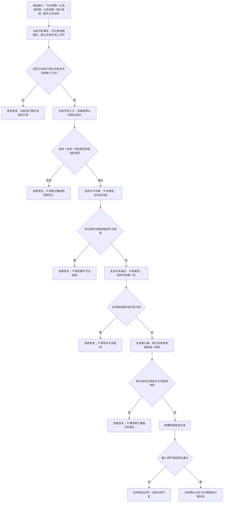

# 仓库快照恢复拒绝矩阵代码逻辑流程图 v0.1

归档状态：因 C013 基础结构裁决失效，仅作历史流程证据，不得作为当前施工依据；后继由 `#338 / NODE-TYPED-MIGRATION` 重建。

更新时间：2026-07-08

## 依据

```text
AGENTS.md
计划/计划索引.md
规范/0050_项目通用机器逻辑与禁止性规则总纲_20260721.md
规范/规范目录.md
规范/4010_子规范_统一仓库稳定句柄与通用关系索引边界.md
规范/4020_子规范_主信息身份生命周期与字段边界.md
规范/4040_子规范_不透明结构事务候选确认撤销与最后发布.md
规范/4050_子规范_入口拒绝逻辑内结果与内部逻辑错误.md
实施记录/20260708_应用逻辑流程图迁移顺序信息数据.md
规范/详细设计/事件日志持久化恢复详细设计.md
规范/详细设计/仓库快照格式与恢复拒绝矩阵详细设计.md
实施记录/20260707_FS09_事件日志持久化恢复增强S0当前代码事实扫描_Codex断点清单.md
```

## 说明

本图是恢复拒绝矩阵的候选代码逻辑边界图。当前没有 `仓库快照服务.h`，没有快照格式版本代码，没有恢复入口；因此本图不允许恢复写入，只定义后续专项必须满足的拒绝门禁。

## 流程图



## 关键边界

```text
当前没有快照恢复代码入口，本图不生成恢复实施许可。
数据库只可作为快照、事件日志、恢复和审计适配，不直接裁决机器事实。
索引只做入口和候选召回，不覆盖关系仓库承载的结构事实。
不得接入旧链表二进制、SQL、控制面板、D455、体素或外设。
```

## 当前代码差距

```text
当前无仓库快照服务、快照格式版本、恢复入口、恢复拒绝矩阵代码。
当前无隔离候选仓库恢复、替换门禁、恢复数量快照或恢复失败审计结构。
事件日志持久化恢复与仓库快照恢复仍停留在详细设计 / 候选材料层。
```

## 后续产物

```text
若用户明确要求恢复能力，必须先生成恢复专项详细设计或待确认施工计划。
施工计划必须列出允许文件、禁止文件、隔离恢复策略、失败收口、读回验证和完成声明边界。
```
