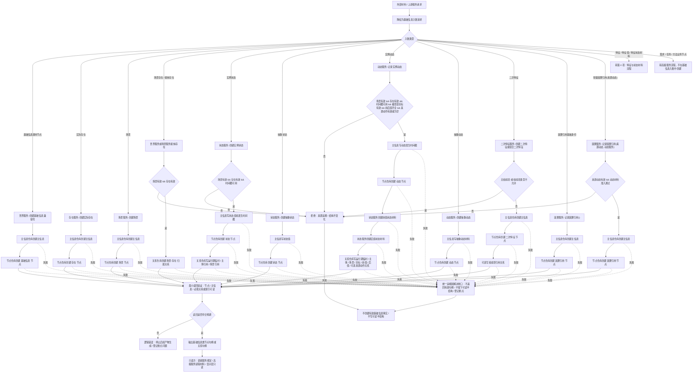

# 基础信息入账代码逻辑流程图

归档状态：因 C013 基础结构裁决失效，仅作历史流程证据，不得作为当前施工依据；后继由 `#338 / NODE-TYPED-MIGRATION` 重建。

更新时间：2026-07-08

## 依据

```text
AGENTS.md
规范/0050_项目通用机器逻辑与禁止性规则总纲_20260721.md
规范/规范目录.md
规范/4030_子规范_基础信息服务分层与领域写授权.md
规范/4010_子规范_统一仓库稳定句柄与通用关系索引边界.md
规范/4020_子规范_主信息身份生命周期与字段边界.md
规范/4040_子规范_不透明结构事务候选确认撤销与最后发布.md
规范/4050_子规范_入口拒绝逻辑内结果与内部逻辑错误.md
规范/详细设计/领域服务最小入口详细设计.md
实施记录/20260708_应用逻辑流程图迁移顺序信息数据.md
海中鱼巣/领域/世界服务.h
海中鱼巣/领域/存在服务.h
海中鱼巣/领域/场景服务.h
海中鱼巣/领域/状态服务.h
海中鱼巣/领域/动态服务.h
海中鱼巣/领域/二次特征服务.h
海中鱼巣/领域/因果服务.h
海中鱼巣/领域/特征服务.h
海中鱼巣/核心/句柄.h
```

## 说明

本图是第 3 项“基础信息入账流程”的代码逻辑流程图，表达外部材料或上游服务请求如何被降权为基础信息入账请求，并经基础信息原子服务或世界聚合服务写入节点、主信息和关系结构。

本图经审查小修后确认：所有写入路径都必须进入最小读回验证；任一主信息、节点、关系或索引写入不及预期都进入统一追根因解决收口；特征、特征值和特征状态材料转第 4 项；因果引用拆分为基础身份和轻量因果引用两个入口；二次特征必须有主信息承载；实例动态前值 / 后值状态材料必须经状态服务创建。

## 流程图



## 关键边界

```text
基础信息入账必须经基础信息原子服务或世界聚合服务入口。
世界服务只做聚合编排；除当前兼容壳 `创建基础信息()` 外，不得绕过原子服务直接写基础信息结构。
所有写入路径都必须进入最小读回验证，包括基础信息通用节点、存在、场景、抽象状态、抽象动态、二次特征、因果引用基础身份和轻量因果引用。
任一主信息、节点、关系或索引写入不及预期，必须进入统一追根因解决收口：不返回有效句柄，不允许留下可被读取为有效业务事实的半结构。
实例状态必须有场景、存在主体和发生时间戳；抽象状态本体不携带发生时间戳。
实例动态必须有场景、存在主体、发生时间戳、被改变目标、改变前值和改变后值；改变前值和改变后值状态材料必须经状态服务创建。
抽象动态本体不携带发生时间戳。
二次特征节点必须有主信息承载；当前代码事实为 `二次特征服务::创建二次特征()` 调用主信息仓库创建主信息，再创建二次特征节点。
因果引用分为因果引用基础身份和轻量因果引用两个入口；轻量因果引用只用来源动态做准入证据，不持久化来源动态关系，不形成稳定因果结论。
特征、特征值和特征状态材料转第 4 项，不在本图中展开。
需求、任务、方法是高级业务节点，不由基础信息入账流程直接创建。
参数检测用于发现非法材料来源并追溯上游，不允许在当前函数内部修复非法数据后继续写入。
任一必需写入后读回不符合预期，属于逻辑错误，必须停止后续施工计划推进并登记断点。
```

## 当前代码差距

```text
当前世界服务仍保留 `创建基础信息()` 兼容壳，直接创建基础信息通用节点；后续详细设计需确认兼容壳归属和使用边界。
当前存在、场景、抽象状态、抽象动态、二次特征、因果引用等路径已有最小写入口，但部分入口未显式执行统一读回验证；详细设计必须补读回验收。
当前状态、动态、二次特征等多步写入路径已有入口拒绝和追根因解决，但未形成完整事务回滚设计；后续详细设计必须补追根因解决收口和半结构不可读验收。
当前 `动态服务::记录实例动态` 内部用私有辅助创建前值 / 后值状态材料；详细设计需改口径为前值 / 后值材料必须经状态服务创建，避免动态服务绕过状态服务写状态。
当前因果引用可无来源直接创建基础身份，也可经来源动态准入创建轻量因果引用；稳定因果结论不在当前实现中。
本图只生成流程图和详细设计依据，不证明基础信息服务分层完整完成，不证明旧基础信息能力已迁移。
```

## 后续产物

```text
本图小修后已按用户审查结论确认。
下一步生成基础信息入账详细设计。
详细设计确认后，才能生成施工计划候选。
施工计划候选必须明确允许文件、禁止文件、追根因解决收口策略和验证方式。
```
## 中途非成功返回二分口径

本文件按 2026-07-09 硬规则修订：中途非成功返回只分为 `追根因解决` 和 `逻辑内返回`。

- `追根因解决`：前置条件已经满足，并进入创建、绑定、写关系、写状态、记录动态、结算、读回或结构承载后，结果不符合内部预期；必须停止依赖路径，定位根因，当前未证明完整回滚时登记事务隔离缺口或半结构隔离缺口。
- `逻辑内返回`：领域协议允许的拒绝、候选为空、请求材料返回或人读材料返回；必须保证结构不变化，且返回材料、日志、回执、显示或控制台输出不裁决机器事实。
