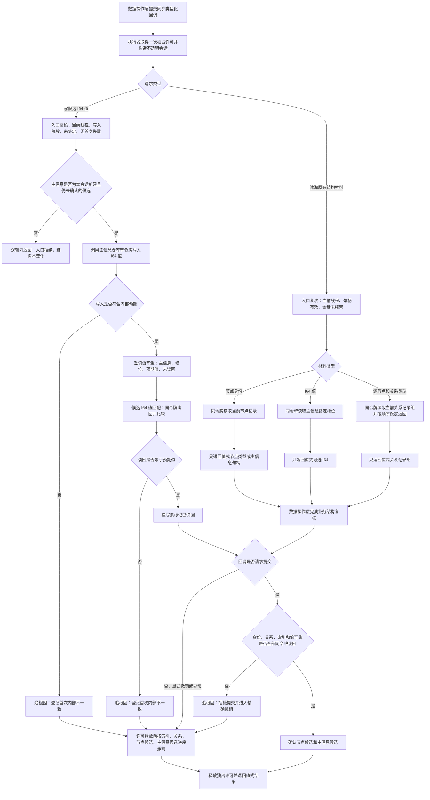

# 不透明结构写入会话材料能力扩展代码逻辑流程图 v0.1

归档状态：因 C013 基础结构裁决失效，仅作历史流程证据，不得作为当前施工依据；后继由 `#338 / NODE-TYPED-MIGRATION` 重建。

更新时间：2026-07-13

## 依据

```text
AGENTS.md
规范/4010_子规范_统一仓库稳定句柄与通用关系索引边界.md
规范/4020_子规范_主信息身份生命周期与字段边界.md
规范/4040_子规范_不透明结构事务候选确认撤销与最后发布.md
规范/详细设计/仓库底层与服务数据操作分层纠偏详细设计.md
海中鱼巣/核心/会话.结构写入.ixx
海中鱼巣/核心/主信息仓库.h
海中鱼巣/核心/节点仓库.h
海中鱼巣/核心/关系仓库.h
实施记录/20260713_SERVICE-DATA-S1_不透明结构写入会话与执行器代码实施_Codex断点清单.md
实施记录/20260713_EXIST-SCENE-S1_存在场景首组垂直样例代码实施_Codex断点清单.md
```

## 说明

本图只表达 `#272 / CORE-SESSION-S2` 对现有不透明结构写入会话的窄能力扩展。当前代码已经具备候选身份、关系、索引、读回、提交和撤销，但尚不能在会话内写入候选主信息 I64 值，也不能向服务专用数据操作层提供同一许可内的节点身份、I64 值和关系材料。

## 流程图



## 非成功返回二分

```text
逻辑内返回：
- 非本会话候选、无效句柄、错误调用阶段或只读材料不存在。
- 发生在第一笔依赖写入前，不产生新的可读结构。

追根因解决：
- 入口已经通过后，候选值写入失败、值读回不匹配、当前关系记录无法按完整句柄解释。
- 请求提交时任一写集未完成同令牌读回。
- 撤销后数量或可读结构不能回到前态。
```

## 关键边界

```text
1. 不导出原始结构事务令牌、许可、仓库引用或未发布候选。
2. 写入候选 I64 值只能作用于本会话创建且尚未确认的主信息候选，禁止修改既有主信息。
3. 会话只提供通用结构材料，不解释状态、动态、需求、任务或方法语义。
4. 关系记录组只作为结构材料；数据操作层仍须复核完整句柄、端点、类型、顺序号和当前版本。
5. 不新增仓库记录级未发布状态、关系候选、索引候选或值回滚日志；撤销候选主信息即撤销其候选值。
6. 四仓库、结构事务 ABI、执行器许可强度和锁序保持不变。
7. 本图形成 #272 的设计依据，不证明代码、构建、运行或阶段 725 已完成。
```
