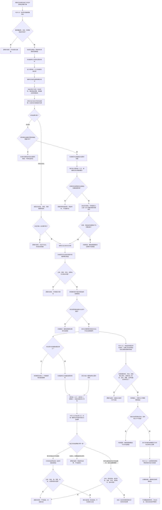

# OBSERVE-VOXEL：观察世界事实与体素融合施工流程图 v0.1

> 已退出：现行版本为 `流程图/20260724_OBSERVE-VOXEL_观察世界事实与体素融合施工流程图_v0.2.md`。

更新时间：2026-07-23

## 依据

- `规范/1140_根规范_存在节点_20260720.md`
- `规范/1150_根规范_场景节点_20260720.md`
- `规范/1160_根规范_状态节点_20260720.md`
- `规范/1170_根规范_动态节点_20260720.md`
- `规范/4010_子规范_统一仓库稳定句柄与通用关系索引边界.md`
- `规范/4020_子规范_领域类型化数据记录与组合读取投影边界.md`
- `规范/4040_子规范_不透明结构事务候选确认撤销与最后发布.md`
- `规范/4070_子规范_权威结构快照恢复候选与运行期原子发布.md`
- `规范/4210_子规范_动态信息分层获取与聚合_20260720.md`
- `规范/4220_子规范_动作动态与因果账本边界_20260720.md`
- `规范/6200_子规范_基础观察事实可用与风险判断分层_20260720.md`
- `规范/6210_子规范_当前场景特征值明确标准_20260720.md`
- `规范/6220_子规范_自我所在场景认知工作区_20260720.md`
- `规范/6230_子规范_已确认观察存在内部结构递归细分_20260720.md`
- `规范/6240_子规范_已确认存在体素融合与分解_20260720.md`
- `规范/6250_子规范_场景体素服务与视觉先验融合_20260720.md`
- `规范/6300_子规范_观察像素簇与存在候选分层_20260720.md`
- `规范/6310_子规范_观察特征质量诊断与认知补偿_20260720.md`
- `规范/6320_子规范_外设观察特征与自我场景认知分层_20260720.md`
- `规范/6330_子规范_作用外设一阶特征改变与关系二次特征边界_20260720.md`
- `规范/6360_子规范_相机外设综合工作流程_20260720.md`
- `规范/6370_子规范_识别本能方法唯一性收敛_20260720.md`
- `规范/7100_子规范_存在概念与实例创建最小闭环_20260720.md`
- `规范/详细设计/观察世界事实与体素融合详细设计.md`
- `计划/20260723_PERCEPTION-D0_D455观察体素生产闭环设计链重建计划_v0.1.md`

## 施工元数据

| 项 | 冻结内容 |
| --- | --- |
| 图类型 | 待实施目标流程图；不是当前代码流程 |
| 绑定详细设计 | `规范/详细设计/观察世界事实与体素融合详细设计.md` |
| 绑定计划 | #360 设计计划；后继 #369—#372 代码计划 |
| 允许文件 | 唯一读取绑定详细设计第 2 节中归属 #369—#372 的精确新建文件；只读复用现有需求 / 任务 / 存在 / 场景 / 状态 / 动态入口 |
| 禁止文件 | 外设采集 / 队列 / 生产者、方法执行以外入口、共享工程 / 入口 / 运行器 |
| 预期结构变化 | 新建像素簇与候选、识别派生需求、新存在承接材料、完整事实提交、体素材、体素代次和先验投影 |
| 执行前复核 | 核对 PER-C7—C12、7100、新任务回流、首次扫描基准、事实字段和体素材新增确认身份 |
| 验证方式 | 四方法零直调、空句柄分支、7100 完整读回、状态动态字段、首次扫描、体素一次消费与投影隔离 |
| 不得宣称 | 候选、空句柄、体素快照、显示或自检均不能证明存在确认、世界事实或生产闭环完成 |

## 身份与边界

本图冻结 `PER-C9—PER-C12 / v0.1`。D455 产品只是受控材料；像素簇、存在候选、识别对应、场景事实、状态动态和体素模型必须逐层提交。报告、算法分数、轨迹号和体素快照都不能直接充当存在身份或世界事实。

## 关键边界

1. 存在候选不是存在；观察结果必须先形成结构化识别需求，经需求—任务—筹办的新回合后，识别方法才可返回唯一已有存在句柄或空句柄。
2. 空句柄是合法未识别结果。稳定材料且确定范围内无候选时只能形成新存在承接或复验需求依据；只有后继任务选中具名存在确认 / 领域提交入口，才可按 7100 建立实例和场景成员。
3. 状态事实必须具备主体、特征、值、场景、时间、来源和版本；动态事实还必须具备被改变目标、前后状态和来源动作。
4. 首次扫描没有可比基准时只建立当前特征值和当前状态基准，不生成变化动态；后续必须同时具备可比基准和可验证差异。
5. 首次基准与其它扫描 / 跟踪都必须经结构化需求材料、需求统一入口、新任务、新筹办和匹配工作包形成独立方法回合；观察事实提交后不得同回合直调。
6. 体素只消费具有稳定材料身份、来源观察材料、发生时间、新增确认身份、`未消费` 状态和当前消费版本的观察体素材；重复消费、越界和版本漂移必须拒绝。
7. 场景体素快照与视觉先验是可重建只读投影，不能反向覆盖权威关系或领域事实。
8. 前置通过后的提交、读回、融合或发布异常均为内部错误，不能降级为普通空结果。
9. 观察、识别、扫描和跟踪不得直接互调；任何衔接都必须跨越结构化结果或缺口、需求统一入口、新任务和新筹办轮次。
