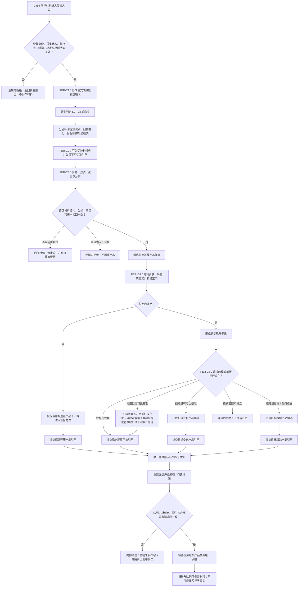

# PERCEPTION-INGEST：D455 成熟度产品受控材料报告队列施工流程图 v0.1

> 已退出：现行版本为 `流程图/20260724_PERCEPTION-INGEST_D455成熟度产品受控材料报告队列施工流程图_v0.2.md`。

更新时间：2026-07-23

## 依据

- `规范/4010_子规范_统一仓库稳定句柄与通用关系索引边界.md`
- `规范/4020_子规范_领域类型化数据记录与组合读取投影边界.md`
- `规范/4040_子规范_不透明结构事务候选确认撤销与最后发布.md`
- `规范/4070_子规范_权威结构快照恢复候选与运行期原子发布.md`
- `规范/6200_子规范_基础观察事实可用与风险判断分层_20260720.md`
- `规范/6210_子规范_当前场景特征值明确标准_20260720.md`
- `规范/6220_子规范_自我所在场景认知工作区_20260720.md`
- `规范/6230_子规范_已确认观察存在内部结构递归细分_20260720.md`
- `规范/6300_子规范_观察像素簇与存在候选分层_20260720.md`
- `规范/6310_子规范_观察特征质量诊断与认知补偿_20260720.md`
- `规范/6320_子规范_外设观察特征与自我场景认知分层_20260720.md`
- `规范/6340_子规范_外设独立控制线程与消息承接边界_20260720.md`
- `规范/6350_子规范_双目相机外设独占观察线程_20260720.md`
- `规范/6360_子规范_相机外设综合工作流程_20260720.md`
- `规范/详细设计/D455成熟度产品受控材料与报告队列详细设计.md`
- `计划/20260723_PERCEPTION-D0_D455观察体素生产闭环设计链重建计划_v0.1.md`

## 施工元数据

| 项 | 冻结内容 |
| --- | --- |
| 图类型 | 待实施目标流程图；不是当前代码流程 |
| 绑定详细设计 | `规范/详细设计/D455成熟度产品受控材料与报告队列详细设计.md` |
| 绑定计划 | #360 设计计划；后继 #361—#365 代码计划 |
| 允许文件 | 唯一读取绑定详细设计第 3.2 节中归属 #361—#365 的精确新建文件；共享工程、入口和运行器只归 #373 |
| 禁止文件 | 现行需求 / 任务 / 方法 / 存在 / 场景 / 状态 / 动态仓与服务、控制面板、SQL；#361—#365 不得改工程 / 入口 |
| 预期结构变化 | 新建 PER-C1—PER-C5 强类型合同、处理模块、一个物理传递队列和四类可重建索引 |
| 执行前复核 | 核对 L0 六个现有文件、全部待新建路径、`export module`、PER-C1—PER-C5 ABI 和文件所有权 |
| 验证方式 | 类型 / 负载、首次无基准、单队列四索引、并发、故障和恢复静态 / 自检；真实汇合留给 #373 |
| 不得宣称 | 流程图、编译或模拟通过均不证明真实 D455、队列消费或生产闭环已接通 |

## 身份与边界

本图冻结 `PER-C1—PER-C5 / v0.1`。L0—L3、三种外显模式和四类产品是彼此独立的分类轴；运行期只有一个物理报告队列，四类产品通过索引或只读视图定位。队列项和材料页只承载受控材料引用，不是世界事实、存在身份或任务完成事实。

## 关键边界

1. `PER-C1` 只定义分类和值式验证，不把成熟度、模式或产品类型互相推导。
2. `PER-C2` 的一个物理队列只是唯一运行期传递容器，不是事实主体或业务状态载体；四类索引可重建，不能各自变成第二份队列。
3. `PER-C3` 的原始逐簇产品只供质量治理和后续稳定化，禁止直接交给观察、识别、扫描或跟踪业务方法。
4. `PER-C4` 的稳定门必须消费跨轮证据；单帧算法分数不能替代稳定观察子集。
5. `PER-C5` 形成产品材料，不形成存在、状态、动态、任务结果或世界事实；首次无可比基准时只能返回当前材料 / 基准建立候选或无变化结果，不能生成扫描变化产品。
6. 前置不成立是逻辑内返回；前置通过后结构写入、读回或发布不一致是内部错误。
