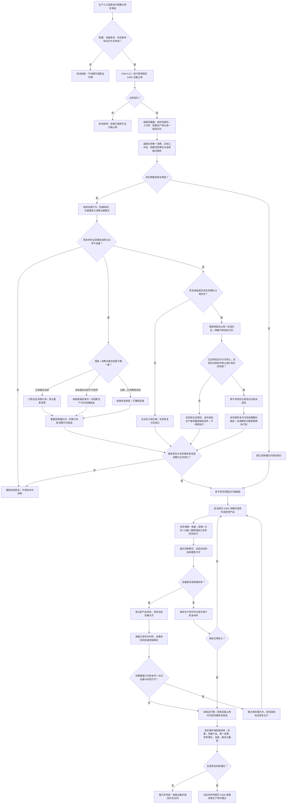

# PERCEPTION-RUNTIME：真实 D455 生产装配恢复验收施工流程图 v0.1

> 已退出：现行版本为 `流程图/20260724_PERCEPTION-RUNTIME_真实D455生产装配恢复验收施工流程图_v0.2.md`。

更新时间：2026-07-23

## 依据

- `规范/1140_根规范_存在节点_20260720.md`
- `规范/1150_根规范_场景节点_20260720.md`
- `规范/1160_根规范_状态节点_20260720.md`
- `规范/1170_根规范_动态节点_20260720.md`
- `规范/3200_根规范_任务_20260720.md`
- `规范/3300_根规范_方法_20260720.md`
- `规范/4010_子规范_统一仓库稳定句柄与通用关系索引边界.md`
- `规范/4020_子规范_领域类型化数据记录与组合读取投影边界.md`
- `规范/4040_子规范_不透明结构事务候选确认撤销与最后发布.md`
- `规范/4070_子规范_权威结构快照恢复候选与运行期原子发布.md`
- `规范/6200_子规范_基础观察事实可用与风险判断分层_20260720.md`
- `规范/6210_子规范_当前场景特征值明确标准_20260720.md`
- `规范/6220_子规范_自我所在场景认知工作区_20260720.md`
- `规范/6230_子规范_已确认观察存在内部结构递归细分_20260720.md`
- `规范/6240_子规范_已确认存在体素融合与分解_20260720.md`
- `规范/6250_子规范_场景体素服务与视觉先验融合_20260720.md`
- `规范/6300_子规范_观察像素簇与存在候选分层_20260720.md`
- `规范/6310_子规范_观察特征质量诊断与认知补偿_20260720.md`
- `规范/6320_子规范_外设观察特征与自我场景认知分层_20260720.md`
- `规范/6330_子规范_作用外设一阶特征改变与关系二次特征边界_20260720.md`
- `规范/6340_子规范_外设独立控制线程与消息承接边界_20260720.md`
- `规范/6350_子规范_双目相机外设独占观察线程_20260720.md`
- `规范/6360_子规范_相机外设综合工作流程_20260720.md`
- `规范/6370_子规范_识别本能方法唯一性收敛_20260720.md`
- `规范/8100_子规范_自我线程与任务管理线程权责边界_20260720.md`
- `规范/8110_子规范_线程生命周期状态上报与控制面板线程信息_20260720.md`
- `规范/详细设计/真实D455生产装配恢复与验收详细设计.md`
- `计划/20260723_PERCEPTION-D0_D455观察体素生产闭环设计链重建计划_v0.1.md`

## 施工元数据

| 项 | 冻结内容 |
| --- | --- |
| 图类型 | 最终生产切换与验收目标流程图；不是当前代码流程 |
| 绑定详细设计 | `规范/详细设计/真实D455生产装配恢复与验收详细设计.md` |
| 绑定计划 | #360 设计计划；后继 #373 唯一生产切换计划 |
| 允许文件 | 唯一读取绑定详细设计第 2 节 #373 精确现有 / 新建文件集、工程、filters 和入口 |
| 禁止文件 | #361—#372 私有实现文件只读汇合；不得改规范、计划或表外代码 |
| 预期结构变化 | 接通真实设备占用、完整运行期上下文、单队列消费、四方法分回合、事实、体素、停止和两套恢复 |
| 执行前复核 | 核对固定候选提交、真实设备、零残留占用、PER-C1—C13 ABI、报告恢复和筹办恢复 |
| 验证方式 | Debug / Release、模拟故障、跨重启、真实 D455 连续硬件场景、独立覆盖审计 |
| 不得宣称 | 单帧、构建、自检、日志、控制面板或无硬件模拟不能替代真实生产闭环验收 |

## 身份与边界

本图冻结 `PER-C13 / v0.1` 的待实现合同。它定义真实 D455 生产装配、设备占用、断流、恢复、跨重启与端到端验收，不声明当前代码已接通、已通过真实硬件验证或已实现完整恢复。

## 关键边界

1. 设备占用按物理设备身份隔离，报告消费按队列项 / 消费窗口隔离，任务筹办按任务身份隔离。
2. 物理队列和四索引不作为权威快照恢复；只持久化关键报告与消费治理事实，隔离复核后重建空队列和四索引。
3. 已承接未完成项只恢复任务侧引用且不得重新消费；未承接且当前不可舍弃项以原报告身份进入新生产代次投递候选；过期、已消费和失效项直接收束。
4. 报告三类恢复互斥分类，不能串行套用；任务筹办恢复是独立子流程，只处理具备任务 / 占用历史的候选。
5. 旧运行代次的筹办占用不得恢复为执行权；必须先证明旧运行代次终止且前轮动作已停止或已有实际回读，才可原子失效旧占用 / 冻结当前性、发布新恢复代次并由新筹办轮次重新取得。无法证明时只能合法等待且不得新执行。
6. 任何恢复材料都不能直接升级为世界事实；报告恢复和任务筹办恢复均合法收口、完整运行期全部成功后才可一次发布。
7. 断流不删除已发布产品、消费状态或领域事实；恢复必须新建可区分的采集代次。
8. 正常停止先封闭生产与消费入口，再持久化恢复候选并释放设备。
9. Debug、自检、模拟输入或无硬件构建不能替代真实 D455 端到端验收。
10. 本流程是施工目标和验收合同，当前状态仍为待实现。
