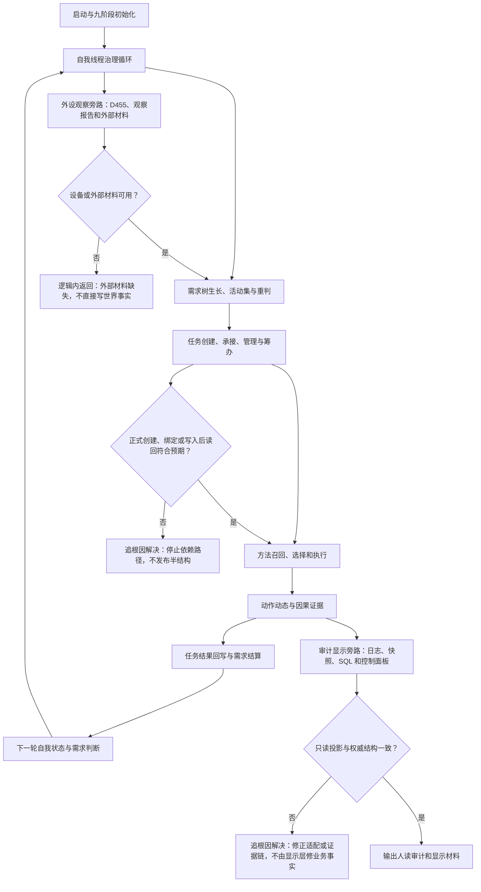

# 旧鱼巢运行主链与两条旁路总览现状流程图

更新时间：2026-07-12

## 元数据

```text
图类型：现状流程图
旧代码版本：D:/鱼巢 HEAD ef2cbbf；相对 birthplace/main ahead 4
旧工作区：2 个未提交 C++ 文件和 1 个未提交计划文件；沿用 #240 HEAD / dirty 分栏冻结
逐行映射表：实施记录/20260712_旧鱼巢运行主链与两条旁路总览逐行代码映射表.md
输入契约 / 调用语境表：实施记录/20260712_旧鱼巢运行主链与两条旁路总览输入契约与调用语境表.md
非成功返回二分审查表：实施记录/20260712_旧鱼巢运行主链与两条旁路总览非成功返回二分审查表.md
偏差清单：实施记录/20260712_旧鱼巢运行主链与两条旁路总览现状施工偏差清单.md
依据实施记录：实施记录/20260712_FLOW-COVERAGE-S1_最终覆盖收口矩阵.md
验证输出：本图为六条严格旧流程包的目录总览；未构建、未运行程序
不得作为施工许可：是
不得宣称：旧能力已迁移、自我循环已实现、外设或体素已接入、旧控制面板或数据库能力已迁移
```

## 依据

```text
计划/已完成计划/20260711_FLOW-COVERAGE-S1_鱼巢逻辑与当前实现流程图全量覆盖修订计划_v0.1.md
流程图/20260712_旧鱼巢启动与九阶段初始化现状流程图_v0.1.md
流程图/20260712_旧鱼巢自我治理循环现状流程图_v0.1.md
流程图/20260712_旧鱼巢需求与任务管理现状流程图_v0.1.md
流程图/20260712_旧鱼巢筹办方法与执行现状流程图_v0.1.md
流程图/20260712_旧鱼巢动态因果结果与结算现状流程图_v0.1.md
流程图/20260712_旧鱼巢外设持久化与显示现状流程图_v0.1.md
```

## 说明

本图只串联 #240 已冻结的旧鱼巢运行证据。每个节点的代码范围、输入契约、非成功二分和偏差以对应六份完整包为准；总览不代替逐行映射。

## 流程图



## 分图入口

| 顺序 | 分图 | 作用 |
| --- | --- | --- |
| 1 | `20260712_旧鱼巢启动与九阶段初始化现状流程图_v0.1.md` | 启动、初始化、线程启动与退出收口 |
| 2 | `20260712_旧鱼巢自我治理循环现状流程图_v0.1.md` | 治理消息、冻结批次、路由、后继回灌 |
| 3 | `20260712_旧鱼巢需求与任务管理现状流程图_v0.1.md` | 需求树、任务承接、管理线程和回执 |
| 4 | `20260712_旧鱼巢筹办方法与执行现状流程图_v0.1.md` | 因果反推、候选方法、执行与结果场景 |
| 5 | `20260712_旧鱼巢动态因果结果与结算现状流程图_v0.1.md` | 动态、因果、结果、价值反馈和结算 |
| 6 | `20260712_旧鱼巢外设持久化与显示现状流程图_v0.1.md` | 外设观察及日志、SQL、控制面板旁路 |

## 关键边界

```text
线程不是海中鱼巢的动作来源。
日志、控制台、SQL 和显示只做人读，不承载机器事实。
旧外设和旧控制面板只作为迁移裁决证据，不计入海中鱼巢迁移完成度。
旧流程中正式结构写入后不及预期统一归为追根因解决；外部材料缺失且写前拒绝才是逻辑内返回。
```
