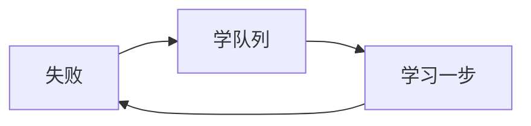

# HY-Ego：任务↔学习差距

## 连接器与范围
连接器github；仓库chunhaizh-cyber/HY-Ego。Win/VS2022/MFC+Mod；Linux需CMake+去MFC；Python：无。fileciteturn121file0L1-L1 fileciteturn127file0L1-L1

## 执行摘要
任务可“需求→步骤→预测/实际→失败转学习”；学习在自我线程内，但缺任务化训练/落盘/回放/指标/gate；调度器重评估/队列处理为空实现。

## 文件清单
|path|功能|关键片段|学习|
|---|---|---|---|
|任务类.ixx|节点写回|写任务特征|样本|
|任务执行类.ixx|筹办推进|回跳重试上限=3；转学习|触发|
|任务调度类.ixx|事件索引|处理队列(){}|瓶颈|
|学习类.ixx|骨架|上限1024/预算1；空执行器|缺|
|自我线程模块.ixx|自运行|动/学队列；尝试学习一步|在线|
证：fileciteturn126file0L1-L1fileciteturn122file0L1-L1fileciteturn125file0L1-L1fileciteturn123file0L1-L1fileciteturn124file0L1-L1

## 依赖清单
|依赖|用途|证据|
|---|---|---|
|RealSense SDK|相机|海鱼.vcxproj|
|vcpkg(OpenCV等)|视觉/网|海鱼.vcxproj|
证：fileciteturn127file0L1-L1

## 需求-差距对照
|需求|现状|结论|
|---|---|---|
|数据输入|半|缺Sample/Batch&Schema|
|在线流程|半|缺学习状态机/回滚|
|更新/落盘/回放|缺|无版本/落盘/重放|
|指标/资源|半|仅日志；缺gate|
证：fileciteturn124file0L1-L1

## 改进与验证
高：补齐调度器入队/重评估/处理队列；学习封装为任务树(采样→更新→验证→提交/回滚)。中：落盘+回放+指标。低：路径参数化。  
复现：`git clone …; cd HY-Ego; powershell .\build.ps1 -Configuration Debug -Platform x64`；验收：日志含“学习线程启动/尝试学习一步”；失败：vcxproj硬路径。fileciteturn128file0L1-L1 fileciteturn127file0L1-L1