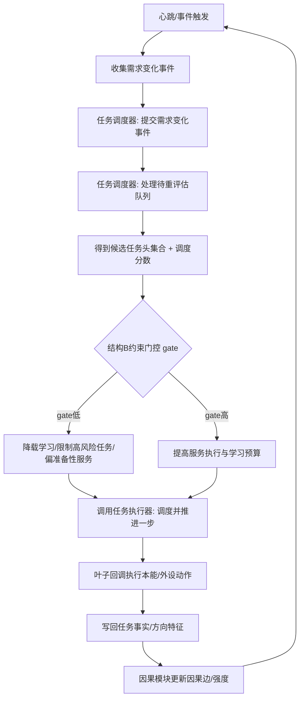

# HY-Ego：按“结构B（约束调制）”实现任务调度功能的可落地设计

## 执行摘要

你说“云端代码中已经基本实现了因果信息的生成”，现在要“按结构 B 来生成任务调度功能”。结合你仓库里已经存在的三块基础设施：

任务执行器 `任务执行类.ixx`：已经能做 **需求驱动筹办 + 条件缺口→子任务 + 顺序推进 + 失败处置 + 局部调度**。fileciteturn101file0L1-L1 fileciteturn113file0L1-L1  
自我线程 `自我线程模块.ixx`：已经有 **心跳调度 + 动作队列/学习队列** 的自运行框架，并将任务事实/方向写入任务虚拟存在特征，为因果调制提供数据入口。fileciteturn103file0L1-L1  
任务调度器草稿 `任务调度类.ixx`：已经给出关键约束——“任务之间不互调，只通过需求变化事件影响彼此”，并规划了索引结构与事件入口，但多处空实现。fileciteturn102file0L1-L1  

因此，“结构B 的任务调度”最合理的落点不是把执行器重写，而是：

把 `任务调度器` 补全为一个**事件驱动的、因果调制的调度前置层**：  
它不负责“怎么做”（执行器做），只负责“现在该推进哪一类任务、以什么预算/优先级推进、哪些任务要降载/挂起/切到学习/切到保守”。

下文给出一套可以直接落到你仓库当前结构上的实现方案：包含结构B定义、调度器核心数据结构、事件与接口契约、主循环集成点、伪代码/示例代码骨架、验证用例与失败排查。

## 连接器与检索仓库清单

启用连接器：github（唯一）。  
仅检索仓库：chunhaizh-cyber/HY-Ego。

相关文件（调度落点）：

- `任务调度类.ixx`（调度器骨架与索引结构）fileciteturn102file0L1-L1  
- `任务执行类.ixx`（执行推进与局部调度）fileciteturn101file0L1-L1  
- `自我线程模块.ixx`（心跳调度与两队列、任务事实/方向写回）fileciteturn103file0L1-L1  
- `规范/0100`、`规范/0200`（根约束/服务优先与安全保障）fileciteturn112file0L1-L1 fileciteturn111file0L1-L1  

## 结构B的定义与与现有代码的映射

你未在本轮对话中粘贴“结构B”的原始定义，我这里给出一个**与现有仓库结构高度匹配**、且符合你前文“约束调制（安全/服务/学习）+因果信息驱动”的“结构B”具体化版本（可直接写入 `任务调度类.ixx` 的实现注释/设计文档）：

结构B（约束调制调度）= **基础调度评分（BaseScore）** × **约束门控（ConstraintGate）** + **因果增益（CausalBoost）** − **风险惩罚（RiskPenalty）** − **资源惩罚（ResourcePenalty）**

其中：

BaseScore：来自现有任务体系（基准优先级、局部偏移、调度优先级、树位置、是否叶子等）。执行器已在运行时刷新 `调度优先级` 并有优先级计算逻辑。fileciteturn101file0L1-L1  
ConstraintGate：由根约束（服务是根目的、安全是保障、权重不能改向）与实时安全状态共同决定——安全紧张时对高风险/高探索任务做门控降载，而不是把服务目标改低。规范给出“安全为保障但服从服务根目的”的边界。fileciteturn111file0L1-L1 fileciteturn112file0L1-L1  
CausalBoost：来自你已经在云端实现的“因果信息生成”（例如：某类任务/动作对服务值提升的正向因果强度、对安全值的负向因果强度、对待机进入概率的影响等）。仓库侧已有“把方法输出事实/方向写回任务特征”的数据入口，因果查询可直接用这些事实特征做 key。fileciteturn103file0L1-L1  
RiskPenalty：来自因果的负向边（提高风险级别/降低安全值/增加失败率等）。`自我线程模块.ixx` 已把风险级别、保守态请求等作为任务事实/方向写入，可直接成为风险惩罚的输入。fileciteturn103file0L1-L1  
ResourcePenalty：队列拥塞、CPU占用、学习队列膨胀等资源信号；你代码里已有队列长度上限与“每次心跳派发上限”。fileciteturn103file0L1-L1  

这套结构B能做到：**调度器只负责“选什么任务/怎么给预算”，执行器负责“怎么推进一步”**，符合 `任务调度类.ixx` 顶部对职责边界的定义。fileciteturn102file0L1-L1

## 任务调度器的实现方案

### 调度器应补全的最小闭环接口

你仓库中 `任务调度器` 已声明了最关键的 API：

- `初始化_扫描需求链()`
- `登记需求()` / `取消登记需求()`
- `提交需求变化事件()`
- `处理待重评估队列()`
- `查询需求状态()`  
并且规划了索引结构：签名→需求列表、任务→需求列表、需求状态表、待重评估队列（去重）。fileciteturn102file0L1-L1

按结构B，需要再补两类能力（建议直接加在 `任务调度器` 内）：

约束门控计算：给定当前“安全/服务/待办/学习负载”输出 gate 系数（0..1）与可用预算。  
因果调制获取：给定任务（或任务事实特征 key）返回 CausalBoost 与 RiskPenalty。

这两类不必强耦合到“因果模块实现细节”，只要提供接口即可：

```cpp
struct 结构_约束门控输出 {
    double gate;                 // 0..1
    std::size_t 动作预算;        // 本轮最多推进多少动作任务
    std::size_t 学习预算;        // 本轮最多推进多少学习任务
};

struct 结构_因果调制输出 {
    double boost;        // 正向增益
    double risk_penalty; // 风险惩罚
    double conf;         // 置信度（可选）
};
```

### 补全 `处理待重评估队列()` 的核心逻辑

`任务调度类.ixx` 当前空实现的函数包括：

- `私有_将任务入队`
- `私有_将需求相关任务入队`
- `私有_沿需求父链入队相关任务`
- `私有_重评估任务`
- `处理待重评估队列`（也空）  
这些正是调度器闭环的核心缺口。fileciteturn102file0L1-L1

补全建议（与结构B一致）：

1) 入队：只做去重与 FIFO（或小顶堆），不做昂贵计算。  
2) 重评估：  
- 读任务负责的需求集合（索引_任务到需求_）  
- 计算“该任务是否存在可执行需求”（需要把你写的 `私有_需求可执行_已加锁读需求链` 与 `私有_任务存在可执行需求_已加锁读需求链` 补完）  
- 若不可执行 → 将任务状态置为等待/挂起（不 delete）  
- 若可执行 → 将任务状态置为就绪，并计算结构B调度分数写入 `任务->主信息->调度优先级`（或写入调度器内部表）  
3) 输出可调度候选集合给执行器（执行器用于 `调度并推进一步`）。执行器本身就接受“候选任务头列表”并按其优先级选择推进，同时可 fallback 到“尝试学习任务”。fileciteturn101file0L1-L1  

### 结构B评分的落地方式

你已经有两套“优先级/调度优先级”机制：

- 执行器内部的 `取优先级()` 会综合“基准优先级、局部偏移、状态加成、是否叶子、步骤序号、父子关系等”。fileciteturn101file0L1-L1  
- 自我线程里也会把任务入执行队列时用 `info->调度优先级`。fileciteturn103file0L1-L1  

结构B最稳妥的方式是：**不推翻执行器的优先级规则，而是在调度器层对“进入候选集/预算/门控”做调制**，即：

最终Score = 执行器优先级（BaseScore） + CausalBoost − RiskPenalty  
然后再乘 gate（或 gate 影响候选过滤与预算）。

推荐三层调制：

候选过滤（硬门控）：安全紧张时禁止某些高风险任务进入候选集（由因果模块给出风险标签）。  
分数调制（软门控）：在允许候选进入的情况下，用 boost/penalty 微调排序。  
预算调制（资源门控）：控制每轮推进动作任务数与学习任务数，避免学习挤占服务执行（你已有独立学习队列结构）。fileciteturn103file0L1-L1  

### Mermaid：自我运行调度总流程（结构B版）



这张图的关键是：调度器不负责推进细节，推进由执行器完成；因果模块只通过“boost/penalty/gate 输入”影响调度决策。fileciteturn101file0L1-L1 fileciteturn102file0L1-L1 fileciteturn103file0L1-L1

## 结构B关键实现细节

### 约束门控 gate 的最小实现（符合规范）

规范强调：服务是根目的，安全是保障；权重只能调权不能改向。fileciteturn111file0L1-L1

因此 gate 的语义应是“控制探索/风险/预算”，而不是“安全低就降低服务目标”。你可以用三段式门控：

- 安全低位区：gate→0（强保守、强降载学习、只允许低风险服务/准备性服务）  
- 中间区：gate 平滑上升  
- 安全高位区：gate→1（放开服务与学习预算，允许探索）  

阈值来源可按你前述构想“自动生成低/高阈值”，或者先写死再逐步用你因果模块生成的统计量替换。

伪代码（可直接内联到调度器或自我线程）：

```pseudo
if safety <= T_low:
  gate = 0
elif safety >= T_high:
  gate = 1
else:
  x = (safety - T_low)/(T_high - T_low)
  gate = x*x*(3-2*x)   # smoothstep
```

### 因果调制的接入点（不绑死因果实现）

你已在自我线程中写入大量“任务事实/方向”特征，例如安全值、服务值、风险级别、回执成功等。fileciteturn103file0L1-L1

因此调度器侧只需约定：从任务虚拟存在读取一组“事实 key”，送入因果模块查询得到：

- 对服务的净正贡献强度（boost）
- 对安全的净负贡献强度（risk_penalty）
- 置信度（conf）

这样即使因果模块部署在云端，调度器只需要一个接口适配层（RPC/共享内存/本地库都可）。

### 指针悬空风险：必须避免在调度器内部强持有裸指针索引

`任务调度类.ixx` 已明确警告：工程仍存在物理 delete 节点/主信息的接口，调度器用“节点指针做索引”若未注销会悬空。建议改为“逻辑失效而不是物理 delete”。fileciteturn102file0L1-L1

按结构B任务化学习后，样本/因果边会更长寿，因此必须尽早完成两步：

1) 节点生命周期改为“墓碑化”（tombstone）：删除只改状态与时间戳，内存延迟回收或由统一 GC 回收。  
2) 调度器索引键升级为稳定ID（主键字符串/自增ID/哈希签名），而不是裸指针。

## 可复现验证方案（命令、用例、指标、排查）

### Windows 复现构建命令

仓库 README 给出 Windows/VS2022 构建方式，并建议 PowerShell 运行 `build.ps1`。fileciteturn105file0L1-L1

```powershell
git clone https://github.com/chunhaizh-cyber/HY-Ego.git
cd HY-Ego
.\build.ps1
```

`build.ps1` 会寻找 MSBuild 路径、清理 temp、运行模块层级检查脚本，并解决 PATH/PATH 双变量导致 MIDL/CL 失败的问题。fileciteturn108file0L1-L1

### 调度器单元验证用例

你补全 `任务调度器` 后，建议最小写三个“白盒测试”用例（可先用主程序入口临时跑日志断言，后续再上测试框架）：

用例一：需求新增→任务入队重评估  
- 构造一个需求节点 `d`，其 `相关任务` 指向任务头 `t`  
- 调用 `提交需求变化事件({新增需求=[d]})`  
- 断言：`队列_待重评估任务_` 包含 `t`，且去重正确。fileciteturn102file0L1-L1  

用例二：需求满足→任务状态从就绪→等待  
- `需求状态_[d]=已满足` 后重评估 `t`  
- 若 `t` 负责的需求都满足，则 `t` 应被设置为等待/完成（看你的策略，但不要 delete）。fileciteturn102file0L1-L1  

用例三：结构B调制排序  
- 构造两个候选任务 `t1,t2` 基础优先级相同  
- 因果模块返回 `t1 boost 高、risk 低`；`t2 boost 低、risk 高`  
- gate=1 时 t1 应排在 t2 前；gate=0 时两者都不应进入高风险候选集（或预算为0）。  

### 验证指标

调度层建议至少输出以下指标（先日志，后结构化）：

- 每心跳：候选任务数、被门控过滤数、动作预算/学习预算、最终推进了哪个任务  
- 任务推进：成功率、失败率、重试率、挂起率、转入学习次数（执行器已有“转入尝试学习”动作路径）。fileciteturn101file0L1-L1  
- 因果调制：boost/penalty 的平均值、置信度分布、同类任务的稳定性（用于自动调参）。

### 常见失败与排查

编译失败：依赖路径/RealSense/vcpkg  
`海鱼.vcxproj` 中硬编码了 RealSense SDK 与 vcpkg 安装路径（例如 `D:\vcpkg\installed\x64-windows\...`、`Intel RealSense SDK 2.0`），需要按本机调整或改为更通用的依赖管理（例如 vcpkg 集成或 CMake）。fileciteturn107file0L1-L1  
RealSense 官方说明 SDK2.0（librealsense）跨平台支持 Windows 与 Ubuntu，可为后续迁移提供依赖基础。citeturn3search0turn3search1  

运行期崩溃：指针悬空  
如上所述，调度器索引裸指针且节点被物理 delete，会导致不可预期崩溃。必须优先解决 tombstone/稳定ID。fileciteturn102file0L1-L1  

学习挤占服务  
`自我线程模块.ixx` 虽然分了学习队列，但若调度器不输出预算门控，学习仍可能大量推进。结构B的 gate/预算是必须项。fileciteturn103file0L1-L1

## 最小落地代码骨架（直接对应你仓库）

下面给出“只在 `任务调度类.ixx` 内补齐空实现”的最小骨架思路（不改变现有 public API），以便你快速落地：

- `私有_将任务入队(任务)`：若 `标记_任务已入队_` 未标记，则 push 到队列并标记  
- `处理待重评估队列(n)`：pop n 个任务，清除标记，调用 `私有_重评估任务(任务)`  
- `私有_重评估任务(任务)`：读取任务负责需求列表，调用 `私有_任务存在可执行需求_已加锁读需求链`；若无可执行需求→置等待/挂起；若有→置就绪并写入调度优先级（结构B分数）  
- `私有_需求可执行_已加锁读需求链`：按你注释口径“自身待执行且子需求全部终结”（终结=已满足/已取消/失败）  
- “因果调制”先用占位函数：如果 cloud 因果接口未接入，可先用任务事实特征里已有字段（例如回执成功/风险级别）做 proxy。

这部分改动不会破坏 `任务执行器` 的职责边界，且能让 `自我线程` 在心跳时从“全量扫描/手动入队”逐步切换为“事件驱动候选集+执行器推进”。fileciteturn101file0L1-L1 fileciteturn102file0L1-L1 fileciteturn103file0L1-L1