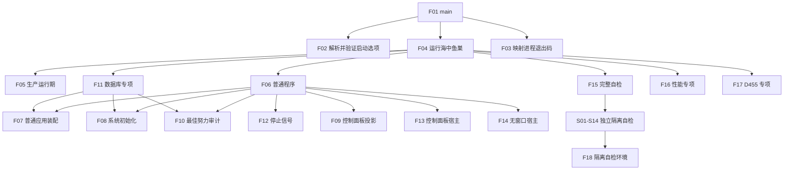

# ENTRY-ONLY 函数与结构知识图谱

版本：v0.1
机器源：`规范/详细设计/20260726_ENTRY-ONLY_函数结构知识图谱_v0.1.json`
冻结提交：`cf3e12d2d57192ca0d99b3acbc6f7d3f3fa7dc43`

## 调用主干



## 结构所有权

| 结构 | 唯一写入方 | 只读消费方 | 生命周期 |
| --- | --- | --- | --- |
| 启动选项解析结果 | F02 | F01、F03 | `main` 本次调用 |
| 程序运行结果 | 各模式函数 | F04、F03、F01 | `main` 本次调用 |
| 普通应用上下文 | F07 | F06/F11/单项自检 | 模式函数返回前；反向析构 |
| 系统初始化结果 | F08 | F06/F09/F10/F11/F13 | 对应上下文内 |
| 控制面板启动投影结果 | F09 | F13 | UI 宿主内只读 |
| 数据库启动审计结果 | F10 | F06/F11/F13 | 模式函数内；非机器事实 |
| 停止信号租约 | F12 | F13/F14 | 宿主运行期 |
| 自检批次结果 | `自检运行器::运行全部` | F15/F03 | 完整自检模式 |

## 依赖方向

```text
入口.cpp
-> 启动.程序入口
-> 启动.应用程序
-> 装配 / 初始化 / 投影 / 审计 / 宿主 / 自检
-> 既有领域服务和适配器
```

禁止反向依赖：

```text
生产领域模块 -> 自检
领域服务 -> 控制面板窗口
系统初始化 -> SQL 读回裁决
入口.cpp -> 节点/关系/语素/需求/概念图
```

## 现有被调合同

12 个既有函数以机器源 `existing_callees` 固定签名和当前文件。它们不在本计划修改范围；调用点必须逐项复核实际接口。任一签名或后置条件漂移即停止关联函数，不由执行者猜测适配。

## 覆盖

```text
待实施或迁移具名函数：32
要求单函数 MD/HTML 图：32 对
既有只读被调合同：12
未解析调用：0
设计待办：0
```
