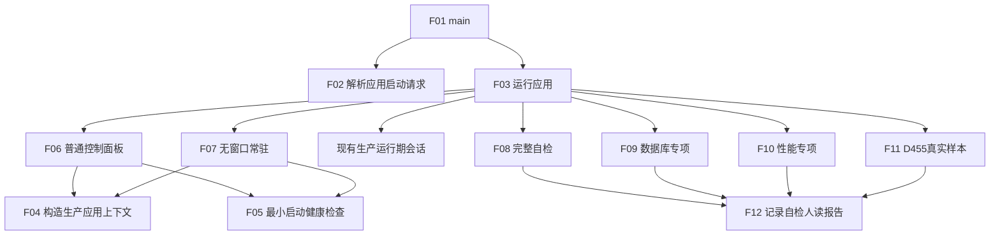

# MAIN-CLEANUP 入口删除优先瘦身与自检日志隔离详细设计

日期：2026-07-26

版本：v0.1

状态：待计划支撑复核的新计划设计包；未登记、未实施

## 1. 目标与依据

目标是把 `海中鱼巣/入口.cpp` 的 11,327 行 `main` 收缩为参数解析、最小装配、一个顶层调用和退出码，同时完整保留真实自检能力，并采用“先删除明确冗余，再用编译错误探测最小依赖，最后以行为验证裁决”的施工路线。

依据：

```text
AGENTS.md
规范/规范目录.md
规范/0050_项目通用机器逻辑与禁止性规则总纲_20260721.md
规范/日志系统规范.md
规范/详细设计/现状扫描/20260726_MAIN-CLEANUP_main职责与行范围清单_v0.1.md
规范/详细设计/20260726_MAIN-CLEANUP_逐函数逐节点实现分析_v0.1.md
代码基线 52d23d501e338f9b451ab4caa6f5851762618c0c
海中鱼巣/入口.cpp blob 3a315ec1f86ce5a395d04e3fa164d9d6a5f39362
```

## 2. 不可变目标

1. 普通无参数、控制面板、无窗口和生产运行期不得执行完整自检。
2. 完整自检、数据库、性能和 D455 真实样本只能由对应显式模式调用。
3. 正例、负例、事务、版本、并发、权限、结构不变及集成接线自检不得因入口瘦身丢失。
4. 每个保留自检单元是对应自检模块中的具名函数，具有完整输入、结构化结果和隔离数据生命周期。
5. 第一删除集优先删除；编译错误只用来发现最小语法、类型、模块和链接依赖。
6. 编译通过不等于行为正确，必须完成模式级行为矩阵。
7. 验收、自检、基准和专项检查的人读过程与结果只走统一日志，不能走控制台、弹窗、界面文本或另建文件。
8. 日志宏开关不改变执行、结构化结果、失败计数、退出码、机器事实或生产行为。

## 3. 目标文件与层级

| 文件 | 身份 | 所有权 |
| --- | --- | --- |
| `海中鱼巣/入口.cpp` | 唯一共享入口、模式组合与最终接线 | 本计划唯一拥有 |
| `海中鱼巣/启动.应用入口.ixx` | 启动请求、模式路由、生产上下文和最小健康检查 | 本计划新建 |
| `海中鱼巣/自检.模式入口.ixx` | 完整 / 数据库 / 性能 / D455 显式自检模式 | 本计划新建 |
| `海中鱼巣/自检.人读日志.ixx` | 结构化结果到统一日志的只读投影 | 本计划新建 |
| `海中鱼巣/自检.入口遗留基础结构.ixx` | 入口内基础结构、事务、缓存、恢复真实回归具名化 | 本计划新建 |
| `海中鱼巣/自检.入口遗留概念语义.ixx` | 入口内概念、语素、状态动态真实回归具名化 | 本计划新建 |
| `海中鱼巣/自检.入口遗留需求任务方法.ixx` | 入口内需求、任务、方法真实回归具名化 | 本计划新建 |
| `海中鱼巣/自检.入口遗留控制面板.ixx` | 入口内控制面板和树投影真实回归具名化 | 本计划新建 |
| `海中鱼巣/自检.入口遗留事件持久化.ixx` | 入口内事件段、日志和持久化真实回归具名化 | 本计划新建 |
| `海中鱼巣/自检.运行器.ixx` | 保留结构化运行器，删除其控制台旁路 | 本计划修改 |
| `海中鱼巣/核心/日志系统.h` | 增加四个具名日志宏；不改变日志类别和写入语义 | 本计划修改 |
| 其它既有自检模块 | 只读复用现有具名函数，不修改 | 禁止修改 |
| `海中鱼巣.vcxproj`、`海中鱼巣.vcxproj.filters` | 登记八个新模块 | 本计划修改 |

生产模块不得 import 自检模块。`入口.cpp` 是唯一同时 import 生产启动层和自检模式层的组合层。

## 4. 数据合同

```cpp
enum class 应用运行模式 : std::uint8_t {
    普通控制面板 = 1,
    无窗口常驻 = 2,
    生产运行期 = 3,
    完整自检 = 4,
    数据库专项 = 5,
    性能专项 = 6,
    D455真实样本 = 7
};

struct 应用启动请求 {
    应用运行模式 模式 = 应用运行模式::普通控制面板;
    bool 有效 = true;
    std::string 拒绝原因;
};

struct 启动健康检查结果 {
    bool 通过 = false;
    std::vector<std::string> 失败编号组;
};

struct 应用上下文构造结果 {
    std::unique_ptr<应用上下文> 上下文;
    std::string 失败编号;
};
```

`应用上下文` 唯一拥有普通生产启动所需仓库、事务、领域服务、初始化服务、线程、只读投影和控制面板依赖；禁止包含测试负例、性能材料、D455 样本、数据库自检材料或自检运行器。

## 5. 模式路由合同

| 参数 | 唯一模式 | 允许组合 | 目标顶层函数 |
| --- | --- | --- | --- |
| 无参数 | 普通控制面板 | 无其它参数 | `运行普通控制面板模式` |
| `--headless` | 无窗口常驻 | 不与任何其它模式组合 | `运行无窗口常驻模式` |
| `--runtime-context` | 生产运行期 | 不与任何其它模式组合 | 现有生产运行期会话 |
| `--self-test-exit` | 完整自检 | 不与任何其它模式组合 | `运行完整自检模式` |
| `--database-self-test-exit` | 数据库专项 | 不与任何其它模式组合 | `运行数据库专项模式` |
| `--warehouse-performance-self-test-exit` | 性能专项 | 不与任何其它模式组合 | `运行性能专项模式` |
| `--d455-real-sample-exit` | D455 真实样本 | 不与任何其它模式组合 | `运行D455真实样本模式` |

未知参数、重复模式参数、两个以上模式参数都在写入前返回退出码 2。构建未启用的专项模式也返回退出码 2；不能降级为完整自检或普通启动。

## 6. 函数与调用图

| 编号 | 完整签名 | 文件 | 返回语义 |
| --- | --- | --- | --- |
| F01 | `int main(int 参数数量, char* 参数组[])` | `入口.cpp` | 顶层退出码 |
| F02 | `应用启动请求 解析应用启动请求(int 参数数量, char* 参数组[]) noexcept` | `启动.应用入口.ixx` | 唯一模式或结构化拒绝 |
| F03 | `int 运行应用(const 应用启动请求& 请求)` | `启动.应用入口.ixx` | 路由后模式退出码 |
| F04 | `应用上下文构造结果 构造生产应用上下文(const 应用启动请求& 请求)` | `启动.应用入口.ixx` | 独占上下文或失败编号 |
| F05 | `启动健康检查结果 运行最小启动健康检查(const 应用启动请求& 请求, const 应用上下文& 上下文)` | `启动.应用入口.ixx` | 最小、快速、非破坏结果 |
| F06 | `int 运行普通控制面板模式(const 应用启动请求& 请求)` | `启动.应用入口.ixx` | 0 / 1 / 2 |
| F07 | `int 运行无窗口常驻模式(const 应用启动请求& 请求)` | `启动.应用入口.ixx` | 0 / 1 / 2 |
| F08 | `int 运行完整自检模式()` | `自检.模式入口.ixx` | 结构化总成映射 0 / 1 |
| F09 | `int 运行数据库专项模式()` | `自检.模式入口.ixx` | 数据库专项结果映射 0 / 1 |
| F10 | `int 运行性能专项模式()` | `自检.模式入口.ixx` | 性能专项结果映射 0 / 1 / 2 |
| F11 | `int 运行D455真实样本模式()` | `自检.模式入口.ixx` | 样本专项结果映射 0 / 1 / 2 |
| F12 | `void 记录自检人读报告(std::wstring_view 切片名, std::wstring_view 内容) noexcept` | `自检.人读日志.ixx` | 无；日志失败被忽略 |



F01—F12 的单函数施工流程图均位于 `流程图/20260726_MAIN-CLEANUP_*.md/.html`，版本 v0.1。
逐节点输入、结果、后继和验证读取
`规范/详细设计/20260726_MAIN-CLEANUP_逐函数逐节点实现分析_v0.1.md`。

## 7. 最小健康检查边界

只允许：

```text
请求结构有效；
配置和构建能力匹配；
必要路径 / 持久材料可读；
必要外部依赖可连接但不写测试材料；
租约 / 单实例前置可取得；
生产初始化发布后必需根材料可读。
```

禁止创建测试数据、运行正负例矩阵、执行并发压力、写 SQL 审计、采集 D455 测试样本、运行完整自检或扫描静态治理项。

## 8. 保留、迁移与删除矩阵

| 对象 | 动作 | 不丢失能力的机械证明 |
| --- | --- | --- |
| 63 个现有登记自检单元 | 保留并迁移 | 清理前后编号集合相等；被固定伪验收污染的项先剔除伪子项再比较 |
| 35 个验收族中的真实子项 | 提取为具名自检函数 | ID、验证对象、正负例、隔离上下文和失败计数逐项映射 |
| 419 次 `输出验收项` | 删除 | 结构化子项仍在结果中；人读投影由 F12 统一日志 |
| 149 项顶层门禁别名 | 删除 | 运行器直接按登记、执行、失败编号形成唯一总结果 |
| 33 个固定 true 输出项 | 删除 / 静态化 | 静态脚本读取真实文件或依赖；不能机械验证者不计运行期通过 |
| 其余固定 true / false 或宏别名 | 分类 | 真实编译能力只作路由能力；固定占位删除 |
| 默认启动完整自检 | 删除 | F06/F07 调用图不存在 F08—F11 |
| 数据库普通启动写入 | 删除 | 仅 F09 拥有数据库自检材料生命周期 |
| 生产初始化 | 保留并提取 | 普通 UI、headless、runtime-context 行为验证 |
| 测试数据准备 | 移入自检模块 | 每个具名自检创建和销毁自己的隔离上下文 |

删除边界以现状扫描的连续行范围和验收族为准，不要求把旧 `main` 每条输出制成现状流程图。

## 9. 删除优先施工算法

### S0 基线

1. 固定计划 blob、当前 `main`、`origin/main`、clean state。
2. fresh Debug x64 build，记录真实命令、退出码和新产物时间。
3. 运行清理前模式矩阵，形成真实基线；不得复用旧二进制。

### S1 第一删除集

一次精确删除第 8 节列出的纯输出、重复转抄、门禁别名、固定占位、默认完整自检调用及其专属局部变量 / lambda。保留结构化结果类型、显式模式参数和所有真实生产初始化。

### S2 编译依赖闭环

重复：

```text
fresh build
-> 逐条记录编译 / 链接错误
-> 判断缺失符号是否服务真实生产或结构化自检合同
-> 是：恢复最小表达式，或提取到 F01—F12 / 对应自检模块
-> 否：保持删除
-> fresh build
```

禁止以恢复旧输出、固定 bool、顶层别名、普通启动自检调用或测试数据耦合来消除错误。

### S3 行为修复

编译通过后执行第 12 节矩阵。行为失败按生产 / 自检合同修复；不能用“重新加入旧冗余”收口。

## 10. 日志宏合同

在 `日志系统.h` 增加四个互相独立、默认关闭的宏：

```text
HY_EGO_DEBUG_LOG_SELFTEST_RESULT
HY_EGO_DEBUG_LOG_DATABASE_SELFTEST
HY_EGO_DEBUG_LOG_WAREHOUSE_PERFORMANCE
HY_EGO_DEBUG_LOG_D455_REAL_SAMPLE
```

每个宏对应一个中文调用宏。开启分支先从已经形成的结构化结果构造人读内容，再调用
`记录自检人读报告(切片名, 内容)`；关闭分支为 `do { } while (false)` 且不引用任何实参，
所以内容形成表达式不求值。结构化结果必须先于宏调用形成。禁止把日志写入返回值并入
`总通过`、失败计数或退出码。

日志切片分别为：

```text
SELFTEST_RESULT
DATABASE_SELFTEST
WAREHOUSE_PERFORMANCE
D455_REAL_SAMPLE
```

不得增加第五种日志类别。普通启动 / 停止观察用运行日志；内部逻辑错误用逻辑错误日志。两者同样不参与机器裁决。

## 11. 失败合同

| 失败 | 结果 |
| --- | --- |
| 参数无效 / 模式冲突 / 构建不支持 | 写入前逻辑内拒绝，退出 2 |
| 上下文构造失败 | 不发布半上下文，退出 1 |
| 最小健康检查失败 | 不进入窗口或常驻循环，退出 1 |
| 自检存在失败项 | 完成允许继续的全部登记项，结构化汇总，退出 1 |
| 日志写入失败 | 忽略日志返回；结构化结果和退出码不变 |
| 前置通过后内部结构异常 | 记录逻辑错误诊断并停止依赖路径，退出 1 |

## 12. 验证矩阵

| 编号 | 构建 / 运行 | 成功条件 |
| --- | --- | --- |
| V01 | 清理前 fresh Debug x64 build | 成功并记录产物时间；只是基线 |
| V02 | 第一删除集后 fresh build 循环 | 最终编译、模块与链接成功；不得宣称功能正确 |
| V03 | 无参数启动 | 不登记 / 运行完整自检，不创建测试数据，可装配控制面板 |
| V04 | `--headless` | 不运行完整自检，可进入并正常停止常驻 |
| V05 | `--runtime-context` | 保持现行生产会话成功 / 失败语义 |
| V06 | `--self-test-exit` | 保留自检 ID 覆盖相等，结构化失败计数与退出码一致 |
| V07 | `--database-self-test-exit` | 只运行数据库专项，使用隔离材料 |
| V08 | `--warehouse-performance-self-test-exit` | 只运行性能专项；未编译支持时退出 2 |
| V09 | `--d455-real-sample-exit` | 只运行 D455 专项；未编译支持时退出 2 |
| V10 | 模式冲突 / 未知参数 | 写入前退出 2，零生产 / 测试结构变化 |
| V11 | 四个日志宏全部关闭 | 不生成对应调试日志；日志专用参数不求值；V06—V09 结果、计数、退出码不变 |
| V12 | 四个日志宏逐个开启 | 只生成对应分类文件；不改变 V06—V09 结构化结果和退出码 |
| V13 | 人读输出静态扫描 | 自检 / 验收 / 基准 / 专项路径无 stdout、stderr、printf、弹窗、UI 文本和旁路文件 |
| V14 | 生产依赖方向扫描 | 生产模块不 import 自检模块 |
| V15 | 保留覆盖对照 | 真实正负例、事务、版本、并发、权限、结构不变及接线项清理前后逐 ID 闭合 |

日志文件存在或内容正确只验证人读投影接线，不作为 V06—V09 通过依据。

## 13. 允许与禁止

允许文件仅限第 3 节列出的精确文件，以及本计划专属施工 / 验证记录。当前 63 个登记调用
已经指向其它既有自检模块的具名函数时只调整 `自检.模式入口.ixx` 的登记接线，不修改提供者；
当前仍内联在 `入口.cpp` 的真实回归只进入第 3 节五个新建“入口遗留”自检模块。

禁止修改：

```text
AGENTS.md
.codex/rules/**
.codex/skills/**
规范/规范目录.md
其它机器规范
计划/计划索引.md
其它计划与设计包
生产领域服务语义和仓库结构
```

## 14. 未决项

无。执行智能体只能按本设计恢复最小依赖；任何需要改变函数签名、模式、保留自检 ID、生产初始化语义、日志类别或宏合同的情况都属于设计漂移。
