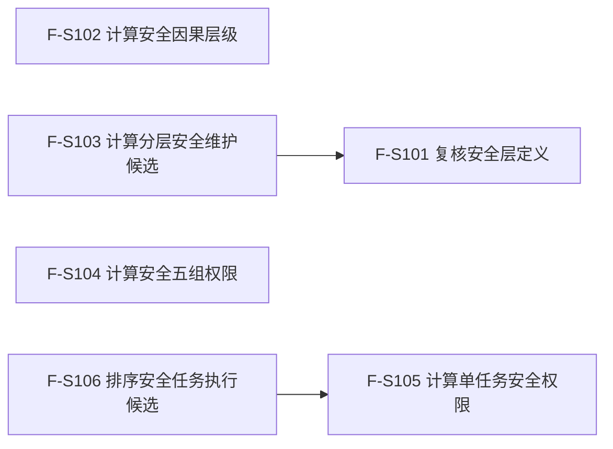

# SAFETY-P1 六函数逐函数逐节点实现分析 v0.1

日期：2026-07-29
状态：现行目标设计分析；绑定 #377 新不可变叶子计划；六函数代码尚未实现
分析对象：F-S101—F-S106
正式依据：6140、6150、`规范/详细设计/分层安全值被动变化与因果任务执行优先级详细设计.md`
目标流程图：本文第 2 节列出的六份 Markdown 单函数施工流程图
当前代码基线：`main@2c38ec4017e38b2e541b93c8c9ae038856f849c7`

## 1. 当前事实与分析边界

执行前只读扫描确认：

1. 六个目标纯值函数在当前源码中零命中。
2. 十个 #377 目标模块均不存在；本文分析的是待实现最终接口，不把合同写成现有能力。
3. `海中鱼巣.核心.执行器.节点直接身份结构写入` 已真实提供 `节点直接身份结构写入事务参与者`、多参与者执行、准备、确认、逆序撤销和最后发布边界。
4. 六函数全部是纯值函数；只允许显式参数决定结果，不读取仓库、时钟、日志、线程或运行消息。
5. 事务参与者与执行器只属于数据操作和服务编排，不进入六函数，也不进入协议模块的纯值 DTO。

本文只分析六个根函数自身节点。非平凡直接调用只有：

```text
F-S103 -> F-S101
F-S106 -> F-S105
```

其它环检测、广度优先、区间并集、checked wide integer 和稳定排序均在所属根函数内作为明确指令实现，不在本版新增未冻结公开函数。

## 2. 流程图登记

| 函数 | 流程图 |
| --- | --- |
| F-S101 | `流程图/20260729_SAFETY-P1_F-S101_复核安全层定义单函数施工流程图_v0.1.md` |
| F-S102 | `流程图/20260729_SAFETY-P1_F-S102_计算安全因果层级单函数施工流程图_v0.1.md` |
| F-S103 | `流程图/20260729_SAFETY-P1_F-S103_计算分层安全维护候选单函数施工流程图_v0.1.md` |
| F-S104 | `流程图/20260729_SAFETY-P1_F-S104_计算安全五组权限单函数施工流程图_v0.1.md` |
| F-S105 | `流程图/20260729_SAFETY-P1_F-S105_计算单任务安全权限单函数施工流程图_v0.1.md` |
| F-S106 | `流程图/20260729_SAFETY-P1_F-S106_排序安全任务执行候选单函数施工流程图_v0.1.md` |

## 3. F-S101 `复核安全层定义`

### 3.1 函数合同

输入是只读 `安全层定义快照`；输出只有 `安全结果分类`。它是定义结构准入函数，不读取当前层值、不形成维护候选。

### 3.2 逐节点分析

| 节点 | 实现分析 | 依据 | 输出/后继 |
| --- | --- | --- | --- |
| S | 绑定 const 引用；零复制、零保存 | 0050 值式输入边界 | B01 |
| B01 | 使用 `节点句柄` 的正式有效性判据检查定义身份与提交方法 | 6140 第 2、9 节 | 非法 R01 |
| B02 | 定义版本非零；规则版本非零且等于 `分层安全维护规则版本` | 6140 第 3 节 | 非法 R02 |
| B03 | 用 I64 比较 `值域下界 < 值域上界`，不做减法，避免溢出 | 6140 第 3 节 | 非法 R03 |
| B04 | 同时证明 `Vmin <= L <= H <= Vmax` | 6140 第 3 节 | 非法 R04 |
| B05 | 两个方向速率均不得小于 0；0 表示该方向不被动变化 | 6140 第 3、6 节 | 非法 R05 |
| B06 | 维护时间单位严格大于 0，避免除零和无量纲累计 | 6140 第 3、7 节 | 非法 R06 |
| R01—R07 | 精确返回冻结枚举；不携带匿名诊断或附加状态 | 详细设计第 10、12 节 | 终止 |

### 3.3 验证映射

- 定义身份/方法为空、版本为零或未知规则版本：`入口拒绝`。
- 值域退化、阈值越界/倒置、负速率、非正时间单位：`结构拒绝`。
- 合法边界 `L=Vmin`、`H=Vmax`、`L=H`、速率为 0：`已形成`。

## 4. F-S102 `计算安全因果层级`

### 4.1 函数合同

输入为不可变图快照与分层请求；输出为分层读取结果。函数必须先证明图结构可用，再区分可达与未归层。

### 4.2 逐节点分析

| 节点 | 实现分析 | 依据 | 输出/后继 |
| --- | --- | --- | --- |
| S/B01 | 复核请求和图中的自我、目标结果、适用场景及来源因果信息 | 6150 第 2—4 节 | 非法 R01 |
| B02 | 比较期望图版本、图/节点/边/场景版本和事实截止；任一已使用版本不当前即整体漂移 | 6150 第 4、11 节 | 漂移 R02 |
| N03 | 单次线性扫描复核两个已排序组；稳定键重复、乱序或当前性非法为坏结构 | 6150 第 2、11 节 | B04/R04 |
| B04 | 每条参与边的两端均在信息组，边与端点场景适用，记录版本闭合 | 6150 第 2 节 | 坏端点 R04 |
| N05 | 仅把当前适用边放入邻接与入度容器；每个邻接组按完整身份/句柄排序 | 6150 第 3 节 | N06 |
| N06/B07 | 用确定性拓扑扫描或等价三色 DFS 检测自环和回边；不借环缩短距离 | 6150 第 3 节 | 有环 R07 |
| N08 | 按层广度优先；保留到达目标的全部最短前驱，不扩展更深层 | 6150 第 3 节 | B09 |
| B09/N10/R10 | 无路径且图完整时形成未归层载荷；深度/分组不适用，路径为空 | 6150 第 4、13 节 | 终止 |
| N11 | 从最短前驱回溯全部最短路径；对节点序列、边序列进行字典序规范化和去重 | 6150 第 3、10 节 | B12 |
| B12/N13 | `D=0` 只表示结果本体；深度适用、分组不适用、组号空 | 6150 第 5 节 | N15 |
| N14 | `D>=1` 时组号为 `min(D,5)`；保留真实 I64 深度 | 6150 第 5 节 | N15 |
| N15/R15 | 主路径取规范化路径组首项，复制并列路径和审计版本 | 详细设计第 10.1 节 | 终止 |
| E16 | 在最外层捕获 `std::bad_alloc` 及容器构造异常，返回 `资源失败` | 0050 noexcept 边界 | 终止 |

### 4.3 验证映射

SP-A01—A05 逐项绑定 B02、B04、B07、N08—N15。测试必须把无路径与坏图分开，把 D=5/6/100 的组号相同和真实深度不同同时断言。

## 5. F-S103 `计算分层安全维护候选`

### 5.1 函数合同

该函数只计算候选，不提交事务。主动事实已经由合法领域发布；本函数只能读取并按固定顺序裁决被动维护。

### 5.2 逐节点分析

| 节点 | 实现分析 | 依据 | 输出/后继 |
| --- | --- | --- | --- |
| C01/B02 | 调用 F-S101；非 `已形成` 分类原样收口且无载荷 | 6140 第 3 节 | R02/继续 |
| B03 | 复核自我、维护族、场景、定义身份和当前维护单元身份一致 | 6140 第 2 节 | R03 |
| B04 | 比较值、定义、图、事实截止、维护账和规则版本；任何漂移整份候选失效 | 6140 第 9 节 | R04 |
| B05/B06 | 以幂等主键查输入中已发布幂等材料；同义读回，异义入口拒绝 | 6140 第 9 节 | N07/R06 |
| N07/R07 | 复制当前值版本和既有维护账版本；`新值版本=nullopt` | 详细设计第 10.1 节 | 终止 |
| N08 | 对事件、因素、排除、证据段、主动结算使用各自冻结稳定键复核顺序/唯一性/关联闭合 | 6140 第 4、5 节 | B09 |
| B09/N10 | 主动事实存在时采用最后合法已发布结算后值，重置维护纪元并跳过本批被动变化 | 6140 第 8 节 | N20 |
| N11 | 应用当前有效排除，形成每个事件的残余因素集合；不得猜测已排除 | 6140 第 4、8 节 | B12 |
| B12/R12 | 任一残余因素缺机会、覆盖、场景或身份可比材料即材料缺失 | 6140 第 5 节 | 终止/继续 |
| N13 | 先按因素合并区间，再以全部残余因素的最小有效增量作为层增量 | 6140 第 5、7 节 | B14 |
| B14/N15 | `V<L` 时用 checked wide integer 计算累计回升并封顶 L | 6140 第 6.1、7 节 | N20 |
| B14/N16 | `L<=V<=H` 保持值；该区间时间不得储存为未来额度 | 6140 第 6.2、8 节 | N20 |
| B17/N18 | `V>H` 且有残余因素时回落并封底 H | 6140 第 6.3、7 节 | N20 |
| B17/N19 | 无残余因素时解除约束；只有合法主动重结算材料可改值，否则保持 | 6140 第 6.3、8 节 | N20 |
| N20/B21 | 形成前后值、方向、累计时间、截止、当前/新值/维护账/发布代次候选 | 详细设计第 10.1 节 | R21/N22 |
| N22/R22 | 无变化时清空新值版本，保留当前值和可回读维护账版本 | 详细设计第 10.1 节 | 终止 |
| E23/R23 | 分配失败与结构/算术拒绝分账；均无载荷 | 0050 | 终止 |

### 5.3 验证映射

SP-A06—A11、A19、A20 绑定本函数。故障夹具不得通过伪造线程轮次、队列压力或服务值触发变化。

## 6. F-S104 `计算安全五组权限`

### 6.1 函数合同

输入是稳定排序的当前层快照；输出是完整或部分五组权限投影。权限投影不写回任何权威事实。

### 6.2 逐节点分析

| 节点 | 实现分析 | 依据 | 输出/后继 |
| --- | --- | --- | --- |
| B01 | 自我/场景有效，事实截止/图版本非零，权限规则版本为 1 | 6150 第 11 节 | R01 |
| N02 | 层组严格排序且无重复；组只允许 1—5；D 与 G 的映射精确；V/L/H 合法 | 6150 第 5、6 节 | B03/R15 |
| B03 | 所有已使用图、值、阈值、规则版本当前；版本值不进入比较 | 6150 第 10、11 节 | R03 |
| N04 | 找首个缺当前值、阈值或层身份的组，生成具名 `安全权限材料缺口` | 6150 第 6 节 | N05 |
| N05 | 单层释放：`V<=L` 为 0，`V>=H` 为 990000，开区间线性；组内取最小，保留全部并列限制来源 | 6150 第 6 节 | N06 |
| N06/N07 | `A1=1000000`；四次向下取整，上放量进入下一组，余量留低组；`Q5=A5` | 6150 第 7 节 | B08 |
| N09/N10/R10 | 缺口组及更高组收到/保留归零且状态为材料缺口；低组保留合法投影 | 6150 第 6、13 节 | 终止 |
| B11 | 完整材料时证明五组和严格等于 1000000 | 6150 第 7 节 | R11/N12 |
| N12—R14 | 冻结版本、层组、四门、五组状态；按是否全零选择成功分类 | 详细设计第 10.1 节 | 终止 |
| E15/R15 | 分配与结构失败分账 | 0050 | 终止 |

### 6.3 验证映射

SP-A04、A13、A14、A17 绑定本函数。必须覆盖边界等号、空组、同组多层最小释放、舍入余量和首个缺口传播。

## 7. F-S105 `计算单任务安全权限`

### 7.1 函数合同

该函数只处理一个任务。它保留全部合法来源和全部并列最高来源，不把多个权限相加。

### 7.2 逐节点分析

| 节点 | 实现分析 | 依据 | 输出/后继 |
| --- | --- | --- | --- |
| B01/B02 | 请求身份、规则版本和全部输入版本准入 | 6150 第 8、11 节 | R01/R02 |
| N03 | 以任务句柄选择唯一执行候选和当前关联，重复候选/关联键为坏结构 | 6150 第 8 节 | B04 |
| B04 | 至少一条来源关系当前、授权且目标等价；否则材料缺失 | 6150 第 8 节 | R04 |
| N05/B06 | 按来源的 G 读取对应 Q；组状态为材料缺口或缺少路径时不能猜测 | 6150 第 6、8 节 | R06/N07 |
| N07 | 求最大权限，保留所有来源以及全部等于最大值的来源 | 6150 第 8 节 | N08 |
| N08 | 用需求句柄、具体结果、深度、规范化路径选主解释 | 6150 第 8、10 节 | N09 |
| N09 | `E=floor(B*Q/1000000)`，checked wide integer，结果允许为 0 | 6150 第 9 节 | N10 |
| N10—R12 | 冻结任务、权限、主来源、并列来源、全部来源与输入版本 | 详细设计第 10.1 节 | 终止 |
| E13/R13 | 分配或结构失败分账 | 0050 | 终止 |

### 7.3 验证映射

SP-A15、A17 绑定本函数。必须证明多需求取最高而非求和、并列来源稳定、零权限不删除任务、溢出不钳制。

## 8. F-S106 `排序安全任务执行候选`

### 8.1 函数合同

该函数遍历候选并调用 F-S105；它把普通竞争、零权限和材料缺口分账，并对普通竞争组执行稳定排序。

### 8.2 逐节点分析

| 节点 | 实现分析 | 依据 | 输出/后继 |
| --- | --- | --- | --- |
| B01/B02 | 请求身份、场景、权限/排序规则和全部版本准入 | 6150 第 10、11 节 | R01/R02 |
| N03 | 候选组按任务句柄/创建序号稳定，和事实候选集合一致，无重复 | 6150 第 10 节 | N04/R16 |
| N04/C05 | 为每个候选形成请求并调用 F-S105；不复制其算法 | 单函数调用边 | B06 |
| B06/N07 | `已形成` 加入普通竞争组 | 6150 第 9、10 节 | B10 |
| B06/N08 | `权限为零` 加入零权限组 | 6150 第 9 节 | B10 |
| B06/N09 | `材料缺失` 加入材料缺口组 | 6150 第 6、13 节 | B10 |
| B06/R09 | 入口、版本、结构、资源或内部分类使整批无载荷失败 | 详细设计第 12 节 | 终止 |
| N11 | 为 1—4 组形成基础稳定键；为组 5 形成十一项完整键 | 6150 第 10 节 | N12 |
| N12 | 在版本门禁之后稳定排序；版本值不进入任何强弱/平局键 | 6150 第 10、11 节 | N13 |
| N13—R15 | 冻结三组结果和输入版本；普通组空则当前无可执行任务 | 6150 第 7、9 节 | 终止 |
| E16/R16 | 分配/排序异常与坏结构分账 | 0050 | 终止 |

### 8.3 组 5 键逐项确认

顺序固定为：权限降序、后果严重度降序、安全不足度降序、时间适用性/完整性/剩余时间、反例升序/正样本降序、基础优先级降序、真实深度升序、规范化路径、来源需求、创建序号、任务句柄。任何版本号均不进入该序列。

### 8.4 验证映射

SP-A15—A17 绑定本函数。必须覆盖全零、全缺口、混合三组、组 5 每一级平局拆解、仅版本不同不改变顺序。

## 9. 跨函数调用图与生命周期



所有参数均只借用到函数返回；所有结果均值式返回。任何返回载荷不得保存指向输入容器的指针、引用、迭代器或视图。

## 10. 未决项

未决项为空。六函数的模块、文件、完整签名、输入、输出、节点、返回分类、异常、生命周期、直接调用边和验证映射均已冻结。
