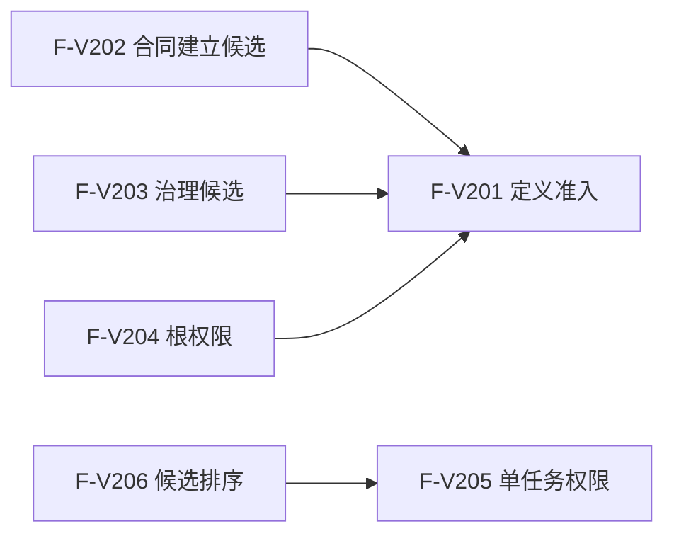

# SERVICE-P1 六函数逐函数逐节点实现分析 v0.1

日期：2026-07-29
状态：现行目标设计分析；F-V201—F-V206 待 #379 实现
当前代码基线：`main@01a547e6a51cc2e92372fdf1bc6a842053edeaed`
正式依据：6160、6170、6150 及 `规范/详细设计/服务值合同衰减与生存安全回归详细设计.md`

## 1. S0 事实与边界

1. 十个 #379 目标模块和 F-V201—F-V206 在当前源码中均不存在。
2. 核心执行器已存在多参与者准备、确认、逆序撤销与最后发布底座。
3. 六函数只处理显式值式输入，不读仓库、时钟、日志、线程或运行消息，不生成稳定身份。
4. 直接项目调用边只允许 `F-V202 -> F-V201`、`F-V203 -> F-V201`、`F-V204 -> F-V201`、`F-V206 -> F-V205`。
5. 事务、仓库、外部参与载荷和发布后读回属于参与者/数据操作，不进入六函数。

## 2. 流程图登记

| 身份 | 流程图 |
| --- | --- |
| F-V201 | `流程图/20260729_SERVICE-P1_F-V201_复核服务生存定义单函数施工流程图_v0.1.md` |
| F-V202 | `流程图/20260729_SERVICE-P1_F-V202_计算服务合同建立候选单函数施工流程图_v0.1.md` |
| F-V203 | `流程图/20260729_SERVICE-P1_F-V203_计算服务生存治理候选单函数施工流程图_v0.1.md` |
| F-V204 | `流程图/20260729_SERVICE-P1_F-V204_计算安全服务根权限单函数施工流程图_v0.1.md` |
| F-V205 | `流程图/20260729_SERVICE-P1_F-V205_计算单任务根权限单函数施工流程图_v0.1.md` |
| F-V206 | `流程图/20260729_SERVICE-P1_F-V206_排序服务生存任务执行候选单函数施工流程图_v0.1.md` |

## 3. F-V201 `复核服务生存定义`

| 节点 | 实现分析 | 依据 | 验证 |
| --- | --- | --- | --- |
| B01 | 使用正式稳定句柄有效性检查自我、两个定义和五项提交方法 | 6160 第 8 节、6170 第 11 节 | SS-A19 |
| B02 | 五方法版本、值域/阈值版本及合同/时间/回归/权限版本均非零且等于现行常量 | 6160、6170 版本合同 | 未知版本拒绝 |
| B03 | 直接比较 `1<L<H<=I64_MAX`，不做可能溢出的差值 | 6170 第 8、10 节 | SS-A15—A17 |
| B04 | 五方法当前且变化族唯一；失效方法不能提交候选 | 6160/6170 动作来源 | SS-A19 |
| R01—R05 | 身份/版本为入口拒绝，阈值/方法结构为结构拒绝，合法为已形成 | 0050 | 全返回 |

## 4. F-V202 `计算服务合同建立候选`

| 节点 | 实现分析 | 依据 | 验证 |
| --- | --- | --- | --- |
| C01/B02 | 调用 F-V201，非成功分类无载荷收口 | 定义前置 | SS-A01 |
| B03 | 复核需求来源、目标、范围、法规和读取用途；请求不产生合同身份 | 6160 第 2—4 节 | SS-A01 |
| B04 | 需求、合同集合、服务/安全值和事实截止版本整组当前 | 6160 第 5、9 节 | 版本漂移 |
| B05 | `A=0` 必须零写入口拒绝；`A=1/>1` 才继续 | 6170 控制态 | SS-A01 |
| B06/B07 | 同幂等键/来源需求唯一合同；同义完整读回，异义拒绝，半合同/预支为内部不一致 | 6160 第 4、9 节 | SS-A02 |
| N09 | 显式有效期适用时用其正 I64；否则冻结默认 2,592,000 秒 | 6160 第 5 节 | SS-A03 |
| N10 | `B=min(M,D0*T)`；安全分解 30%；`P1=B-P0`；全部 checked wide | 6160 第 6 节 | SS-A04 |
| N11 | 以剩余空间计算实际写入和舍弃，舍弃不补领 | 6160 第 6—7 节 | SS-A07 |
| N12/R12 | 形成合同+预支的单一值式候选，只有后继事务可生成真实身份/版本 | 6160 第 8 节 | SS-A05 |

## 5. F-V203 `计算服务生存治理候选`

| 节点 | 实现分析 | 依据 | 验证 |
| --- | --- | --- | --- |
| C01—B04 | 定义、身份、运行代次、时间纪元、单调时间和值/集合/截止版本准入 | 6170 第 3—4 节 | SS-A09 |
| B05—R07 | 同键同义返回权威材料的值式副本；异义或半结构拒绝 | 6160/6170 幂等 | SS-A19—A20 |
| N08 | 按发生事实序裁决完成、取消、终止、到期；余款阶段只关闭一次；到期事件一次 | 6160 第 7 节 | SS-A05—A07 |
| N09 | 准备只有新正式结果且唯一绑定衰减段时补回；实际补回不超过归属衰减 | 6160 第 8 节 | SS-A08 |
| N10 | 完整秒只由单调边界得出；跨代无证明建立新纪元且不补停机区间 | 6170 第 3—4 节 | SS-A09 |
| N11/N12 | 按事实边界分段，最长等待不叠加；逐段地板和必须等价逐秒 | 6170 第 5—7 节 | SS-A10—A13 |
| N13 | 顺序固定为余款/补回后衰减；每次饱和写入保留舍弃值 | 6160/6170 同秒顺序 | SS-A07/A08 |
| B14/N15 | `A=0` 先保持终止；同秒主动安全改变时跳过被动回归 | 6170 第 8 节 | SS-A15 |
| N16 | `V=0` 收敛 A 到 1；正 V 按比例、阈值和 checked wide 回归 | 6170 第 8—9 节 | SS-A14—A16 |
| N17—R19 | 形成一份合同终态+准备+衰减+根回归聚合载荷；无变化清空新值版本 | 6170 第 11 节 | SS-A19—A20 |

## 6. F-V204 `计算安全服务根权限`

| 节点 | 实现分析 | 依据 | 验证 |
| --- | --- | --- | --- |
| C01/B02 | 定义准入后核对自我、当前值、截止和权限版本 | 6170 第 10 节 | SS-A17 |
| B03/N04 | A=0/1 分别写终止/休眠，普通竞争不适用，两根权限均零 | 6170 第 10 节 | SS-A17 |
| B05/N06 | A>1 且 A<=L：安全 1,000,000、服务 0 | 6170 第 10 节 | SS-A17 |
| N07 | L<A<H：服务权限线性 1..990000，安全为差值 | 6170 第 10 节 | SS-A17 |
| N08 | A>=H：安全 10,000、服务 990,000 | 6170 第 10 节 | SS-A17 |
| B09—R10 | A>1 时两项非负且严格守恒 1,000,000 | 6170 第 10 节 | SS-A17 |

## 7. F-V205 `计算单任务根权限`

| 节点 | 实现分析 | 依据 | 验证 |
| --- | --- | --- | --- |
| B01 | 请求/任务/事实/规则版本先做当前性门禁 | 6170 第 11 节 | 版本漂移 |
| B02/N03 | 根竞争不适用时保留任务并形成零权限载荷 | 6170 第 10 节 | SS-A17 |
| N04/B05 | 选择唯一任务候选和全部目标等价当前来源；缺 SAFETY 材料不猜测 | 6170 第 10—11 节 | SS-A18 |
| N06 | 安全来源组合安全根与 6150；独立服务取服务根；安全兼服务只走安全 | 6170 第 10 节 | SS-A18 |
| N07 | 多来源取最高不求和，保留全部来源/并列来源 | 6170 第 11 节 | SS-A18 |
| N08 | `floor(B*Q/1,000,000)`，允许零且 checked wide | 6170 第 11 节 | SS-A18 |
| N09—R11 | 冻结主来源、全部来源、根权限和输入版本 | 详细设计第 5.3 节 | SS-A17/A18 |

## 8. F-V206 `排序服务生存任务执行候选`

| 节点 | 实现分析 | 依据 | 验证 |
| --- | --- | --- | --- |
| B01/N02 | 候选稳定键唯一并与事实集合一致；版本只做门禁 | 6170 第 11 节 | SS-A18 |
| C03 | 对每个候选调用 F-V205，不复制单任务算法 | 调用边 | SS-A18 |
| B04—B08 | 已形成、零权限、材料缺口三账分离；其它失败整批无载荷 | 6170 逻辑内结果 | SS-A17/A18 |
| N09/N10 | 按权限、基础优先级、来源分类、安全具体材料、创建序号、任务句柄稳定排序 | 6170 第 11 节 | SS-A18 |
| N11—R13 | 普通组空时当前无可执行任务，仍返回零权限和缺口组 | 6170 第 10 节 | SS-A17 |

## 9. 调用、所有权与生命周期

全部参数只借用到函数返回；结果是独立值式对象，不保留输入引用/指针/迭代器。未决项为空。
