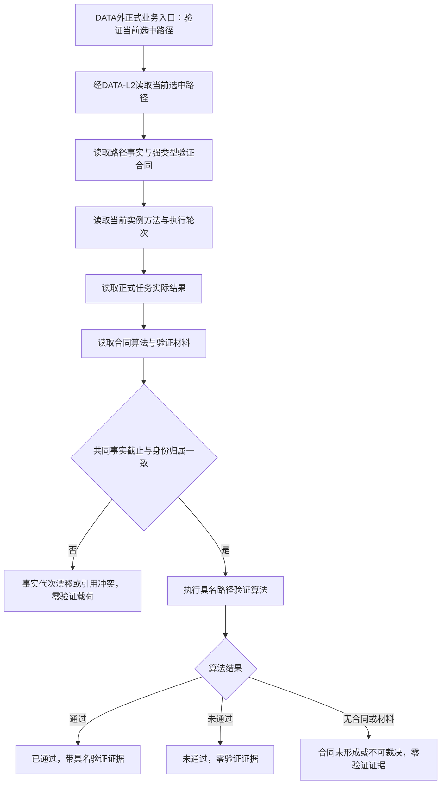

# RUNTIME-GOVERNANCE-TASK-PATH-VERIFICATION-PROVIDER 任务路径验证合同与执行提供者详细设计 v0.1

状态：创建侧候选，未登记为可执行。

本设计只处理“正式任务实际结果能否证明当前选中路径成功”的独立路径验证提供者。它不写任务生命周期，不裁决需求满足或结算，不改变安全值 / 服务值，不进入学习或任务筹办，也不新增生产故障钩子。

## 1. 目标与四层裁决边界

四个裁决必须保持独立：

```text
任务目标是否达成
    -> 路径验证是否通过
        -> 任务是否完成
            -> 需求是否满足
```

现有目标裁决只形成值式后继准备：目标已达成时为“待验证后完成”，目标未达成时为“目标未达成待重筹办”。本叶只提供第二层读取 / 执行合同；它不能把目标已达成改写为验证通过，也不能把验证结果直接写成任务完成。

## 2. 创建侧当前事实

| 事实 | 证据 | 裁决 |
| --- | --- | --- |
| 路径材料的 `验证合同` 是 `稳定编码` | `海中鱼巣/领域/L2任务结构.数据.h` 的 `L2完整路径材料` | 不是强类型合同身份，不能直接作为验证规则、版本或算法依据 |
| 路径筹办把 `方法.适用范围.front().来源稳定编码` 写入验证合同 | `海中鱼巣/领域/内部治理/服务.任务筹办编排.ixx` 路径材料构造 | 适用范围来源不能证明本次实际结果可证明当前路径成功；该回退必须退出 |
| 路径写入由 `L2任务结构服务` 持有唯一 owner 原子写集 | `海中鱼巣/领域/服务.L2任务结构.ixx` 的 `写入已验证任务方法路径` | 可复用路径事实 owner 与同代读回，不新增第二路径 owner |
| `L2任务方法路径结构服务` 只读取普通方法并转交路径写入 | `海中鱼巣/领域/服务.L2任务方法路径结构.ixx` | 只能是 DATA-L2 路径结构 CRUD 门面；不得执行路径成功性算法 |
| 任务实际结果已有正式读取 DTO / 当前投影 | `海中鱼巣/领域/L2任务结构.数据.h`、`服务.L2任务结构.ixx` | 可复用结果身份、实例方法、执行轮次和共同事实截止 |
| 任务事实只有创建 / 退出生命周期 | `L2任务事实` 与 `L2生命周期` | 不能用 `退出任务` 冒充完成、待重筹办或状态迁移；生命周期是后继独立提供者缺口 |

## 3. 现有能力复用与禁止复用

### 3.1 复用

- `L2任务结构服务::读取任务方法路径`：读取当前路径事实、任务归属、筹办轮次和现有路径材料。
- `L2任务结构服务::读取当前选中路径`：读取任务当前唯一选中路径关系。
- `L2任务结构服务::读取实例方法` / `按任务读取当前实例方法`：读取当前执行冻结及执行轮次。
- `L2任务结构服务::读取任务实际结果` / `按任务与执行轮次读取实际结果`：读取正式结果及其来源版本、运行代次和事实截止。
- 现有 L1 owner-aware 当前投影、共同事实代次、非成功零载荷模式。

### 3.2 禁止复用为路径验证

- `L2方法适用范围事实.来源稳定编码`：只能是方法适用范围来源，不能升级为验证合同。
- `L2目标状态合同` 或特征比较结果：它属于目标达成裁决，不是路径验证算法。
- 方法返回值、退出码、具名日志、线程正常返回或任何生产内自检：均不是机器验证事实。
- 旧协议中的生命周期枚举和 `退出任务`：不得作为任务状态或路径验证执行入口。
- `服务.L2任务方法路径结构.ixx`：不得承载业务验证请求 / 结果或“已通过 / 未通过”判断。

## 4. DATA-L2 结构合同与业务验证合同的分层

以下只冻结结构层引用和 DATA 外业务层 DTO 的边界；在验证算法及其权威材料 owner 未冻结前，均是设计接口，不得当作现有实现。

### 4.1 强类型身份与版本

在 `海中鱼巣/领域/L2任务结构.数据.h` 中新增互不混淆的值类型：

```cpp
struct L2路径验证合同身份 { 稳定编码 值; };
struct L2路径验证合同版本 { std::uint64_t 值 = 0; };
struct L2路径验证算法身份 { 稳定编码 值; };
struct L2路径验证算法版本 { std::uint64_t 值 = 0; };
struct L2路径验证材料组身份 { 稳定编码 值; };
struct L2路径验证材料组版本 { std::uint64_t 值 = 0; };
struct L2路径验证合同引用 final {
    L2路径验证合同身份 合同;
    L2路径验证合同版本 合同版本;
    L2路径验证算法身份 算法;
    L2路径验证算法版本 算法版本;
    L2路径验证材料组身份 材料组;
    L2路径验证材料组版本 材料组版本;
};
```

这些类型只表达结构引用的身份 / 版本，不自行定义算法。`L2完整路径材料::验证合同` 必须改为 `L2路径验证合同引用`；不能同时保留第二个普通编码字段。该引用由 DATA-L2 路径结构 owner 存储和当前 / 历史读回，但它不包含路径是否成功的业务结论。

### 4.2 DATA-L2 公开结构读回

`服务.L2任务结构.ixx` / `服务.L2任务方法路径结构.ixx` 只能继续提供 `L2任务方法路径读取结果` 等结构 CRUD 结果，其中的 `L2完整路径材料` 只携带 `L2路径验证合同引用`。这些入口不得新增 `已通过`、`未通过`、`不可裁决` 等业务状态，也不得返回业务验证证据。

### 4.3 DATA 外业务请求与结果 DTO

候选业务 DTO 放在 `海中鱼巣/领域/运行期只读查询.数据.h`，不放入 DATA-L2 结构 DTO：

```cpp
struct 任务路径验证业务请求 final {
    std::uint32_t 合同版本 = 0;
    L2任务身份 任务;
    L2任务方法路径身份 路径;
    L2实例方法身份 实例方法;
    std::uint64_t 执行轮次 = 0;
    L2任务实际结果身份 任务实际结果;
    std::uint64_t 共享事实截止G0 = 0;
};

enum class 任务路径验证业务状态 : std::uint8_t {
    已通过 = 1,
    未通过 = 2,
    不可裁决 = 3,
    合同未形成 = 4,
    入口拒绝 = 5,
    许可拒绝 = 6,
    未找到 = 7,
    事实代次漂移 = 8,
    资源失败 = 9,
    内部不一致 = 10
};

struct 任务路径验证业务结果 final {
    std::uint32_t 合同版本 = 0;
    任务路径验证业务状态 状态 = 任务路径验证业务状态::入口拒绝;
    L2任务身份 任务;
    L2任务方法路径身份 路径;
    L2实例方法身份 实例方法;
    L2任务实际结果身份 任务实际结果;
    L2路径验证合同引用 合同引用;
    std::uint64_t 共同事实截止代次 = 0;
    std::optional<稳定编码> 验证通过证据;
};
```

合同要求：

1. 业务请求必须同时指定任务、当前选中路径、当前实例方法、执行轮次、正式任务实际结果和共享截止；业务 provider 必须通过 DATA-L2 正式读取逐项核对归属关系，不能只按一个稳定编码查找。
2. 服务必须在一个共同事实截止下读取路径、实例方法、实际结果和验证合同材料；任一已发布读取截止不一致时返回 `事实代次漂移`，不得猜测或重试。
3. `已通过` 才允许携带 `验证通过证据`；所有其它状态必须零证据、零隐含成功载荷。结果 DTO 可以回传请求身份用于关联，但不回传未经验证的事实载荷。
4. `已通过` / `未通过` 必须由具名验证算法对具名验证材料作出；不得由目标状态比较、方法返回值或日志替代。
5. 验证算法身份、版本、材料组身份和版本必须来自 DATA-L2 读取到的 `L2路径验证合同引用` 及其正式结构材料，不得由调用方字符串拼装或默认填充。

## 5. 权威来源、owner 与公开入口

当前只有路径和实际结果 owner 已存在，验证合同与验证材料 owner 尚未在代码中形成。候选边界如下：

| 责任 | 候选物理位置 | 约束 |
| --- | --- | --- |
| 路径事实存储 / 当前读回 | `服务.L2任务结构.ixx` | 继续由任务 owner 持有；不新增第二写入口 |
| 路径结构 CRUD 门面 | `服务.L2任务方法路径结构.ixx`、`服务.L2任务结构.ixx` | 只存取 `L2路径验证合同引用` 及路径结构；不返回业务验证结论 |
| 验证合同、算法、材料的结构 owner | 尚未形成 | 必须按纯结构职责明确唯一 owner、类型、版本和公开读入口；不能用方法适用范围代替 |
| 路径验证业务 provider | 复用 `组合.运行期只读查询.ixx` 的 BIZ 组合层，新增唯一业务入口 | 通过 DATA-L2 正式读取后执行算法；不写 DATA、不拥有路径结构、不创建第二 owner |
| 普通应用装配 | `装配.普通应用.ixx` | 只取得同一 `运行期只读查询组合器` 实例；禁止静态单例、第二 provider 或测试专用接线 |

因此本包不能把“候选门面”写成已经可执行的 provider。没有第三行的正式 owner 与读入口，任何 `已通过` 都是不诚实结果。

## 6. 计划目标中的读取顺序



该图不表示当前代码已有入口；它是执行计划的目标顺序。

## 7. 幂等、当前性与持久化裁决

路径验证业务 provider 是对 DATA-L2 已有路径引用、合同材料和正式实际结果的纯读裁决。第一版不新建“路径验证结果”持久节点，不创建第二 DATA owner，不写任务、不改路径、不更新目标事实。相同请求在同一共同事实截止下应得到相同值式结果；不同请求或事实截止变化必须重新读取。

如后续任务生命周期迁移需要审计留痕，迁移入口可以把本 DTO 的身份、算法版本、材料版本和共同截止作为迁移证据复制进自己的原子写集；这不授权本叶自行建立独立验证结果账。

## 8. 执行前必须解决的提供者缺口

本设计不能标记为可执行，原因是以下机器语义仍没有当前正式依据：

1. 哪个 DATA-L2 结构 owner 持有 `L2路径验证合同引用` 的内容版本、算法身份 / 版本和材料组身份 / 版本；
2. 哪个 DATA 外业务 provider 读取结构材料并执行该算法；
3. 算法读取哪些正式材料，以及如何区分 `已通过`、`未通过`、`不可裁决`；
4. 普通应用如何取得同一业务 provider 实例；
5. 生产代码中尚无业务验证入口，不能由执行者临场发明。

在上述五项冻结前，路径验证计划必须保持 `待激活` 候选或不登记；不得登记为 `可执行`，也不得派发代码施工。

## 9. 与任务生命周期提供者拆分的裁决

路径验证与任务生命周期不能合并为一份代码叶：前者是对路径 / 实际结果的纯读裁决，后者是任务 owner 的持久状态写入；两者的事务边界、幂等身份和失败回滚不同。把它们合并会迫使执行者在同一入口临场决定“验证通过是否写完成”，直接违反四层裁决。

后继任务生命周期必须保留两层入口：

1. **DATA 外任务生命周期业务 provider**：消费目标达成裁决、路径验证业务结果、正式实际结果当前性和执行冻结，解释是否申请“待验证后完成”“目标未达成待重筹办”或“任务完成”。自我线程只能调用这个业务入口，不能裸写 DATA-L2。
2. **DATA-L2 任务结构写入口**：只接收业务 provider 已形成的结构迁移请求，校验状态枚举、任务 / 结果 / 路径 / 实例方法引用形状、期望事实代次、幂等身份、合法结构迁移顺序，并以 owner-aware 事务持久化和正式读回；不得判断目标是否达成、路径验证是否通过或任务是否真实完成。

本叶不冻结后继业务 provider 的具体 DTO、函数或写集，也不把任何业务结论下沉到 `L2任务结构服务`。后继计划必须从路径验证结果发布后的新 HEAD 重新 S0，再分别冻结这两层的 ABI 与所有权。

当前代码没有对应状态字段、DATA 外业务 provider 或唯一结构迁移入口，因此这部分不能与本叶合并，也不能登记为已冻结的直接后继；只有路径验证 provider 发布后，才能从新 HEAD 重新 S0 冻结其物理字段、写集和读回。

## 10. 后继任务生命周期提供者的门禁

任务状态提供者只能在本合同真实可读、可执行且能返回结构化结果后形成。它必须另行冻结：

- `待验证后完成`、`完成`、`目标未达成待重筹办` 的持久状态字段；
- 唯一生命周期迁移写入口；
- 幂等身份、共同事实截止、迁移证据和正式读回；
- 只允许 `目标未达成待重筹办` 或“验证通过后完成”路径，不把验证未通过写成任务失败。

现有 `退出任务` 和旧协议枚举均不满足这些条件。本叶不修改它们。

## 11. 完成声明边界

即使未来该计划完成，也只能声明：

> 对具名路径验证合同、算法和材料，生产公开入口能够在共同事实截止下返回结构化路径验证结果，并保持非成功零载荷和正式读回一致。

不得声明任务完成、需求满足、需求结算、服务成功、安全值 / 服务值变化、学习闭环、普通任务筹办或整个治理循环完成。
