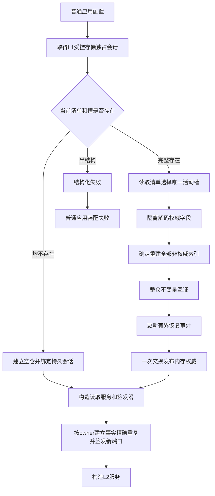

# DATA-L1-PERSISTENT-RECOVERY-MANAGEMENT-PLANE L1持久证据与隔离恢复详细设计 v0.1

日期：2026-08-28

状态：设计候选，待创建侧验证与发布

直接后继：`INSTINCT-BOOTSTRAP-ROOT-ANCHOR v0.2`

## 1. 目标与边界

建立普通应用唯一使用的持久 `L1事实基座运行包`。首次运行建立空内存仓；后续运行在任何 L2 owner 和业务 provider 构造前，从同一受控存储根恢复完整 L1 中性事实状态。恢复后普通读取仍只读取内存已发布状态，磁盘材料不成为第二权威。

完成必须证明：

```text
所有已发布 / 已退出稳定编码不复用
+ owner、节点、关系、值、属性槽、历史、墓碑完整恢复
+ 持久幂等账恢复并支持精确重放
+ 非权威索引只从恢复状态重建
+ 新进程不继承旧写端口并可按 owner 事实重新签发
+ 普通应用装配失败关闭全部后续业务入口
```

本计划不建立本能根事实，不修改 L2 结构语义，不读取磁盘补判普通查询，不实现运行期局部恢复，不声明断电和介质灾难验证通过。

## 2. 当前事实

当前代码基线：`047859f555afd45c70182929403dee78b6506bc4`。

1. `海中鱼巣/核心/服务.L1事实基座.ixx` 的无参数工厂只执行 `std::make_shared<L1事实基座实例状态>()`；每次普通应用装配都取得全新内存仓。
2. `海中鱼巣/核心/仓库.L1事实基座.ixx` 的权威 `状态` 集中保存事实代次、下个编码、当前 / 历史 owner、当前三类事实、历史、永久占用、墓碑、五类幂等账和旧共享 owner 定位。
3. 同文件只有五个权威交换点：owner 建立、owner 退出、物理清理、跨 owner 原子事务和普通中性写集。恢复持久准备可以在这五处统一接入，不修改所有读取入口。
4. 源 / 目标 / 关系类型、当前节点引用及历史候选索引均可由权威事实重建；它们不进入持久载荷。
5. 普通应用配置当前只配置不可变材料目录。不可变材料服务保存领域材料，不保存 L1 事实图，不能复用为 L1 快照。

## 3. 总体流程



运行期成功写入固定为：

```text
复制当前状态形成候选
-> 应用写集并执行现有状态完整检查
-> 规范编码候选权威字段
-> 写非活动槽临时文件并刷新
-> 原子替换非活动槽
-> 写新清单临时文件并刷新
-> 原子替换当前清单
-> 无抛出交换内存状态
-> 现有正式读回
```

## 4. 公开装配合同

新增 `海中鱼巣/核心/L1事实基座持久恢复.数据.h`：

```cpp
inline constexpr std::uint32_t L1事实基座持久恢复合同版本_v1 = 1;
inline constexpr std::uint32_t L1事实基座持久快照格式版本_v1 = 1;

struct L1事实基座持久存储配置_v1 final {
    std::uint32_t 合同版本 = L1事实基座持久恢复合同版本_v1;
    std::filesystem::path 受控根;
    friend bool operator==(const L1事实基座持久存储配置_v1&,
        const L1事实基座持久存储配置_v1&) = default;
};

enum class L1事实基座持久恢复状态_v1 : std::uint8_t {
    已建立空仓 = 1,
    已恢复 = 2,
    入口拒绝 = 3,
    存储占用 = 4,
    材料不完整 = 5,
    格式不支持 = 6,
    摘要不一致 = 7,
    编码或所有者冲突 = 8,
    事实代次漂移 = 9,
    资源失败 = 10,
    持久证据未知 = 11,
    内部不一致 = 12
};

struct L1事实基座持久恢复见证_v1 final {
    std::uint32_t 格式版本 = L1事实基座持久快照格式版本_v1;
    std::uint64_t 快照序号 = 0;
    std::uint64_t 事实代次 = 0;
    std::array<std::uint8_t, 32> 载荷SHA256{};
    friend bool operator==(const L1事实基座持久恢复见证_v1&,
        const L1事实基座持久恢复见证_v1&) = default;
};

struct L1事实基座持久恢复结果_v1 final {
    L1事实基座持久恢复状态_v1 状态 =
        L1事实基座持久恢复状态_v1::内部不一致;
    std::optional<L1事实基座持久恢复见证_v1> 恢复见证;
    bool 成功() const noexcept;
};
```

`成功()` 当且仅当“已建立空仓且无见证”或“已恢复且见证格式、序号、事实代次和摘要均有效”。

在 `海中鱼巣/核心/服务.L1事实基座.ixx` 增加：

```cpp
struct L1事实基座持久运行包建立结果_v1 final {
    L1事实基座持久恢复结果_v1 恢复;
    std::unique_ptr<L1事实基座运行包> 运行包;
    bool 成功() const noexcept;
};

L1事实基座持久运行包建立结果_v1
建立L1事实基座持久运行包_v1(
    const L1事实基座持久存储配置_v1&) noexcept;
```

仅成功结果携带运行包。现有无参数工厂保留给隔离测试，不进入 `构造普通应用上下文`。

## 5. 存储协议

受控根下固定文件：

```text
l1-fact-store.lock
l1-fact-store.manifest.v1
l1-fact-store.slot0.v1
l1-fact-store.slot1.v1
l1-fact-store-recovery.audit.v1
```

会话锁使用 Windows 无共享文件句柄；进程退出后由操作系统释放，锁内容不参与身份和恢复。

清单字段顺序：

```text
8字节magic = HZYCL1M1
U32格式版本
U64快照序号
U64事实代次
U8活动槽(0或1)
U64载荷字节数
32字节SHA-256
```

快照头字段顺序：

```text
8字节magic = HZYCL1S1
U32格式版本
U64快照序号
U64事实代次
U64载荷字节数
32字节SHA-256
后接规范载荷
```

全部整数显式小端；布尔只允许 `0/1`；optional 使用 `0/1` 标签；枚举校验合法底层值；variant 使用具名稳定标签，不读取 `variant::index()`。字符串和字节组使用 `U64长度 + 原字节`，解码前证明长度不超过剩余载荷和 `SIZE_MAX`。

SHA-256 使用 Windows CNG `BCrypt`，链接 `bcrypt.lib`。摘要只检测材料损坏，不承担身份或业务安全语义。

## 6. 权威载荷

载荷按下列顺序编码；全部无序表和集合先按数值键升序规范化：

1. 事实代次、下个编码。
2. 当前所有者、历史所有者。
3. 当前节点、当前关系、当前值。
4. 历史事实。
5. 永久占用。
6. 物理清理墓碑。
7. 物理清理幂等账。
8. 中性 legacy 幂等账。
9. 所有者建立幂等账。
10. 所有者范围幂等账，先 owner 编码后幂等身份。
11. 跨所有者原子事务幂等账。
12. 旧共享所有者定位。

事实 variant 标签固定为节点 `1`、关系 `2`、值 `3`。原始材料和事实引用的标签由各具名备选类型显式常量定义；禁止按声明顺序、布局或类型哈希派生。未知标签返回“格式不支持”。

不编码七类非权威索引、隔离标志、活动端口所有者、锁、地址、文件句柄和未发布候选。进程生命周期维护幂等前缀 `0x4E43'0000'0000'0000` 的记录在编码前剔除；其它幂等记录不得剔除、摘要化或只保存结果。

## 7. 隔离恢复与索引重建

恢复先解码到局部 `状态 候选`，固定 `隔离=false`，再按现有派生 helper 重建七类索引。重建后调用现有 `状态完整(候选)`，至少互证：

- 事实代次和创建 / 退出边界；
- 当前、历史和墓碑互斥；
- 永久占用全集与下个编码；
- owner 当前 / 历史、事实 owner 和关系类型 owner；
- 属性槽、当前值和引用闭包；
- 五类持久幂等账的请求、结果、映射和事实证据；
- 旧共享 owner 定位唯一性。

任一不成立时不发布。只有全部互证和审计更新成功后，才在尚未对外发布的空仓上执行一次 `std::swap(状态_, 候选)`；恢复保持原事实代次，不创建新事实。

## 8. 五个持久准备接点

仓库增加可空的进程内持久会话和唯一 private helper：

```cpp
持久准备结果 准备持久发布(const 状态& 候选) noexcept;
```

只在以下现有权威交换前调用：

| 入口 | 当前交换 | 修改 |
| --- | --- | --- |
| 建立 owner | `swap(状态_, 候选)` | 准备成功后交换 |
| 退出 owner | `swap(状态_, 候选)` | 准备成功后交换 |
| 物理清理 | `swap(状态_, 候选)` | 准备成功后交换 |
| 跨 owner 原子事务 | `状态_=move(候选仓库.状态_)` | 对候选状态准备后移动 |
| 普通 / owner 中性写集 | `swap(状态_, 候选)` | 准备成功后交换 |

纯内存仓会话为空，helper 立即成功且不分配、不访问文件。持久准备资源失败映射现有资源失败；编码或状态矛盾映射内部不一致。全部失败保持旧状态、旧清单和旧活动槽。

## 9. 普通应用装配

`普通应用配置` 增加 `L1事实基座持久存储`，默认根为：

```text
%LOCALAPPDATA%/海中鱼巣/数据/L1事实基座
```

它与不可变材料根是同一 `数据` 根下的不同兄弟目录，不得相同或互为父子。`构造普通应用上下文` 首先调用持久运行包工厂；失败映射新增 `普通应用装配状态::L1事实基座持久恢复失败`，立即返回空上下文。

恢复成功后，现有 owner 建立流程以固定建立幂等身份取得精确重复结果和同一 owner 事实，再由当前进程签发器形成新 raw 写端口。旧端口集合始终为空，不进入快照。

## 10. 状态矩阵

| 情况 | 状态 | 运行包 |
| --- | --- | --- |
| 清单和两槽均不存在 | 已建立空仓 | 有 |
| 清单选择槽完整且整仓互证 | 已恢复 | 有 |
| 坏合同、相对路径、根相同 / 嵌套 | 入口拒绝 | 空 |
| 同根已有活动进程 | 存储占用 | 空 |
| 清单缺失但槽存在、清单槽缺失 | 材料不完整 | 空 |
| magic、版本、标签非法 | 格式不支持 | 空 |
| 长度或 SHA-256 不一致 | 摘要不一致 | 空 |
| 稳定编码复义、owner / 引用矛盾 | 编码或所有者冲突 | 空 |
| 事实代次、创建 / 退出边界矛盾 | 事实代次漂移 | 空 |
| 分配、文件、刷新或锁资源失败 | 资源失败 | 空 |
| 原子替换结果无法确定 | 持久证据未知 | 空 |
| 重建后状态、幂等账或读回不一致 | 内部不一致 | 空 |

全部非成功不携带恢复见证，不构造服务、签发器或部分运行包。

## 11. 文件范围

新增：

```text
海中鱼巣/核心/L1事实基座持久恢复.数据.h
海中鱼巣/端到端测试.L1事实基座持久恢复.ixx
```

修改：

```text
海中鱼巣/核心/仓库.L1事实基座.ixx
海中鱼巣/核心/服务.L1事实基座.ixx
海中鱼巣/装配.普通应用.ixx
海中鱼巣/入口.cpp
海中鱼巣.vcxproj
海中鱼巣.vcxproj.filters
```

禁止修改 L2 结构服务、本能根 provider、启动线程顺序、状态 / 动态 / 需求业务语义和其它 L4 WIP。目标修改文件存在异主 WIP 时只停止对应实施，不覆盖现场。

## 12. 验证合同

专项使用仓库外独立存储根：

1. 空根建立空仓。
2. owner、节点、关系、值、属性槽、历史和墓碑完整重启读回。
3. 稳定编码和下个编码不复用。
4. 五类幂等账跨进程重放。
5. 新进程端口为空并按 owner 事实重新签发。
6. 七类索引未持久化但恢复后查询一致。
7. 清单 / 槽 / 长度 / 摘要损坏全部 fail-closed。
8. 非活动槽更大或更新时仍只采用清单指定槽。
9. 五个交换点持久准备失败时内存零变化。
10. 清单已提交后退出，重启采用候选且原幂等请求收敛。
11. 第二进程同根打开返回存储占用。
12. 普通应用重启后现有 owner 与世界根身份保持一致。

Debug 和 Release 都必须编译。用户已要求业务运行测试在实际使用中进行，因此不得把未运行的真实重启、断电或长时验证声明为 PASS；施工记录必须逐项标记 `NOT_RUN`。

## 13. 后继门禁

只有本计划代码正式发布，普通应用已经使用持久工厂，且至少静态证明完整状态、五个交换点和装配失败门禁后，`INSTINCT-BOOTSTRAP-ROOT-ANCHOR v0.2` 才可重新 S0。未运行的真实跨进程验收仍必须保留为未证明边界。
