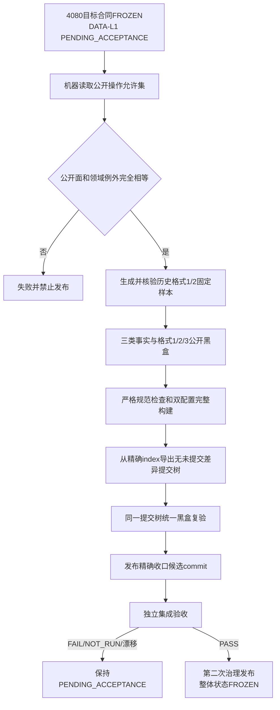

# DATA-L1-FINAL-CLOSURE 通用操作冻结与统一黑盒收口详细设计 v0.1

日期：2026-09-01

状态：正式施工详细设计

## 1. 目标与完成边界

本设计把 4080 已冻结的 DATA-L1 通用操作 / 目标公开合同落实为可机械检查、可在干净提交树运行的收口候选。代码结果必须同时完成：

```text
冻结公开操作允许集
+ 阻止领域专用标识进入L1公开面
+ 修正未知权威载荷版本错误分账
+ 补齐节点/关系/值恢复黑盒
+ 补齐权威载荷格式1/2/3固定样本矩阵
+ 统一运行全部L1黑盒与双配置构建
```

本设计不增加 L1 业务能力，不增加普通 CRUD，不改变节点、关系、值、owner、事实代次、幂等或原子事务语义。新的存在、场景、特征、状态、动态、因果、需求、任务和方法应用只能组合已冻结的目标合同。

`FROZEN` 当前只属于通用操作全集 / 目标公开合同；DATA-L1 整体能力保持 `PENDING_ACCEPTANCE`，直到候选代码提交通过独立集成验收并由规范 / 索引所有者第二次治理发布。合同冻结不禁止不改变它的缺陷修复、安全 / 平台适配、性能优化及既有格式兼容修复。新增基础原语必须由用户显式解冻并建立新合同版本。

## 2. 现行事实基线

设计扫描基线：`main@7125fb2823f52bf153dd2cdfd430ef312c646649`，与 `origin/main` 一致。

1. `海中鱼巣/核心/服务.L1事实基座.ixx` 已公开 4080 第 3 节列出的服务、写端口、签发器、运行包和两种工厂。
2. `L1中性写集请求` 与 `L1所有者范围写集请求` 都只包含节点 / 关系 / 值新建、属性槽变更和退出事实；物理清理由独立入口完成。
3. 双参与者 v1 DTO 仍含 `状态 / 动态` 领域命名；三分区 v2 与有限 N v3 使用中性参与者身份。该 v1 集合是唯一兼容例外。
4. 上层只需 import `服务.L1事实基座`；当前除该服务模块外的生产源码没有直接 import `仓库.L1事实基座`。仓库模块机械可导入但能绕过端口，不属于支持的外部面。
5. 持久仓编码权威载荷格式 3，解码接受格式 1、2、3；当前清单始终使用独立格式 1。
6. 未知清单版本已经返回 `格式不支持`；未知权威载荷版本目前经布尔解码失败落为 `编码或所有者冲突`，与 4070 v1.8 冲突。
7. `端到端测试.L1事实基座持久恢复.ixx` 只覆盖空仓、owner 发布、第二会话恢复、端口重签与 owner 读回，没有节点、关系、值、属性槽、历史或墓碑恢复。
8. `端到端测试.DATA-L1有限N分区原子事务.ixx` 的 V07 覆盖格式 3 round-trip；V08 明确因缺独立合法格式 1 / 2 固定样本而 `NOT_RUN`。
9. 20260828 持久恢复施工 / 验证记录曾写入“有界审计”或“审计 helper”表述，但生产源码、公开 DTO 和专项均不存在恢复审计账。历史记录保持原样；本次记录必须具名纠正其过度声明，不把历史文案当实现证据。
10. 规范目录此前称有限 N v3 尚未实现，实际 DTO、服务、仓库、持久格式 3 和专项已由提交 `3502ddf1` 发布。本设计包同步目录，但不把静态存在扩大成最终收口验收通过。

## 3. 收口流程



任何一步失败都不允许把 DATA-L1 整体标记为最终收口完成；不得通过修改允许集吸收意外公开接口，也不得手工拼装旧格式样本绕过真实兼容性。

## 4. 机器可读冻结清单

新增 `tools/l1_frozen_surface_manifest.json`，UTF-8、确定键序，固定顶层结构：

```json
{
  "schema_version": 1,
  "specification": "4080-v1.0",
  "surface_contract_status": "FROZEN",
  "data_l1_status": "PENDING_ACCEPTANCE",
  "accepted_commit": null,
  "acceptance_record": null,
  "source_module": "海中鱼巣/核心/服务.L1事实基座.ixx",
  "public_operations": {
    "L1事实基座服务": [],
    "L1所有者范围写端口": [],
    "L1所有者范围签发器": [],
    "L1事实基座运行包": [],
    "free_functions": []
  },
  "frozen_source_files": [],
  "legacy_domain_exceptions": [],
  "technical_token_exceptions": [],
  "forbidden_domain_tokens": []
}
```

五个操作组逐项填写 4080 第 3 节的精确名称，组内按源码公开顺序；名称只作人读操作分组，不独自承担完整合同冻结。

`frozen_source_files` 对下列五个文件逐项记录物理路径、规范化字节数和 SHA-256：

1. `海中鱼巣/核心/服务.L1事实基座.ixx`；
2. `海中鱼巣/核心/L1公共事实.数据.h`；
3. `海中鱼巣/核心/L1中性CRUD.数据.h`；
4. `海中鱼巣/核心/L1所有者范围CRUD.数据.h`；
5. `海中鱼巣/核心/L1事实基座持久恢复.数据.h`。

指纹输入是整个文件的 UTF-8 字节，只把 `CRLF` / `CR` 确定规范为 `LF`；注释、空白、声明、实现体、重导出、重载、DTO 字段、枚举数值、合同常量和公开 callable 都进入指纹。因此不需要自制不完整 C++ 语义解析器，任何同名重载、签名、DTO、枚举、版本、重导出或实现变化都必定使指纹失败。

这个策略有意强于“只冻结 ABI”：4080 允许的合同内缺陷、安全、平台、性能或兼容修复若必须改动这五个文件，必须由具名维护计划先证明 43 项操作、完整签名 / DTO / 枚举 / 版本、legacy 例外和持久矩阵未被扩张，再同步新指纹并全量回归；任何上层用途计划不得更新指纹。

兼容例外使用“物理文件 + 限定所属类型 + 成员 + 成员种类 + 期望出现次数”，不使用裸标识符集合：

| 文件 | 唯一允许的限定成员 |
| --- | --- |
| `海中鱼巣/核心/L1所有者范围CRUD.数据.h` | `L1跨所有者原子事务参与者序号::{状态,动态}` 枚举项各1次；`L1跨所有者原子事务请求.{状态写集,动态写集}` 字段各1次；`L1跨所有者原子事务结果.{状态编码映射,动态编码映射}` 字段各1次 |
| `海中鱼巣/核心/服务.L1事实基座.ixx` | `L1所有者范围写端口::提交跨所有者原子事务` 函数1次；其实现体对请求 `状态写集 / 动态写集` 的字段访问各1次 |

禁止领域词固定为：`存在、场景、特征、动态、因果、需求、任务、方法、动作、安全、服务`。通用结果字段的“状态”不作词法禁止，但已冻结 DTO 仍由合同指纹阻止新增业务状态结构。“服务”只允许已冻结的 `L1事实基座服务`、`读取服务` 及 `绑定于` 签名中同名技术参数；按“文件 + 限定声明 + 标识符 + 次数”检查，不对整个词放行。

清单是冻结合同投影，不是第二机器语义来源；内容必须和 4080 完全一致。发现实际公开面外项时修改源码或停止，不得自动把外项写入清单。

## 5. 冻结面检查器

新增 `tools/check_l1_frozen_surface.py`。它同时提供命令行入口和 `检查冻结面() -> list[str]`，固定执行：

1. 读取并验证清单 schema、`4080-v1.0` 和 `surface_contract_status=FROZEN`；未知字段、重复项、空名或缺组失败。`data_l1_status` 只允许 `PENDING_ACCEPTANCE / FROZEN`：前者要求 `accepted_commit / acceptance_record` 均为 null；后者要求 40 位精确 commit、已登记集成验收记录，且 `tools/check_integration_acceptance.py` 对该记录与 commit 退出 0。
2. 对五个 `frozen_source_files` 读取当前工作树实际文件，只规范行结束后重算字节数和 SHA-256；任一文件缺失或指纹不同即失败并报告精确文件。
3. 读取 `服务.L1事实基座.ixx`，在指纹一致的前提下用有界词法和大括号配对提取四个具名 class 的 `public:` 区域和 export namespace 直接自由函数名；忽略构造、析构、赋值、`operator...` 和结果值类型的 `成功()`，验证 43 个操作名无增无减。
4. 对四个 L1 数据头与服务的冻结公开声明提取 C++ 标识符；含禁止领域词的标识符必须与限定 legacy / 技术例外的物理文件、所属声明、成员种类和出现次数完全匹配。例外缺失、移动、改变成员种类、增加同名成员或额外出现都失败。
5. 核对 4080 正文的操作 / 目标合同状态、DATA-L1 整体能力状态与清单完全一致，并核对规范目录 4015 / 4070 / 4080 摘要和“有限 N v3 已实现”口径。`PENDING_ACCEPTANCE` 模式不读取日志、构建产物、缓存或历史记录补结论；`FROZEN` 模式只额外消费清单具名的精确验收记录与 commit。
6. 扫描 `海中鱼巣/**` 生产 C++ 源，`import 海中鱼巣.核心.仓库.L1事实基座` 只允许出现在 `核心/服务.L1事实基座.ixx`；其它文件命中即失败。
7. `许可拒绝` 只允许出现在冻结数据头的既有枚举声明和服务层既有只读映射；仓库写入 / 读取 / 管理实现或新服务分支产生该值时失败。

修改 `tools/check_specs.py`：在现有目录 / 规范关系检查后调用 `检查冻结面()`，把每项转换为 `ERROR`；因此 `python .\tools\check_specs.py --strict` 自动包含冻结面门禁。检查器自身也支持：

```powershell
python .\tools\check_l1_frozen_surface.py --strict
```

检查器测试至少用仓库外临时副本注入：额外公开操作、删除冻结操作、新增同名重载、改参数 / 返回 / cv / `noexcept`、DTO 字段增删改、枚举数值重排、合同版本变化、重导出数据头新增 callable、非例外领域标识符、同文件重复 / 移动 legacy 例外、篡改 `surface_contract_status`，以及在无有效验收 commit / 记录时提前将 `data_l1_status` 改为 `FROZEN`。十二类均须非零；其中前八类至少必须由冻结文件指纹直接捕获，正式源不因测试改变。

## 6. 未知权威载荷版本错误修正

只修改 `海中鱼巣/核心/仓库.L1事实基座.ixx` 私有恢复实现，不改变公开 DTO 或函数签名。

新增私有枚举：

```cpp
enum class 权威载荷解码状态 : std::uint8_t {
    成功 = 1,
    格式不支持 = 2,
    材料非法 = 3
};
```

`解码权威状态(const std::vector<std::uint8_t>&, 状态&)` 改为返回该枚举，顺序固定：

1. magic 不能读取或不匹配：`格式不支持`；
2. 版本不能读取或不在 `1..3`：`格式不支持`；
3. 已知版本的字段、顺序、枚举、重复、尾随材料、owner、关系、槽、幂等或索引重建失败：`材料非法`；
4. 全部解码和索引重建成功：`成功`。

`初始化持久恢复实现` 映射固定为：

```text
格式不支持 -> L1事实基座核心持久恢复状态::格式不支持
材料非法   -> L1事实基座核心持久恢复状态::编码或所有者冲突
成功       -> 继续事实代次和状态完整互证
```

摘要、清单、事实代次和最终 `状态完整` 的既有分账保持不变。不得增加公开恢复状态或放宽已知格式校验。

## 7. 三类事实恢复专项扩展

扩展既有 `海中鱼巣/端到端测试.L1事实基座持久恢复.ixx`，继续只使用公开持久运行包、签发器、写端口和读取服务。固定建立一个独占 owner，并在同一 owner 下使用下列写集：

### 7.1 首次结构

| 本地键 | 事实 | 关键字段 |
| --- | --- | --- |
| 1 | 普通节点 A | 节点种类 `普通` |
| 2 | 普通节点 B | 节点种类 `普通` |
| 3 | 关系类型节点 RT | 节点种类 `关系类型` |
| 4 | 属性类型节点 PT | 节点种类 `属性类型`，表示 `I64` |
| 5 | 关系 R1 | `A -> B`，类型 RT，角色 1 |
| 6 | 值 V1 | 所属 A，类型 PT，材料 41，来源 B |
| - | 属性槽 | `A + PT -> V1` |

记录首次编码映射和 G1。第二写集建立 R2（同端点 / 类型、角色 2）与 V2（材料 42），把槽切到 V2，并在同事务退出 R1 / V1。第三写集建立三个独立无引用事实用于退出与物理清理：普通节点 C、关系 R3、值 V3；按引用闭包要求先退出 R3 / V3，再退出 C，最后用独立物理清理请求形成三类墓碑。

### 7.2 第二会话恢复断言

恢复后必须逐项证明：

- A / B / RT / PT / R2 / V2 当前可读，属性槽指向 V2；
- R1 / V1 只从历史入口可读，创建 / 退出代次保持；
- C / R3 / V3 返回历史材料已清理且三类墓碑字段正确；
- 当前源 / 目标关系组、历史关系组、历史属性值组和一致投影的事实代次、排序与成员一致；
- owner 当前可读，旧端口未恢复，按原建立身份重新签发成功；
- 原首次写入幂等身份的首次材料可读，原请求重放精确收敛；
- 新提交取得后继事实代次且稳定编码不复用。

增加未知载荷版本注入：复制一份合法格式 3 根，只改活动快照开头的载荷版本并同步 manifest 长度 / SHA-256，使摘要校验通过而载荷版本未知；公开持久工厂必须返回 `格式不支持` 且不交付运行包。摘要未同步的对照仍返回 `摘要不一致`。

同一专项追加 fail-closed 矩阵：清单缺失但槽存在、清单指向槽缺失、清单长度不等于活动载荷、SHA-256 不符、已知格式内未知 variant / 枚举标签、同根第二运行包存储占用，以及非活动槽序号 / 代次更大但清单仍指向合法活动槽。前六类必须非成功且空运行包；最后一类必须只采用清单指定槽。

## 8. 历史格式固定样本

新增两组二进制测试材料，不登记到工程 XML：

```text
海中鱼巣/测试材料/DATA-L1-FINAL-CLOSURE/载荷格式1/
  manifest.bin
  snapshot-a.bin
  snapshot-b.bin（若历史公开路径实际形成）
  provenance.json

海中鱼巣/测试材料/DATA-L1-FINAL-CLOSURE/载荷格式2/
  manifest.bin
  snapshot-a.bin
  snapshot-b.bin（若历史公开路径实际形成）
  provenance.json
```

### 8.1 来源冻结

| 载荷格式 | 唯一生成源码提交 | 必须使用的能力 |
| --- | --- | --- |
| 1 | `db65bc99c48310935509e3fdf05b22e71ae9b6b1` | 该提交公开持久运行包、owner、节点 / 关系 / 值写入、当前 / 历史读回 |
| 2 | `ff2366d97b662cfc6c8cf16917c06d5da182bf4b` | 上述能力 + 该提交公开三分区 v2 原子提交 |

执行者在 `D:\TEMP\海中鱼巣\DATA-L1-FINAL-CLOSURE\fixtures\<format>` 导出精确提交树，使用生产外临时 generator 只经该提交的公开 API 形成与第 7.1 节同构的三类事实、当前 / 历史和幂等账；格式 2 另形成一笔三分区 v2 首次结果。禁止调用私有编码器、复制当前格式 3 后改版本字节或手工构造二进制。

`provenance.json` 固定记录：schema 1、载荷格式、完整 40 位 source commit、generator 源 SHA-256、实际生成命令、manifest / 两槽逐文件 SHA-256、活动槽、事实代次、owner / 三类事实稳定编码、写入幂等身份和期望读回。生成后再从未修改的同提交树独立恢复一次并通过公开读回，才可纳入候选。

### 8.2 新实现兼容矩阵

扩展 `端到端测试.DATA-L1有限N分区原子事务.ixx` 的 V08：把每组固定材料复制到独立 `D:\TEMP` 根，由新实现恢复并验证：

| 样本 | 旧账预期 | 恢复后动作 |
| --- | --- | --- |
| 格式 1 | v2 / v3 组合账为空；既有 v1 / owner 账保持 | 三类事实正式读回，原写请求精确重放，再首次提交 v3 |
| 格式 2 | v2 账精确重放；v3 账为空 | 三类事实正式读回，原 v2 请求精确重放，再首次提交 v3 |
| 格式 3 | v2 / v3 按已发布材料恢复 | 保持既有 V07 round-trip 和 v3 精确重放 |

格式 1 / 2 后首次 v3 必须形成共同后继 G，重启后 v3 原请求精确重复；不得原地迁移旧账或让相同数值键跨版本命中。

测试定位 fixture 根固定从 `std::filesystem::path{__FILE__}` 的仓库源码父链解析，并验证 `provenance.json` 与实际文件 SHA-256；找不到、哈希不符或 source commit 不等冻结值时失败，不降级为 `NOT_RUN`。

## 9. 允许文件与依赖方向

生产修改：

```text
海中鱼巣/核心/仓库.L1事实基座.ixx
```

专项与固定材料：

```text
海中鱼巣/端到端测试.L1事实基座持久恢复.ixx
海中鱼巣/端到端测试.DATA-L1有限N分区原子事务.ixx
海中鱼巣/测试材料/DATA-L1-FINAL-CLOSURE/**
```

工程检查：

```text
tools/l1_frozen_surface_manifest.json
tools/check_l1_frozen_surface.py
tools/check_specs.py
```

专属记录：

```text
施工记录/20260901_DATA-L1-FINAL-CLOSURE_施工记录_v0.1.md
验证记录/20260901_DATA-L1-FINAL-CLOSURE_验证记录_v0.1.md
```

既有两个专项已经登记并可由生产外 driver import，不修改 `海中鱼巣.vcxproj`、filters、入口、普通应用装配或其它 dirty 文件。禁止修改服务公开模块、四个 L1 数据头、L2 / L3、业务层、旧施工 / 验证记录、知识库和共享流程图。

若实施发现修正格式错误必须改变公开 DTO，或两个专项无法在不改工程登记的前提下形成统一 driver，属于设计漂移并停止；不得临场扩大白名单。

## 10. 统一验证合同

在精确 index 导出的提交树中，以 VS 2022 `v143` 和仓库外独立目录执行：

1. `python .\tools\check_l1_frozen_surface.py --strict`；
2. `python .\tools\check_specs.py --strict`；
3. `git diff --check` 与精确暂存文件白名单；
4. Debug / Release x64 根工程 fresh Rebuild；
5. 生产外统一 driver 同时调用 `运行L1事实基座持久恢复端到端测试()` 与 `运行DATA_L1有限N分区原子事务端到端测试()`，两配置都退出 0；
6. 第 5 节十二类检查器负例全部非零，正式树复查仍为 0；
7. 恢复 fail-closed 矩阵全部通过，失败均不交付运行包且不退化为空仓；
8. 从精确 index 导出源码树后重复 1、2、4、5、7，证明结果不依赖工作区异主 WIP。

黑盒驱动只使用公开 API。fixture generator、driver、构建中间件、程序和日志只放在 `D:\TEMP\海中鱼巣\DATA-L1-FINAL-CLOSURE\<轮次>`，不进入 Git；固定二进制 fixture 和 provenance 是唯一例外，按第 8 节进入测试材料路径。

故障注入中没有合法稳定 seam 的崩溃、断电、介质故障、资源耗尽和长时运行逐项记 `NOT_RUN`。这不影响通用操作 / 目标公开合同冻结，但不得声明对应可靠性已经验收。

代码候选提交和推送后，交互智能体必须委派集成验收与回归智能体，以该精确 commit 为唯一基线执行服务导向独立验收，并在 `验证记录/集成验收/**` 形成由 `tools/check_integration_acceptance.py` 验证的结论。代码执行记录、统一 driver 自检或构建通过都不能替代该独立验收。

独立验收 `PASS` 后，规范 / 计划索引所有者以第二次治理发布同步修改 4080、规范目录、冻结 manifest 和计划索引：把 `data_l1_status` / 整体能力状态升级为 `FROZEN`，登记精确验收 commit 和记录，使 `DATA-L1-FINAL-CLOSURE` 退出。该发布不改生产代码、不重写验收结论；验收非 `PASS` 或基线不同则保持 `PENDING_ACCEPTANCE`。

## 11. 完成声明边界

代码执行与精确提交树统一黑盒通过后，只可以声明：

> DATA-L1 收口候选实现与 4080 v1.0 冻结通用操作目标合同一致；领域专用公开面受到机器门禁；节点、关系、值恢复及载荷格式 1 / 2 / 3 兼容已在精确提交树经公开黑盒验证；整体状态仍为 `PENDING_ACCEPTANCE`。

只有独立集成验收 `PASS` 且第二次治理发布完成后，才可以声明：

> DATA-L1 整体能力状态已 `FROZEN`；后续上层应用只能组合冻结 L1 能力。

不得声明：任何上层存在 / 场景 / 特征 / 状态 / 动态 / 因果 / 需求 / 任务 / 方法应用已经完成，崩溃或断电恢复已验证，或 L1 永远不再允许缺陷修复。新的上层应用只能组合 L1；新增原语必须显式解冻。
