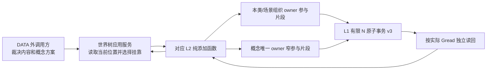

# 六类显式挂靠添加与概念引用详细设计

身份：`L2-BOUND-ADD-CONCEPT-REFERENCE`

日期：2026-09-13
版本：v0.4
设计基线：`6b595aab49c66f3475d1608bc1d5851218076fac`
状态：总体设计冻结；第一代码叶执行退回的状态、模块依赖与受限原子提交合同缺口已修订

## 1. 目标与边界

L2 只有场景、存在、特征、状态、动态和因果六类。每类公开的纯添加函数必须接收调用方显式给出的强类型挂靠，不自行查找父节点、猜测世界根或使用隐式全局位置。世界树类位于六类之上，先读取当前世界树位置，再把挂靠参数传给对应 L2 函数并消费完整结果。

一次纯添加只有在本类信息节点、直接挂靠、相关概念生成或精确复用、概念引用/世界挂接全部按实际截止读回后才成功。概念结构仍由唯一概念 owner 写入；世界树类不直写 L1、概念或任何第二权威。

本设计不改变概念抽象的业务归属。类别、签名、定义、直接上位和支持依据由 DATA 之外调用方先裁决，L2 只机械核验、组织事务和读回。

## 2. 当前事实与复用裁决

- `应用服务.世界树类.ixx` 已位于业务应用层，并能读取唯一根和统一层级位置；可复用其位置读取、根闭集及同截止守卫。
- 当前世界树创建仍直接调用 `绑定存在数据服务`，对应 L2 类尚未成为统一公开添加入口。
- 存在绑定已有父场景/父存在/直接子场景三类显式绑定；场景已有父场景语境；准确特征已有 `{场景,组织父}`；状态、动态的内容创建与场景绑定/组织仍分开；因果没有独立链内挂靠 DTO。
- 六类中只有因果类持有窄概念核验提供者，其余概念形成位于应用服务。当前概念数据服务仍带旧四根物理合同，不能作为新生产路径继续扩张；首叶必须先把新参与 ABI 所需的现有纯值强类型移入无环合同模块，并为概念服务增加不要求旧根交付的新布局。
- L1 有限 N 分区原子事务 v3 已提供共同 G、幂等、原键恢复和跨 owner 原子提交，可复用；不得新增领域化 L1 入口。

因此先形成无总根的概念窄参与提供者，再依次迁移六类添加入口。世界树消费者最后接线。

## 3. 总体调用与权威



世界树应用服务只拥有值式位置和结果，不保存写入事实。每个事实仍由原 owner 负责；概念 owner 只写概念、定义、直接上位、世界挂接/引用，不写世界节点和结构父。

## 4. 六类挂靠和添加合同

| 类 | 强类型挂靠 | 同截止校验 | 成功闭合 |
| --- | --- | --- | --- |
| 场景 | 新场景：父场景；已有 E 启用视角：父场景语境、预期结构父关系 | 父场景当前有效且属于同一世界；已有 E 的唯一结构父与预期关系一致 | 新场景共同形成 E、直接子场景边、父语境与角色；已有 E 不增第二结构父；相关概念为同 E 的存在概念 |
| 存在 | `父场景成员(父场景)` 或 `父存在组成(父存在)` | 绑定端当前有效、世界根和场景语境一致、无环且唯一 | E 与初始绑定同次成立；存在概念生成/复用及世界挂接完整 |
| 特征 | `场景直接特征`、`存在内部特征`、`父特征子节点`之一；带所属场景和组织父 | 父类型、场景语境、路径、当前性及唯一位置一致 | F 内容、场景已知和组织边共同成立；特征概念生成/复用及引用完整 |
| 状态 | 发生场景、被描述存在、状态组织父 | C/E/S 使用关系、FT和值、组织路径同 G0 完整 | S 内容、使用绑定、场景组织和已有特征概念/规则引用完整；无状态概念类 |
| 动态 | 发生场景、主体存在、动态组织父 | 来源截止、B/S 或子动态闭包、主体、场景和组织路径一致 | D 内容、来源、场景组织和动态概念生成/复用及引用完整 |
| 因果 | 调用方显式给出的独立因果链/因果组织父；世界树类只补充当前世界证据引用 | 链父当前有效，概念角色和证据截止完整，无环 | 概念化因果信息及链内直接组织完整；不进入世界树单父 |

所有入口共同拒绝：零/最大 `G0`、空挂靠、端点类型错误、端点不存在或已退出、截止漂移、多父/成环、概念方案缺字段、跨类别上位、同义读取失败、预算不足、幂等冲突、资源失败和内部不一致。提交前失败零新身份；提交后不确定返回原请求、首次可能 H 和明确阶段。

## 5. 概念窄参与 ABI（第一代码叶）

新模块：`海中鱼巣.领域.合同.相关概念添加参与`，文件 `海中鱼巣/领域/合同.相关概念添加参与.ixx`。模块声明后的唯一公开模块依赖固定为 `export import 海中鱼巣.核心.服务.L1事实基座;`；该核心服务模块已经公开再导出`海中鱼巣.核心.合同.L1所有者范围CRUD`，因此本合同不重复直接导入owner-scoped合同。它不导入任一六类数据服务或概念数据服务。为解除循环，从 `数据服务.概念树类.ixx` 原名、原字段迁移并由该数据模块继续再导出的纯值类型固定为：`概念树概念身份`、`概念树存在引用`、`概念树特征类型引用`、`概念树特征引用`、`概念树场景引用`、`概念树世界引用`、`概念树形成世界引用`、`概念树精确值`、`概念树I64区间`、`概念树特征值域`、`概念树特征定义`、`概念树存在定义`、`概念树定义`、`概念树来源项`、`概念树预算`、`概念树生命周期`、`概念树直接上位事实`、`概念树形成引用事实`。迁移不改名称、字段顺序、枚举分派或对象含义。

物理依赖和签名唯一冻结为：

```cpp
export module 海中鱼巣.领域.合同.相关概念添加参与;
export import 海中鱼巣.核心.服务.L1事实基座;

export namespace 海中鱼巣 {
class 相关概念添加参与者 {
 public:
  virtual bool 绑定于(const L1事实基座服务&) const noexcept = 0;
  // 其余虚函数保持下述冻结声明。
};
}
```

`L1事实基座服务`只能指向`海中鱼巣.核心.服务.L1事实基座`所拥有并导出的类实体。禁止在全局模块片段、本领域合同模块或头文件中另写`class L1事实基座服务;`，否则会建立不同模块归属的同名实体；也禁止把签名改成`void*`、模板参数、owner端口或删除`绑定于`。依赖方向固定为“相关概念领域合同 -> 核心L1服务 -> 核心合同/仓库”，核心L1服务不得反向导入本领域合同，因而不形成模块环。导入本合同的消费者通过该`export import`取得同一个完整服务类型，无需依赖偶然导入顺序。合同全局模块片段增加标准`<span>`，只用于下述调用期外部端口借用视图。

公开纯值类型固定为：

```cpp
enum class 相关概念类别 : std::uint8_t { 存在 = 1, 特征 = 2 };
enum class 相关概念方案种类 : std::uint8_t { 精确复用 = 1, 创建并引用 = 2 };
enum class 相关概念参与状态 : std::uint8_t {
  已准备 = 1, 已读取 = 2, 精确重复 = 3, 入口拒绝 = 4,
  概念未找到 = 5, 概念已退出 = 6, 类别冲突 = 7, 签名冲突 = 8,
  上位成环 = 9, 挂靠无效 = 10, 事实代次漂移 = 11,
  幂等冲突 = 12, 数量预算不足 = 13, 历史材料不可用 = 14,
  资源失败 = 15, 内部不一致 = 16, 已可能发布 = 17,
  旧格式不支持 = 18
};
using 相关概念读取预算 = 概念树预算;
struct 相关概念世界挂靠 { 概念树形成世界引用 世界事实; std::uint64_t 证据截止=0; };
struct 相关概念精确复用方案 { 概念树概念身份 概念; 相关概念类别 类别; 概念树定义 预期定义; };
struct 相关概念创建方案 { 相关概念类别 类别; 概念树定义 定义; std::vector<概念树概念身份> 直接上位; };
using 相关概念方案 = std::variant<相关概念精确复用方案, 相关概念创建方案>;
struct 相关概念参与请求 { std::uint32_t 版本=1; std::uint64_t G0=0; L1所有者范围写入幂等身份 幂等身份; 相关概念方案 方案; 相关概念世界挂靠 挂靠; 相关概念读取预算 预算; };
struct 相关概念参与片段 { 相关概念参与状态 状态; std::uint64_t Gread; std::optional<L1有限N分区原子参与者写集_v3> 写集; /* 不含端口 */ };
struct 相关概念完整事实 { 概念树概念身份 概念; 相关概念类别 类别; 概念树定义 定义; std::vector<概念树直接上位事实> 直接上位; 概念树形成引用事实 挂接; 概念树生命周期 生命周期; };
struct 相关概念参与读回 { 相关概念参与状态 状态; std::uint64_t Gread,H; std::optional<相关概念完整事实> 概念; };
struct 相关概念组合提交请求 { std::uint32_t 版本=1; std::uint64_t Gread=0; L1所有者范围写入幂等身份 组合幂等身份; 相关概念参与请求 概念请求; std::vector<L1有限N分区原子参与者写集_v3> 前序参与者写集组; };
struct 相关概念组合提交结果 { std::uint32_t 版本=1; 相关概念参与状态 概念状态; std::uint64_t Gread=0; bool 已进入L1=false; L1有限N分区原子事务结果_v3 事务结果; };
class 相关概念添加参与者 {
 public:
  virtual bool 绑定于(const L1事实基座服务&) const noexcept = 0;
  virtual 相关概念参与片段 准备相关概念片段(const 相关概念参与请求&, std::uint64_t Gread, L1有限N分区原子参与者身份_v3) const noexcept = 0;
  virtual 相关概念组合提交结果 提交相关概念组合事务(const 相关概念组合提交请求&, std::span<L1所有者范围写端口* const> 前序参与者端口组) noexcept = 0;
  virtual 相关概念参与读回 读取相关概念结果(const 相关概念参与请求&, std::uint64_t Gread, std::uint64_t H) const noexcept = 0;
};
```

新布局的精确公开交付为：

```cpp
struct 相关概念结构类型 final {
  稳定编码 类型登记, 概念族成员, 概念类别, 定义成员, 定义种类;
  稳定编码 定义宿主, 定义特征类型, 定义模板;
  稳定编码 精确I64, 精确I64组, 精确U64组, 区间下界, 区间上界;
  稳定编码 直接上位, 形成成员, 形成存在, 形成特征, 形成特征类型, 形成场景;
  稳定编码 证据截止, 生命周期;
};
struct 相关概念结构交付 final {
  std::uint32_t 版本=1, 格式=1;
  稳定编码 格式锚点, 概念族锚点;
  相关概念结构类型 类型;
};
```

格式锚点以 `类型登记` 的确定角色 1—21 逐项指向上述字段顺序中的类型编码；角色、类型编码和两个锚点均非零、互异、同一概念 owner 且当前有效。`概念族锚点`只是本 owner 的成员索引锚，不是概念、顶层父或总根。

L1 参与片段固定复用现有 `L1有限N分区原子参与者写集_v3`，不得另造第二事务协议。`概念树定义`经既有确定规范化和强类型逐字段相等同时充当不可变签名与完整定义；首叶不引入当前代码不存在的“不可变材料身份”。类别必须与定义联合分支一致。`相关概念完整事实`必须回显身份、类别、定义、全部直接上位、请求挂接及生命周期。顶层概念的直接上位允许为空；非顶层的调用方提交完整直接上位组。`准备相关概念片段`新增第三参数`L1有限N分区原子参与者身份_v3`，必须位于2—255；形成的写集必须原样使用该身份，不得固定为2或在提交时改写。`已准备`必须携带非空可提交写集；`精确重复`无写集，后续读回用 `H=Gread`；其它非成功既无写集也无假完整事实。

受限组合提交只由概念参与者实现，不公开概念owner端口。请求中的前序写集数量记为M，固定1≤M≤254；前序写集按vector位置严格使用参与者1..M，概念参与者严格为M+1，所有身份连续且恰覆盖1..M+1。外部端口span长度必须等于M，端口i对应前序写集i+1；所有端口有效、绑定同一L1、owner与对应写集一致且两两不同，组合键、各owner键非零且互异，所有写集期望代次和概念请求G0均等于Gread。任一不满足时不进入L1。

`提交相关概念组合事务`在概念服务互斥范围内先用概念请求的owner幂等键读取私有概念端口首次材料。首次材料未找到时，才以参与者M+1重新调用准备函数；只有状态`已准备`且概念写集owner、参与者、代次和owner键精确匹配时才组装新请求。首次材料成功时，必须验证owner、owner键、首次H、首次结果和请求概念的权威读回，再把首次规范化owner写集机械转换为参与者M+1的v3写集：合同、代次、owner键、本地键、材料、退出事实和项顺序原样保留，稳定引用转为同一稳定引用，本owner本地引用转为参与者M+1的同一本地引用，禁止生成指向前序参与者的跨参与者引用。转换后再次规范化必须与首次材料逐字段相等，否则返回内部不一致且不提交。该写集只用于原组合键重放；首次材料残缺、错owner、错键或读回不同义同样返回内部不一致且不提交。这样发布后的同键重放不依赖在新当前代次重新准备，也不把当前已经存在的挂接误判成无需重放。

新建或重放均组装`{前序写集..., 概念写集}`，由外部端口1调用现有`提交有限N分区原子事务_v3`，其余端口顺序固定为外部端口2..M、最后是仅在函数内部取址的概念端口。传入span是调用期非拥有借用，函数不得保存、返回或转交到L1调用之外；概念端口不进入请求DTO、结果DTO或任何public/protected访问器。后继L2只可传入自身或其具名私有参与接口合法交付的端口，世界树和普通业务调用者不得调用该提交函数。

若首次材料未找到且重新准备得到`精确重复`或任一非`已准备`状态，则`已进入L1=false`，回显精确概念状态，事务结果保留默认入口拒绝且零写；已有稳定概念由后继L2按自身owner数选择既有单owner或多owner提交，不伪造空概念参与者。进入L1后`已进入L1=true`；首次提交阶段`概念状态=已准备`，L1返回精确重复时改为`概念状态=精确重复`。L1九种状态、组合键、共同H、发布标志、重试边界和参与者结果原样回显。提交前失败零写；`已可能发布`只允许原Gread、原组合键、原概念请求、相同前序规范化写集和相同端口owner顺序重放，不回滚。L1返回`已提交/精确重复`且共同H有效后，调用者必须分别完成各外部owner读回，并调用`读取相关概念结果(概念请求, 实际Gread, 共同H)`；任一读回不完整由后继L2映射为已可能发布，不能把原子提交本身当作业务成功。

`概念树类数据服务`实现该接口。新布局由同一概念 owner 校验。纯新构造固定为 `概念树类数据服务(const L1事实基座服务&, const 特征类数据服务&, const 存在类数据服务&, const 特征值类数据服务&, const 场景类数据服务&, L1所有者范围写端口&&, const 相关概念结构交付&)`；迁移构造固定为相同前六项后接 `const 概念树结构交付&, const 相关概念结构交付&`。场景服务只用于核验 `概念树场景引用` 的当前/历史身份和同L1，不取得写入权。内部把旧 `概念树结构交付` 改为可选旧布局，把新交付保存为可选新布局；纯新构造只含新布局，迁移构造两者均含，保留的旧构造只含旧布局。旧入口在旧布局缺失时结构化返回`概念树数据状态::旧格式不支持 = 35`，新参与入口在新布局缺失时返回`相关概念参与状态::旧格式不支持 = 18`；两侧不得访问对方布局。准备函数只核验并形成概念 owner 片段，不提交；后继 L2 取得全部前序 owner 的合法私有端口与写集后，只能通过本接口的`提交相关概念组合事务`完成包含概念 owner 的 L1 v3 原子提交。读取函数只读概念 owner 权威事实。接口不公开概念 owner 写端口，也不允许调用者构造概念编码。

这里的两个“旧格式不支持”属于不同公开合同，精确映射固定如下：

| 入口与触发 | 返回枚举与固定值 | 载荷和写入 |
| --- | --- | --- |
| `准备相关概念片段`或`读取相关概念结果`所在实例没有新`相关概念结构交付` | `相关概念参与状态::旧格式不支持 = 18` | 两者回显调用截止`Gread`；准备结果无写集且该DTO没有H字段，读回结果`H=0`且无`概念`；L1零写入 |
| 保留的旧概念入口所在实例没有旧`概念树结构交付` | `概念树数据状态::旧格式不支持 = 35` | 保持旧入口既有空业务载荷和零写入合同 |
| 新参与路径复用的内部读取明确得到`概念树数据状态::旧格式不支持` | 以穷尽`switch`显式映射为`相关概念参与状态::旧格式不支持 = 18` | 不透传底层数值，不保留部分概念或片段 |

`18`只追加到`相关概念参与状态`的现有1—17闭集，不改变任何原值。实现不得以`static_cast`、底层整数复制或同名枚举代入把`概念树数据状态`的`35`当作参与状态。`旧格式不支持`不是成功：成功谓词不得接受18，准备结果不得携带`写集`，读回结果不得携带`概念`。纯新实例验证旧入口为35、旧实例验证新参与两入口为18、迁移实例验证两侧分别成功且不访问对方布局；编译期同时断言两个底层值分别为18和35。

创建片段的固定物理映射是：`概念族锚点 -> C` 使用 `概念族成员`；C 保存 `概念类别` 和 `生命周期` 值；`C -> 定义记录` 使用 `定义成员`，定义记录保存 `定义种类`，并按 `概念树特征定义/概念树存在定义` 分支使用定义关系和值类型逐项展开；每条 `上位C -> 下位C` 使用 `直接上位`；`C -> 形成记录` 使用 `形成成员`，形成记录按世界引用联合的实际分支以唯一一种 `形成*` 关系指向挂靠端点，并保存 `证据截止`。所有节点、关系和值使用同一参与写集的本地键，禁止预分配稳定编码。精确复用且挂接已存在返回空写集；精确复用缺挂接只形成记录、形成成员、端点关系和证据值。

首叶只开放当前已有完整强类型定义的存在与特征。场景复用同一 E 的存在概念；状态只引用已发布特征概念；因果继续使用4340窄核验；动态概念等待7191的专属定义加入同一 owner 后扩展本枚举和联合，不能用临时字节、裸编码或实例动态内容替代。

## 6. 事务、并发和恢复

后继 L2 添加函数在单实例互斥区内固定 `G0`，依次完成挂靠预读、概念方案预读、各 owner 片段准备、L1 v3 一次提交、当前 G 读取和各 owner 独立读回。片段只允许前向依赖，owner 唯一且顺序稳定；请求哈希和幂等身份不能依赖容器地址或遍历偶然顺序。

同键同请求精确收敛；同键异请求返回幂等冲突。同 G 并发只有一个提交成功，另一个按漂移或精确重复处理。提交前异常清空临时片段；提交后超时、异常或读回失败不得回滚或删除，返回已可能发布并由原键恢复。

## 7. 世界树应用职责

世界树类新增的六类应用方法在对应提供者完成后逐步接线。每个方法先调用统一位置读取，并按第4节构造挂靠；任何位置读取非成功均不得调用 L2 添加。世界树类不能读取内部 owner、调用参与者准备函数、组装 L1 事务或直接调用概念写函数。

L2 返回成功后，世界树类在结果 `Gread` 读取统一位置及相关概念投影。两者实际截止不同、位置多重、挂靠不相等或概念引用缺失时返回内部不一致/事实代次漂移，不保存本地补丁。

## 8. 实施路线

1. P0：概念唯一 owner 的无总根窄参与合同及独立验证。本设计配套的第一份代码计划只覆盖本项，发布门禁满足前保持待激活。
2. P1：存在类和场景类公开添加入口，替代世界树对 `绑定存在数据服务` 的直接消费。
3. P2：特征类吸收定位创建公开入口并支持三种挂靠。
4. P3：状态类协调内容、C/E/S 绑定、组织和特征概念引用。
5. P4：动态类协调内容、来源、组织和动态概念引用。
6. P5：因果类增加独立链内挂靠；不接入世界树单父。
7. P6：世界树类六路位置选择、传参和结果读回；旧直接编排入口零可达后再退役。

P1—P6 只是后继路线，不登记当前计划，不授权代码施工。

## 9. 完成声明边界

总体完成需要六类公开添加、概念唯一 owner、世界树应用调用、普通生产装配、旧入口零可达和独立集成验收全部成立。P0 完成只证明相关概念参与者可以在无总根新合同下准备片段并独立读回，不证明任何六类添加或世界树消费已经迁移。
