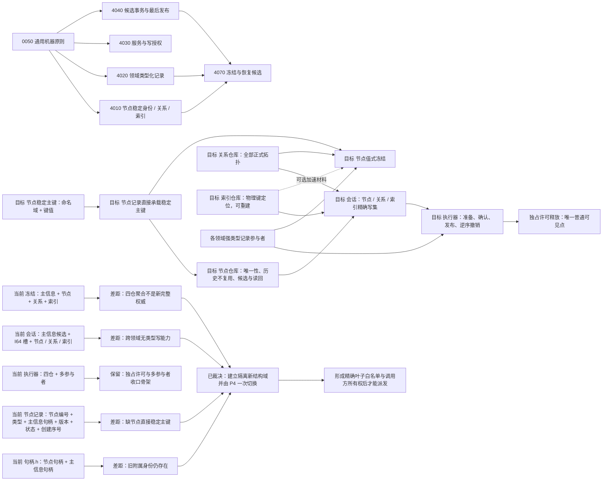
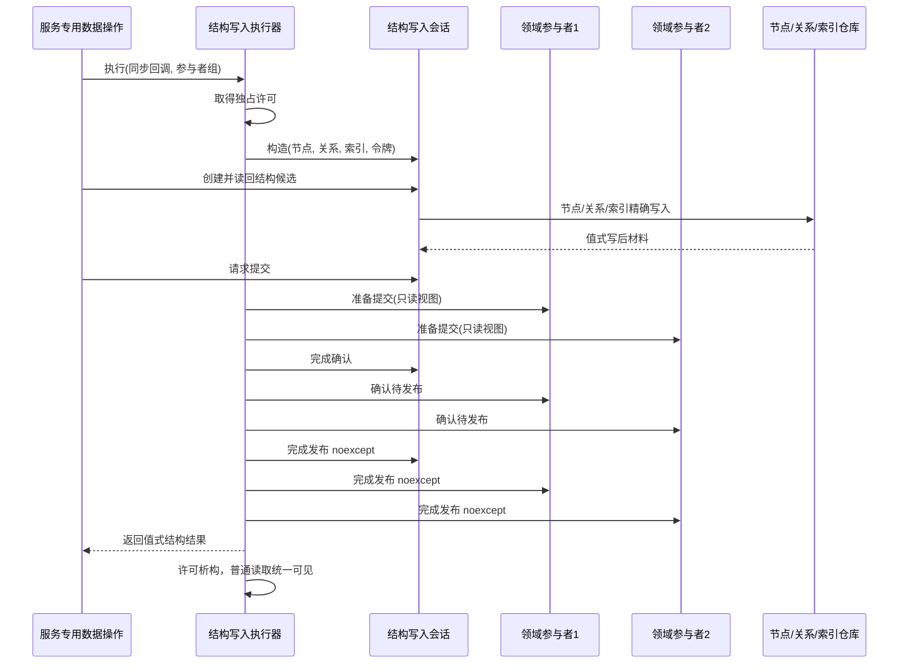

# NODE-TYPED-MIGRATION NT-P1 函数结构知识图谱

日期：2026-07-22

基线：`main@1185e1b458b9c83244cd775dea3825931a134787`

状态：设计记录 / 区分当前实现与施工目标 / 不授权代码实施

## 1. 用途

本图谱把 NT-P1 的正式规范、当前核心符号、目标结构、目标函数、调用关系、文件所有权和施工门禁连成一份可机械复核的记录。它不取代正式规范、详细设计或叶子施工计划。

## 2. 总知识图谱



## 3. 当前符号事实表

| 当前符号 | 文件 | 直接依赖 / 数据 | 当前调用语境 | 目标处置 |
| --- | --- | --- | --- | --- |
| `主信息句柄` | `核心/句柄.h` | 仓库编号、主信息编号、版本 | 节点记录、会话、领域结构和冻结 | 新路径禁止；物理删除归 P4 |
| `节点记录::主信息` | `核心/节点仓库.h` | `主信息句柄` | 所有节点创建与节点附属读取 | 替换为 `节点稳定主键`，不能双字段并存于新记录 |
| `节点仓库(const 主信息仓库&, ...)` | `核心/节点仓库.h/.cpp` | 主信息仓库、事务接线 | 运行期装配 | 新路径构造不再依赖主信息仓库 |
| `结构化创建节点未发布候选(类型, 主信息, 令牌)` | `核心/节点仓库.h/.cpp` | 主信息当前性 | 会话节点候选 | 新路径改为 `类型 + 稳定主键 + 令牌` |
| `创建主信息候选` | `核心/会话.结构写入.ixx` | 主信息仓库 | 领域数据操作事务 | 从新会话删除 |
| `写入候选I64值` / `候选I64值匹配` | 同上 | 主信息候选和值槽 | 特征值、状态动态等旧路径 | 由各领域强类型参与者替代 |
| `读取候选节点主信息` / `读取候选I64值` | 会话提交准备视图 | 主信息、I64 | 事务参与者准备 | 改为候选节点稳定主键与类型读取 |
| `结构写入事务参与者` | `核心/执行器.结构写入.ixx` | 四阶段虚接口 | 服务内部记录侧账 | 保留；每个领域实现强类型材料 |
| `结构写入执行器::执行` | 同上 | 独占许可、会话、参与者组 | 数据操作同步回调 | 保留骨架，移除新路径主信息仓库依赖 |
| `主键绑定记录` / `绑定主键` | `核心/索引仓库.h/.cpp` | 索引物理键、节点句柄、所有者声明 | 候选定位 | 改称索引物理键；不可裁决节点稳定身份 |
| `权威冻结材料::主信息` | `核心/权威冻结材料.数据.h` | 主信息值容器 | 快照只读导出 | 新冻结合同删除；旧材料只读归档 / 迁移或拒绝 |

## 4. 目标结构节点

### 4.1 `节点稳定主键`

```text
字段：命名域、键值
有效性：两个分量都非零
相等性：两个分量全部相等
写入方：领域服务形成，专用数据操作提交，节点仓库复核
读取方：节点仓库、关系端点复核所需节点读回、领域服务值式投影
生命周期：节点历史内不变；删除后不得复用
持久化：随节点记录完整保存
禁止：索引物理键、旧主信息编号、显示名、哈希临时值直接冒充
```

### 4.2 `节点记录`

```text
节点编号
节点稳定主键
节点类型
版本号
记录状态
创建序号
```

### 4.3 `领域强类型记录参与者<T记录>`

```text
T记录由本领域定义，不进入跨领域 variant
所属节点完整句柄
记录版本 / 格式版本 / 状态
写前值 / 写后值
候选阶段
准备提交 / 确认待发布 / 完成发布 / 完成撤销
```

## 5. 目标函数节点与边

### 5.1 节点仓库

| 目标函数 | 输入 | 输出 | 调用者 | 关键边界 |
| --- | --- | --- | --- | --- |
| `稳定主键是否有效` | `节点稳定主键` | bool 辅助判断 | 节点仓库 / 数据操作 | bool 不成为机器事实，只作写前拒绝 |
| `读取稳定主键当前身份` | 稳定主键、令牌 | 具名状态 + 可选节点句柄 | 结构会话 | 区分空闲、已占用、入口拒绝、内部不一致 |
| `结构化创建节点未发布候选` | 节点类型、稳定主键、独占令牌 | 操作结果 + 候选 | 结构会话 | 同键同义幂等；同键异义冲突；无占用才创建 |
| `读取节点` | 完整节点句柄、可选令牌 | 值式节点记录 | 会话 / 关系 / 正式读取 | 复核仓库编号、版本和状态 |
| `按稳定主键读取节点` | 稳定主键、可选令牌 | 值式节点句柄 / 记录 | 正式读取 | 内部可重建索引命中后仍回读记录 |
| `导出权威状态` | 共享令牌 | 节点仓库权威材料 | 冻结编排 | 冻结记录直接含稳定主键 |

### 5.2 结构写入会话

| 目标函数 | 依赖 | 写集变化 | 后继 |
| --- | --- | --- | --- |
| `读取稳定主键当前身份` | 节点仓库 | 无 | 创建前幂等 / 冲突分流 |
| `创建节点候选` | 节点仓库 | 节点候选组 | `节点可读`、关系 / 索引 / 参与者候选 |
| `读取节点稳定主键` | 节点仓库 | 无 | 领域数据操作完整读回 |
| `创建关系` / `失效已发布关系` / `重挂已发布关系` | 关系仓库 | 新关系 / 关系变更写集 | 关系审计读回 |
| `绑定索引物理键` | 索引仓库 | 索引写集 | 正反绑定读回 |
| `请求提交` | 全部结构写集已读回 | 决定=提交 | 参与者准备 |
| `完成确认` | 节点 / 关系候选 | 阶段=已确认待发布 | 参与者确认 |
| `完成发布` | 无失败区 | 关闭结构候选能力 | 参与者发布、许可释放 |
| `完成撤销` | 精确写集 | 逆序恢复 | 成功返回或隔离 |

### 5.3 执行器与参与者



异常边：

```text
回调 / 准备 / 确认异常
-> 参与者 P2、P1 逆序撤销
-> 索引逆序撤销
-> 关系变更 / 新关系逆序撤销
-> 节点候选逆序撤销
-> 无法证明前态则事务域隔离
```

## 6. 调用方边界

| 层 | 可以持有 | 不得持有 |
| --- | --- | --- |
| 领域服务 | 业务请求、稳定句柄、强类型材料、领域结果 | 仓库、令牌、会话、参与者控制权 |
| 服务专用数据操作 | 值式结构请求、执行器私有入口、本域参与者 | 业务裁决、跨域通用载荷 |
| 执行器 | 接线、节点 / 关系 / 索引仓库指针、参与者组 | 主信息仓库、领域业务含义 |
| 会话 | 令牌、结构仓库、精确结构写集 | 领域值、主信息、通用 I64 |
| 领域参与者 | 本域强类型候选与反向材料 | 仓库、原始令牌、其它领域记录 |
| 普通读取者 | 发布后的稳定句柄和值式投影 | 未发布候选、内部可变引用 |

## 7. 现状到目标的结构边映射

```text
主信息句柄 ------------------------------------X 新路径退出
主信息记录.拓扑锚点 ----------------------------X 由正式关系承担
主信息记录.值容器 ------------------------------X 由各领域强类型记录承担
节点记录.主信息 ---------> 节点记录.稳定主键
会话.主信息候选组 ------------------------------X
会话.候选I64写集 -------------------------------X
会话.节点候选组 ---------> 以稳定主键创建的节点候选组
会话.关系写集 -----------> 保留并重绑新节点记录
会话.索引写集 -----------> 保留但术语改为索引物理键
执行器.多参与者收口 -----> 保留，参与者变为领域强类型记录
冻结主信息材料 --------------------------------X
冻结节点记录.主信息 -----> 冻结节点记录.稳定主键
四仓固定聚合 -----------> 节点 + 关系 + 各领域类型化记录；索引可重建
```

## 8. 文件所有权图

```mermaid
flowchart TD
    P1["NT-P1 隔离新域唯一所有者"] --> F1["句柄.h：只追加稳定主键、节点类型和关系 ABI"]
    P1 --> F2["仓库.节点直接身份.ixx"]
    P1 --> F3["仓库.正式关系.ixx"]
    P1 --> F4["仓库.可重建索引.ixx"]
    P1 --> F5["会话.节点直接身份结构写入.ixx"]
    P1 --> F6["执行器.节点直接身份结构写入.ixx"]
    P1 --> F7["冻结.节点直接身份结构.ixx"]
    P1 --> F8["自检.节点直接身份结构写入.ixx"]
    P1 --> F9["工程、filters、入口最小隔离自检接线"]

    OLD["旧节点/关系/索引仓、旧会话/执行器、旧冻结材料"] --> RO["P1 只读禁止；P4-CUTOVER 唯一物理退役"]

    P2A["NT-P2A"] --> A1["特征值 I64 / Vec 强类型记录"]
    P2B["NT-P2B"] --> B1["状态 / 动态强类型记录"]
    P2C["NT-P2C"] --> C1["自我内部世界与槽位投影"]
    P3["NT-P3"] --> D1["领域服务、数据操作、兼容入口、删除审计"]
    P4["NT-P4"] --> E1["运行期宿主、快照恢复、旧仓库与旧句柄物理退役"]

    Shared["后继共享工程 / 自检运行器"] --> One["按固定提交顺序由当前唯一叶子接管"]
```



## 9. 已确认漂移与停止条件

### 9.1 当前白名单漂移

当前核心字段和函数签名被大量领域调用方消费。只修改 NT-P1 候选核心文件会导致以下三者至少一项失败：

```text
编译闭合
现行生产入口不继续读取主信息
不建立稳定主键与旧主信息之间的伪映射
```

总计划已正式选择：

```text
建立完全隔离、未接生产装配的新结构域
-> P2 / P3 只在新域形成已迁对象
-> 禁止同一稳定身份跨域双写或互查
-> P4 完成恢复与总验收后一次切换默认装配并退役旧域
```

### 9.2 立即退回设计的条件

```text
请求命名域不在 4010 固定 ABI 表或与节点类型错配
执行计划要求节点同时保存稳定主键和主信息句柄
参与者需要通用 variant / JSON / 字节包
新路径仍调用写入候选I64值或读取候选节点主信息
索引物理键被当成稳定主键
同一稳定身份被新旧路径双写
P1、P2、P3 对同一核心文件没有唯一所有者
发布区新增可能失败的校验、分配或外部回调
```

## 10. 机械核对清单

```text
[ ] 两份流程图的 Markdown / HTML Mermaid 主体一致
[ ] 详细设计绑定 0050、4010、4020、4030、4040、4070
[ ] 现状图只描述 main@1185e1b4，不把新规范画成现状
[ ] 施工图明确“当前未实现”
[ ] 节点稳定主键与索引物理键完全分名
[ ] 节点记录不含主信息、通用值或拓扑锚点
[ ] 参与者只承载本域强类型记录
[ ] 写前拒绝和内部逻辑错误二分完整
[ ] 逆序撤销和撤销失败隔离完整
[ ] 文件所有权无跨叶子共同写
[ ] 叶子计划按已裁决的隔离新结构域冻结新模块、跨域禁令和 P4 最终切换门禁
```
