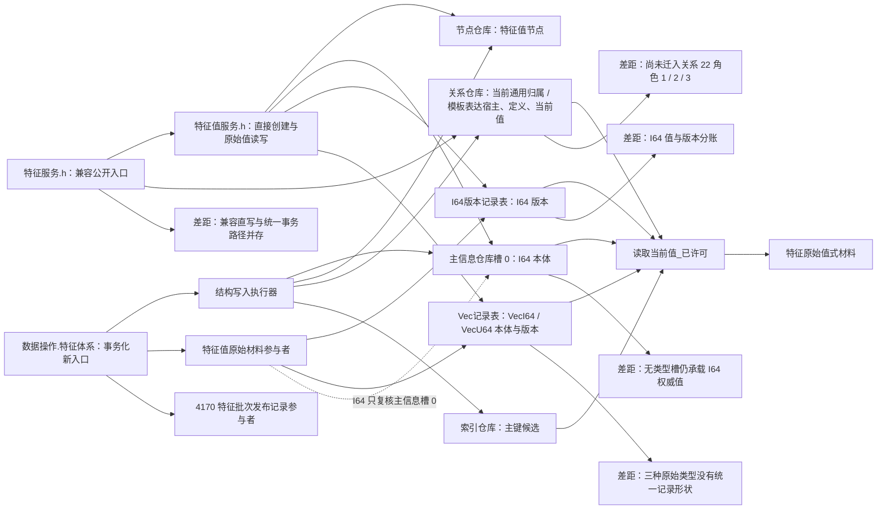
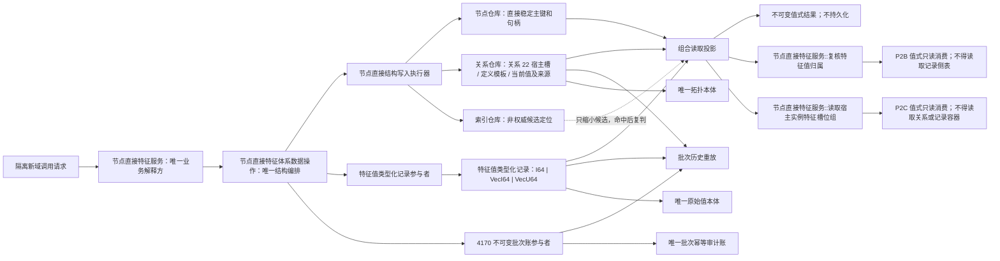

# NODE-TYPED-MIGRATION NT-P2A 函数结构知识图谱

日期：2026-07-22

基线：`main@1185e1b458b9c83244cd775dea3825931a134787`

身份：NT-P2A 设计记录；记录当前代码事实、目标结构、函数职责和文件所有权，不是正式规范或代码许可

## 1. 图谱入口

```text
正式规范 -> 详细设计 -> 现状 / 施工流程图 -> 本函数结构图谱 -> 后继叶子施工计划
```

绑定：

- `规范/详细设计/NODE-TYPED-MIGRATION_NT-P2A_特征值类型化记录与当前关系迁移详细设计.md`
- `流程图/20260722_NODE-TYPED-MIGRATION_NT-P2A_特征值类型化记录迁移现状流程图_v0.2.md`
- `流程图/20260722_NODE-TYPED-MIGRATION_NT-P2A_特征值类型化记录迁移施工流程图_v0.2.md`

## 2. 当前结构图谱



## 3. 目标结构图谱



## 4. 当前函数事实表

| 当前函数 / 类型 | 文件 | 当前输入 | 当前结构作用 | 迁移裁决 |
| --- | --- | --- | --- | --- |
| `形成初始特征值写入规格` | `数据操作.特征体系.ixx` | 主键、原始类型、三组候选值 | 形成互斥值式规格 | 保留职责；输出改为类型化记录规格 |
| `发布初始特征状态` | 同上 | 槽位、初始值规格 | 单参与者事务发布新值 | 保留入口语义；参与者改为类型化记录 |
| `形成特征批次变更规格` | 同上 | 批次、规则、宿主、有序项目 | 复核顺序和项目唯一性 | 保留 |
| `提交特征批次` | 同上 | 批次规格 | 执行原始材料 + 4170 双参与者 | 保留；第一参与者换为类型化记录 |
| `形成特征批次候选_会话` | 同上 | 会话、规格、两个参与者 | 初始 / 换代、来源、批次候选 | 保留算法；删除主信息值写入 |
| `写入带主键节点_会话` | 同上 | 类型、主键 | 当前先创建主信息，再创建节点并绑索引 | 由 NT-P1 节点直接主键候选接口替换 |
| `写入槽位_会话` | 同上 | 槽位规格 | 创建实例槽和通用宿主 / 模板关系 | 改写关系 22 角色 1 / 2；删除主信息输出 |
| `写入初始值_会话` | 同上 | 槽位、值规格、材料参与者 | 创建值节点 / 通用归属当前关系，I64 写主信息槽 | 改为关系 22 角色 3 + 唯一类型化记录候选 |
| `读取节点身份_已许可` | 同上 | 节点句柄、令牌 | 读取节点并要求主信息可读 | 改读节点直接身份和稳定主键 |
| `读取当前值_已许可` | 同上 | 槽位材料、令牌 | 当前关系 + 主信息 I64 / Vec 侧表组合 | 改为当前关系 + 类型化记录组合 |
| `读取批次历史值_已许可` | 同上 | 槽位、4170 项目、令牌 | 关系审计 + 主信息 / 侧表读取 | 改为关系审计 + 指定值记录读取 |
| `登记初始材料` | `参与者.特征值原始材料.ixx` | 值节点、主信息、类型、值、版本 | 登记分裂侧表候选 | 由 `登记初始记录` 取代 |
| `准备提交` | 同上 | 结构只读视图 | I64 读主信息、Vec / I64 侧表写入 | 改为复核节点直接身份并写一条记录 |
| `完成撤销` | 同上 | 无公开输入 | 删除本次 I64 版本 / Vec 记录 | 保留精确逆序撤销职责 |
| `特征值原始材料侧表访问器::读取` | 同上 | 值节点 | 返回类型、版本和 Vec，不返回 I64 本体 | 由统一记录访问器取代 |
| `写入I64值` | `特征值服务.h` | 值节点、I64 | 主信息槽 0 + I64 版本侧表 | 禁止作为新生产写；兼容路由或拒绝 |
| `写入VecI64值` / `写入VecU64值` | 同上 | 值节点、向量 | Vec 侧表原地写 / 换代 | 禁止作为新生产写；兼容路由或拒绝 |
| `读取原始值材料` | 同上 | 值节点 | 组合主信息和两种侧表 | 改读统一类型化记录 |
| `读取实例槽位当前值材料` | `特征服务.h` | 槽位 | 从归属关系找唯一值节点 | 保留关系读取语义；底层改数据操作投影 |
| `创建特征值` | 同上 | 槽位 | 直接创建节点和当前关系 | P3 封口；P2A 不继续扩展 |
| `复核特征值归属` | 当前不存在 | 值节点、可选定义和读取口径 | 目标值式只读归属复核 | P2A 新增输出合同，供 P2B 只读消费 |
| `读取宿主实例特征槽位组` | 当前不存在 | 宿主节点 | 目标按关系 22 枚举并完整组合槽位组 | P2A 新增输出合同，供 P2C 只读消费 |

## 5. 目标函数职责图

```text
特征服务
  -> 形成初始 / 换代 / 批次业务请求
  -> 解释值域、来源和业务结果
  -> 复核特征值归属（值式只读，供 P2B 消费）
  -> 读取宿主实例特征槽位组（值式只读，供 P2C 消费）

特征体系数据操作
  -> 形成特征值类型化记录规格
  -> 写入槽位_会话
  -> 写入初始值_会话
  -> 形成特征批次候选_会话
  -> 提交特征批次
  -> 读取当前值_已许可
  -> 读取批次历史值_已许可

特征值类型化记录事务参与者
  -> 登记初始记录
  -> 准备提交
  -> 确认待发布
  -> 完成发布
  -> 完成撤销

特征值类型化记录访问器
  -> 读取当前记录
  -> 读取审计记录

4170 批次账参与者
  -> 保持现有独立职责，不保存原始值
```

## 6. 目标结构节点表

| 图谱节点 | 身份 | 写入方 | 读取方 | 生命周期 |
| --- | --- | --- | --- | --- |
| 特征定义节点 | 节点直接稳定主键 + 句柄 | 特征体系数据操作 | 特征服务 / 数据操作 | 定义生命周期 |
| 实例特征槽节点 | 节点直接稳定主键 + 句柄 | 特征体系数据操作 | 特征服务 / 数据操作 | 由关系 22 角色 1 / 2 / 3 完整成立 |
| 特征值节点 | 节点直接稳定主键 + 句柄 | 特征体系数据操作 | 特征服务 / 数据操作 / 审计 | 值身份生命周期 |
| 特征值类型化记录 | 所属值节点 + 记录类型 + 原始值版本 | 记录参与者 | 记录访问器 / 数据操作 | 发布后不可静默覆写；历史可审计 |
| 槽位当前值关系 | 完整关系句柄 | 特征体系数据操作 | 当前值读取 / 批次审计 | 当前有效，换代后失效审计 |
| 来源关系 | 完整关系句柄 | 特征体系数据操作 | 来源复核 / 批次读回 | 随值证据保存 |
| 4170 批次记录 | 强类型批次身份 | 批次账参与者 | 幂等预读 / 历史重放 / 恢复治理 | 发布后不可变 |
| 主键索引 | 所有者 + 命名域 + 物理键 | 统一事务内索引候选 | 候选定位 | 可清空、可重建、非权威 |
| 组合读取投影 | 一次读取值式结果 | 数据操作临时组合 | 特征服务调用方 | 调用期，不持久化 |

## 7. 关系边表

| 源 | 关系 | 目标 | 约束 | 不得替代 |
| --- | --- | --- | --- | --- |
| 合法宿主节点 | 特征实例角色 22 / 角色 1 | 实例槽节点 | 宿主零到多；槽位反向恰一；宿主 + 定义只有一个当前槽 | 宿主字段或槽位数组 |
| 实例槽节点 | 特征实例角色 22 / 角色 2 | 特征定义节点 | 每槽恰一条有效关系 | 定义句柄字段副本 |
| 实例槽节点 | 特征实例角色 22 / 角色 3 | 特征值节点 | 每槽恰一当前关系；换代失效旧关系 | 当前值字段或记录内槽位号 |
| 特征值节点 | 因果来源 | 来源节点 | 来源句柄当前有效，角色 / 顺序符合请求 | 记录内来源副本 |
| 4170 批次记录 | 值式引用 | 值 / 关系 / 来源完整句柄 | 只用于发布幂等与审计 | 原始值本体或当前值裁决 |

## 8. 函数调用链

### 8.1 初始值

```text
特征服务公开入口
-> 特征体系数据操作::形成初始特征值写入规格
-> 特征体系数据操作::发布初始特征状态
-> 结构写入执行器::执行
-> 写入初始值_会话
-> 特征值类型化记录事务参与者::登记初始记录
-> 准备提交 / 确认待发布 / 完成发布
-> 读取当前值_已许可
-> 返回不可变组合投影

跨域只读：P2B -> 特征服务::复核特征值归属
-> 特征体系数据操作读取关系 22 角色 2 / 3 和类型化记录
-> 返回值节点、原始值版本、实例槽、定义和关系证据
-> P2B 不获得记录容器、侧表、仓库或令牌

宿主投影只读：P2C -> 特征服务::读取宿主实例特征槽位组
-> 特征体系数据操作按关系 22 角色 1 枚举实例槽
-> 逐槽读回角色 2 模板、角色 3 当前值和唯一类型化记录
-> 返回调用期不可变组；任一槽位不完整时整体报内部不一致
-> P2C 不获得持久列表、关系仓库、索引、记录容器、侧表或令牌
```

### 8.2 批次换代

```text
特征服务批次入口
-> 形成特征批次变更规格
-> 提交特征批次
-> 事务外读取特征批次结果
-> 结构写入执行器取得唯一写入权
-> 形成特征批次候选_会话
   -> 锁内重读 4170
   -> 失效旧当前关系
   -> 创建新值节点 / 新当前关系 / 来源关系
   -> 登记新类型化记录
   -> 登记 4170 候选
-> 两个参与者和结构会话共同确认
-> 最后发布
-> 读取批次历史值_已许可逐项互证
```

## 9. 非成功图谱

```text
逻辑内返回节点
  入口拒绝：材料、类型、值域、身份或格式无效
  幂等读回：同键同义且全部结构互证
  幂等冲突：同键异义或项目语义不同
  许可拒绝：未形成候选前竞争
  版本漂移：第一写前当前关系 / 值 / 版本变化

内部逻辑错误节点
  节点 / 关系 / 记录创建后不及预期
  同值节点多记录、多原始类型或版本断裂
  类型化记录含拓扑或批次副本
  参与者阶段、确认、撤销或发布不闭合
  发布后读回不一致
  4170 与值记录 / 关系审计不一致

内部错误边
  停止新增写入
  -> 依赖逆序精确撤销
  -> 证明前态
  -> 失败则隔离事务域
  -> 保留具名证据并退回设计 / 追根因
```

## 10. 文件所有权图

```text
P2A 隔离新域独占候选
  海中鱼巣/领域/特征值类型化记录.数据.h
  海中鱼巣/领域/参与者.特征值类型化记录.ixx
  海中鱼巣/领域/数据操作.节点直接特征体系.ixx
  海中鱼巣/领域/服务.节点直接特征.ixx
  海中鱼巣/领域/自检.节点直接特征体系.ixx

本叶子活动期共享接线唯一所有者
  海中鱼巣.vcxproj
  海中鱼巣.vcxproj.filters
  统一自检运行器
  -> 仅 #340 在其任务活动期写入；#340 集成并由设计接受后，所有权按固定提交移交 #341；入口禁止修改

P2A 禁止
  核心节点 / 句柄 / 关系 / 索引 / 事务（NT-P1）
  现行默认特征数据操作 / 服务 / 旧原始材料参与者
  状态动态记录与服务（NT-P2B）
  自我 / 存在场景投影（NT-P2C）
  兼容服务全局退役（NT-P3）
  快照恢复和旧材料（NT-P4）
  4170 字段与业务语义
```

## 11. 代码漂移门禁

执行前必须重新扫描并比较本图谱。出现以下任一漂移，P2A 不开工：

1. `特征体系数据操作` 已不再是当前批次结构编排唯一入口；
2. 4170 记录字段、参与者顺序或同层授权桥改变；
3. NT-P1 没有提供节点直接主键、记录候选或统一事务接口；
4. I64 已被其它任务迁入另一权威结构；
5. P2B / P2C 已取得 `数据操作.特征体系.ixx`、工程文件或同一自检文件所有权；
6. 新代码需要关系端点副本、通用值槽、主信息兼容双写或批次账复制原始值；
7. 当前测试只能证明返回码或日志，不能读回节点、关系、记录和 4170。
8. 关系 22 角色 1 / 2 / 3 尚未进入 P2A 实际代码，或 P2B 需要绕过 `复核特征值归属` 直接读取记录侧表。
9. P2C 需要绕过 `读取宿主实例特征槽位组` 直接读取关系仓库、索引、记录容器或旧侧表。

## 12. 图谱验证清单

- 当前事实节点均可回指 `main@1185e1b4` 代码；
- 目标结构节点均可回指 2100、4010、4020、4030、4040、4110、4170；
- 每个写函数只有一个结构所有者；
- 每条正式拓扑只出现在关系边，不在记录节点复制；
- I64、VecI64、VecU64 汇入同一记录体系且互斥；
- 4170 与值本体保持分账；
- 逻辑内返回与内部逻辑错误无交叉降级；
- P2A、P2B、P2C 的提供者—消费者关系已经冻结为 v0.2 预冻结待实现接口合同，`#340—#342` 可在互斥文件中并行形成候选；该合同不是当前实现事实。
- P2B 写入关系 19 角色 3（特征）和角色 4（值）时只消费 P2A `复核特征值归属` 的冻结值式合同，不得补造同名接口或读取 P2A 内部记录。
- P2C 形成自我实例特征读取投影时只消费 P2A `读取宿主实例特征槽位组` 的冻结值式合同，不得补造本地替身。
- `#340 -> #341 -> #342` 只作为最终固定汇集顺序；工程、统一自检运行器、入口和默认装配由 #352 唯一拥有并完成真实接线与完整验证。
