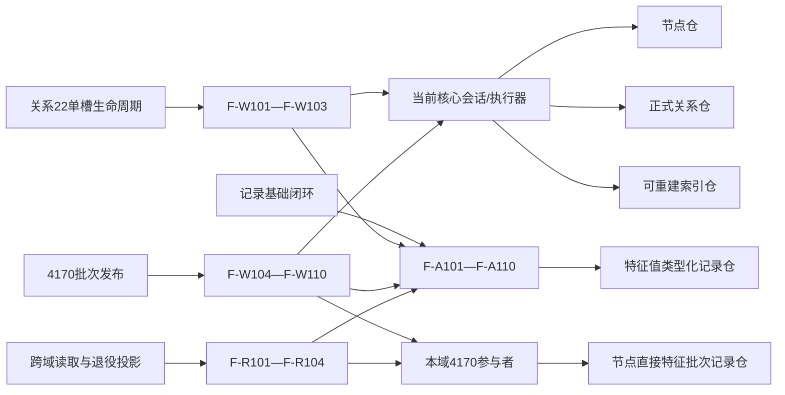

# NODE-TYPED-MIGRATION NT-P2A 函数结构知识图谱

日期：2026-07-29

版本：v0.3

基线：`main@dbe710096193fbd517edae5cb871decaf6b49bf3`

身份：目标设计知识图谱；不冒充当前实现或施工完成。

## 1. 业务—能力—函数图


```mermaid
flowchart LR
 B1["记录基础闭环"] --> A["F-A101—F-A110"]
 B2["关系22单槽生命周期"] --> W1["F-W101—F-W103"]
 B3["4170批次发布"] --> W2["F-W104—F-W110"]
 B4["跨域读取与退役投影"] --> R["F-R101—F-R104"]

 W1 --> CORE["当前核心会话/执行器"]
 W2 --> CORE
 W1 --> A
 W2 --> A
 W2 --> BP["本域4170参与者"]
 R --> A
 R --> BP

 A --> REC["特征值类型化记录仓"]
 BP --> BATCH["节点直接特征批次记录仓"]
 CORE --> NODE["节点仓"]
 CORE --> REL["正式关系仓"]
 CORE --> IDX["可重建索引仓"]
```

## 2. 物理所有权图

```text
#340 / P2A-BASE
  节点直接领域合同.数据.h
  特征值类型化记录.数据.h
  参与者.特征值类型化记录.ixx
  自检.节点直接特征值类型化记录.ixx

#382 / P2A-WRITE
  协议.节点直接特征关系准入.ixx
  参与者.节点直接特征批次记录.ixx
  数据操作.节点直接特征写入.ixx
  服务.节点直接特征写入.ixx
  自检.节点直接特征写入.ixx

#383 / P2A-READ
  数据操作.节点直接特征查询退役.ixx
  服务.节点直接特征.ixx
  自检.节点直接特征查询退役.ixx
```

不存在目标 `数据操作.节点直接特征体系.ixx`；共享大单体已经按权威事实所有者拆开。工程 / filters / 运行器 / 入口继续归 #352，冻结见证和全量同代次读取继续归后继 #375 修订。

## 3. 事实节点与关系边

| 事实节点 | 唯一写入方 | 读取方 | 生命周期 |
| --- | --- | --- | --- |
| 特征值类型化记录 | F-A102/F-A104 | F-A106/F-A107、W、R、#375 | 候选→已发布；历史保留 |
| 角色1宿主槽 | F-W101/F-W104 | F-W103/F-R102 | 槽生命周期 |
| 角色2定义模板 | F-W101/F-W104 | F-W103/F-R101/F-R102 | 槽生命周期 |
| 角色3当前值 | F-W101/F-W102/F-W104 | W/R | 当前有效；换代后失效审计 |
| 来源关系1 | F-W101/F-W102/F-W104 | F-W110/F-R104 | 随值证据保留 |
| 本域4170记录 | F-W106/F-W108 | F-W110/F-R104/#375 | 发布后不可变 |
| 投影结构版本 | F-A104 | F-A106/F-A107/F-A109、W/R | 每真实记录事务推进一次 |

## 4. 调用图


```mermaid
flowchart TD
 EX["核心执行器::执行"] --> A102["F-A102"]
 EX --> A103["F-A103"]
 EX --> A104["F-A104"]
 EX -. "失败逆序撤销" .-> A105["F-A105"]
 EX --> W106["F-W106"]
 EX --> W107["F-W107"]
 EX --> W108["F-W108"]
 EX -. "失败逆序撤销" .-> W109["F-W109"]

 A108["F-A108"] --> A201["F-A201"]
 A201 --> A204["F-A204—F-A212 探针/回调"]
 A101 --> A202["F-A202 资源命中"]
 A102 --> A213["F-A213 阶段命中"]
 A203["F-A203 专项追加"] --> R303["F-R303 查询阶段分派"]
 A201 --> A101["F-A101"]
 A201 --> EX
 A201 --> A106["F-A106"]
 A201 --> A107["F-A107"]
 A201 --> A109["F-A109"]
 A201 --> A110["F-A110"]

 W101["F-W101"] --> W103["F-W103"]
 W101 --> EX
 W101 --> A101
 W101 --> A110
 W102["F-W102"] --> W103
 W102 --> EX
 W102 --> A101
 W102 --> A110
 W103 --> A109
 W103 --> A106

 W104["F-W104"] --> W113["F-W113"]
 W104 --> W110["F-W110"]
 W104 --> EX
 W104 --> A101
 W104 --> W105["F-W105"]
 W104 --> A107
 W104 --> A109
 W104 --> A110
 W110 --> W113
 W110 --> A109
 W110 --> A107
 W115["F-W115"] --> W114["F-W114"]

 W111["F-W111"] --> W301["F-W301"]
 W301 --> W304["F-W304—F-W310 夹具/探针/回调"]
 W105 --> W302["F-W302 批次资源命中"]
 W101 --> W303["F-W303 写资源命中"]
 W106 --> W311["F-W311 批次阶段命中"]
 W104 --> W312["F-W312 核心固定结果"]
 W301 --> W114
 W301 --> W115
 W301 --> W101
 W301 --> W102
 W301 --> W104
 W301 --> W105
 W301 --> W112["F-W112"]
 W301 --> W113
 W301 --> EX

 W201["F-W201"] --> W101
 W202["F-W202"] --> W102
 W203["F-W203"] --> W104

 R101["F-R101"] --> A109
 R101 --> A106
 R101 --> A107
 R102["F-R102"] --> A109
 R102 --> A106
 R103["F-R103"] --> R101
 R104["F-R104"] --> A107
 R104 --> A109
 R104 --> W112
 R104 --> W113
 R105["F-R105"] --> R301["F-R301"]
 R301 --> R303
 R101 --> R302["F-R302 查询资源命中"]
 R301 --> R101
 R301 --> R102
 R301 --> R103
 R301 --> R104
 R301 --> R201["F-R201"]
 R301 --> R202["F-R202"]
 R301 --> R203["F-R203"]
 R301 --> R204["F-R204"]
 R301 -. "合法夹具" .-> W101
 R301 -. "合法夹具" .-> W102
 R301 -. "合法夹具" .-> W104

 R201 --> R101
 R202 --> R102
 R203 --> R103
 R204 --> R104
```

37 个业务 / 公开目标根和 28 个专项内部支持根身份核对，共65根：

```text
A: A101 A102 A103 A104 A105 A106 A107 A108 A109 A110
W: W101 W102 W103 W104 W105 W106 W107 W108 W109 W110 W111 W112 W113 W114 W115 W201 W202 W203
R: R101 R102 R103 R104 R105 R201 R202 R203 R204
专项支持A: A201 A202 A203 A204 A205 A206 A207 A208 A209 A210 A211 A212 A213
专项支持W: W301 W302 W303 W304 W305 W306 W307 W308 W309 W310 W311 W312
专项支持R: R301 R302 R303
```

F-A102—F-A105 与 F-W106—F-W109 之间不存在彼此直接调用边；它们分别由核心执行器按准备、确认、逆序撤销和最后发布阶段调用。F-W103 仅为 W101/W102 private 边；F-W110 不调用 F-W103。服务根只保留单转发边。

## 5. 依赖与状态

```text
#340 当前核心接口真实存在 -> 设计终审完成前待激活
#382 消费 #340 新接口 -> 等待 #340 真实结果
#383 消费 #340 记录 + #382 本域批次仓 -> 等待两者真实结果
#375 消费 #340 记录 + #382 本域批次仓 -> 旧版本继续待激活并另行重制
```

预冻结合同只证明设计可构造，不证明模块、编译、工程或生产接线存在。

## 6. 非成功图

```text
第一写前：
  无效身份 / 命名域 / 类型 / 规则 -> 入口拒绝
  完整同义 -> 幂等读回
  同键异义 -> 入口拒绝+同键异义
  当前材料变化 -> 写前漂移
  许可失败 -> 许可竞争

第一写后：
  候选 / 参与者 / 基数 / 读回矛盾 -> 内部错误
  -> 批次参与者、记录参与者、核心写集逆序撤销
  -> 撤销不闭合则隔离事务域
```

## 7. 覆盖结论

三十七个业务 / 公开目标根和二十八个专项内部支持根正在绑定业务节点、物理位置、单函数图、逐节点分析和验证编号，共六十五根。DTO 名称避开旧默认域同命名空间冲突；旧代码只能作差距证据。当前状态：端到端独立终审中，未决节点不得提前写无。
