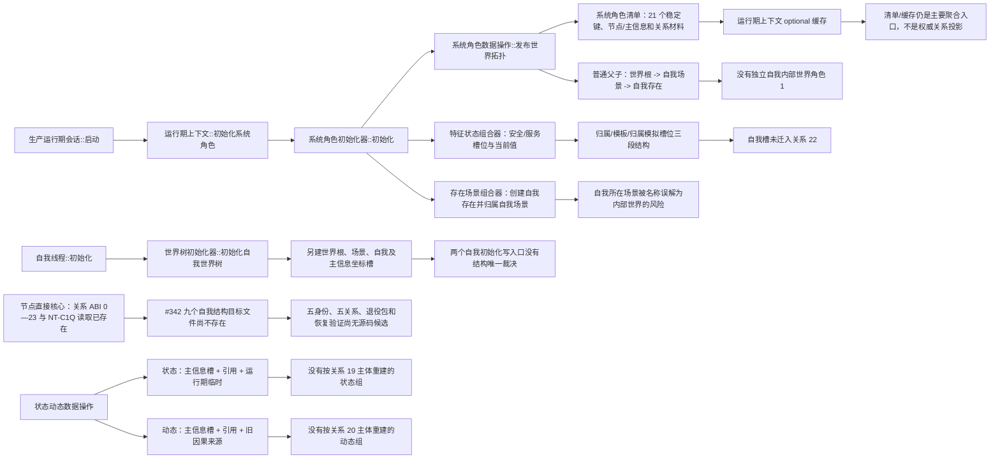
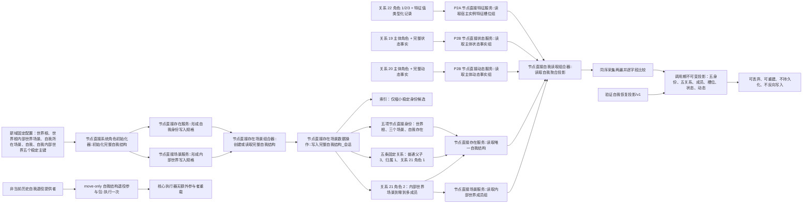
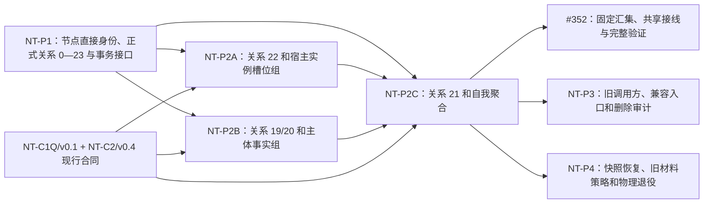

# NODE-TYPED-MIGRATION NT-P2C 函数结构知识图谱

日期：2026-07-24

接口事实基线：长期执行通道累计候选 `80ca494ca4325df4f3377bc8ca1e9168ff95a6a7`；默认生产路径对照 `main@a2acebb01ddc10f1b72f79ad4cfc756a65aa3ccf`

身份：NT-P2C 设计记录；记录当前代码事实、目标结构、函数职责、关系角色和所有权，不是正式规范或代码实施许可

## 1. 图谱入口

```text
正式规范
-> NT-P2C 详细设计
-> 现状 / 施工流程图
-> 本函数结构图谱
-> 独立叶子施工计划与执行前 S0
```

绑定：

- `规范/详细设计/NODE-TYPED-MIGRATION_NT-P2C_自我内部世界与事实投影迁移详细设计.md`
- `流程图/20260722_NODE-TYPED-MIGRATION_NT-P2C_自我内部世界与事实投影迁移现状流程图_v0.1.md`
- `流程图/20260722_NODE-TYPED-MIGRATION_NT-P2C_自我内部世界与事实投影迁移施工流程图_v0.3.md`
- `流程图/20260724_NODE-TYPED-MIGRATION_NT-P2_反向读取五角色身份与退役参与包施工流程图_v0.2.md`

## 2. 当前结构图谱



## 3. 目标结构图谱



## 4. 当前函数事实表

| 当前函数 / 类型 | 文件 | 当前责任 | P2C 裁决 |
| --- | --- | --- | --- |
| `生产运行期会话::启动` | `启动.生产运行期.ixx` | 构造全新上下文、初始化并首次发布 | P2C 只读；首次发布边界由 P4 切换时复用 |
| `运行期上下文::初始化系统角色` | `启动.运行期上下文.ixx` | 串行初始化并缓存系统角色清单 | P2C 只读；P4 切换为节点直接候选上下文 |
| `系统角色初始化器::初始化` | `领域/初始化.系统角色.ixx` | 编排世界根、自我、特征、需求、概念和方法根 | 旧默认域只读；P3 建立新域候选映射，P4 切换 |
| `系统角色数据操作::预检稳定键` | `领域/数据操作.系统角色.ixx` | 从索引、节点和主信息预检 21 个稳定键 | 旧默认域只读；不得在 P2C 混接节点直接主键 |
| `系统角色数据操作::发布世界拓扑` | 同上 | 写世界根到场景、场景到自我普通父子 | 旧默认域只读；新域由节点直接模块独立实现关系 21 |
| `系统角色清单` | `领域/系统角色清单.数据.h` | 保存 21 个稳定键和关系材料 | 升级格式，增加内部世界；不保存四类列表，不单独裁决事实 |
| `在已有场景中创建并接纳实际存在` | `领域/数据操作.存在场景.ixx` | 创建存在并写场景归属 | 保留自我所在场景成员用途；扩展完整自我同事务入口 |
| `创建场景归属` / `读取场景归属` | 同上 | 维护通用场景到存在归属 | 不得替代关系 21；自我内部世界成员用角色 2 |
| `创建实例特征槽位` | `领域/数据操作.特征体系.ixx` | 旧归属/模板建立槽位 | 由 P2A 迁入关系 22，P2C 只读消费 |
| `读取宿主定义槽位` | 同上 | 读取单个旧槽位 | P2A 提供宿主完整槽位组值式入口 |
| `读取状态材料` | `领域/服务.状态.ixx` | 读取单个旧状态材料 | P2B 提供主体完整状态事实组 |
| `读取动态材料` | `领域/服务.动态.ixx` | 读取单个旧动态材料 | P2B 提供主体完整动态事实组 |
| `世界树初始化器::初始化自我世界树` | `领域/初始化.世界树.ixx` | 旧线程路径另建自我结构与坐标槽 | 停止生产写，改为只读适配或由后继明确退役 |
| `自我线程::初始化` | `线程/自我线程.ixx` | 调用旧世界树和根需求初始化 | 改从运行期租约取得唯一自我聚合入口 |

累计候选 `80ca494c` 已具备 #342 需要的核心真实边界：关系 ABI 0—23、NT-C1Q 反向 / 相关关系值式读取、节点删除候选、索引移除候选、P2A 宿主槽位组、P2B 主体状态 / 动态组和核心执行器无额外参与者重载。#342 九个目标文件仍不存在；本图把这些符号记作消费接口或待实施目标，不把候选误写成 main 生产事实。

## 5. 正式关系角色图谱

### 5.1 关系 21

| 角色 | 顺序号 | 源 -> 目标 | 基数 | 写入方 |
| --- | --- | --- | --- | --- |
| 内部世界 | 1 | 当前自我存在 -> 自我内部世界场景 | 每个当前自我恰一 | 存在领域 |
| 场景成员 | 2 | 自我内部世界场景 -> 子存在 | 零到多，同成员至多一条 | 场景领域 |

硬边界：角色 2 的目标不得是当前自我；角色 1/2 和子场景结构不得形成自包含环。关系 21 不承载实例槽、状态或动态。

### 5.2 关系 22

```text
角色 1 宿主槽：自我存在 -> 实例槽
角色 2 定义模板：实例槽 -> 抽象特征定义
角色 3 当前值：实例槽 -> 特征值
```

P2C 不写这些关系，只消费 P2A 完整结果组。

### 5.3 关系 19/20

```text
关系 19 角色 1 主体：状态 -> 当前自我存在
  -> P2B 逐项读回场景、特征、值、来源存在和状态域记录

关系 20 角色 1 主体：动态 -> 当前自我存在
  -> P2B 逐项读回场景、目标、前后状态、来源存在、按种类成立的动作/低层/同源角色和动态域记录
```

P2C 不持有状态/动态容器，也不直接读取反向索引。

## 6. 目标函数职责

```text
存在业务服务
  -> 形成自我身份写入规格
  -> 读取唯一自我结构
  -> 形成自我结构退役规格
  -> 读取自我结构退役材料

场景业务服务
  -> 形成内部世界写入规格
  -> 读取内部世界成员组

存在场景组合器
  -> 创建或读取完整自我结构
  -> 增加内部世界成员

存在场景数据操作
  -> 写入完整自我结构_会话
  -> 读取唯一自我结构_已许可
  -> 写入内部世界成员_会话
  -> 读取内部世界成员组_已许可
  -> 形成退役提供者

自我结构退役提供者
  -> 形成自我结构退役参与包

自我结构退役参与包
  -> 执行一次
  -> 先登记关系 21 失效
  -> 调用 #346 回调登记其它关系 / 索引 / 自我节点删除
  -> 使用核心执行器无额外参与者重载

特征业务服务（P2A）
  -> 读取宿主实例特征槽位组

状态业务服务（P2B）
  -> 读取主体状态事实组

动态业务服务（P2B）
  -> 读取主体动态事实组

自我聚合读取组合器
  -> 读取自我聚合投影
  -> 验证自我恢复投影
```

## 7. 创建调用链

```text
全新运行期上下文候选
-> 系统角色初始化器::初始化完整自我结构
-> 存在服务::形成自我身份写入规格
-> 场景服务::形成内部世界写入规格
-> 存在场景组合器::创建或读取完整自我结构
-> 数据操作事务外全量预读关系 21
-> 同义完整结构：幂等读回
-> 异义占用/另一自我：零写冲突
-> 未找到：结构执行器取得唯一写入权
-> 写入完整自我结构_会话
   -> 锁内重读稳定身份和唯一性
   -> 创建或同义复用世界根、世界根内部世界场景、自我所在场景、自我和自我内部世界场景
   -> 写三条普通父子和一条归属固定关系
   -> 写关系 21 角色 1
   -> 按请求写角色 2
   -> 读回五身份、五固定关系、自我恰一、内部世界恰一、自我非成员、成员无重复、无环
-> 全部候选确认待发布
-> 最后发布
-> 存在/场景服务事务外正式读回
-> 形成系统角色启动回执
```

## 8. 聚合读取调用链

```text
自我聚合读取组合器::读取自我聚合投影
-> 第一遍按固定顺序采集
   -> 存在服务::读取唯一自我结构
      -> 关系 21 角色 1 全域零/一/多裁决并读回五身份 / 五关系
   -> 场景服务::读取内部世界成员组
      -> 关系 21 角色 2 逐项端点和无环复核
   -> 特征业务服务::读取宿主实例特征槽位组
      -> 关系 22 角色 1/2/3 + 特征值类型化记录
   -> 状态业务服务::读取主体状态事实组
      -> 关系 19 主体反向候选 + 完整状态事实
   -> 动态业务服务::读取主体动态事实组
      -> 关系 20 主体反向候选 + 完整动态事实
-> 第二遍同序采集
-> 全部值式字段相等：返回不可变组合
-> 任一不同：读取版本漂移 / 读取期间版本变化，材料为空
```

合法空成员、空槽位、空状态、空动态分别返回空结果组；任何非空候选结构异常都使整组为内部不一致，不静默过滤。

### 8.1 退役调用链

```text
存在服务::形成自我结构退役规格(自我, 预期版本, 非当前历史自我)
-> 写前证明目标不是当前唯一自我且当前唯一自我仍完整
-> 退役提供者::形成自我结构退役参与包
   -> 冻结关系 21、其它当前关系和索引影响面
-> 自我结构退役参与包::执行一次
   -> 登记关系 21 失效
   -> #346 回调登记其它关系失效、索引移除、自我节点删除、读回和请求提交
   -> 核心执行器无额外参与者重载
-> 提交前失败：逆序撤销
-> 已提交：读回节点已删除、关系已失效、索引已移除
-> 发布后读回失败：保留已提交，返回权威读回内部错误
```

当前自我、世界根、世界根内部世界场景普通退役拒绝；内部世界场景及其它固定身份都不是本包删除目标。

### 8.2 恢复验证调用链

```text
验证自我恢复投影/v1
-> 请求自我结构候选组恰一
-> 验证五项节点身份
-> 验证固定关系 0 / 1 / 21
-> 验证成员关系 21 / 2
-> 验证 P2A 关系 22 槽位材料
-> 验证 P2B 关系 19 / 20 状态 / 动态材料
-> 空组合法；坏项整体失败
-> 形成规范化值式投影，不写仓库、不发布
```

## 9. 非成功图谱

```text
逻辑内返回
  写前入口拒绝：零/重复主键、错类型、旧版本、自我作为成员、明确环风险
  幂等读回：同稳定身份、同角色 1/2 语义且完整结构互证
  幂等/唯一性冲突：已有另一完整自我或同键异义
  许可拒绝/版本漂移：第一笔候选前具名返回
  合法空投影：没有成员、槽位、状态或动态
  恢复材料不一致：候选拒绝，材料为空
  退役入口拒绝：当前自我、错授权语境、第二次 / 移动后执行、空回调或无效执行器

内部逻辑错误
  已发布域零个或多个竞争当前自我
  自我缺/多内部世界、自我是自身成员、成员重复或成环
  关系 21/22/19/20 角色、端点、基数或版本异常
  候选读回、确认、撤销、最后发布或发布后读回不闭合
  P2A/P2B 返回部分成功组或用缓存补结构
  退役已提交后节点 / 关系 / 索引精确读回不闭合

收口
  停止新增写入
  -> 统一可见点前精确逆序撤销
  -> 读回事务前态
  -> 无法证明则隔离事务域
  -> 已发布异常停止依赖路径，不重开候选撤销
```

## 10. 文件所有权图

```text
P2C 隔离新域独占候选
  领域/自我结构.数据.h
  领域/数据操作.节点直接存在场景.ixx
  领域/服务.节点直接存在.ixx
  领域/服务.节点直接场景.ixx
  领域/组合.节点直接存在场景.ixx
  领域/组合.节点直接自我读取.ixx
  领域/节点直接系统角色回执.数据.h
  领域/初始化.节点直接系统角色.ixx
  领域/自检.节点直接自我结构.ixx

旧路径切换清单（P2C 只读，P3 映射，P4 切换）
  领域/初始化.世界树.ixx
  线程/自我线程.ixx
  领域/初始化.需求.ixx（仅旧结果适配）

最终共享接线唯一所有者
  #352：工程 XML、统一自检运行器、入口和默认装配
  -> #342 只形成本叶独占源码候选，不取得共享接线文件写权

P2C 只读依赖
  NT-P1/#374：节点、句柄、正式关系 0—23、事务、反向读取、关系失效、索引移除和节点删除
  P2A：关系 22、特征值记录、读取宿主实例特征槽位组
  P2B：关系 19/20、状态动态记录、两个主体事实组读取

P2C 禁止
  特征体系和状态动态生产文件
  现行默认存在/场景、系统角色、运行期上下文、装配和自我线程
  需求/任务/方法业务语义和兼容入口
  快照恢复、旧快照迁移和在线上下文替换
```

## 11. 依赖图



P2A/P2B/P2C 的消费关系由 NT-C1Q/v0.1 与 NT-C2/v0.4 冻结。#342 从长期执行通道累计候选直接核对 #340 / #375 / #341 的真实符号，只消费 `读取宿主实例特征槽位组` 与主体状态 / 动态事实组，不补造接口或读取提供者内部结构。`#340 -> #374 -> #375 -> #341 -> #342` 是当前累计父链；工程、统一运行器、入口和默认装配统一由 #352 接线并完整验证。

## 12. 代码漂移门禁

执行前出现以下任一漂移，P2C 不开工：

1. `初始化.节点直接系统角色.ixx` 不再是隔离新域候选初始化入口；
2. `数据操作.节点直接存在场景.ixx` 不再是新域存在/场景结构的唯一数据操作入口；
3. 关系 21 角色、端点、基数或唯一键变化；
4. P2A 的精确接口 `读取宿主实例特征槽位组` 与累计候选或 NT-C2/v0.4 漂移，或返回持久列表 / 内部能力；
5. P2B 的 `读取主体状态事实组` / `读取主体动态事实组` 与累计候选或 NT-C2/v0.4 漂移，或返回部分结果；
6. 五身份或五固定关系只能靠文件名、显示名、旧清单或显示拓扑猜测；
7. 旧自我线程仍能创建另一套当前自我且没有具名收口所有者；
8. #340 / #341 实际符号与预冻结值式合同漂移，或 P2A/P2B/P2C 对同一生产 / 自检文件发生所有权重叠，或任何叶子尝试写 #352 独占的工程 / 运行器 / 装配文件；
9. 施工需要伪造顶层结构版本 / 空事务参与者、持久列表、旧新双写、旧清单默认补字段、在线热替换或恢复失败全新启动；
10. #346 无法在包回调内登记其它关系、索引和单一目标节点删除，或消费者要求 #342 同时删除内部世界场景。

## 13. 图谱验证清单

- 默认生产事实回指 `main@a2acebb0`，施工消费接口回指累计候选 `80ca494c`；
- 五项身份与五条固定关系字段、类型、命名域和顺序全部冻结；
- 目标自我结构写关系 0 / 1 / 21，成员唯一使用关系 21 角色 2；
- 自我槽唯一消费 P2A 关系 22，P2C 不另建槽位关系；
- 状态/动态投影唯一消费 P2B 关系 19/20 主体事实组；
- 自我所在场景与自我内部世界保持两个身份，自我不是自身成员；
- 所有列表都是调用期值式投影，清空可重建；
- 逻辑内返回和内部逻辑错误没有互相降级；
- 普通聚合使用双遍逐字段比较，不借用 #349 许可、不伪造顶层结构版本；
- 退役包 move-only / 单次执行和恢复验证完整 ABI 均有具名所有者与调用链；
- 旧自我写路径、P2A/P2B 累计候选接口和 #352 最终共享接线所有权均有明确门禁；
- 本图谱没有宣称代码迁移、运行验证或跨重启恢复已经完成。
