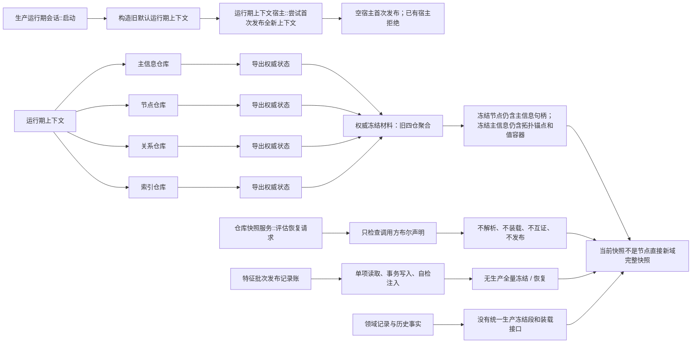
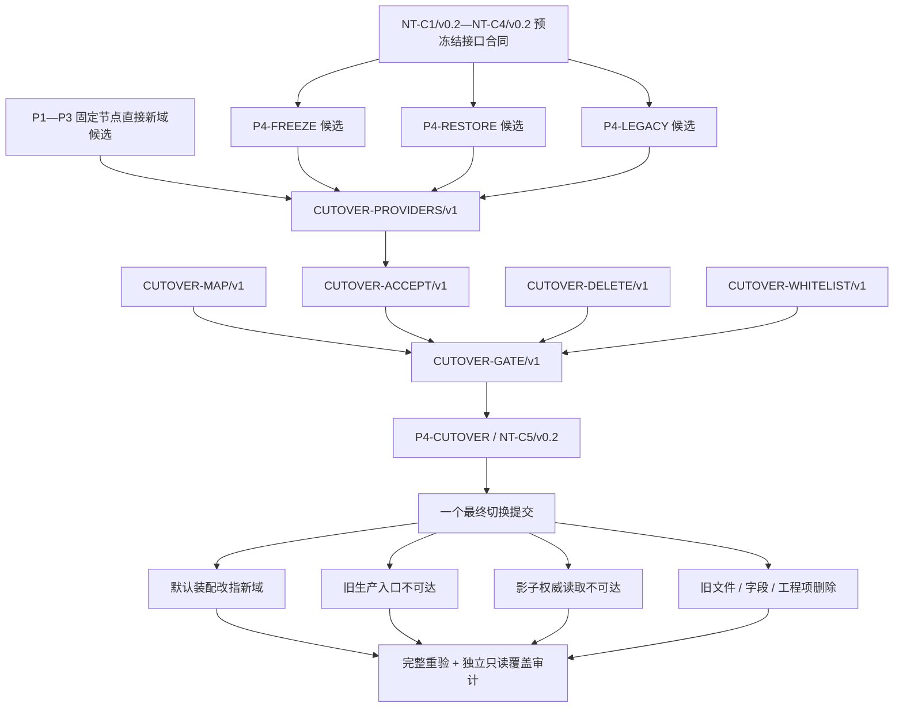

# NODE-TYPED-MIGRATION NT-P4 函数结构知识图谱

日期：2026-07-22

基线：`main@47ff41e440a90030d7e1eda98bc3c26f4f0cd3dc`

身份：NT-P4 设计记录；记录当前代码事实、目标函数职责、叶子所有权和最终切换约束，不是正式规范、当前实现事实或代码实施许可

## 1. 图谱入口

```text
正式规范
-> NT-P4 现状 / 施工流程图
-> NT-P4 统一快照恢复退役验收详细设计
-> 本函数结构知识图谱
-> P4 叶子施工计划
-> P1—P3 固定提交上的执行前 S0
```

绑定：

- `流程图/20260722_NODE-TYPED-MIGRATION_NT-P4_统一快照恢复退役现状流程图_v0.1.md`
- `流程图/20260722_NODE-TYPED-MIGRATION_NT-P4_统一快照恢复退役施工流程图_v0.2.md`
- `规范/详细设计/NODE-TYPED-MIGRATION_NT-P4_统一快照恢复退役验收详细设计.md`

本图谱严格区分：

```text
当前事实：旧默认域仍是唯一默认生产装配
P1—P3 目标：只在具名“节点直接”隔离新域形成新结构和新生产候选调用图
P4 目标：统一冻结与恢复验证通过后，以同一个最终切换提交改变默认装配并物理退役旧域
```

## 2. 当前结构图谱



当前不存在生产 `导入权威`、`隔离装载`、`恢复注入`、`加载快照` 或 `解析快照` 入口。当前宿主没有恢复替换、清空或在线替换入口；这一安全边界应保留。

## 3. 目标结构图谱

```mermaid
flowchart LR
    PRE["P1—P3 固定提交：节点直接隔离新域 + 新生产候选调用图"] --> ISO["切换前八类零互通验证"]
    ISO --> FREEZE["NT-C4/v0.2 冻结协调器::形成统一权威冻结材料"]
    FREEZE --> SEG["九个必需强类型段：节点、关系、特征值、状态、动态、任务方法选择、概念签名、用途观察、特征批次发布"]
    SEG --> SER["序列化器::序列化统一权威快照"]
    SER --> SAVE["文件材料服务::原子保存快照材料"]

    FILE["当前格式快照材料"] --> PARSE["严格解析器::解析统一权威快照"]
    PARSE --> PACK["恢复材料包：不可变、无仓库能力"]
    PACK --> LOAD["恢复协调器::形成隔离恢复候选"]
    LOAD --> ORDER["固定顺序装载节点、关系、领域记录、历史事实、4170"]
    ORDER --> VERIFY["恢复协调器::验证完整恢复候选"]
    VERIFY --> CROSS["全量互证 + 索引 + 自我投影 + 概念投影确定重建"]
    CROSS --> REFREEZE["候选再冻结与输入规范化载荷相等"]
    REFREEZE --> CAP["已验证运行期上下文候选"]

    NEWSTART["生产运行期会话::启动全新上下文"] --> NEWVERIFY["验证完整全新候选：全量互证 + 投影确定重建 + 规范化初始冻结"]
    NEWVERIFY --> CAP
    RESTORESTART["生产运行期会话::启动恢复上下文"] --> PARSE
    CAP --> FIRST["NT-C5/v0.2 运行期上下文宿主::尝试首次发布已验证上下文"]
    FIRST --> EMPTY["仅空宿主单次原子发布"]
    EMPTY --> READBACK["正式服务发布后读回"]
    READBACK --> SELF["完整自我恢复证据：内部世界、成员、槽位、状态、动态"]

    LEGACY["离线迁移器::迁移旧快照到当前格式"] --> FILE
    LEGACY --> REJECT["无歧义映射不成立则拒绝"]

    SELF --> CUT["P4 最终切换提交"]
    CUT --> DEFAULT["默认装配唯一指向节点直接新域"]
    CUT --> UNREACH["旧生产入口不可达"]
    CUT --> SHADOW["任务选择旧槽 / 概念影子权威读取不可达"]
    CUT --> DELETE["旧文件、字段和工程项物理删除"]
```



全新和恢复共用同一个“已验证候选首次发布”能力；恢复失败必须失败退出，不得回退全新。不存在在线热替换、第二次发布或恢复时读取当前旧上下文补项。

## 4. 当前函数事实表

| 当前函数 / 类型 | 文件 | 当前责任 | P4 裁决 |
| --- | --- | --- | --- |
| `主信息仓库::导出权威状态` | `核心/主信息仓库.h/.cpp` | 导出旧主信息记录与高水位 | 旧域整体退役，不转换为目标权威段 |
| `节点仓库::导出权威状态` | `核心/节点仓库.h/.cpp` | 导出依赖主信息句柄的旧节点 | 只作现状证据；目标消费 P1 节点直接新域冻结接口 |
| `关系仓库::导出权威状态` | `核心/关系仓库.h/.cpp` | 导出有效、失效、删除关系及高水位 | 语义需由 P1 新域固定接口承接，并复核关系角色和新域端点 |
| `索引仓库::导出权威状态` | `核心/索引仓库.h/.cpp` | 导出当前、永久和反向绑定 | 索引改为从权威结构确定重建，不作为必需权威段 |
| `权威冻结材料` | `核心/权威冻结材料.数据.h` | 聚合旧四仓冻结材料 | 改为具名强类型段或由新具名文件替代；不得保留通用业务容器 |
| `仓库快照服务::评估恢复请求` | `核心/仓库快照服务.h` | 检查专项、格式、句柄、关系、索引、隔离读回等布尔值 | 不能宣称恢复；由真实材料解析和结构化恢复结果替代 |
| `运行期上下文宿主::尝试首次发布全新上下文` | `启动.运行期上下文.ixx` | 只允许空宿主首次发布全新候选 | 安全边界保留，收敛为全新 / 恢复共用的已验证候选首次发布 |
| `生产运行期会话::启动` | `启动.生产运行期.ixx` | 只构造并首发旧默认全新上下文 | P4-CUTOVER 才切为全新 / 恢复互斥路由；P3 不提前改默认入口 |
| `特征批次发布记录账访问器::读取` | `领域/参与者.特征批次发布记录.ixx` | 按批次读取单项已发布记录 | 由 P4-FREEZE 形成有界生产全量冻结适配 |
| `特征批次发布记录账::自检注入已发布记录` | 同上 | 仅供自检建立记录 | 不得充当恢复注入接口；恢复需内部隔离装载适配 |
| `生产运行期会话` 调用入口 | `入口.cpp` | `--runtime-context` 只进入全新运行期 | 仅 P4-CUTOVER 有权加入明确恢复模式并保持参数互斥 |

上述函数表描述 `main@47ff41e...`。P4 开工前必须在 P3 固定提交重新扫描，不能把本表当成届时实际接口。

## 5. 目标函数职责表

| 层级 | 目标函数 | 输入 | 唯一责任 | 输出 / 失败边界 |
| --- | --- | --- | --- | --- |
| 冻结协调器 | `形成统一权威冻结材料` | `const 统一冻结规格&`、`统一冻结提供者组&` | 在同一代次复制并互证全部九个必需权威段 | `统一冻结结果`；任一段失败不产出完整快照 |
| 段注册表 | `读取当前必需段声明组` | 无 | 返回具名段类型、版本、上限、冻结 / 装载 / 互证处理器 | `必需段声明组读取结果`；未知、重复或缺段声明为内部错误 |
| 序列化器 | `序列化统一权威快照` | 统一冻结材料 | 形成规范化二进制编码，不写 C++ 内存布局 | 规范化字节组或资源失败 |
| 文件材料服务 | `原子保存快照材料` | 规范化字节组、目标路径 | 临时写、复读校验并原子替换 | 已保存或资源失败；旧完整文件不被半写覆盖 |
| 严格解析器 | `解析统一权威快照` | `const 规范化快照字节材料&` | 分配前校验边界、版本、段、摘要并逐字段解码 | `严格解析结果`；不可变恢复材料包或具名失败 |
| 恢复协调器 | `形成隔离恢复候选` | `恢复材料包&&`、`const 隔离运行期建立规格&` | 按固定顺序建立普通路径不可见的新上下文候选 | `候选形成结果`；失败销毁且宿主不变 |
| 投影重建器 | `重建节点直接派生投影` | `节点直接运行期上下文候选&` | 仅由候选权威结构确定重建索引、自我与概念投影 | `投影重建结果`；不得产生新增机器事实 |
| 候选验证器 | `验证完整全新候选` | P3 新生产候选图形成的全新候选 | 全量互证、索引 / 投影确定重建并形成规范化初始冻结 | 已验证候选或内部不一致；不得绕过验证发布 |
| 恢复协调器 | `验证完整恢复候选` | 隔离候选、输入规范化摘要 | 全量互证，重建索引 / 投影，再冻结比较 | 单次移动的已验证候选或内部不一致 |
| 运行期上下文宿主 | `尝试首次发布已验证上下文` | `已验证运行期上下文候选&&` | 只在空宿主中完成一次原子发布 | `运行期首次发布结果`；不得替换 / 清空 |
| 生产运行期会话 | `启动全新上下文` | 明确全新请求 | 通过 P3 新生产候选调用图形成、验证并首发 | 全新租约或失败退出 |
| 生产运行期会话 | `启动恢复上下文` | 明确恢复请求、快照路径 | 严格解析、隔离恢复、验证并首发 | 恢复租约或失败退出；不回退全新 |
| 离线迁移器 | `迁移旧快照到当前格式` | 具名旧版本只读材料 | 逐项无歧义转换并输出当前格式材料 | 新材料与迁移报告，或明确拒绝 |
| 验收组合器 | `读取完整自我恢复证据` | 已发布租约 | 通过 P2A/P2B/P2C 正式值式服务组合读回 | 自我、内部世界、成员、槽位、状态、动态完整证据 |
| 概念投影重建器 | `重建概念派生投影` | 四根、三阶段、概念签名、关系 9—12 | 确定重建登记、活动图、抽象树和召回投影 | 投影后验报告；无事件账统计为空 |

`NT-C4/v0.2` 与 `NT-C5/v0.2` 已冻结完整中文签名：

```text
必需段声明组读取结果 读取当前必需段声明组()
统一冻结结果 形成统一权威冻结材料(const 统一冻结规格&, 统一冻结提供者组&)
规范化编码结果 序列化统一权威快照(const 统一权威冻结材料&)
快照文件保存结果 原子保存快照材料(const 快照文件保存请求&)
严格解析结果 解析统一权威快照(const 规范化快照字节材料&)
候选形成结果 形成隔离恢复候选(恢复材料包&&, const 隔离运行期建立规格&)
投影重建结果 重建节点直接派生投影(节点直接运行期上下文候选&)
候选验证结果 验证完整全新候选(节点直接运行期上下文候选&&)
候选验证结果 验证完整恢复候选(节点直接运行期上下文候选&&, const 规范化权威载荷摘要&)
旧格式识别结果 识别旧快照格式(const 旧快照只读材料&)
旧快照迁移结果 迁移旧快照到当前格式(const 旧快照只读材料&, 旧格式版本身份)
旧快照迁移报告 审计旧快照迁移(const 旧快照只读材料&, const 旧快照迁移结果&)
运行期首次发布结果 尝试首次发布已验证上下文(已验证运行期上下文候选&&)
生产运行期启动结果 启动全新上下文(const 全新运行期启动请求&)
生产运行期启动结果 启动恢复上下文(const 恢复运行期启动请求&)
完整自我恢复证据读取结果 读取完整自我恢复证据(const 运行期上下文租约&)
```

冻结、编码、解析、迁移和候选结果固定区分 `已形成/入口或材料拒绝/资源失败/内部不一致`；启动结果固定区分 `已启动/入口拒绝/材料拒绝/资源失败/已有当前上下文/内部逻辑错误`。若执行前实际模块方向迫使公开仓库、记录容器、事务令牌或可变上下文，或无法保持上述 ABI、所有权和结果分类，停止并退回对应合同提供者。

## 6. 统一冻结与恢复调用链

### 6.1 冻结保存

`NT-C4/v0.2` 格式节点固定为：魔数 `48 5A 59 43 53 4E 50 31`；容器版本 1；小端标识 1；容器头 104 字节；段头 64 字节；段清单版本 1；摘要算法 SHA-256/版本 1；冻结规则版本 1；稳定主键命名域 ABI 1；九段按类型 1—9 升序且各恰一段。上限为文件 `8,589,934,592` 字节、单段 `2,147,483,648` 字节、每段 `4,194,304` 项、单记录 `16,777,216` 字节、字符串和单向量各 `1,048,576`。容器摘要计算时将头偏移 72—103 视为零。

```text
当前节点直接运行期上下文
-> 签发唯一冻结身份并取得覆盖全部新域写入的单一冻结权
-> 复核无未完成候选、已确认未发布参与者或隔离事务域
-> 形成统一权威冻结材料
   -> 节点直接记录、命名域 ABI 与各域高水位
   -> 正式关系 0—23 全部有效 / 失效 / 删除 / 历史版本
   -> 特征值、状态、动态具名领域记录和历史
   -> 任务方法选择类型化记录
   -> 概念签名类型化记录
   -> 用途观察类型化记录
   -> 4170 特征批次发布记录
-> 同代次跨段引用、数量、端点、所属节点和高水位互证
-> 形成规范化权威载荷摘要
-> 释放冻结权
-> 序列化统一权威快照
-> 原子保存快照材料
```

索引、四类列表、概念登记数组、活动快照、抽象树、召回组、统计缓存、组合投影、线程、锁、许可、日志和显示材料不进入必需权威段。

### 6.2 严格恢复

```text
明确恢复模式与快照路径
-> 解析统一权威快照
   -> 文件头、长度、版本、段清单和摘要分配前检查
   -> 未知 / 重复 / 缺段、尾随、溢出和超限拒绝
   -> 逐字段解码为不可变恢复材料包
-> 形成隔离恢复候选
   -> 节点
   -> 关系
   -> 领域类型化记录
   -> 历史事实和 4170
-> 验证完整恢复候选
   -> 稳定身份、端点、关系 19—23、关系 16 角色、领域记录和历史互证
   -> 概念签名与关系 9—12、四根、三阶段、同类无环和唯一根可达互证
   -> 从权威结构重建正反索引
   -> 重建自我成员、槽位、状态和动态投影
   -> 确定重建概念登记、活动图、抽象树和召回投影；无事件账统计为空
   -> 候选再冻结与输入规范化权威载荷相等
-> 封装已验证运行期上下文候选
-> 空宿主尝试首次发布
-> P2A/P2B/P2C 和 P3 正式服务发布后读回
```

任何恢复失败都销毁尚未发布的候选并失败退出。已发布后读回失败则停止消费者并失败退出，不重新发布旧域。

## 7. 文件所有权图

```text
P4-FREEZE 独占；提供 NT-C4/v0.2 格式 / 冻结 / 编码
  核心/权威冻结材料.数据.h 或新具名替代文件
  核心/冻结.统一权威结构.ixx
  核心/序列化.统一权威快照.ixx
  独立新域有界冻结适配，只读消费 P1—P3 固定接口
  4170 有界冻结适配
  专属冻结 / 编码自检

P4-RESTORE 独占；按 NT-C4/v0.2 提供解析 / 恢复 / 验证
  核心/仓库快照服务.h 或新具名恢复模块
  核心/解析.统一权威快照.ixx
  核心/恢复.节点直接运行期上下文.ixx
  独立新域内部隔离装载适配，只读消费上游固定接口
  索引 / 投影重建协调器
  专属解析 / 故障 / 再冻结自检

P4-LEGACY 独占；按 NT-C4/v0.2 提供旧材料识别 / 迁移 / 审计
  旧格式只读结构
  离线迁移器
  旧格式迁移 / 拒绝自检

P4-CUTOVER 唯一共享接线所有者；提供 NT-C5/v0.2
  装配.运行期业务.ixx
  启动.运行期上下文.ixx
  启动.生产运行期.ixx
  生产运行期配置.数据.h
  入口.cpp
  核心/句柄.h 的旧 ABI 删除
  海中鱼巣.vcxproj / .filters
  海中鱼巣/自检.运行器.ixx
  旧默认域文件、字段、任务选择旧槽、概念影子权威读取和工程项删除
```

P4-FREEZE、P4-RESTORE 和 P4-LEGACY 不得改默认装配、入口、旧句柄 ABI 或物理删除旧文件；三者按 v0.2 预冻结待实现接口合同在互斥文件中并行形成候选。`FREEZE -> RESTORE -> LEGACY -> CUTOVER` 只作为最终固定汇集顺序；工程 XML、统一运行器、入口、默认装配和物理删除始终由 CUTOVER（#352）唯一拥有，不发生逐计划移交，也不存在无编号 `P4-SHARED`。

## 8. 叶子依赖与最终切换原子性



P1—P3 不得提前切换默认生产装配。P4 主线不得出现双默认、新默认已写而旧入口仍可写、旧文件先删而新恢复未接通或工程项先删后补的中间状态。

六个 `CUTOVER-*` 节点是静态证据合同，不是当前 PASS。`CUTOVER-GATE/v1` 只有在任务状态迁移事件绑定共同集成基线、提供者固定集、合同接受矩阵、调用点映射、最终删除集和执行白名单的真实内容 blob 后才激活；122 文件扫描只是 `CUTOVER-WHITELIST/v1` 的候选上界。

## 9. 非成功结果与收口

### 9.1 逻辑内返回

```text
候选前：全新 / 恢复模式冲突、缺路径、未知参数
解析前：文件不存在、不可读、超限或资源不足
解析中：未知格式 / 段 / 枚举、重复、缺段、摘要错、截断或尾随
互证中：重复身份、悬空关系、错角色、错版本、缺领域记录
旧格式：无法形成逐项无歧义映射
发布前：宿主已经存在当前上下文
```

这些分支均保持宿主与既有租约不变，也不得触发恢复失败后全新启动。

### 9.2 内部逻辑错误

```text
同一冻结代次的具名段互不一致
严格有效材料无法被内部装载器精确建立
索引或投影重建产生输入权威结构不存在的新事实
候选再冻结不等于输入规范化权威载荷
已验证候选仍缺 P2/P3 正式服务结构
最终切换后旧入口仍可达或新旧域互通
发布后正式服务读回不一致
```

发布前错误销毁隔离候选。发布后错误停止依赖路径和消费者；不得清空宿主、切回旧域或重开候选撤销。

## 10. 代码漂移门禁

P4 任一叶子 S0 出现以下情况即停止受影响施工并退回设计：

1. P1—P3 实际提交直接修改旧默认域，无法证明具名节点直接隔离新域；
2. P3 未形成只指向新域的新生产候选调用图，或仍读取主信息 / 旧侧表补项；
3. 任一领域权威记录缺少有界强类型冻结或内部隔离装载合同；
4. 统一冻结需要分时拼接不同代次，或冻结时存在未完成候选；
5. 序列化依赖 JSON、C++ 内存布局或任意字节业务记录；
6. 恢复需要公开写服务逐条注入，或读取当前旧上下文补段；
7. 旧快照只能靠运行期猜测映射；
8. 要求在线热替换、第二次宿主发布或恢复失败回退全新；
9. 默认切换、旧入口不可达与物理退役无法形成同一提交；
10. 叶子对入口、上下文、工程、自检运行器或同一文件出现所有权重叠。

## 11. 验证图谱

```text
静态隔离
  -> P3 前默认入口到新候选零可达
  -> 旧 / 新域身份、关系、索引、领域记录、4170、投影、恢复、装配八类零互通

冻结与格式
  -> 同代次全段冻结
  -> HZYCSNP1 / 容器头104 / 段头64 / 九段1—9 / 固定小端 / SHA-256 数值 ABI
  -> 文件、段、记录、字符串和向量上限逐项命中
  -> 节点含稳定主键、命名域 ABI / 高水位且无主信息句柄
  -> 关系 0—23、任务选择、概念签名和领域历史完整
  -> 规范化字节与原子文件替换

解析与恢复
  -> 截断、未知、重复、缺段、超限、溢出、摘要错全部分配前拒绝
  -> 每个失败点候选销毁且宿主值式不变
  -> 索引、四类自我投影和概念投影从权威结构确定重建
  -> 恢复候选再冻结与输入相等

运行期
  -> 全新 / 恢复参数互斥
  -> 恢复失败不回退全新
  -> 空宿主单次发布，已有宿主拒绝
  -> 进程甲冻结退出，进程乙只恢复启动
  -> P2A/P2B/P2C 和 P3 正式值式服务完整读回

最终切换
  -> CUTOVER-PROVIDERS / ACCEPT / MAP / DELETE / WHITELIST 五证据与共同基线由 CUTOVER-GATE/v1 闭合
  -> 一个暂存集同时包含新默认、旧入口 / 影子权威读取不可达和旧文件 / 工程项删除
  -> Debug / Release 当轮重建与完整自检
  -> 跨进程恢复和故障矩阵
  -> strict、diff check、暂存白名单
  -> 独立只读覆盖审计后由设计窗口接受
```

## 12. 完成声明边界

本设计包完成只证明 NT-P4 已形成可用于后续施工计划的流程、详细设计和函数结构图谱。只有 P1—P4 实施、集成、完整验证和独立审计全部完成并由设计窗口接受后，才能声明节点直接新域成为唯一默认生产装配、当前格式完整恢复接通、完整自我跨重启读回以及旧主信息生产结构物理退役。

不得从本记录宣称当前代码已经实现统一快照、恢复、默认切换或旧域删除。
