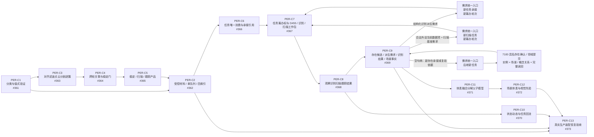
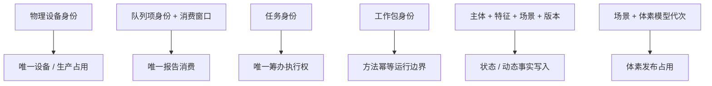
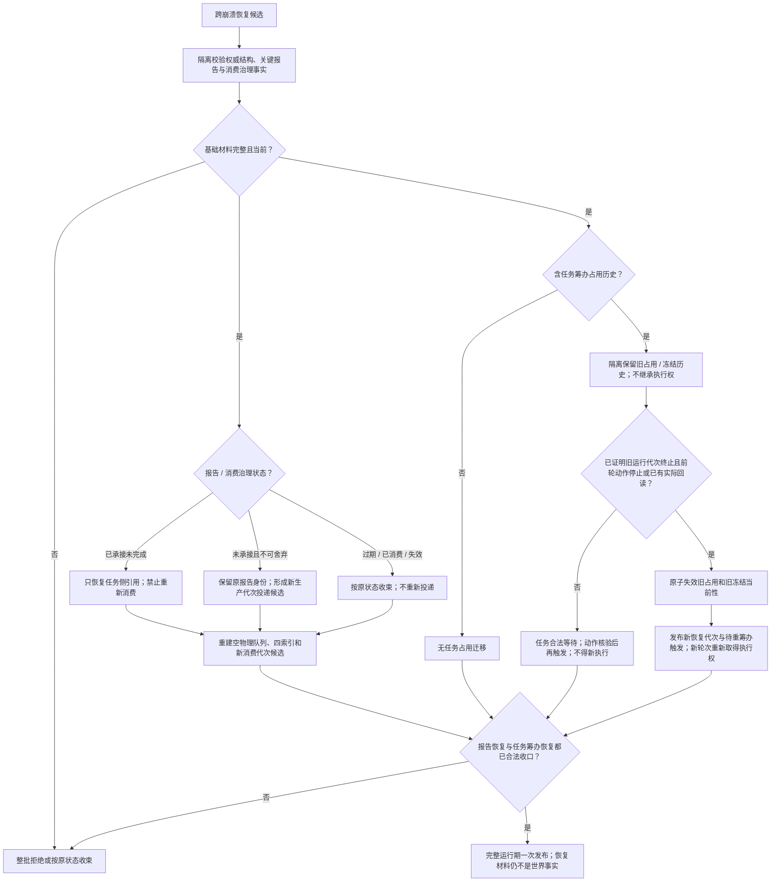

# PERCEPTION-D0：D455 观察体素生产闭环函数结构知识图谱

日期：2026-07-23

版本：v0.1

状态：#360 现行设计知识图谱；冻结 `PER-C1—PER-C13 / v0.1` 的模块、结构、函数、所有权和依赖方向；代码未实现

## 1. 权威输入

- `规范/详细设计/D455成熟度产品受控材料与报告队列详细设计.md`
- `规范/详细设计/D455任务唯一消费冻结工作包与观察方法详细设计.md`
- `规范/详细设计/观察世界事实与体素融合详细设计.md`
- `规范/详细设计/真实D455生产装配恢复与验收详细设计.md`
- `流程图/20260723_PERCEPTION-INGEST_D455成熟度产品受控材料报告队列施工流程图_v0.1.md`
- `流程图/20260723_PERIPHERAL-TASK_任务唯一消费冻结工作包观察方法施工流程图_v0.1.md`
- `流程图/20260723_OBSERVE-VOXEL_观察世界事实与体素融合施工流程图_v0.1.md`
- `流程图/20260723_PERCEPTION-RUNTIME_真实D455生产装配恢复验收施工流程图_v0.1.md`

## 2. 总图



图中边是冻结的提供—消费关系，不表示提供者代码已经存在。#361—#372 可在所有权隔离下并行形成候选；#373 独占真实汇合、工程、入口、统一运行器、生产宿主和真实硬件验收。

## 3. 合同—结构—函数—模块映射

| 合同 | 核心结构 | 核心函数 | 模块 / 文件身份 | 所有者 |
| --- | --- | --- | --- | --- |
| PER-C1 | `D455材料分类`、`D455产品身份` | `验证并分类D455产品` | 新建待实现：`海中鱼巣/适配/协议.D455观察供给.ixx`、`海中鱼巣/适配/自检.D455观察供给合同.ixx` | #361 |
| PER-C2 | `D455受控产品引用`、`D455报告队列项`、四类索引 | `保留D455产品`、`发布D455报告` | 新建待实现：`海中鱼巣/线程/协议.D455报告流转.ixx`、`海中鱼巣/线程/材料域.D455受控引用.ixx`、`海中鱼巣/线程/队列.D455观察供给报告.ixx`、`海中鱼巣/线程/生产者.D455观察供给.ixx`、`海中鱼巣/线程/自检.D455观察供给报告流转.ixx` | #362 |
| PER-C3 | `D455逐簇项`、`D455原始逐簇产品` | `形成原始逐簇产品` | 新建待实现：`海中鱼巣/适配/处理.D455逐簇产品.ixx`、`海中鱼巣/适配/自检.D455逐簇产品.ixx` | #363 |
| PER-C4 | `D455跨轮材料窗口`、`D455稳定观察项` | `形成稳定观察子集` | 新建待实现：`海中鱼巣/适配/处理.D455稳定观察.ixx`、`海中鱼巣/适配/自检.D455稳定观察.ixx` | #364 |
| PER-C5 | `D455扫描变化项`、`D455目标跟踪项`、`D455变化跟踪产品组` | `形成变化跟踪产品` | 新建待实现：`海中鱼巣/适配/处理.D455变化跟踪.ixx`、`海中鱼巣/适配/自检.D455变化跟踪.ixx` | #365 |
| PER-C6 | `D455等待工作项`、`D455消费窗口`、`已承接D455材料引用` | `尝试承接D455报告` | 新建待实现：`海中鱼巣/线程/协议.任务外设材料承接.ixx`、`海中鱼巣/领域/数据操作.任务外设材料承接.ixx`、`海中鱼巣/领域/服务.任务外设材料承接.ixx`、`海中鱼巣/领域/组合.任务外设报告承接.ixx`、`海中鱼巣/领域/自检.任务外设材料承接.ixx` | #366 |
| PER-C7 | `任务筹办占用`、`识别派生需求材料`、`合法外设当前数据项`、`扫描输入材料`、`D455方法工作包`、`识别任务工作包`、`扫描任务工作包` | `尝试取得任务筹办执行权`、`冻结D455方法工作包`、`冻结识别任务工作包`、`冻结扫描任务工作包` | 新建待实现：`海中鱼巣/线程/协议.任务感知方法工作包.ixx`、`海中鱼巣/领域/数据操作.任务感知方法工作包.ixx`、`海中鱼巣/领域/服务.任务感知方法工作包.ixx`、`海中鱼巣/领域/适配.任务感知方法材料.ixx`、`海中鱼巣/领域/组合.任务感知方法工作包.ixx`、`海中鱼巣/领域/自检.任务感知方法工作包.ixx` | #367 |
| PER-C8 | `任务感知方法结果`、四类入口规格 | `执行观察方法`、`执行识别方法`、`执行扫描方法`、`执行跟踪方法` | 新建待实现：`海中鱼巣/领域/合同.感知本能方法.ixx`、`海中鱼巣/领域/服务.感知本能方法.ixx`、`海中鱼巣/领域/自检.感知本能方法.ixx` | #368 |
| PER-C9 | `观察像素簇材料`、`存在候选`、`识别对应结果`、`新存在承接需求材料`、`观察事实提交规格`；形成 PER-C7 定义的 `识别派生需求材料` 与 `合法外设当前数据项` 值 | `形成存在候选`、`形成识别派生需求材料`、`接收识别方法结果`、`形成新存在承接或复验需求`、`提交观察事实`、`形成合法外设当前数据项` | 新建待实现：`海中鱼巣/领域/合同.观察存在提交.ixx`、`海中鱼巣/领域/组合.观察存在提交.ixx`、`海中鱼巣/领域/自检.观察存在提交.ixx`；跨任务共享类型由 PER-C7 合同模块唯一拥有 | #369 |
| PER-C10 | `状态事实提交规格`、`动态事实提交规格`、`状态动态提交结果` | `提交扫描跟踪事实` | 新建待实现：`海中鱼巣/领域/合同.观察状态动态提交.ixx`、`海中鱼巣/领域/组合.观察状态动态提交.ixx`、`海中鱼巣/领域/自检.观察状态动态提交.ixx` | #370 |
| PER-C11 | `观察体素材`、`体素模型代次` | `融合已确认存在体素材` | 新建待实现：`海中鱼巣/领域/合同.存在体素融合.ixx`、`海中鱼巣/领域/数据操作.存在体素融合.ixx`、`海中鱼巣/领域/服务.存在体素融合.ixx`、`海中鱼巣/领域/自检.存在体素融合.ixx` | #371 |
| PER-C12 | `场景体素快照`、`视觉先验` | `读取场景体素快照`、`以视觉先验辅助观察候选` | 新建待实现：`海中鱼巣/领域/合同.场景体素与视觉先验.ixx`、`海中鱼巣/领域/服务.场景体素与视觉先验.ixx`、`海中鱼巣/领域/自检.场景体素与视觉先验.ixx` | #372 |
| PER-C13 | `D455设备占用`、`D455生产运行代次`、`D455重连代次`、`D455运行期上下文`、`D455恢复候选清单`、`D455端到端验收结果` | `尝试取得D455设备占用`、`装配D455生产运行期`、`从D455恢复候选装配运行期`、`处理D455断流`、`停止D455生产运行期`、`验收真实D455生产闭环` | 现有：`海中鱼巣/适配/协议.D455采样材料.ixx`、`海中鱼巣/适配/采集器.D455相机.ixx`、`海中鱼巣/线程/缓存.D455帧材料.ixx`、`海中鱼巣/线程/上行桥.D455采样材料.ixx`、`海中鱼巣/线程/外设采样材料线程.ixx`、`海中鱼巣/线程/任务管理线程.ixx`、`海中鱼巣/装配.运行期业务.ixx`、`海中鱼巣/启动.生产运行期.ixx`、`海中鱼巣/启动.运行期上下文.ixx`、`海中鱼巣/自检.运行器.ixx`、`海中鱼巣/入口.cpp`、`海中鱼巣.vcxproj`、`海中鱼巣.vcxproj.filters`；新建待实现：`海中鱼巣/线程/协议.D455生产运行期.ixx`、`海中鱼巣/装配.D455生产运行期.ixx`、`海中鱼巣/装配.D455恢复.ixx`、`海中鱼巣/适配/自检.D455生产闭环.ixx` | #373 |

## 4. 结构身份与禁止替代

| 层 | 正式身份 | 禁止替代 |
| --- | --- | --- |
| 外部材料 | 设备 + 采集 / 生产代次 + 帧 / 产品身份 | 指针、线程编号、日志行 |
| 报告传递 | 强类型报告稳定身份；物理队列项只作运行期定位 | 把物理队列位置或容器状态当机器事实、四个独立队列、四个状态副本 |
| 消费 | 队列项 + 消费窗口 + 已承接引用 | 分类视图命中、控制面板读取 |
| 筹办 | 任务身份 + 筹办轮次 + 有效占用 | 线程身份、方法身份、根需求身份 |
| 方法 | D455 / 识别 / 扫描三类不可变工作包身份 | 直接读取外设队列、跨方法调用、无类型材料容器 |
| 观察 / 识别 | 观察结果 -> 存在候选 -> 识别派生需求 -> 新任务 / 新筹办 -> 唯一已有存在句柄 / 空句柄 | 方法直接互调、轨迹号、质量分数、报告编号 |
| 新存在 | 空句柄依据 -> 新存在承接任务 -> 7100 实例 / 场景 / 概念关系完整读回 | 由观察或识别直接创建存在 |
| 世界事实 | 主体 + 场景 + 时间 + 来源 + 版本的类型化记录和关系 | 报告、候选、方法返回码 |
| 体素 | 场景 + 模型代次 + 证据和父子关系 | 显示网格、场景快照、视觉先验 |
| 恢复 | 关键报告 / 消费治理事实和完整权威结构的隔离恢复候选 | 物理队列快照、索引快照、日志 |

## 5. 并发隔离图



这些键互不替代。不同任务可并发筹办；同一任务必须在召回前互斥。不同设备可并发生产；同一设备只有一个有效生产占用。一个报告只能形成一个当前承接。

## 6. 恢复关系图



物理报告队列和四类索引不保存为权威队列快照。恢复只迁移允许的治理事实，不能把报告、候选或任务材料升级为存在、状态、动态或体素事实。

## 7. 逻辑内返回与内部错误

| 阶段 | 逻辑内返回 | 内部错误 |
| --- | --- | --- |
| 分类 / 产品 | 字段缺失、非法组合、无合法簇、未稳定、无变化、目标丢失 | 同身份同规则产生矛盾分类；已发布产品不可读 |
| 队列 / 消费 | 队列满、重复、过期、已承接、无匹配 | 队列确认后承接记录无法发布 / 读回 |
| 筹办 / 冻结 | 筹办占用、引用失效、方法不匹配、取消 | 同任务两路径进入召回；冻结后字段改变 |
| 观察 / 识别 / 事实 | 空句柄、需复验、新存在承接等待、主体 / 场景不合法、字段不完整、首次扫描无基准、版本漂移 | 方法直接互调；7100 或事实前置通过后事务无法确认 / 读回 |
| 体素 | 无融合点、越界、质量不足、重复消费 | 前置通过后空间 / 父子 / 发布不变量破坏 |
| 运行 / 恢复 | 设备占用失败、恢复候选不完整、断流、重连超窗 | 完整装配无法一次发布或服务句柄不一致 |

## 8. 计划所有权和集成顺序

1. #361 冻结值式 ABI 后，#362—#365 只读消费。
2. #363 -> #364 -> #365 是产品算法数据依赖；各自文件所有权隔离。
3. #362 与 #363—#365 可按 PER-C1 / PER-C2 合同形成候选，真实队列汇合归 #373。
4. #366 只拥有报告到已承接引用；#367 只拥有筹办绑定、三类强类型工作包和 `识别派生需求材料` 类型；#368 只拥有四方法登记与结果。
5. #369、#370 分别拥有观察 / 识别回流 / 新存在承接材料与状态动态；不得互改对方领域记录。#369 import PER-C7 的 `识别派生需求材料` 与 `合法外设当前数据项` 类型并形成值；`扫描输入材料` 由 #367 基于合法当前数据项或已有基准扫描变化报告形成，#367 不反向 import #369。#369 不拥有识别方法执行，也不拥有 7100 存在创建入口。
6. #371 只拥有体素写入；#372 只拥有快照、先验和候选辅助。
7. #373 固定汇合顺序：

```text
#361 / #363 / #364 / #365
-> #362
-> #366
-> #367
-> #368
-> #369 / #370
-> #371
-> #372
-> 生产装配、恢复、真实硬件验收
```

候选可并行形成不等于验证后置可以省略。最终只有 #373 消费真实提供者实现，完成构建、端到端接线和能力验收。

## 9. 覆盖检查

| 要求 | 覆盖 |
| --- | --- |
| PER-C1—PER-C13 均有版本、模块、DTO / 结构、行为、提供 / 消费计划 | 四份现行详细设计和第 3 节 |
| 写入方、读取方、生命周期、并发键 | 各合同分节和第 4—5 节 |
| 逻辑内返回、内部错误、恢复、漂移退回 | 各合同分节和第 6—7 节 |
| 一个物理队列、四索引、任务域唯一消费 | PER-C2 / PER-C6 |
| 原始逐簇禁入业务方法、识别无 D455 直通且跨新任务回合 | PER-C5 / PER-C7 / PER-C8 / PER-C9 |
| 空句柄复验 / 新存在承接与 7100 实例创建 | PER-C9 |
| 首次扫描不新增第五产品；稳定观察经观察事实形成合法当前数据项，再跨新任务建立当前值 / 状态基准 | PER-C5 / PER-C7 / PER-C8 / PER-C9 / PER-C10 |
| 报告 / 候选不是世界事实 | PER-C2 / PER-C9 / PER-C13 |
| 体素只消费已确认新增且未消费的观察材料 | PER-C11 |
| 生产接线和真实硬件验收只归 #373 | PER-C13 / 第 8 节 |

## 10. 未完成声明

本图谱是设计与计划输入，不是代码事实。任何模块、函数、结构、恢复或验收只有在对应计划实施、真实汇合验证并进入正式集成后才能声明完成。
