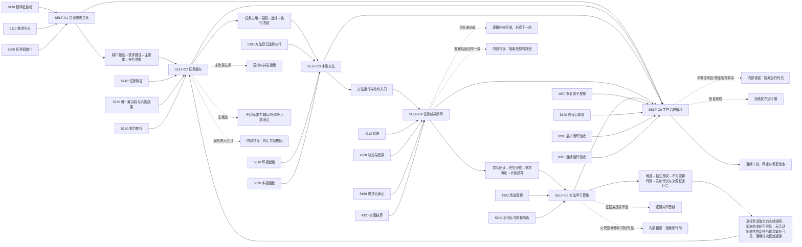

# SELF-D0 节点直接自我治理闭环函数结构知识图谱

日期：2026-07-23

版本：v0.1

状态：#353 施工知识图谱；冻结 `SELF-C1—SELF-C6 / v0.1`；不证明代码实现

## 1. 节点类型

| 类型 | 节点 |
| --- | --- |
| 规范节点 | 0050、3100—3300、4010、4020、4040、4070、4110、4210、4220、4310—4330、5100—5130、5160、5200—5250、5300—5340、6100、6120、6130、7130、8100、8200、8210、8300、8310 |
| 合同节点 | SELF-C1 自我需求生长、SELF-C2 任务筹办、SELF-C3 本能方法、SELF-C4 任务结果闭环、SELF-C5 方法学习晋级、SELF-C6 自我治理循环 |
| 状态节点 | 根缺口候选、需求路径、主需求、任务意图、任务待筹办、筹办占用、六类结果、执行冻结、方法运行、实际回读、任务完成、需求满足、价值结算、学习候选、晋级授权、新代际、下一轮 |
| 拒绝节点 | 身份无效、读取不全、版本漂移、未取得占用、无候选、授权失效、材料不足、未知差异、恢复缺项 |
| 内部错误节点 | 双筹办、前置通过后发布失败、读回不一致、跨域写入、父代原地变化、同轮新代际可见、停止后写事实、半恢复发布 |
| 验证节点 | 权重闭合、并发互斥、六类覆盖、实际回读、三类裁决分账、学习隔离、恢复原子性、连续十轮 |

## 2. 图谱

## 3. 函数与结构映射

| 函数族 | 输入 | 输出 | 唯一写入边 |
| --- | --- | --- | --- |
| `形成根特征缺口候选` | 自我、根定义、槽位、当前值版本 | 候选或具名拒绝 | 不写需求 |
| `提交需求路径` | 候选、目标、OR/AND 规格 | 需求与路径结果 | 需求领域 |
| `形成主需求决议` / `提交任务意图` | 当前需求集合 / 主需求 | 值式决议 / 任务意图 | 决议不改需求；任务域建任务 |
| `尝试取得筹办执行权` / `筹办任务` | 任务、轮次、恢复代次 | 占用 / 六类结果 | 任务领域 |
| `登记本能方法` / `执行本能方法` | 完整方法规格 / 冻结输入 | 方法代际 / 运行结果 | 方法领域；动作再进入所属领域 |
| `回读方法实际结果` / `验证任务目标` | 运行身份、正式事实 / 冻结目标 | 回读 / 任务验证 | 事实域 / 任务域 |
| `提交需求满足` / `提交价值结算` | 任务验证 / 预算份额 | 两份独立结果 | 需求领域 / 4320、6100 正式价值结算入口 |
| `形成学习候选` / `裁决晋级授权` / `发布方法新代际` | 4330 分栏观察组 / 候选 / 授权 | 候选 / 授权 / 新代际 + 发布代次 + 来源任务回合 | 候选、晋级、方法发布入口分权 |
| `运行一个治理轮次` | 当前运行期和下一轮输入 | 轮次结果 | 只编排，不直接写业务事实 |
| `恢复并发布自我治理循环` | 隔离恢复候选 | 新运行代次 | 全部校验后原子发布 |

## 4. SELF-C1—SELF-C6 冻结索引

| 合同 | 文件 | ABI | 提供 / 消费 | 漂移退回点 |
| --- | --- | --- | --- | --- |
| SELF-C1 | `海中鱼巣/领域/合同.自我需求生长.ixx`（新建待实现） | 1 | #354 / #357、#359 | 身份、路径权重、任务意图或写权改变 |
| SELF-C2 | `海中鱼巣/领域/合同.任务筹办.ixx`（新建待实现） | 1 | #355 / #357、#367、#359 | 六类结果、并发键、恢复代次或冻结改变 |
| SELF-C3 | `海中鱼巣/领域/合同.本能方法.ixx`（新建待实现） | 1 | #356 / #357、#368、#359 | 方法清单、动作归属、内容版本改变 |
| SELF-C4 | `海中鱼巣/领域/合同.任务结果闭环.ixx`（新建待实现） | 1 | #357 / #358、#370、#359 | 实际回读、三类裁决所有权或下一轮改变 |
| SELF-C5 | `海中鱼巣/领域/合同.方法学习晋级.ixx`（新建待实现） | 1 | #358 / #359 | 统计字段、候选键、授权方、发布代次、来源回合或任务级可见性改变 |
| SELF-C6 | `海中鱼巣/运行/合同.自我治理循环.ixx`（新建待实现） | 1 | #359 / #373 | 运行身份、调度、停止、恢复或验收改变 |

所有合同输入输出均为值式 DTO、稳定句柄或不透明引用；线程、锁、日志、索引和返回码不承担机器事实。

## 5. 完整合同权威

SELF-C1—C6 的 DTO、完整行为、ABI、所有权、生命周期、逻辑内结果、内部错误和漂移退回唯一读取 `规范/详细设计/节点直接自我内部治理闭环详细设计.md` 第 4 节。本知识图谱只维护节点、边、函数映射和紧凑索引，不另存第二份完整合同表。
