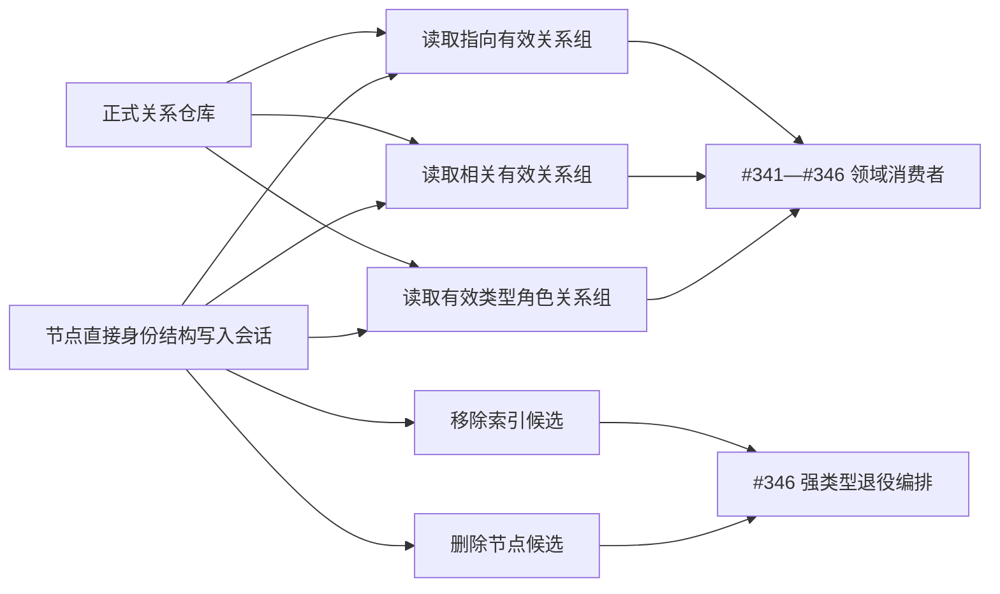

# NODE-TYPED-MIGRATION NT-P1Q 函数结构知识图谱

日期：2026-07-24

## 1. 提供图



## 2. 函数职责

| 函数 | 输入 | 输出 | 所有者 | 消费者 |
| --- | --- | --- | --- | --- |
| `读取指向有效关系组` | 目标节点、关系类型 | 当前有效关系值式组 | #374 | #341—#346 |
| `读取相关有效关系组` | 任一端点、关系类型 | 入向与出向去重组 | #374 | #342—#346 |
| `读取有效类型角色关系组` | 关系类型、顺序号 | 全域当前角色组 | #374 | #342、#343、#346 |
| `移除索引候选` | 索引物理键 | 带值结构写入结果 | #374 | #346 |
| `删除节点候选` | 当前节点句柄 | 新删除版本句柄结果 | #374 | #346 |

## 3. 依赖与停止

```text
#374 只提供通用能力
-> #341—#345 各自解释关系角色与业务基数
-> #340—#345 各自提供领域记录退役参与包
-> #346 统一编排但不直接访问私有仓
-> #352 完成真实汇集和跨领域验证
```

函数缺失属于待实施目标。签名、排序、候选视图或删除语义与详细设计不一致时，只停止 #374 及直接消费者，不扩大到其它计划。
