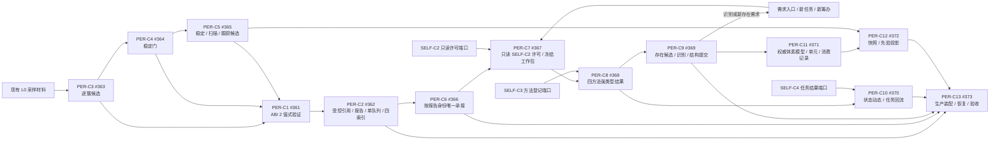
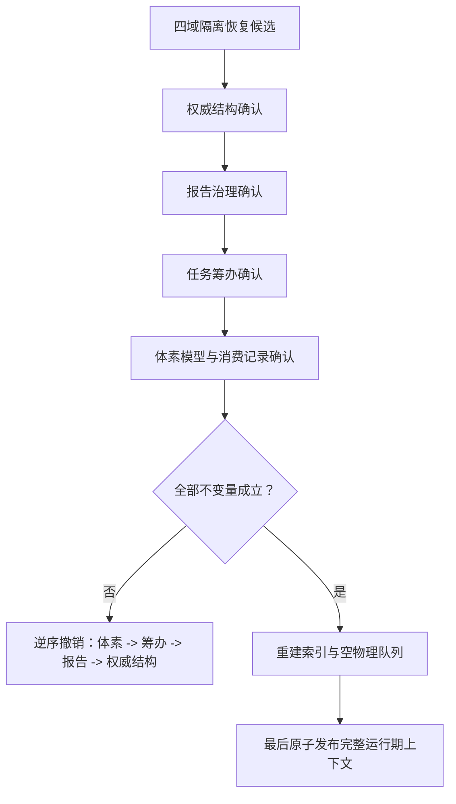

# PERCEPTION-D0：D455 观察体素生产闭环函数结构知识图谱 v0.2

日期：2026-07-24

状态：#360 现行设计知识图谱；冻结 `PER-C1—PER-C13 / ABI 2` 的模块、结构、函数、所有权和依赖方向；代码未实现。

## 1. 权威输入

- `规范/详细设计/D455成熟度产品受控材料与报告队列详细设计.md` v0.2
- `规范/详细设计/D455任务唯一消费冻结工作包与观察方法详细设计.md` v0.2
- `规范/详细设计/观察世界事实与体素融合详细设计.md` v0.2
- `规范/详细设计/真实D455生产装配恢复与验收详细设计.md` v0.2
- `流程图/20260724_PERCEPTION-INGEST_D455成熟度产品受控材料报告队列施工流程图_v0.2.md`
- `流程图/20260724_PERIPHERAL-TASK_任务唯一消费冻结工作包观察方法施工流程图_v0.2.md`
- `流程图/20260724_OBSERVE-VOXEL_观察世界事实与体素融合施工流程图_v0.2.md`
- `流程图/20260724_PERCEPTION-RUNTIME_真实D455生产装配恢复验收施工流程图_v0.2.md`

## 2. 提供—消费总图

图中边是待实现合同的导入方向，不表示提供者代码已经存在。`C5 -> C12` 只传递 `D455稳定观察子集`；C12 不消费原始帧、原始逐簇或泛化观察材料。

`C3 -> C4 -> C5` 只表示材料派生方向；产品发布路径固定为 `(C3 | C4 | C5) -> C1 -> C2`，因此下图中的 C3、C4、C5 分别指向 C1，不表示绕过任何后继产品阶段。

## 3. 合同—结构—函数—模块映射

| 合同 / 所有者 | 核心结构 | 公开或计划内核心函数 | 唯一文件身份 |
| --- | --- | --- | --- |
| C1 / #361 | 分类、产品身份、四种强类型负载、验证结果 | `验证并分类D455产品` | `适配/协议.D455观察供给.ixx`；`适配/自检.D455观察供给合同.ixx` |
| C2 / #362 | 受控产品引用、报告身份、队列项、四索引、生产者状态 | `保留D455产品`、`发布D455报告`、消费候选 / 确认 / 撤销 / 读回 | `线程/协议.D455报告流转.ixx`；`线程/材料域.D455受控引用.ixx`；`线程/队列.D455观察供给报告.ixx`；`线程/生产者.D455观察供给.ixx`；`线程/自检.D455观察供给报告流转.ixx` |
| C3 / #363 | 对齐输入、空间点、逐簇项、原始逐簇产品 | `形成原始逐簇产品` | `适配/处理.D455逐簇产品.ixx`；对应自检 |
| C4 / #364 | 跨轮窗口、关联键、稳定观察项 / 子集 | `形成稳定观察子集` | `适配/处理.D455稳定观察.ixx`；对应自检 |
| C5 / #365 | 稳定子集、扫描变化、目标跟踪、变化跟踪结果 | `形成变化跟踪产品` | `适配/处理.D455变化跟踪.ixx`；对应自检 |
| C6 / #366 | 等待工作项、消费窗口、已承接引用 | `尝试承接D455报告` | `线程/协议.任务外设材料承接.ixx`；`领域/数据操作.任务外设材料承接.ixx`；服务、组合、自检 |
| C7 / #367 | SELF-C2 许可快照、三类不可变工作包、识别 / 扫描输入类型 | `冻结D455方法工作包`、`冻结识别任务工作包`、`冻结扫描任务工作包` | `线程/协议.任务感知方法工作包.ixx`；数据操作、服务、适配、组合、自检 |
| C8 / #368 | 方法登记材料、四方法结果、统一结果分支 | `执行观察方法`、`执行识别方法`、`执行扫描方法`、`执行跟踪方法` | `领域/合同.感知本能方法.ixx`；服务、自检 |
| C9 / #369 | 像素簇、存在候选、识别对应、新存在需求、结构提交读回 | `形成观察存在候选`、`形成识别派生需求`、`接收识别结果`、`提交并读回观察存在` | `领域/合同.观察存在提交.ixx`；组合、自检 |
| C10 / #370 | 状态 / 动态提交规格、事实读回、任务结果回流规格 | `提交扫描跟踪事实` | `领域/合同.观察状态动态提交.ixx`；组合、自检 |
| C11 / #371 | 观察体素材、模型身份、体素单元、模型记录、消费记录 | `融合已确认存在体素材` | `领域/合同.存在体素融合.ixx`；数据操作、服务、自检 |
| C12 / #372 | 读取范围、场景体素快照、视觉先验、候选辅助结果 | `读取场景体素快照`、`以视觉先验辅助观察候选` | `领域/合同.场景体素与视觉先验.ixx`；服务、自检 |
| C13 / #373 | 设备占用、生产 / 重连代次、运行期上下文、四域恢复结果、验收结果 | `装配D455生产运行期`、`从D455恢复候选装配运行期`、`处理D455断流`、`停止D455生产运行期`、`验收真实D455生产闭环` | 详细设计第 2 节登记的现有 / 新建 #373 独占文件、工程、filters、入口 |

所有路径均以 `海中鱼巣/` 为代码根；自检文件与生产模块保持单向依赖。逐字段 DTO、稳定枚举值、构造注入、生命周期和结果矩阵唯一读取四份 v0.2 详细设计。

## 4. 身份、所有权和并发键

| 层 | 正式身份 / 并发键 | 禁止替代 |
| --- | --- | --- |
| 采样 | 设备 + 采集代次 + 帧序号 + 标定版本 | 指针、线程编号、显示帧 |
| 报告 | `D455报告身份` | 队列位置、消费窗口、任务身份 |
| 承接 | 报告身份全局唯一；任务 / 工作项 / 窗口只绑定 | 分类视图命中 |
| 筹办 | SELF-C2 的任务 + 筹办轮次 + 占用版本 | C7 创建第二占用、线程身份 |
| 方法 | 工作包身份 + 冻结版本 | 直接读队列、方法互调 |
| 世界结构 | 节点句柄、正式关系、状态 / 动态类型化记录 | 观察事实节点、报告或普通返回码 |
| 体素 | 存在 + 场景 + 模型代次；材料身份 + 消费版本 | 体素节点、显示网格或快照 |
| 恢复 | 四提供者各自的隔离候选与确认版本 | 日志、物理队列、索引快照 |

## 5. 发布与恢复顺序

领域写入均遵守 4040：锁外候选、会话内复核、参与者确认、逆序撤销、完整读回、最后发布。恢复编排不取得各域事实写权。

## 6. 逻辑内返回、内部错误和 DRIFT

| 阶段 | 逻辑内返回 | 内部错误 |
| --- | --- | --- |
| 产品 | 字段缺失、非法组合、无合法簇、未稳定、无变化、目标丢失 | 同身份同规则矛盾、发布后不可读 |
| 报告 / 承接 | 队列满、重复、过期、已承接、无匹配 | 报告确认后承接记录不能发布 / 读回 |
| 工作包 / 方法 | 许可无效、引用失效、入口不匹配、任务取消 | 冻结后字段改变、两路径进入同一召回 |
| 世界结构 | 空对应、需复验、字段不全、首次无基准 | 前置通过后关系 / 事实不能确认或读回 |
| 体素 | 无融合点、越界、质量不足、重复消费 | 空间 / 父子 / 消费 / 发布不变量破坏 |
| 运行期 | 设备占用失败、恢复候选不完整、断流超窗 | 半运行期可见、服务版本不一致、停止后仍发布 |

任一计划若改变 ABI 2 或 DTO，返回 `DRIFT-PER-CONTRACT`；现行只读接口无法适配，返回 `DRIFT-PER-CURRENT-INTERFACE`；需要表外文件，返回 `DRIFT-PER-FILE-OWNERSHIP`；形成反向 import，返回 `DRIFT-PER-IMPORT-CYCLE`。不得由执行侧补造设计。

## 7. 计划隔离与完成边界

1. #361—#372 只修改各自行登记文件与专属施工记录，不修改工程、filters、入口、统一运行器或生产装配。
2. #361—#372 可按待实现合同并行形成隔离候选；提供者代码未实现不是设计阻塞。
3. #373 只有在 #352、#359、#361—#372 固定结果提交全部存在后才可激活，且独占真实汇合和硬件验收。
4. 本图谱只证明施工依据链闭合，不证明任何模块已实现、编译、接线或通过真实 D455 验收。
