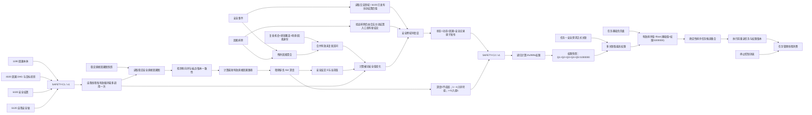
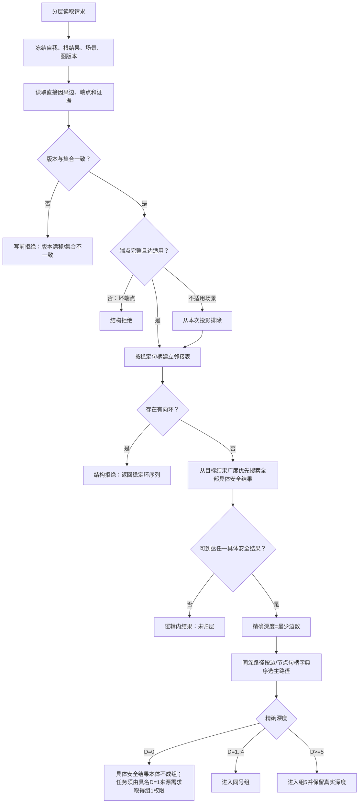
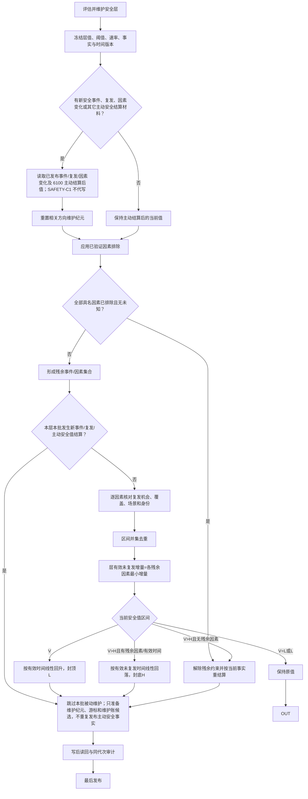
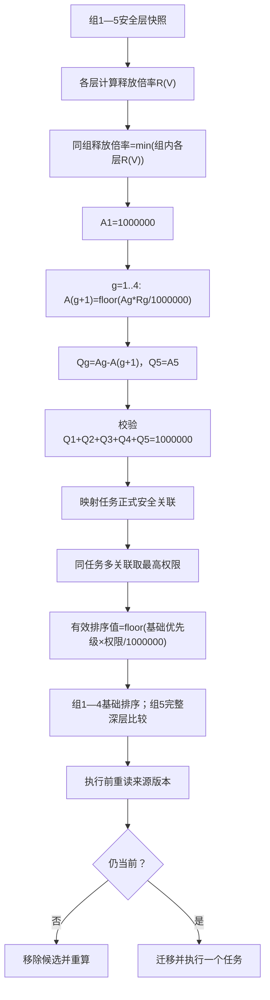
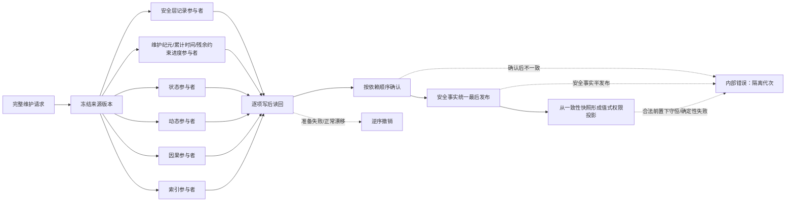
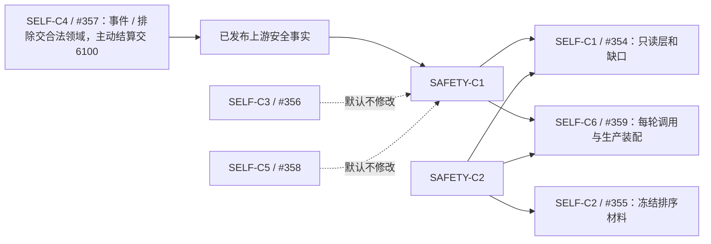

# SAFETY-PRIORITY 分层安全值维护与因果任务优先级函数结构知识图谱

日期：2026-07-24

版本：v0.1

状态：施工知识图谱候选；冻结 `SAFETY-C1 / v1`、`SAFETY-C2 / v1`；不证明代码实现

绑定详细设计：`规范/详细设计/分层安全值被动变化与因果任务执行优先级详细设计.md`。

## 1. 节点类型

| 类型 | 节点 |
| --- | --- |
| 规范节点 | 0050、1140、1160、1170、1190、3100、3200、4210、4220、4310、4320、5110、5120、5210、5230、6100—6150、8100、8200、8300、8310 |
| 合同节点 | SAFETY-C1 稳定因果分层与安全值维护、SAFETY-C2 递归权限与任务排序 |
| 权威事实节点 | 安全根结果、直接因果边、安全层定义、安全层当前值、安全事件、事件因素、因素排除、未复发证据段、状态、动态、因果 |
| 只读投影节点 | 精确因果深度、安全组、残余因素集合、有效未复发时间、安全权限快照、任务排序材料 |
| 调度节点 | 自我线程一轮调用、任务候选集合、任务管理线程、停止控制消息 |
| 拒绝节点 | 身份无效、版本漂移、场景不可比、覆盖不完整、证据过期、权限来源失效 |
| 结构拒绝节点 | 因果环、坏端点、混合图版本、集合不一致 |
| 逻辑内结果节点 | 未归层、无值变化、零权限、无可执行任务、精确重复 |
| 内部错误节点 | 写后读回不一致、确认失败、撤销失败、半发布、调度反写安全值 |
| 验证节点 | SP-A01—A20 |

## 2. 总图



## 3. 稳定因果分层子图



## 4. 安全值维护子图



## 5. 权限递归与任务排序子图



组 5 排序材料必须形成完整依赖链：

```text
分层安全值 + Vmin/Vmax/规则版本
-> 归一化安全不足度

有效时间证据 + 预计模型版本
-> 预计达到目标/阈值的时间，或具名不可预计

安全事件/残余因素
-> 未处理后果严重度

直接因果路径 + 样本依据 + 规则版本
-> 因果成立强度和版本

任务权限 + 不足度 + 预计/时间证据 + 后果严重度
+ 因果成立强度/版本 + 基础优先级 + 真实深度 + 稳定键
-> 组 5 确定性比较
```

## 6. 函数节点和调用边

| 层 | 函数节点 | 主要输入 | 主要输出 | 调用/被调用 |
| --- | --- | --- | --- | --- |
| 因果读取 | `读取稳定安全直接因果图` | 自我、根结果、场景、截止版本 | 不可变图快照 | 被安全分层服务调用 |
| 因果纯值 | `检测安全因果图环` | 图快照 | 无环或稳定环序列 | 先于最短路径 |
| 因果纯值 | `计算精确因果深度` | 无环图、目标结果、具体结果组 | 深度、全部并列最短来源或未归层 | 调用广度优先搜索 |
| 分组纯值 | `形成安全组五组投影` | `D>=1` 的分层结果组 | 1—5 组值式投影；深度 0 不适用 | 不改精确深度，不生成组 0 |
| 证据纯值 | `复核未复发证据段` | 事件、因素、场景、覆盖、机会、时间 | 可用/拒绝 | 先于区间合并 |
| 证据纯值 | `合并有效未复发区间` | 有序证据段 | 区间并集与单调纳秒数 | 去重重叠区间 |
| 聚合纯值 | `计算层有效未复发增量` | 残余因素及各自区间 | 最小有效增量 | 缺任一因素则为零 |
| 维护纯值 | `计算被动安全值变化` | 层快照、累计有效时间 | 新值、维护纪元、累计时间、分类 | 不读仓库或时钟 |
| 安全服务 | `评估并维护安全层` | 值式维护请求 | 维护结果 | 编排主动/被动顺序 |
| 定义读取 | `读取被动维护提交方法` | 安全层定义快照 | 稳定方法身份 | 线程和请求不得注入 |
| 安全数据操作 | `准备安全维护候选` | 完整冻结材料 | 不透明候选能力 | 准备跨域参与者 |
| 安全数据操作 | `确认安全维护候选` | 候选能力 | 确认结果 | 只在写后审计通过后 |
| 安全数据操作 | `撤销安全维护候选` | 候选能力 | 撤销结果 | 准备失败或正常漂移 |
| 权限纯值 | `计算单层释放比例` | V、L、H | 0..990000 | 边界等号固定 |
| 权限纯值 | `计算组最小释放倍率` | 同组层快照 | 组释放倍率和全部限制层 | 不比较原始层值 |
| 权限纯值 | `计算五组递归权限` | 组 1—5 快照 | `Q1..Q5` | 128 位中间值、总和守恒 |
| 权限纯值 | `传播安全组材料缺口` | 缺口来源组、组快照 | `材料缺失` 结果及部分权限载荷 | 低组合法权限保留；缺口组及更高组为零 |
| 任务投影 | `计算任务最高安全权限` | 任务关联、权限快照 | 权限和主解释 | 多关联取最大 |
| 排序纯值 | `计算组五安全不足度` | V、Vmin、Vmax、版本 | 0..1000000 | checked wide integer |
| 排序纯值 | `比较任务执行候选` | 两份完整排序材料 | 稳定次序 | 组 5 覆盖预计时间、后果和因果证据 |
| 自我线程路由 | `调度一轮安全维护` | 截止版本、单调时间 | 结构化结果 | 每有效循环最多一次 |
| 任务线程路由 | `读取并排序可执行任务候选` | 当前任务集合、权限版本 | 有序候选 | 停止控制另行优先 |

## 7. 数据依赖边

```text
直接因果边记录
-> 稳定因果图快照
-> 精确深度
-> 安全层身份
-> 安全权限快照
-> 任务排序材料

安全事件
-> 事件因素
-> 因素排除 / 未复发证据段
-> 残余风险集合
-> 被动维护候选
-> 安全层新值
-> 权限新快照

安全层前值 + 维护规则 + 时间证据
-> 安全层后值
-> 安全状态
-> 安全变化动态
-> 变化因果引用
-> 任务调度只读权限
```

禁止的反向边：

```text
队列拥堵 / 任务数量 / 算力不足 -> 安全值
运行消息优先级 -> 安全权限
任务完成 -> 直接写安全值
线程循环次数 -> 被动变化量
日志 / 显示 / 返回码 -> 安全事实
权限快照 -> 反写因果图、层值或阈值
服务值 -> 改写任意分层安全值
```

## 8. 原子参与者图



## 9. 拒绝与内部错误路由

| 节点 | 分类 | 后继 |
| --- | --- | --- |
| 无路径且图完整 | 逻辑内结果 | 无安全深度；按非安全任务规则处理 |
| 图有环、坏端点、混合版本 | 结构拒绝 | 拒绝新投影，不使用未归层兜底 |
| 场景不可比、感知覆盖不全 | 写前拒绝/无有效时间 | 本轮不增加低位回升时间 |
| 中间区间、整数变化量为零 | 逻辑内无变化 | 不写值变化动态 |
| 安全值无变化或精确重放 | 逻辑内结果 | 返回当前值版本、空新值版本和维护账版本 |
| 某组事实或阈值材料缺失 | `材料缺失` + 部分权限载荷 | 本组及更高组零权限，低组合法结果保留；不得伪称五组守恒 |
| 图、权限规则或已使用来源版本漂移 | `版本漂移`、无载荷 | 整份投影失效，不允许部分消费 |
| 权限为零 | 逻辑内调度结果 | 保留任务，排除普通执行竞争 |
| 无任务 | 逻辑内调度结果 | 等待事实或任务变化 |
| 候选准备后正常版本漂移 | 正常并发拒绝 | 逆序撤销并重读 |
| 写后读回不一致、撤销失败、半发布 | 内部逻辑错误 | 隔离受影响路径并追根因 |
| 调度器要求修改安全值 | 越权 | 写前拒绝并保留诊断 |

## 10. 与 SELF 合同的连接



连接规则：

1. SELF-C1 不计算安全值，SELF-C2 不把权限当筹办权或任务授权。
2. SELF-C4 必须把新事件、复发、因素变化和因素排除交各自合法领域，把主动安全结算交 6100；SAFETY-C1 只读消费这些已发布快照。
3. SELF-C6 唯一拥有自我线程、任务管理线程、工程、入口和统一运行器接线。
4. 安全提供者计划只实现协议、领域服务、数据操作、纯值算法和专项自检，不夺取 SELF-C6 共享文件。

## 11. 当前接口差距节点

| 当前接口 | 当前事实 | 目标差距 |
| --- | --- | --- |
| `服务.轻量因果.ixx`、`因果服务.h` | 轻量引用和候选材料 | 无稳定图、环检测、最短路径、精确深度 |
| `自我线程.ixx` | 仅按消息批次调用可选处理器 | 无每轮安全维护入口 |
| `自我治理领域路由.ixx` | 固定安全当前值 1、目标值 10 的兼容链 | 待退役，不能扩写为分层算法 |
| `协议.任务执行请求.ixx` | 无安全权限及来源版本 | 缺 SAFETY-C2 冻结材料 |
| `任务管理线程.ixx` | 强类型请求按确认入队顺序消费 | 无候选集合权限排序和消费前重读 |
| `有界运行消息队列.ixx` | 低/普通/高/停止运行控制 | 不能承载安全任务权限；停止优先须保留 |
| 节点直接身份结构写入会话 | 已有节点/关系/索引候选底座 | 缺安全、状态、动态、因果同会话参与者 |

## 12. 验证节点索引

```text
SP-A01 图版本准入
SP-A02 环检测
SP-A03 最短路径与同深稳定选择
SP-A04 深度无截断和组5精确比较
SP-A05 未归层
SP-A06 未复发证据完整性
SP-A07 时间区间去重和调用幂等
SP-A08 低位线性回升
SP-A09 高位线性回落与因素排除
SP-A10 中间区间及生存安全根值隔离
SP-A11 新事件优先
SP-A12 跨域事务原子性
SP-A13 1%/99%边界
SP-A14 递归权限精确闭合
SP-A15 多需求任务取最高
SP-A16 确定性任务排序
SP-A17 零权限不删除事实
SP-A18 线程只调度
SP-A19 恢复不跨代次累计
SP-A20 服务合同、服务值和生存安全根值隔离
```

本文图谱只建立施工函数、结构和合同之间的连接，不表示任何候选模块、函数、事务参与者或生产接线已经存在。
