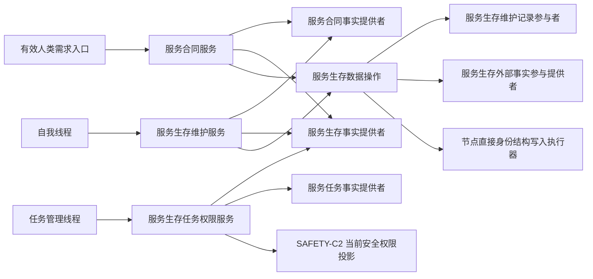
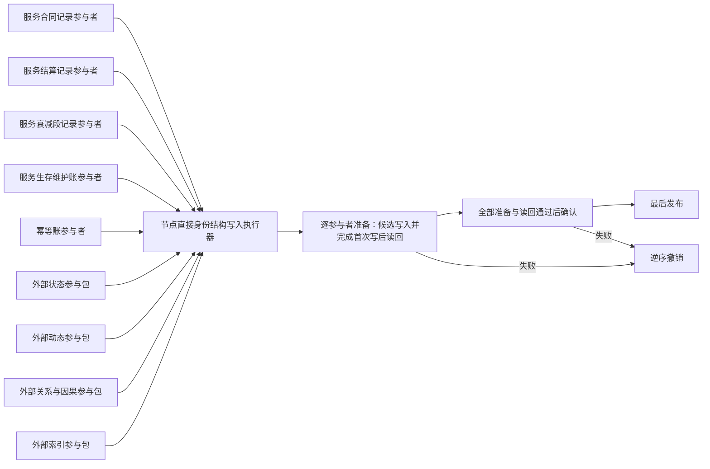

# SERVICE-SURVIVAL 服务合同、衰减与生存安全回归函数结构知识图谱

日期：2026-07-24

设计状态：终审设计图谱；冻结 `SERVICE-C1—C3 / v1` 的函数、结构、所有权和依赖，不表示代码已实现。

## 1. 入口图



线程只调用；领域服务裁决；数据操作组装候选；执行器最后发布；权限服务只读已发布快照。

## 2. 模块依赖图

```text
协议.服务生存维护
├─ 唯一声明三个只读事实提供者及全部值式 DTO
├─ 算法.服务合同结算
├─ 算法.服务值时间维护
├─ 算法.服务生存任务权限
├─ 参与者.服务生存维护记录
├─ 数据操作.服务生存维护
├─ 服务.服务合同
├─ 服务.服务生存维护
├─ 服务.服务生存任务权限
└─ 自检.服务值合同维护与生存权限

协议.分层安全维护
└─ 协议.服务生存维护（只读消费 #377 预冻结的权限读取结果 / 载荷；禁止复制 SAFETY DTO）

核心.执行器.节点直接身份结构写入
└─ 数据操作.服务生存维护

参与者.服务生存维护记录
└─ 数据操作.服务生存维护

协议 + 数据操作 + 算法.服务合同结算
└─ 服务.服务合同

协议 + 数据操作 + 算法.服务合同结算 + 算法.服务值时间维护
└─ 服务.服务生存维护

协议 + 算法.服务生存任务权限
└─ 服务.服务生存任务权限

生产线程、任务管理、工程、入口、真实适配
└─ 只由 #359 后续接入
```

禁止反向依赖：

```text
协议 -> 执行器
协议 -> 数据操作 / 参与者 / 任一服务
算法 -> 仓库 / 线程 / 日志
参与者 -> 领域服务
服务 -> 线程
服务.服务合同 <-> 服务.服务生存维护
权限服务 -> 可变事务
生产模块 -> 自检模块
```

## 3. `SERVICE-C1` 函数图

| 层 | 函数 | 输入 | 输出 | 关键不变量 |
| --- | --- | --- | --- | --- |
| 公开服务 | `建立或读取服务合同` | `服务合同建立请求` | `服务合同结果` | 一个有效来源需求只有一个合同 |
| 事实提供 | `读取服务合同事实` | 内部来源请求 | 需求、任务、方法、进展和值式事实 | 只读已发布副本 |
| 纯值算法 | `计算合同冻结预算` | 有效总秒、规则版本 | `B` | 宽位乘法，饱和到 I64_MAX |
| 纯值算法 | `计算合同预支与余款` | `B` | `P0、P1` | 先安全分解，`P0+P1=B` |
| 纯值算法 | `裁决合同终态` | 当前合同与同秒事实 | 唯一终态候选 | 正式发生序，不用容器序 |
| 纯值算法 | `形成到期未满足事件` | 到期合同、目标事实 | 不可变事件候选 | 只生成一次，不恢复合同 |
| 纯值算法 | `计算服务准备补回` | 准备结果、衰减段 | 请求 / 实际补回 | 不重复、不净增长 |
| 数据操作 | `提交服务合同候选` | 合同、结算和值候选 | 发布载荷 | 写后读回、最后发布 |

### 3.1 建立合同调用链

```text
建立或读取服务合同
-> 校验幂等主键、自我、提出者、需求和规则版本
-> 读取服务需求事实
-> 校验目标、范围、来源和法规准入
-> 查询同一有效期唯一合同
-> 同义重复读回；异义重复拒绝
-> 冻结显式有效期或规则默认 2,592,000 秒
-> 计算 B、P0、P1
-> 读取当前服务值和剩余空间
-> 形成合同、预支结算、服务值状态、动态和幂等候选
-> 提交服务合同候选
```

### 3.2 终态与准备算法消费边界

```text
SERVICE-C2 的结算服务生存治理批次
-> 冻结同秒合同与准备事实
-> 完成 / 取消 / 终止按发生序先裁决
-> 到期判定
-> 完成支付 P1
-> 取消 / 终止 / 到期关闭 P1
-> 到期且仍未满足时形成到期未满足事件
-> 从有效未满足集合移除
-> 准备完成时计算唯一衰减段补回
-> 与本秒时间维护和安全根回归候选共同原子提交
```

`SERVICE-C1` 拥有终态与准备的纯值算法和合同语义；生产线程不得把它们作为独立公开写入口调用。这样同秒合同终态、准备补回、衰减和安全根回归不会形成三个可见中间事务。

## 4. `SERVICE-C2` 函数图

| 层 | 函数 | 输入 | 输出 | 关键不变量 |
| --- | --- | --- | --- | --- |
| 公开服务 | `结算服务生存治理批次` | `服务生存治理请求` | `服务生存治理结果` | 同秒合同终态、准备、完整秒和根回归单事务；每完整秒最多消费一次 |
| 事实提供 | `读取服务生存事实` | 内部来源请求 | 定义、当前值、安全、时间和事实游标 | 方法身份和阈值冻结 |
| 纯值算法 | `计算跨过完整秒数` | 时间纪元、前后边界 | `N` | 循环次数不参与 |
| 纯值算法 | `选择最长未满足需求` | 当前有效合同组 | 唯一 `t` 与并列来源 | 多需求不叠加 |
| 纯值算法 | `裁决有效服务活动` | 合同 / 准备、授权、方法和进展 | 强类型活动状态 | 标签不成立活动 |
| 纯值算法 | `计算普通衰减步长` | `D0、t、T` | `D` | I64 安全、余数舍弃 |
| 纯值算法 | `计算区间衰减地板和` | 分段区间 | 宽位请求总量 | 等价逐秒 |
| 纯值算法 | `形成服务衰减段` | 分段事实和值 | 衰减段候选 | 可持久审计 |
| 纯值算法 | `映射服务比例` | `V` | `P` 或零值分支 | 非零映射 1..99 |
| 纯值算法 | `计算生存安全根回归` | `V、A、L、H` | 根值候选 | A 为零先保持终止 |
| 数据操作 | `提交服务生存维护候选` | 值、状态、动态、衰减段和游标 | 发布载荷 | 全部同代次 |

### 4.1 时间维护调用链

```text
结算服务生存治理批次
-> 读取服务生存定义与当前快照
-> 核对运行代次、时间纪元和连续性
-> 计算 N
-> 同时读取合同终态、准备、到期未满足事件、安全事实和进展事实
-> N 为零但存在合同终态或准备结算时仍继续；全部均无变化才返回无变化
-> 按事实边界切段
-> 每段选择最长等待并裁决有效活动
-> 计算普通衰减或三十天目标
-> 形成可审计衰减段
-> 先应用同秒合同结算和准备补回，再应用本秒衰减
-> 若主动安全值改变则跳过被动回归
-> 否则计算服务比例与生存安全根回归
-> 提交合同终态、准备结算、服务维护和安全根候选
```

### 4.2 生存安全回归图

```text
A = 0
-> 保持终止

A 不为 0 且 V = 0
-> A 收敛为 1

V 大于 0 且 A 小于 L
-> 先除 100 后乘 P
-> 封顶 L

L 小于等于 A 且 A 小于等于 H
-> 无变化

V 大于 0 且 A 大于 H
-> 先除 100 后乘 100-P
-> 封底 H
```

## 5. `SERVICE-C3` 函数图

| 层 | 函数 | 输入 | 输出 | 关键不变量 |
| --- | --- | --- | --- | --- |
| 公开服务 | `计算任务根权限` | `任务根权限请求` | `任务根权限结果` | 多来源取最高，不求和 |
| 公开服务 | `排序服务生存任务候选` | 候选任务组 | 排序结果 | 零权限不入普通竞争 |
| 事实提供 | `读取服务任务事实` | 内部来源请求 | 来源、任务、基础优先级和版本 | 任务名称不分类 |
| 纯值算法 | `计算安全服务根权限` | `A、L、H` | 安全根 / 服务根权限 | `A=0/1` 两者均为零；仅 `A>1` 总和恒为百万 |
| 纯值算法 | `组合安全来源权限` | 安全根、6150 来源权限 | 来源最终权限 | 安全兼服务不重复 |
| 纯值算法 | `计算任务有效执行优先级` | 基础优先级、来源权限 | I64 排序值 | 宽位乘除 |
| 纯值算法 | `选择任务最高来源权限` | 全部有效来源 | 主来源及并列来源 | 保留全部来源 |
| 纯值算法 | `稳定排序任务候选` | 权限载荷组 | 有序组 | 稳定收尾键完整 |

```text
读取当前生存安全根值与阈值
-> A=0 或 A=1 时形成两项零权限并停止普通任务排序
-> A>1 时形成总和为百万的安全根 / 服务根权限
-> 读取任务全部来源
-> 安全来源组合 6150 当前权限
-> 独立服务来源使用服务根权限
-> 安全兼服务来源只走安全路径
-> 每任务取最高来源
-> 计算有效执行优先级
-> 零权限与材料缺口分组
-> 对其余候选稳定排序
```

## 6. 记录与参与者图



外部参与提供者只形成参与包，不改变合同预算、前后值、动作方法或规则版本。空包、重复参与者、错代候选和部分载荷均在执行器前拒绝。

## 7. 结构生命周期

| 结构 | 创建 / 写入者 | 读取者 | 生命周期 |
| --- | --- | --- | --- |
| 服务合同记录 | 服务合同服务 / 服务生存维护服务 + 数据操作 | 合同、维护、恢复和审计 | 新合同与预支由合同服务发布；终态由聚合维护服务发布；当前 + 历史长期保存 |
| 服务结算记录 | 服务合同服务 / 服务生存维护服务 + 数据操作 | 维护、恢复和审计 | 预支由合同服务发布；余款关闭与准备补回由聚合维护服务发布；不可变阶段记录 |
| 到期未满足事件 | 服务生存维护服务 + 数据操作 | 同秒维护、恢复和审计 | 聚合事务内发布；不可变，只消费一次 |
| 准备衰减归属 | 服务生存维护服务 + 数据操作 | 准备结算和恢复 | 聚合事务内按衰减段冻结 |
| 服务衰减段 | 服务生存维护服务 | 准备补回、恢复和审计 | 不可变聚合记录 |
| 服务生存维护账 | 服务生存维护服务 | 幂等、恢复和审计 | 不可变维护记录 |
| 当前权限投影 | 权限服务 | 任务调度 | 当前快照，可重建 |
| 派发权限历史 | #359 任务派发入口 | 任务审计和恢复 | 实际派发后不可变 |

## 8. 结果与失败图

```text
入口材料不完整
-> 入口拒绝 / 材料缺失 / 版本漂移 / 时间证据缺口
-> 零写入

前置通过且当前没有跨过完整秒、没有合同终态、没有准备结算且没有其它值变化
-> 无变化
-> 返回当前值版本和维护账版本

精确同键同义
-> 精确重复
-> 读回既有当前版本

候选准备失败
-> 逆序撤销
-> 资源失败或结构拒绝

前置通过后读回、确认、撤销或发布不一致
-> 内部不一致
-> 停止依赖路径
```

不得用普通 `bool`、日志、异常文本、队列状态或线程状态代替结果分类。

## 9. 专项验收索引

```text
SS-A01—A08   服务合同、预算、结算、到期和准备
SS-A09—A13   时间、最长等待、三十天、活动保护和衰减段
SS-A14—A16   服务比例、生存安全控制态和回归算术
SS-A17—A18   安全 / 服务根权限与来源组合
SS-A19—A20   原子事务、幂等和恢复
SS-A21       休眠与有效人类需求唤醒
SS-A22       分层安全值、线程和调度边界隔离
```

本图谱只冻结施工函数、结构、依赖和所有权。#379 候选不得声明真实线程、工程、恢复或任务调度已接通；这些共享面只由 #359 统一实现和验收。
