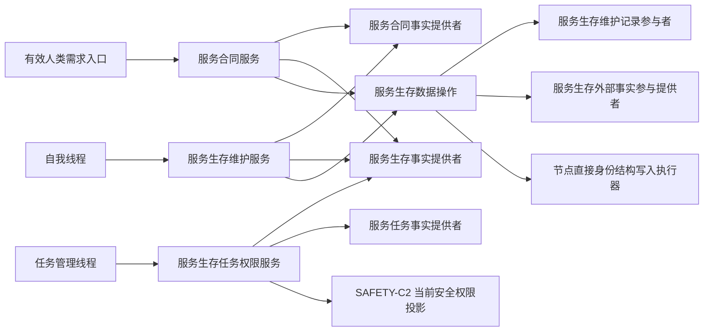
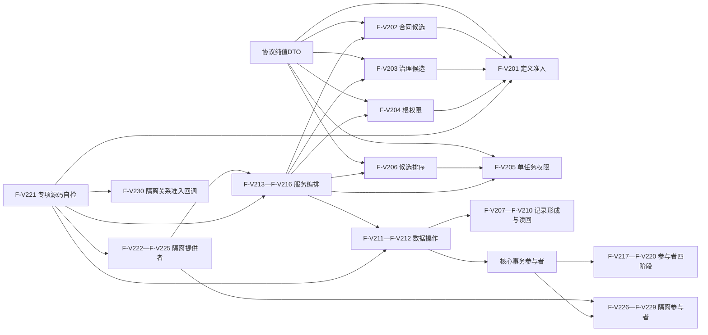
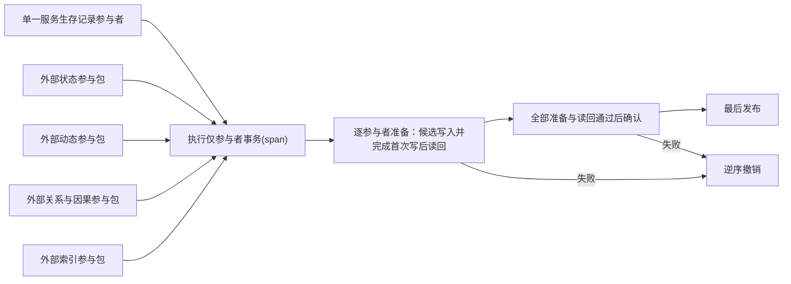

# SERVICE-SURVIVAL 服务合同、衰减与生存安全回归函数结构知识图谱

日期：2026-07-29

版本：v0.3

设计状态：现行目标知识图谱；冻结 `SERVICE-C1—C3 / v1` 的函数、结构、所有权和依赖；代码待 #379 实现。

绑定逐节点分析：`规范/详细设计/20260729_SERVICE-P1_三十函数逐函数逐节点实现分析_v0.1.md`。

绑定功能确认：`规范/详细设计/20260729_SERVICE-P1_三十函数功能确认_v0.1.md`。

## 1. 入口图


```mermaid
flowchart LR
    H["有效人类需求入口"] --> S1["服务合同服务"]
    T["自我线程"] --> S2["服务生存维护服务"]
    TM["任务管理线程"] --> S3["服务生存任务权限服务"]
    S1 --> P1["服务合同事实提供者"]
    S1 --> P2["服务生存事实提供者"]
    S2 --> P1
    S2 --> P2
    S3 --> P2
    S3 --> P3["服务任务事实提供者"]
    S1 --> D["服务生存数据操作"]
    S2 --> D
    D --> R["服务生存维护记录参与者"]
    D --> P4["服务生存外部事实参与提供者"]
    D --> X["节点直接身份结构写入执行器"]
    S3 --> SAF["SAFETY-C2 当前安全权限投影"]
```

线程只调用；领域服务裁决；数据操作组装候选；执行器最后发布；权限服务只读已发布快照。

## 2. 模块依赖图

```text
协议.服务生存维护
├─ 唯一声明三个只读事实提供者及全部值式 DTO
├─ 算法.服务合同结算
├─ 算法.服务值时间维护
├─ 算法.服务生存任务权限
├─ 参与者.服务生存维护记录
├─ 数据操作.服务生存维护
├─ 服务.服务合同
├─ 服务.服务生存维护
├─ 服务.服务生存任务权限
└─ 自检.服务值合同维护与生存权限

协议.分层安全维护
└─ 协议.服务生存维护（只读消费 #377 v0.7 真实源码候选的来源选择、权限读取结果 / 载荷；禁止复制 SAFETY DTO）

核心.执行器.节点直接身份结构写入
├─ 参与者.服务生存维护记录
└─ 数据操作.服务生存维护

参与者.服务生存维护记录
└─ 数据操作.服务生存维护

协议 + 数据操作 + 算法.服务合同结算
└─ 服务.服务合同

协议 + 数据操作 + 算法.服务合同结算 + 算法.服务值时间维护
└─ 服务.服务生存维护

协议 + 算法.服务生存任务权限
└─ 服务.服务生存任务权限

生产线程、任务管理、工程、入口、真实适配
└─ 只由 #359 后续接入
```

禁止反向依赖：

```text
协议 -> 执行器
协议 -> 数据操作 / 参与者 / 任一服务
算法 -> 仓库 / 线程 / 日志
参与者 -> 领域服务
服务 -> 线程
服务.服务合同 <-> 服务.服务生存维护
权限服务 -> 可变事务
生产模块 -> 自检模块
```

### 2.1 #379 三十个待实现根函数

| 身份 | 函数 | 模块 | 流程图 | 直接调用 |
| --- | --- | --- | --- | --- |
| F-V201 | `复核服务生存定义` | `算法.服务值时间维护` | `流程图/20260729_SERVICE-P1_F-V201_复核服务生存定义单函数施工流程图_v0.1.md` | 无 |
| F-V202 | `计算服务合同建立候选` | `算法.服务合同结算` | `流程图/20260729_SERVICE-P1_F-V202_计算服务合同建立候选单函数施工流程图_v0.1.md` | F-V201 |
| F-V203 | `计算服务生存治理候选` | `算法.服务值时间维护` | `流程图/20260729_SERVICE-P1_F-V203_计算服务生存治理候选单函数施工流程图_v0.1.md` | F-V201 |
| F-V204 | `计算安全服务根权限` | `算法.服务生存任务权限` | `流程图/20260729_SERVICE-P1_F-V204_计算安全服务根权限单函数施工流程图_v0.1.md` | F-V201 |
| F-V205 | `计算单任务根权限` | `算法.服务生存任务权限` | `流程图/20260729_SERVICE-P1_F-V205_计算单任务根权限单函数施工流程图_v0.1.md` | 无 |
| F-V206 | `排序服务生存任务执行候选` | `算法.服务生存任务权限` | `流程图/20260729_SERVICE-P1_F-V206_排序服务生存任务执行候选单函数施工流程图_v0.1.md` | F-V205 |
| F-V207 | `形成服务合同记录参与者` | `参与者.服务生存维护记录` | `流程图/20260729_SERVICE-P1_F-V207_形成服务合同记录参与者单函数施工流程图_v0.1.md` | 构造私有记录参与者 |
| F-V208 | `形成服务生存治理记录参与者` | `参与者.服务生存维护记录` | `流程图/20260729_SERVICE-P1_F-V208_形成服务生存治理记录参与者单函数施工流程图_v0.1.md` | 构造私有记录参与者 |
| F-V209 | `读取已发布服务合同结果` | `参与者.服务生存维护记录` | `流程图/20260729_SERVICE-P1_F-V209_读取已发布服务合同结果单函数施工流程图_v0.1.md` | 无 |
| F-V210 | `读取已发布服务生存治理结果` | `参与者.服务生存维护记录` | `流程图/20260729_SERVICE-P1_F-V210_读取已发布服务生存治理结果单函数施工流程图_v0.1.md` | 无 |
| F-V211 | `提交服务合同候选` | `数据操作.服务生存维护` | `流程图/20260729_SERVICE-P1_F-V211_提交服务合同候选单函数施工流程图_v0.1.md` | F-V207、F-V209、执行仅参与者事务 |
| F-V212 | `提交服务生存治理候选` | `数据操作.服务生存维护` | `流程图/20260729_SERVICE-P1_F-V212_提交服务生存治理候选单函数施工流程图_v0.1.md` | F-V208、F-V210、执行仅参与者事务 |
| F-V213 | `建立或读取服务合同` | `服务.服务合同` | `流程图/20260729_SERVICE-P1_F-V213_建立或读取服务合同单函数施工流程图_v0.1.md` | F-V202、F-V211 |
| F-V214 | `结算服务生存治理批次` | `服务.服务生存维护` | `流程图/20260729_SERVICE-P1_F-V214_结算服务生存治理批次单函数施工流程图_v0.1.md` | F-V203、F-V212 |
| F-V215 | `计算任务根权限` | `服务.服务生存任务权限` | `流程图/20260729_SERVICE-P1_F-V215_计算任务根权限单函数施工流程图_v0.1.md` | F-V204、F-V205 |
| F-V216 | `排序服务生存任务候选` | `服务.服务生存任务权限` | `流程图/20260729_SERVICE-P1_F-V216_排序服务生存任务候选单函数施工流程图_v0.1.md` | F-V204、F-V206 |
| F-V217 | `准备提交` | 私有记录参与者 | `流程图/20260729_SERVICE-P1_F-V217_准备服务生存记录提交单函数施工流程图_v0.1.md` | 无 |
| F-V218 | `确认待发布` | 私有记录参与者 | `流程图/20260729_SERVICE-P1_F-V218_确认服务生存记录待发布单函数施工流程图_v0.1.md` | 无 |
| F-V219 | `完成发布` | 私有记录参与者 | `流程图/20260729_SERVICE-P1_F-V219_完成发布服务生存记录单函数施工流程图_v0.1.md` | 无 |
| F-V220 | `完成撤销` | 私有记录参与者 | `流程图/20260729_SERVICE-P1_F-V220_完成撤销服务生存记录单函数施工流程图_v0.1.md` | 无 |
| F-V221 | `运行服务值合同维护与生存权限专项源码自检` | `自检.服务值合同维护与生存权限` | `流程图/20260729_SERVICE-P1_F-V221_运行服务值合同维护与生存权限专项源码自检单函数施工流程图_v0.1.md` | F-V201—F-V216、F-V222—F-V225 |
| F-V222 | `隔离服务合同事实提供者::读取服务合同事实` | `自检.服务值合同维护与生存权限` | `流程图/20260729_SERVICE-P1_F-V222_隔离读取服务合同事实单函数施工流程图_v0.1.md` | 无 |
| F-V223 | `隔离服务生存事实提供者::读取服务生存事实` | `自检.服务值合同维护与生存权限` | `流程图/20260729_SERVICE-P1_F-V223_隔离读取服务生存事实单函数施工流程图_v0.1.md` | 无 |
| F-V224 | `隔离服务任务事实提供者::读取服务任务事实` | `自检.服务值合同维护与生存权限` | `流程图/20260729_SERVICE-P1_F-V224_隔离读取服务任务事实单函数施工流程图_v0.1.md` | 无 |
| F-V225 | `隔离服务生存外部事实参与提供者::形成服务生存外部事实参与包` | `自检.服务值合同维护与生存权限` | `流程图/20260729_SERVICE-P1_F-V225_隔离形成服务生存外部事实参与包单函数施工流程图_v0.1.md` | 构造隔离外部事实参与者 |
| F-V226 | `隔离外部事实参与者::准备提交` | `自检.服务值合同维护与生存权限` | `流程图/20260729_SERVICE-P1_F-V226_隔离外部事实参与者准备提交单函数施工流程图_v0.1.md` | 无 |
| F-V227 | `隔离外部事实参与者::确认待发布` | `自检.服务值合同维护与生存权限` | `流程图/20260729_SERVICE-P1_F-V227_隔离外部事实参与者确认待发布单函数施工流程图_v0.1.md` | 无 |
| F-V228 | `隔离外部事实参与者::完成发布` | `自检.服务值合同维护与生存权限` | `流程图/20260729_SERVICE-P1_F-V228_隔离外部事实参与者完成发布单函数施工流程图_v0.1.md` | 无 |
| F-V229 | `隔离外部事实参与者::完成撤销` | `自检.服务值合同维护与生存权限` | `流程图/20260729_SERVICE-P1_F-V229_隔离外部事实参与者完成撤销单函数施工流程图_v0.1.md` | 无 |
| F-V230 | `允许服务生存专项隔离关系` | `自检.服务值合同维护与生存权限` | `流程图/20260729_SERVICE-P1_F-V230_允许服务生存专项隔离关系单函数施工流程图_v0.1.md` | 无 |


```mermaid
flowchart LR
    Q["协议纯值DTO"]
    V201["F-V201 定义准入"]
    V202["F-V202 合同候选"]
    V203["F-V203 治理候选"]
    V204["F-V204 根权限"]
    V205["F-V205 单任务权限"]
    V206["F-V206 候选排序"]
    R["F-V207—F-V210 记录形成与读回"]
    D["F-V211—F-V212 数据操作"]
    S["F-V213—F-V216 服务编排"]
    P["F-V217—F-V220 参与者四阶段"]
    T["F-V221 专项源码自检"]
    IP["F-V222—F-V225 隔离提供者"]
    IX["F-V226—F-V229 隔离参与者"]
    IR["F-V230 隔离关系准入回调"]
    C["核心事务参与者"]
    Q --> V201
    Q --> V202
    Q --> V203
    Q --> V204
    Q --> V205
    Q --> V206
    V202 --> V201
    V203 --> V201
    V204 --> V201
    V206 --> V205
    S --> V202
    S --> V203
    S --> V204
    S --> V205
    S --> V206
    S --> D
    D --> R
    D --> C
    C --> P
    T --> IP
    IP --> S
    IP --> IX
    C --> IX
    T --> S
    T --> D
    T --> V201
    T --> IR
```

三十函数均为待实现节点；`T --> IR` 表示 F-V221 取 F-V230 地址填入局部关系准入表，不表示运行期建立关系候选。图边不表示代码存在、编译或接线完成。

### 2.2 所有权与验证反向边

| 对象 | 唯一所有者 | 验证 |
| --- | --- | --- |
| 纯值 DTO、枚举、结果和三只读提供者 | `协议.服务生存维护` | ABI/字段/载荷静态断言 |
| move-only 外部参与项 / 载荷 / 结果 / 提供者 | `数据操作.服务生存维护` | 种类 1..4、非零稳定键、二元键严格升序、空/重复/错代/生命周期 |
| 服务记录仓、参与结果与工厂 | `参与者.服务生存维护记录` | SS-A19—A20 |
| F-V201—F-V203 | 两个合同/时间算法模块 | SS-A01—A16、A19—A22 |
| F-V204—F-V206 | 权限算法模块 | SS-A17—A18、A22 |
| F-V207—F-V210、F-V217—F-V220 | `参与者.服务生存维护记录` | 幂等、阶段、读回、撤销与最后发布 |
| F-V211—F-V212 | `数据操作.服务生存维护` | 仅参与者事务、参与顺序与发布后读回 |
| F-V213—F-V216 | 三个服务模块 | 提供者请求逐字段形成、单次读取和结构化收口 |
| F-V221 专项结果与入口 | `自检.服务值合同维护与生存权限` | SS-A01—A22 源码矩阵 |
| F-V222—F-V225 隔离提供者脚本 | `自检.服务值合同维护与生存权限` | 请求逐字段相等、耗尽 / 错序 / 复制失败、move-only 单次移动 |
| F-V226—F-V229 隔离参与者阶段 | `自检.服务值合同维护与生存权限` | 准备 / 确认故障、最后发布、逆序撤销、调用计数和零机器事实写入 |
| F-V230 隔离关系准入 | `自检.服务值合同维护与生存权限` | F-V221 24 项局部准入表统一取址；固定返回 `true`，零事实读写 |

## 3. `SERVICE-C1` 函数图

| 层 | 函数 | 输入 | 输出 | 关键不变量 |
| --- | --- | --- | --- | --- |
| 公开服务 | `建立或读取服务合同` | `服务合同建立请求` | `服务合同结果` | 一个有效来源需求只有一个合同 |
| 事实提供 | `读取服务合同事实` | 内部来源请求 | 需求、任务、方法、进展和值式事实 | 只读已发布副本 |
| F-V202 内指令 | 计算合同冻结预算、预支与余款 | 有效总秒、规则版本 | `B、P0、P1` | 宽位乘法、饱和、`P0+P1=B`；不是额外函数 |
| F-V203 内指令 | 裁决合同终态并形成到期未满足事件 | 当前合同与同秒事实 | 唯一终态 / 事件候选 | 正式发生序、只生成一次；不是额外函数 |
| F-V203 内指令 | 计算服务准备补回 | 准备结果、衰减段 | 请求 / 实际补回 | 不重复、不净增长；不是额外函数 |
| 数据操作 | `提交服务合同候选` | 合同、结算和值候选 | 发布载荷 | 写后读回、最后发布 |

### 3.1 建立合同调用链

```text
建立或读取服务合同
-> 校验幂等主键、自我、提出者、需求、值 / 定义 / 集合 / 时间 / 事实和规则首次读取条件
-> 逐字段形成合同与生存来源请求并各读取一次
-> 校验目标、范围、来源和法规准入
-> 查询同一有效期唯一合同
-> 同义重复读回；异义重复拒绝
-> 冻结显式有效期或规则默认 2,592,000 秒
-> 计算 B、P0、P1
-> 读取当前服务值和剩余空间
-> 只消费提供者返回的合同 / 预支身份版本材料，形成合同、预支结算、服务值状态、动态和幂等候选
-> 提交服务合同候选
```

### 3.2 终态与准备算法消费边界

```text
SERVICE-C2 的结算服务生存治理批次
-> 冻结同秒合同与准备事实
-> 完成 / 取消 / 终止按发生序先裁决
-> 到期判定
-> 完成支付 P1
-> 取消 / 终止 / 到期关闭 P1
-> 到期且仍未满足时形成到期未满足事件
-> 从有效未满足集合移除
-> 准备完成时计算唯一衰减段补回
-> 与本秒时间维护和安全根回归候选共同原子提交
```

`SERVICE-C1` 拥有终态与准备的纯值算法和合同语义；生产线程不得把它们作为独立公开写入口调用。这样同秒合同终态、准备补回、衰减和安全根回归不会形成三个可见中间事务。

## 4. `SERVICE-C2` 函数图

| 层 | 函数 | 输入 | 输出 | 关键不变量 |
| --- | --- | --- | --- | --- |
| 公开服务 | `结算服务生存治理批次` | `服务生存治理请求` | `服务生存治理结果` | 同秒合同终态、准备、完整秒和根回归单事务；每完整秒最多消费一次 |
| 事实提供 | `读取服务生存事实` | 内部来源请求 | 定义、当前值、安全、时间和事实游标 | 方法身份和阈值冻结 |
| F-V203 内指令 | 计算跨过完整秒数、选择最长未满足需求、裁决有效活动 | 时间 / 合同 / 准备 / 进展材料 | `N`、唯一 `t`、活动状态 | 循环次数不参与、多需求不叠加；不是额外函数 |
| F-V203 内指令 | 计算普通衰减步长和区间地板和 | `D0、t、T`、分段区间 | 宽位请求总量 | I64 安全、等价逐秒；不是额外函数 |
| F-V203 内指令 | 形成服务衰减段、映射比例并计算生存安全根回归 | 分段事实、`V、A、L、H` | 衰减段 / 根值候选 | 可审计、A 为零先保持；不是额外函数 |
| 数据操作 | `提交服务生存治理候选` | 值、状态、动态、衰减段和游标 | 发布载荷 | 全部同代次 |

### 4.1 时间维护调用链

```text
结算服务生存治理批次
-> 读取服务生存定义与当前快照
-> 核对运行代次、时间纪元和连续性
-> 计算 N
-> 同时读取合同终态、准备、到期未满足事件、安全事实和进展事实
-> N 为零但存在合同终态或准备结算时仍继续；全部均无变化才返回无变化
-> 按事实边界切段
-> 每段选择最长等待并裁决有效活动
-> 计算普通衰减或三十天目标
-> 形成可审计衰减段
-> 先应用同秒合同结算和准备补回，再应用本秒衰减
-> 若主动安全值改变则跳过被动回归
-> 否则计算服务比例与生存安全根回归
-> 提交合同终态、准备结算、服务维护和安全根候选
```

### 4.2 生存安全回归图

```text
A = 0
-> 保持终止

A 不为 0 且 V = 0
-> A 收敛为 1

V 大于 0 且 A 小于 L
-> 先除 100 后乘 P
-> 封顶 L

L 小于等于 A 且 A 小于等于 H
-> 无变化

V 大于 0 且 A 大于 H
-> 先除 100 后乘 100-P
-> 封底 H
```

## 5. `SERVICE-C3` 函数图

| 层 | 函数 | 输入 | 输出 | 关键不变量 |
| --- | --- | --- | --- | --- |
| 公开服务 | `计算任务根权限` | `任务根权限请求` | `任务根权限结果` | 多来源取最高，不求和 |
| 公开服务 | `排序服务生存任务候选` | 候选任务组 | 排序结果 | 零权限不入普通竞争 |
| 事实提供 | `读取服务任务事实` | 场景、SAFETY 来源选择、任务、图 / 集合 / 双规则版本 | 来源、任务、候选、#377 原权限结果和完整回显 | 任务名称不分类，不枚举维护族 |
| 纯值算法 | `计算安全服务根权限` | `A、L、H` | 安全根 / 服务根权限 | `A=0/1` 两者均为零；仅 `A>1` 总和恒为百万 |
| F-V205 内指令 | 精确抽取 SAFETY 权限并组合安全 / 服务来源 | 安全根、完整层 / 未归层 / 缺口、服务根 | 来源最终权限 | 完整层取 `保留权限[组-1]`，安全兼服务不重复；不是额外函数 |
| F-V205 内指令 | 计算有效执行优先级并选择最高来源 | 基础优先级、全部有效来源 | I64 排序值、主 / 并列来源 | 宽位乘除、保留全部来源；不是额外函数 |
| F-V206 内指令 | 稳定排序任务候选 | 权限载荷组 | 有序组 | 稳定收尾键完整；不是额外函数 |

```text
从公开请求逐字段形成生存来源请求并读取一次
-> 从同一公开请求逐字段形成任务来源请求并读取一次
-> 核对值 / 定义 / 进展 / 主动事实 / 纪元 / 代次 / 时间 / 场景 / 图 / 任务集合 / 双权限规则回显
-> 逐项匹配 #377 安全层来源选择与完整层 / 缺口 / 未归层材料
-> 读取当前生存安全根值与阈值
-> A=0 或 A=1 时形成两项零权限并停止普通任务排序
-> A>1 时形成总和为百万的安全根 / 服务根权限
-> 读取任务全部来源
-> 安全来源组合 6150 当前权限
-> 独立服务来源使用服务根权限
-> 安全兼服务来源只走安全路径
-> 每任务取最高来源
-> 计算有效执行优先级
-> 零权限与材料缺口分组
-> 对其余候选稳定排序
```

## 6. 记录与参与者图


```mermaid
flowchart LR
    A["单一服务生存记录参与者"] --> X["执行仅参与者事务(span)"]
    F["外部状态参与包"] --> X
    G["外部动态参与包"] --> X
    H["外部关系与因果参与包"] --> X
    I["外部索引参与包"] --> X
    X --> J["逐参与者准备：候选写入并完成首次写后读回"]
    J --> K["全部准备与读回通过后确认"]
    K --> M["最后发布"]
    J -->|失败| R["逆序撤销"]
    K -->|失败| R
```

合同 / 预支 / 终态 / 准备 / 衰减 / 维护所需稳定身份、版本、纪元和代次只来自两个事实提供者返回的身份版本材料；算法、服务、记录参与者和外部参与提供者都不得生成或递增。外部参与提供者只按完整规格形成参与包，不改变合同预算、前后值、动作方法或规则版本。数据操作总先形成单一服务记录参与者，再追加外部参与者，因此 span 始终非空；空外部包、重复参与者、错代候选和部分载荷均在执行器前拒绝。

## 7. 结构生命周期

| 结构 | 创建 / 写入者 | 读取者 | 生命周期 |
| --- | --- | --- | --- |
| 服务合同记录 | 服务合同服务 / 服务生存维护服务 + 数据操作 | 合同、维护、恢复和审计 | 新合同与预支由合同服务发布；终态由聚合维护服务发布；当前 + 历史长期保存 |
| 服务结算记录 | 服务合同服务 / 服务生存维护服务 + 数据操作 | 维护、恢复和审计 | 预支由合同服务发布；余款关闭与准备补回由聚合维护服务发布；不可变阶段记录 |
| 到期未满足事件 | 服务生存维护服务 + 数据操作 | 同秒维护、恢复和审计 | 聚合事务内发布；不可变，只消费一次 |
| 准备衰减归属 | 服务生存维护服务 + 数据操作 | 准备结算和恢复 | 聚合事务内按衰减段冻结 |
| 服务衰减段 | 服务生存维护服务 | 准备补回、恢复和审计 | 不可变聚合记录 |
| 服务生存维护账 | 服务生存维护服务 | 幂等、恢复和审计 | 不可变维护记录 |
| 当前权限投影 | 权限服务 | 任务调度 | 当前快照，可重建 |
| 派发权限历史 | #359 任务派发入口 | 任务审计和恢复 | 实际派发后不可变 |

## 8. 结果与失败图

```text
入口材料不完整
-> 入口拒绝 / 材料缺失 / 版本漂移 / 时间证据缺口
-> 零写入

前置通过且当前没有跨过完整秒、没有合同终态、没有准备结算且没有其它值变化
-> 无变化
-> 仅记录参与者事务发布可回读维护账
-> 返回当前值版本和维护账版本

精确同键同义
-> 精确重复
-> 读回既有当前版本

候选准备失败
-> 逆序撤销
-> 资源失败或结构拒绝

前置通过后读回、确认、撤销或发布不一致
-> 内部不一致
-> 停止依赖路径
```

不得用普通 `bool`、日志、异常文本、队列状态或线程状态代替结果分类。

## 9. 专项验收索引

```text
SS-A01—A08   服务合同、预算、结算、到期和准备
SS-A09—A13   时间、最长等待、三十天、活动保护和衰减段
SS-A14—A16   服务比例、生存安全控制态和回归算术
SS-A17—A18   安全 / 服务根权限与来源组合
SS-A19       原子事务、幂等、确认 / 撤销与最后发布
SS-A20       局部真实发布后的合同 / 治理阻塞读回；不冒充恢复
SS-A21       休眠与有效人类需求唤醒
SS-A22       #377 权限值式载荷和局部仓计数前后不变；静态命令另验线程 / 日志 / import 边界
```

本图谱只冻结施工函数、结构、依赖和所有权。#379 候选不得声明真实线程、工程、恢复或任务调度已接通；这些共享面只由 #359 统一实现和验收。

## 10. v0.3 修订

v0.3 从六个纯值函数扩为三十个完整根函数，新增记录工厂 / 读回、数据操作、四公开服务、生产参与者四阶段、专项入口、四个隔离提供者、隔离参与者四阶段和局部关系准入回调图谱；同步 #377 v0.7 显式来源选择、精确 SAFETY 数值提取、候选身份版本材料、类构造注入、`执行仅参与者事务(span)`、跨准备 / 确认持锁、异常分账、发布后读回，以及 F-V221 三核心仓 / 事务域 / 执行器真实构造生命周期。设计未决边、未解析提供者和待执行侧裁决项为空；执行前真实门禁仍为 #375 修订版结果满足 4040 发布见证 / 代次推进，并在回填后重跑全包终审。
