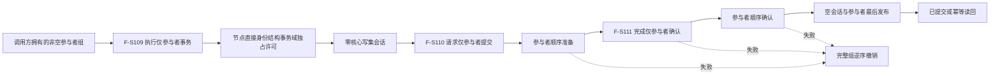

# SAFETY-P1 纯参与者事务提供者函数结构知识图谱 v0.1

日期：2026-07-29

状态：现行提供者知识图谱；合同 `CORE-C1/v1`

绑定详细设计：`规范/详细设计/SAFETY-P1_节点直接身份结构纯参与者事务提供者详细设计.md`。

## 函数节点

| 身份 | 所有者 | 可见性 | 直接消费 |
| --- | --- | --- | --- |
| F-S109 | 核心执行器模块 | public | #377 F-S108 |
| F-S110 | 核心会话模块 | private，执行器友元 | F-S109 |
| F-S111 | 核心会话模块 | private，执行器友元 | F-S109 |

普通带回调执行入口、公开 `请求提交()` 和普通 `完成确认()`不指向 F-S110/F-S111；因此不会取得空核心写集提交能力。
