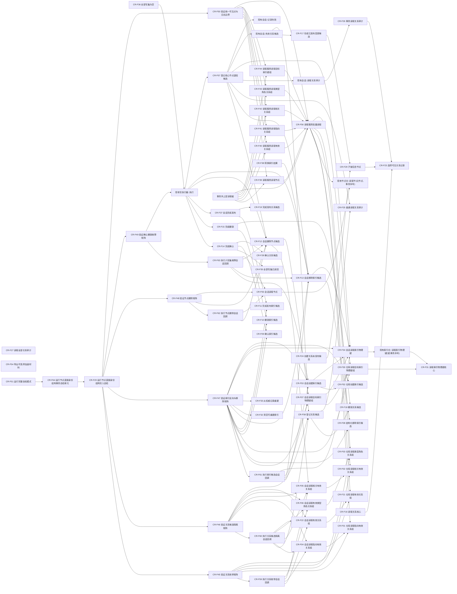

# CORE-RETIRE-P1 函数结构知识图谱

日期：2026-07-30
版本：v0.1
性质：目标知识图谱；不修改全项目当前代码图谱
根集合：CR-F01—CR-F64

## 1. 目标调用图



## 2. 正向与反向调用闭合表

| 函数组 | 允许调用方 | 具名被调方 | 禁止调用方 / 边界 |
| --- | --- | --- | --- |
| CR-F01—F03、F21 | CR-F04—F06/F22、CR-F40—F43、CR-F45/F46 | 节点仓普通读取 | 上层不得在无读取服务许可时直接跨仓组合 |
| CR-F04—F07、F22、F34 | 写执行器回调内的具名领域操作、CR-F12/F13、专项夹具 | 普通仓库视图、会话精确写集、节点仓事务读取 | 不取得共享许可；枚举不替代精确写项读回 |
| CR-F08—F11、F30—F33 | 会话、CR-F47、CR-F14/F15/F37 | CR-F31 及索引内部正反表 | 领域服务和线程不得直接形成候选 |
| CR-F12—F15、F35—F38 | 写执行器和专项夹具 | 关系/索引/节点仓具名入口 | 不逃逸会话、候选或事务序号 |
| CR-F16—F19、F23—F29 | 关系仓公开入口与专项夹具 | 关系条目和本仓私有辅助 | 不调用旧关系栈；不跨仓持锁 |
| CR-F39—F44 | 事务外上层读取者、CR-F50 | CR-F56 单项批量包装 | 会话和写执行器回调不得反向调用 |
| CR-F56 | 事务外上层读取者、CR-F39—F44、CR-F50 | 事务域一次共享许可和节点/关系/索引普通读取 | 不返回许可、仓库引用或半批结果 |
| CR-F45—F50 | CR-F20 | 本行矩阵覆盖的生产函数 | 不作为生产业务入口 |
| CR-F20 | CR-F51 | CR-F45—F50、既有27项自检 | 不直接由 `main` 或业务服务调用 |
| CR-F51 | 正式完整自检模式分派 | 自检运行器、CR-F20 | 不改变生产运行期分派 |
| CR-F52—F54 | 会话、冻结导出和 CR-F47 | 索引候选/正反表/CR-F31 | 不向旧索引栈复制状态 |
| CR-F55 | 会话调用者、CR-F48 | 节点仓事务读取、节点创建/删除写集 | 不把删除候选写后句柄伪装成已发布记录 |
| CR-F57 | 写执行器回调内的具名领域服务、专项夹具 | 会话关系审计/失效、CR-F13、CR-F12 | 不请求提交；不替代领域记录参与者或完整业务删除许可 |
| CR-F58 | 会话创建/失效/重挂关系入口 | 关系写集、CR-F25 普通审计、CR-F18 | 私有登记函数；不得被领域服务直接调用 |

## 3. 无调用边但必须独立成图的根

CR-F24—F29、CR-F32—F33、CR-F35—F38、CR-F52—F55、CR-F58 的部分调用来自现有同模块函数或本包施工步骤，不要求为现有平凡访问器建立新图；这些根仍分别拥有唯一施工图和完整函数合同。CR-F57 是 B06—B14 的具名底层生产根。每一条目标项目调用边必须同时出现在调用方图的“被调函数”与被调方图的“允许调用方”中。

## 4. 禁止边

```text
领域服务或线程 -> CR-F08—F11 候选仓库入口
会话 / 写执行器回调 -> CR-F39—F44/F56 事务外读取服务
上层 -> 仓库锁 / 事务许可 / 事务序号 / 候选 / 会话
新直接身份域 -> 旧 关系仓库 / 旧 索引仓库 / 旧 执行器.结构写入
CR-F45—F50 -> 生产业务事实或计划状态
日志宏 -> 自检通过判定、失败数量、退出码或机器事实
```
