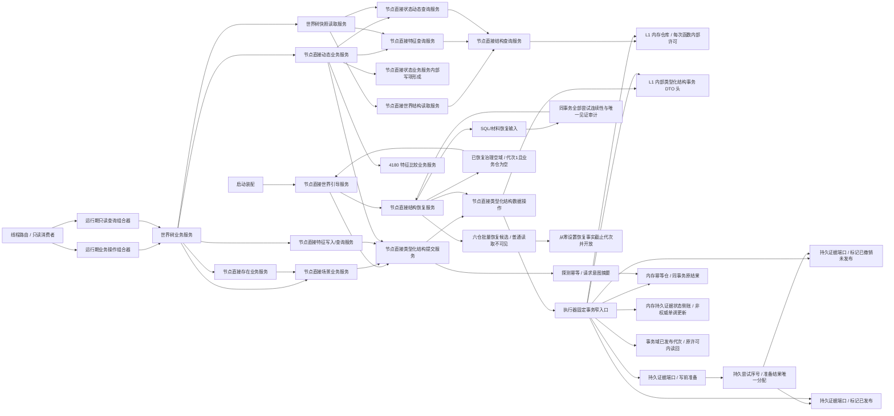

# WORLD-TREE-P1 函数结构知识图谱 v0.1

日期：2026-08-02

状态：目标设计图谱；待实现



## 1. 公开调用边

| 调用方 | 被调方 | 传入 | 返回 | 事实边界 |
| --- | --- | --- | --- | --- |
| 启动装配 | 节点直接世界引导服务 | 安装实例身份、合同/规则版本 | 恢复/创建状态、发布代次、根/初始场景读回 | 普通入口开放前；未知历史不得新建 |
| 运行期业务操作组合器 | 世界树业务服务六个写入口 | 强类型世界请求 | 世界树写入结果 | 不解释结果、不直达 L1 |
| 运行期只读查询组合器 | 世界树业务服务三个读入口 | 强类型读取请求 | 整树入口返回 `世界树读取结果`；存在入口返回 `世界树存在读取结果`；场景入口返回 `世界树场景读取结果` | 不缓存、不从 SQL 补缺；单对象结果不伪装为完整整树快照 |
| 世界树业务服务 | 节点直接存在/场景/特征/状态动态服务 | 稳定身份请求或不可变规格 | 原发布代次和操作专属读回 | 原事实所有者不变；不调用旧结构栈 |
| 世界树快照读取服务 | 世界结构/特征/状态动态查询服务 | 值式稳定身份组 | 各自非零代次和值式材料 | 首末代次完全相等；漂移整轮重试一次 |
| L2 具名领域服务 | 节点直接类型化结构提交服务 | 版本化强类型纯值写集 | 发布代次和值式读回 | 参与者和事务控制由 L1 内部固定 |
| 节点直接类型化结构提交服务 | 节点直接类型化结构数据操作 | 版本化纯值服务请求 | 数据操作结构化结果 | 提交服务不 import 执行器；提交/恢复服务与数据操作/执行器共同 include 唯一内部 DTO 头，L2 禁止 include |
| 节点直接类型化结构数据操作 | 执行器固定事务窄入口 | 中性写入/恢复规格、读回规格、幂等身份 | 通用读回、原发布代次、持久状态 | 不接受外部回调或参与者；许可释放前完成读回 |
| L2 具名领域服务 | 节点直接类型化结构提交服务::探测幂等 | 幂等身份、公开请求意图摘要 | 未找到/同义原结果/异义/隔离/许可 | 在读取可变提供者前可先行收敛，不查 SQL |
| 固定事务入口 | 持久证据端口 | 计划稳定身份、预计代次、确定性写集材料 | 已准备/精确同义及非零尝试序号，或结构化非成功 | 先只读计算；保存尝试序号和临时侧账后才建立内存候选 |
| 固定事务入口 | 持久证据端口::标记已撤销未发布 | 同次准备返回的尝试序号、双摘要、完整写集 SHA-256 | 成功/精确同义或结构化非成功 | 候选失败且完整撤销后仍在原独占许可内调用；非成功隔离 |
| 固定事务入口 | 持久证据端口::标记已发布 | 同次准备返回的尝试序号、发布代次和结果摘要 | 已见证/精确同义或结构化非成功 | 只在内存发布及原许可读回后调用；未知不回滚内存事实 |
| 节点直接结构恢复服务 | 持久恢复材料端口 | 安装实例身份 | 按事务身份、尝试序号审计后的完整尝试组 | 已撤销尝试只审计；断序、多个见证、已准备或未知保持隔离 |

## 2. 禁止边

```text
世界树业务服务 -X-> 仓库 / SQL / 材料 / 锁 / 令牌 / 会话
L2 领域服务 -X-> 参与者指针 / 发布后回调 / 事务视图
线程路由 -X-> 领域数据操作 / L1 提交服务
快照读取服务 -X-> 跨服务共享许可 / SQL / 部分结果拼接
世界树门面 -X-> 旧世界服务.h / 旧存在场景状态动态栈
```

## 3. 版本和所有权

- 世界协议合同版本、L1 结构服务合同版本、世界引导合同版本、写集规则版本均从 `1` 开始并分别审计。
- 快照由调用方拥有；服务内部引用由唯一运行期装配拥有且覆盖全部同步请求。
- 代次由 L1 事务域拥有；对象版本由各事实领域拥有；两者不得混同。
- 类型合同、类型化值历史和原事务幂等结果分别由三个 L1 内存仓拥有；幂等仓另含按事务身份及持久尝试序号单调更新的非权威持久证据状态侧账。尝试序号由持久端口分配，只用于证据审计，不是业务身份或代次。SQL 只保存持久证据和恢复输入，运行期不回查裁决。
- 节点直接结构查询服务同时注入类型合同仓与类型化值仓；L1 稳定共享值、索引物理键、持久证据状态及公开业务中性写项/端点引用/读回规格只定义在 `核心/节点直接结构合同.数据.h`；合法 L2 只能用这些纯值原语构造提交服务公开请求，不能取得内部事务能力。L2 世界稳定事实只定义在 `领域/世界树事实.数据.h`，各服务按值复用。
- `节点直接类型化结构提交服务`、公开提交/探测请求与包装结果唯一归 `海中鱼巣.核心.服务.节点直接类型化结构提交`；`节点直接结构恢复服务`、恢复请求与包装结果唯一归 `海中鱼巣.核心.服务.节点直接结构恢复`；提交服务/恢复服务—数据操作—执行器共享的中性请求/规格/结果、恢复 DTO 和计划身份映射唯一归 `核心/节点直接类型化结构事务.数据.h`，四个 L1 模块共同 include 且不得复制声明，L2 禁止 include。查询服务只为现有事务域/读取许可 import 执行器模块，不构造或调用写入执行器。数据操作模块拥有写编排和恢复解码，执行器模块拥有许可内计划身份、确定性编码/SHA-256 和固定事务；两者都不声明服务类、不建立跨模块 friend。六仓共享恢复状态唯一归 `节点直接结构合同.数据.h`，每个 move-only 恢复候选结果在所属仓内、候选完整定义后声明。幂等记录与全部参与者一起最后发布；已隔离记录在聚合恢复 DTO 前拒绝，只保留隔离审计；发布后读回矛盾只隔离事务域，不二次改写幂等事实。
- 六仓恢复候选、结果、权威材料和暂存容器分别归各现有仓模块；执行器只按稳定材料构造它们并固定编排，不取得仓锁或容器。事务域分账 `等待恢复/普通开放/故障隔离`：恢复许可只在等待恢复且代次 0 时成立，普通许可只在开放后成立，故障隔离拒绝全部许可。六仓全部发布后，执行器才调用事务域私有 `从零设置恢复事实截止代次并开放`；该调用是恢复可见性的唯一线性化点。
- 多个 L2 服务共享的世界事实值唯一归 `海中鱼巣.领域.世界树事实.数据`；服务专属请求/结果随服务模块，状态动态私有写项随数据操作模块，不存在汇总服务实体的 `协议.世界树`。
- 节点/关系内部句柄只在单个 L1 服务函数许可内存在；所有跨服务边只传稳定身份见证和强类型值。
- 旧 `世界服务.h` 的 12 个直接消费者和 2 个间接受影响消费者迁移分别由其事实所有者的独立稳定身份迁移包拥有；旧头文件自身不计入消费者。P1D 只在这些前置结果进入当前代码基线后拥有生产接线、残余引用清除和头文件删除。其它旧单领域服务不在本目标内顺带删除。
- 此图谱只描述目标结构，不宣称节点或边已在当前代码存在。
