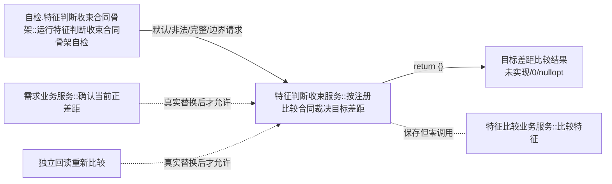
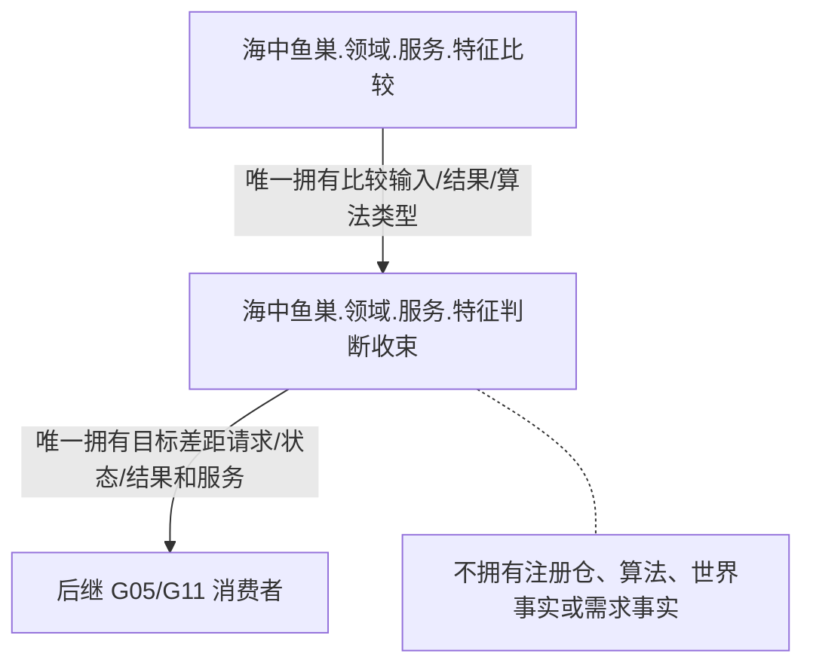

# SELF-GOV-G05-F1 目标差距比较收束合同骨架函数结构知识图谱 v0.1

日期：2026-08-03

## 1. 唯一根

```text
目标差距比较结果 海中鱼巣::特征判断收束服务::按注册比较合同裁决目标差距(
    const 目标差距比较请求& 请求) const noexcept
```

定义位置：`海中鱼巣/领域/服务.特征判断收束.ixx`。公开定义数必须为1，重载数必须为0。

## 2. 骨架调用图



## 3. 边表

| 调用方 | 被调方 | 类别 | 骨架要求 | 后继条件 |
| --- | --- | --- | --- | --- |
| 专属自检 | 根函数 | 直接自检 | 至少四类请求 | 只消费未实现 |
| 根函数 | 任意项目函数 | 生产调用 | 0 | 不适用 |
| 根函数 | COMPARE-F | 成员调用 | 0 | COMPARE-R真实替换后才可形成 |
| G05/G11 | 根函数 | 生产调用 | 0 | 根函数真实结果进入正式代码后 |

服务构造保存的 `特征比较业务服务&` 是生命周期依赖，不是本骨架根函数的调用边；聚合统计中 COMPARE-F 出边必须为0。

## 4. 类型所有权



## 5. 禁止图

```text
特征判断收束 -X-> 需求服务
特征判断收束 -X-> 世界树/状态/特征事实读取服务（COMPARE-F除外）
特征判断收束 -X-> 数据操作/仓库/索引/事务/许可/会话/锁
特征判断收束 -X-> SQL/材料/缓存/日志/时钟/线程
特征判断收束 -X-> COMPARE-F类型复制或有损摘要
```

## 6. 聚合不变量

| 不变量 | 要求 |
| --- | --- |
| 根身份 | 完整限定定义恰一 |
| ABI | DTO字段顺序、整数宽度、状态1—11稳定 |
| 构造 | 唯一非拥有 `特征比较业务服务&`；不可复制移动 |
| 骨架结果 | 未实现、零身份、零代次、空比较结果 |
| 调用边 | 自检到根存在；根到项目函数为0 |
| 事实 | 调用前后全部权威事实和发布代次不变 |
| 消费者 | 未实现后成功后继调用数0 |
| 参数读取 | 根函数形参不命名；字段读取数0 |
