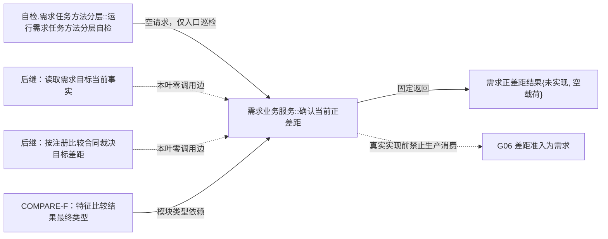

# SELF-GOV-G05 正差距确认合同骨架函数结构知识图谱 v0.1

日期：2026-08-03

## 根身份

```text
SG-G05-F0-001
需求正差距结果 海中鱼巣::需求业务服务::确认当前正差距(
    const 需求正差距请求& 请求) const
模块：海中鱼巣.领域.服务.需求
文件：海中鱼巣/领域/服务.需求.ixx
形态：public const 成员函数
状态：目标待新增；骨架固定未实现
```

## 目标调用图



## 边表

| 调用方 | 被调方 | 类别 | 本叶状态 | 参数 / 结果 | 事实边界 |
| --- | --- | --- | --- | --- | --- |
| 运行需求任务方法分层自检 | 确认当前正差距 | 直接、自检 | 待新增 | `{}` -> 固定未实现 | 调用前后结构数量相等 |
| 确认当前正差距 | 任意项目函数 | 生产直接调用 | 固定为 0 | 不适用 | 零读取、零写入 |
| 生产自我治理消费者 | 确认当前正差距 | 生产直接 | 待激活 | 只有真实实现后允许 | 骨架不解除依赖 |

## 类型所有权

```text
海中鱼巣.领域.服务.需求
  独占：需求正差距请求身份、需求正差距请求、需求正差距载荷、需求正差距结果、需求正差距状态和合同版本
海中鱼巣.领域.服务.特征比较
  复用：特征比较算法族、特征比较结果及其完整子结构
海中鱼巣/核心/节点直接结构合同.数据.h
  复用：节点稳定身份见证、类型合同稳定身份
```

不得在需求服务中复制或压缩比较 DTO；不得在世界树服务、自检模块或线程模块重复声明上述需求 DTO。

## 聚合一致性

- 本文件是目标设计知识图谱，不写入或改写全项目当前代码知识图谱。
- 骨架实现后当前代码图谱由专属维护智能体按已发布代码另行更新。
- `未实现` 节点不计入真实 G05 能力完成数。
