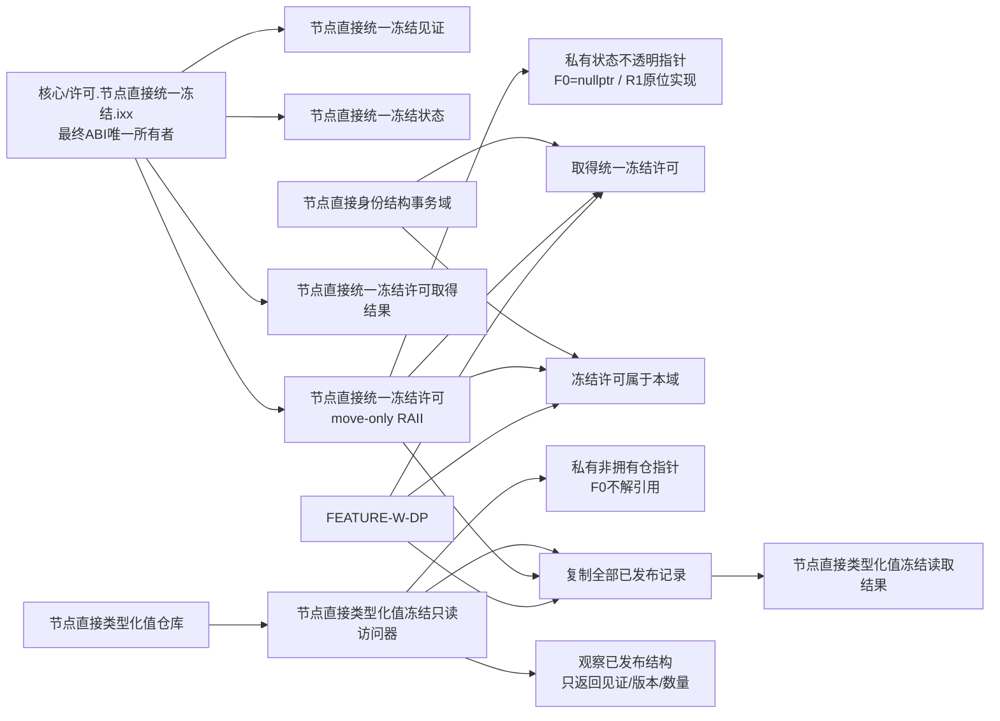
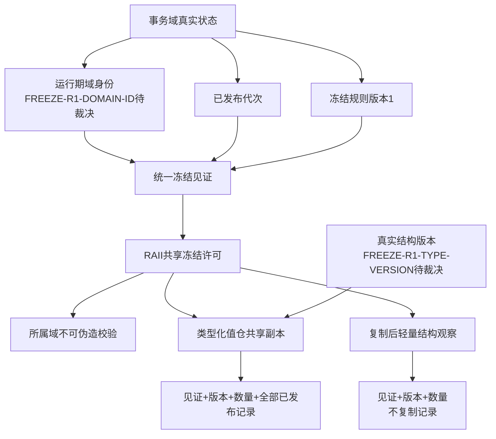
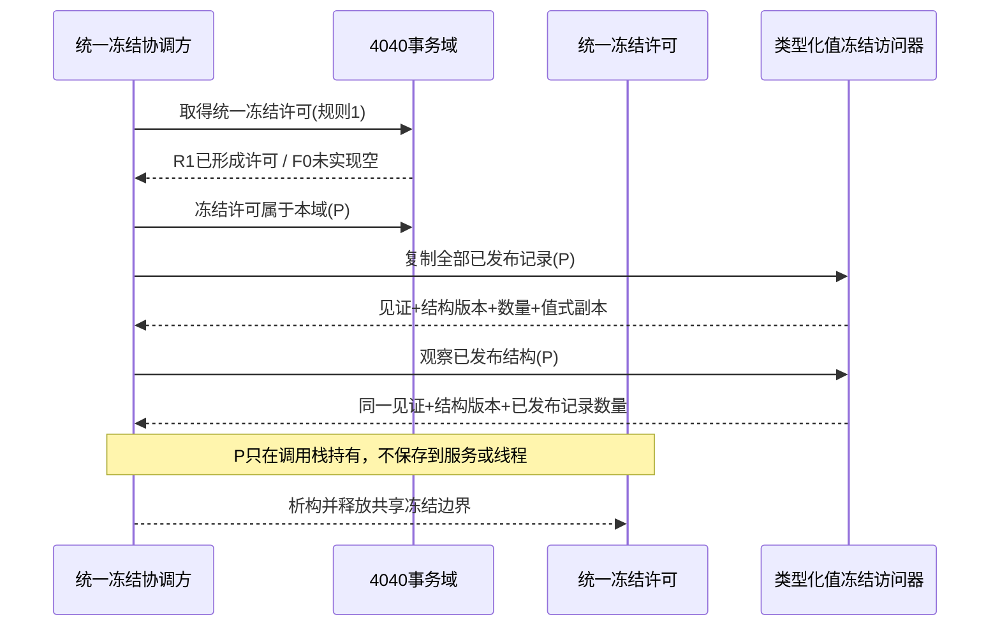

# WORLD-TREE-CORE-FREEZE-DP 统一4040冻结许可与真实结构见证提供者函数结构知识图谱 v0.2

创建侧正式基线：`30dc5df188ecc0b2f1cb7e0c719fbe21dbdb1803`



## F0调用图

```text
取得统一冻结许可(any)
└─ 返回 {未实现, nullopt}

冻结许可属于本域(any)
└─ 返回 false

节点直接统一冻结许可::有效()
└─ 返回 false

节点直接统一冻结许可::读取见证()
└─ 返回 {0,0,0}

节点直接类型化值冻结只读访问器::复制全部已发布记录(any)
└─ 返回 {未实现, nullopt}

节点直接类型化值冻结只读访问器::观察已发布结构(any)
└─ 返回 {未实现, nullopt}
```

F0没有事务域成员读取、shared_mutex调用、仓导出、容器复制、SQL、日志或机器事实写入边。F0保留固定大小的不透明私有状态指针但不分配；R1不得通过新增许可成员改变对象布局。

## R1目标图与未决门禁



| 未决身份 | 必须裁决 | 禁止补位 |
| --- | --- | --- |
| `FREEZE-R1-DOMAIN-ID` | 签发来源、唯一范围、失败、恢复 | 地址、随机猜测、调用方值、安装日志 |
| `FREEZE-R1-TYPE-VERSION` | 初值、推进粒度、溢出、恢复 | 4040代次、最大值版本、记录数量 |
| `FREEZE-R1-ISOLATION` | 损坏见证的隔离收口 | 静默返回普通竞争 |

## 生命周期



## 禁止边

```text
许可模块 -X-> 类型化值仓/领域/SQL
类型化值冻结访问器 -X-> 自行取得第二许可
上层 -X-> 锁守卫/互斥/原子/仓容器/可写事务许可
结构版本 -X-> 最大记录版本/记录数量/SQL水位
统一冻结 -X-> 全仓万能冻结/外设冻结/全进程暂停
F0 -X-> FEATURE-W-DP门禁解除
```
