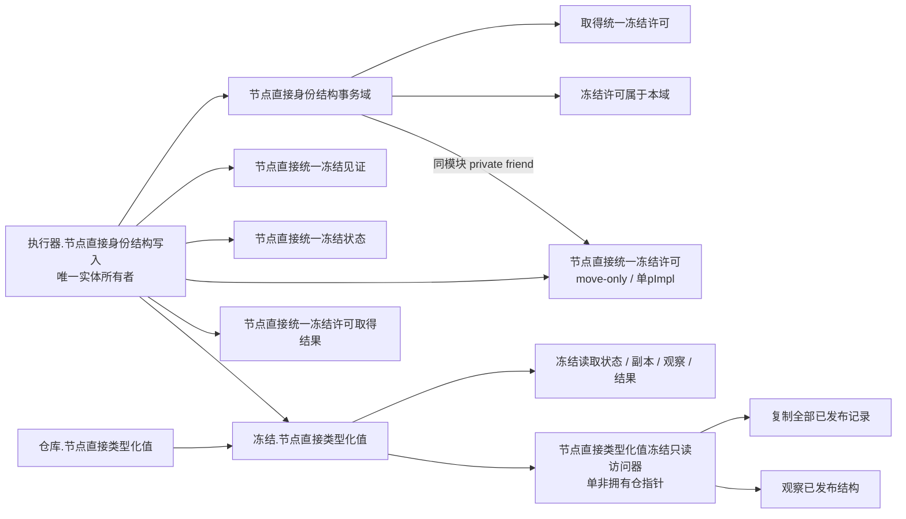
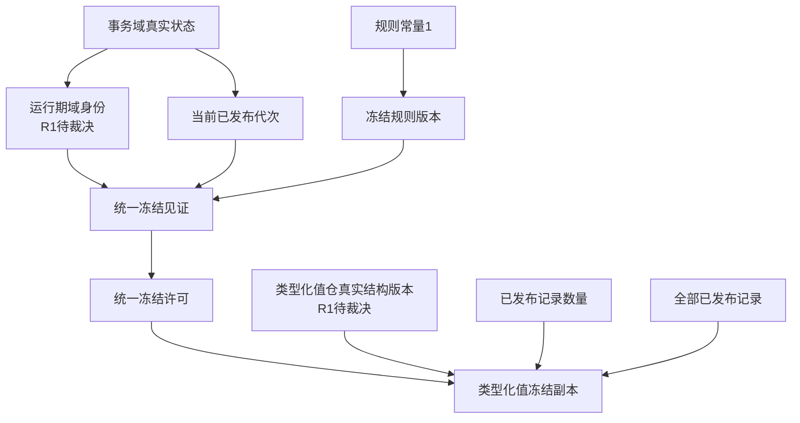
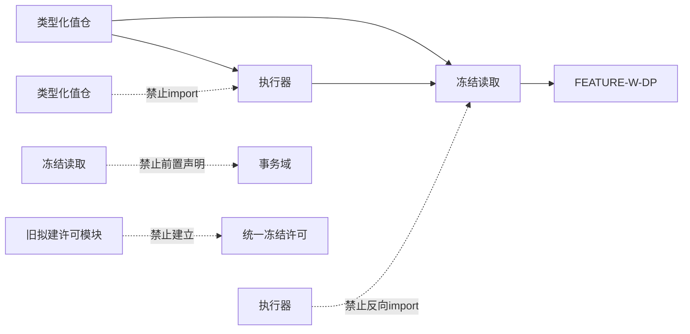
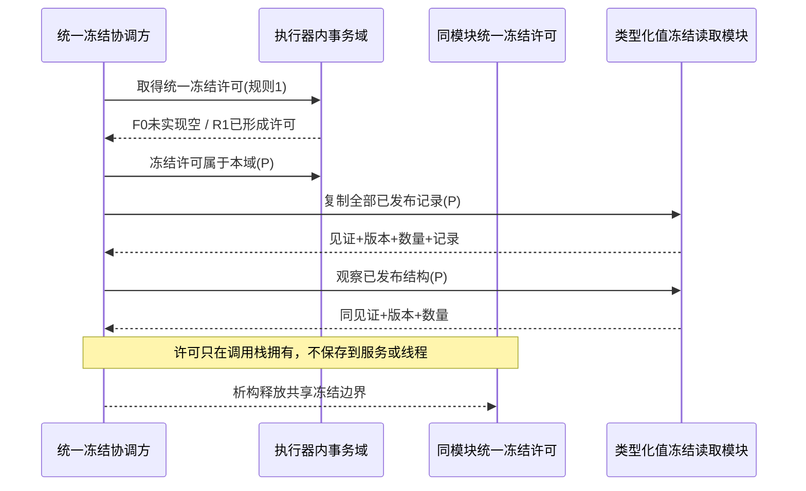

# WORLD-TREE-CORE-FREEZE-DP 统一4040冻结许可与真实结构见证提供者函数结构知识图谱 v0.3

修订基线：`dd497341216b05e2d4b55af6afa1df5402882cc3`

## 所有权图



## F0 调用图

```text
事务域::取得统一冻结许可(any)
└─ 返回 {未实现, nullopt}

事务域::冻结许可属于本域(any)
└─ 返回 false

统一冻结许可::有效()
└─ 返回 false

统一冻结许可::读取见证()
└─ 返回 {0,0,0}

冻结访问器::复制全部已发布记录(any)
└─ 返回 {未实现, nullopt}

冻结访问器::观察已发布结构(any)
└─ 返回 {未实现, nullopt}
```

F0 没有事务域成员读取、锁、仓导出、SQL、日志、恢复或事实写入边。访问器构造仅保存仓地址。

## 提供者—消费者矩阵

| 合同 | 唯一提供者 | 直接消费者 | F0 | R1 |
| --- | --- | --- | --- | --- |
| 统一冻结许可 / 见证 | 执行器内事务域 | 统一冻结协调方 | 未实现空 | 真实许可 |
| 所属域判断 | 执行器内事务域 | FEATURE-W-DP 协调方 | false | 私有归属校验 |
| 类型化值全量副本 | 冻结读取模块访问器 | FEATURE-W-DP 数据操作 | 未实现空 | 全部已发布记录 |
| 类型化值轻量观察 | 冻结读取模块访问器 | FEATURE-W-DP 复制后复核 | 未实现空 | 版本 / 数量 / 见证 |

## 逐字段来源



## 依赖与禁止图



## 生命周期



## 未决门禁

| 身份 | 必须裁决 | 禁止补位 |
| --- | --- | --- |
| `FREEZE-R1-DOMAIN-ID` | 签发、唯一范围、失败、恢复 | 地址、随机、调用方值、SQL |
| `FREEZE-R1-TYPE-VERSION` | 初值、推进粒度、溢出、恢复 | 4040代次、最大记录版本、数量 |
| `FREEZE-R1-ISOLATION` | 损坏见证的隔离收口 | 静默竞争或普通失败 |

v0.3 已闭合 ABI friend 所有权；上述三项仍只门控 R1 真实行为，不阻断 F0 固定未实现骨架。
