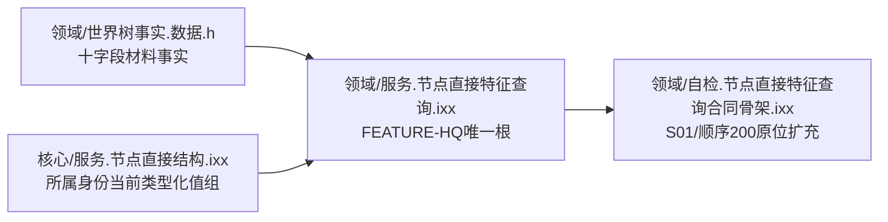
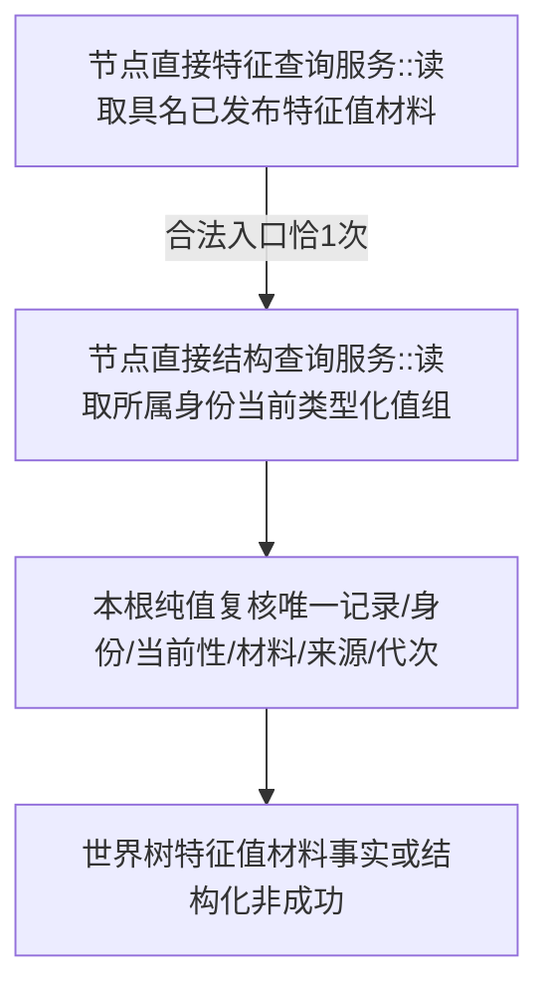
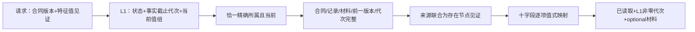

# WORLD-TREE-FEATURE-HQ 具名已发布特征值材料真实读取函数结构知识图谱 v0.1

日期：2026-08-03

设计身份：WORLD-TREE-FEATURE-HQ

## 1. 模块与所有权



FEATURE-HQ只替换P1BF v0.4第二函数体和同一专项自检，不修改共享头、DTO、构造、工程或启动聚合。

## 2. 唯一调用图



非法入口L1调用0。无第二provider、回调或递归边。

## 3. 数据方向



## 4. 状态和禁止边

| L1/本层事实 | FEATURE-HQ结果 |
| --- | --- |
| 非法请求 | 入口拒绝 |
| L1未找到/入口拒绝/版本漂移/许可拒绝/资源失败/内部不一致 | 同名映射 |
| L1成功零代次 | 内部不一致 |
| 同键异完整身份 | 版本漂移 |
| 多记录、记录/材料/来源矛盾 | 内部不一致 |
| 唯一完整记录 | 已读取 |

```text
FEATURE-HQ -X-> SQL/ODBC/持久材料/缓存/日志/时钟
FEATURE-HQ -X-> 4170批次记录、批次引用或批次侧账
FEATURE-HQ -X-> 旧特征服务/数据操作/句柄栈
FEATURE-HQ -X-> 仓库/事务域/许可/锁/写服务
FEATURE-HQ -X-> 宿主组FEATURE-Q函数
```

## 5. 机器不变量

| 不变量 | 证明 |
| --- | --- |
| 根函数唯一 | 完整限定签名源码定义1 |
| L1调用固定 | 非法0，合法恰1；参数精确为请求稳定主键 |
| 单一事实截止 | 只接受L1非零代次，不事后拼接 |
| 领域基数 | 值组恰1，不取首项或猜合同 |
| 身份版本 | 同键异完整身份返回版本漂移 |
| 来源边界 | 仅完整存在节点；服务来源拒绝 |
| 字段零推断 | 十字段与读回逐项相等 |
| 零副作用 | 权威仓、账和代次调用前后相等 |
| 自检不增 | S01/200原位扩充，顶层数量21保持21 |

## 6. 依赖和完成边界

P1BF v0.4 只有计划合同时，本图是待激活目标结构。必须等其代码结果进入正式main后原位施工。本图不证明FEATURE-Q、4170、特征写入、比较、状态动态、完整快照或服务验收完成。
