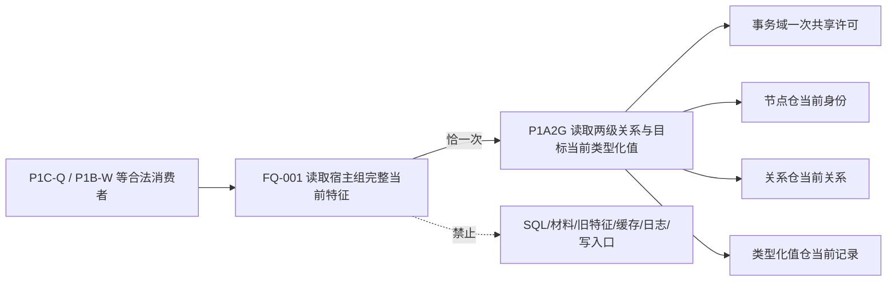

# WORLD-TREE-FEATURE-Q 当前完整特征真实读取函数结构知识图谱 v0.1

日期：2026-08-03

设计身份：WORLD-TREE-FEATURE-Q

状态：正式设计；代码待实现

## 1. 根与物理身份

```text
FQ-001 节点直接特征查询服务::读取宿主组完整当前特征
├─ 模块：海中鱼巣.领域.服务.节点直接特征查询
├─ 文件：海中鱼巣/领域/服务.节点直接特征查询.ixx
├─ 可见性：public export class member
├─ 形态：const noexcept
├─ 输入：const 节点直接宿主组特征读取请求&
├─ 输出：节点直接特征组读取结果（prvalue/调用方拥有）
└─ 事实副作用：0
```

## 2. 唯一调用图



FQ-001 不直接调用事务域或仓库，不调用其它 L1 单项读取，不调用自己或任何回调。

## 3. 数据变换图

```text
请求.头.世界根 + 请求.宿主组
-> P1A2G.必须节点组 / 根节点组

关系22角色1（宿主 -> 实例槽）
-> 世界树特征事实.{宿主,实例槽,宿主关系}

关系22角色2（实例槽 -> 抽象定义）
-> 世界树特征事实.{特征定义,定义关系}

关系22角色3（实例槽 -> 特征值）
-> 世界树特征事实.{当前值,当前值关系}

角色3目标的唯一当前类型化值读回
-> 世界树特征事实.{原始值类型合同身份,原始值类型合同版本,
                    原始值记录身份,原始值版本,前一原始值版本,
                    原始值,来源存在,首次发布代次,当前状态发布代次}
```

## 4. 控制节点

| 节点 | 决策 | 成功后继 | 非成功 |
| --- | --- | --- | --- |
| Q01 | 请求准入 | 形成P1A2G请求 | 入口拒绝 |
| Q02 | P1A2G状态 | 解释角色22 | 固定状态映射 |
| Q03 | 角色1完整性 | 建槽表 | 特征槽缺项 |
| Q04 | 角色2完整性 | 绑定定义 | 特征定义缺项 |
| Q05 | 角色3完整性 | 绑定当前值 | 特征当前值缺项 |
| Q06 | 目标值读回完整性 | 形成事实 | 特征当前值缺项 |
| Q07 | 宿主+定义唯一性 | 排序 | 特征槽缺项 |
| Q08 | 缺项是否为空 | 已读取 | 内部不一致+缺项 |
| Q09 | 异常分类 | 无 | 资源失败/内部不一致空结果 |

## 5. 身份、版本和排序

| 对象 | 唯一身份键 | 版本用途 | 排序键 |
| --- | --- | --- | --- |
| 节点 | 节点稳定主键 | 内容匹配/冲突 | 命名域、键值、身份版本 |
| 关系 | 关系稳定主键 | 内容匹配/冲突 | 命名域、键值、关系版本 |
| 类型化值记录 | 值记录稳定身份 | 当前记录和冲突 | 命名域、键值、值记录版本 |
| 特征事实 | 宿主+定义+实例槽稳定身份 | 同键异内容冲突 | 宿主、定义、槽三段键 |

版本不进入去重身份键。相同稳定身份、不同版本或其它字段不同均为内部不一致，不作为两个事实返回。

## 6. 状态传播图

```text
P1A2G成功 + 业务完整 -> 已读取 / 非零代次 / 完整特征 / 空缺项
P1A2G未找到         -> 未找到 / 原代次 / 空 / 空
P1A2G入口拒绝       -> 入口拒绝 / 0 / 空 / 空
P1A2G版本漂移       -> 版本漂移 / 原非零代次 / 空 / 空
P1A2G许可拒绝       -> 许可拒绝 / 0 / 空 / 空
P1A2G资源失败       -> 资源失败 / 0 / 空 / 空
P1A2G内部不一致     -> 内部不一致 / 0 / 空 / 空
业务缺项            -> 内部不一致 / 原非零代次 / 空 / 稳定缺项
bad_alloc/length_error -> 资源失败 / 0 / 空 / 空
其它异常            -> 内部不一致 / 0 / 空 / 空
```

## 7. 所有权和生命周期

```text
请求：调用期间const借用；FQ-001不保存
结构_：装配宿主持有且长于服务；FQ-001只同步调用一次
P1A2G结果：FQ-001局部按值拥有
索引/缺项/特征构造容器：FQ-001局部拥有
返回：调用方拥有
许可/锁：只在P1A2G内部；不得进入FQ-001或返回DTO
```

## 8. 修改与验证归属

```text
生产函数体：领域/服务.节点直接特征查询.ixx
专项：领域/自检.节点直接特征查询合同骨架.ixx
顶层身份：沿用 WORLD-TREE-P1BF-S01 / 顺序200
共享DTO、构造、工程、启动：只读，不修改
```

源码闭包必须证明 FQ-001 直接成员调用仅 `结构_.读取两级关系与目标当前类型化值` 一次，
写入/许可/仓库/SQL/材料/旧特征/日志/回调及未解析调用均为0。
