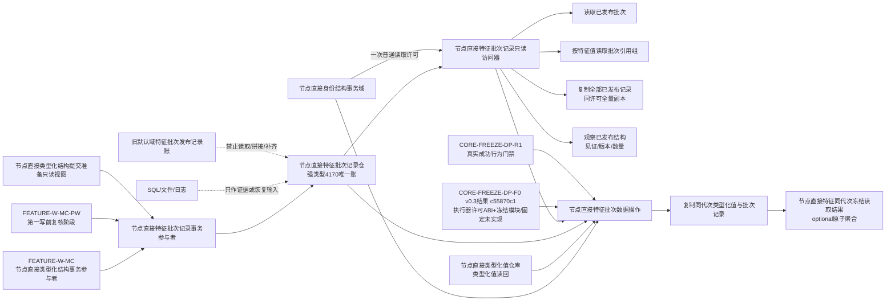
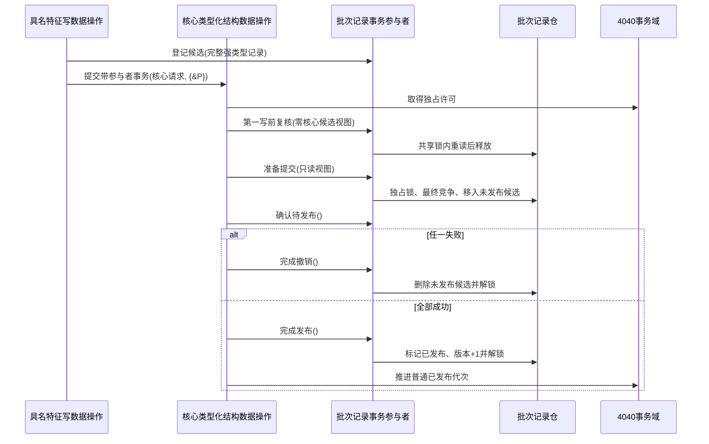
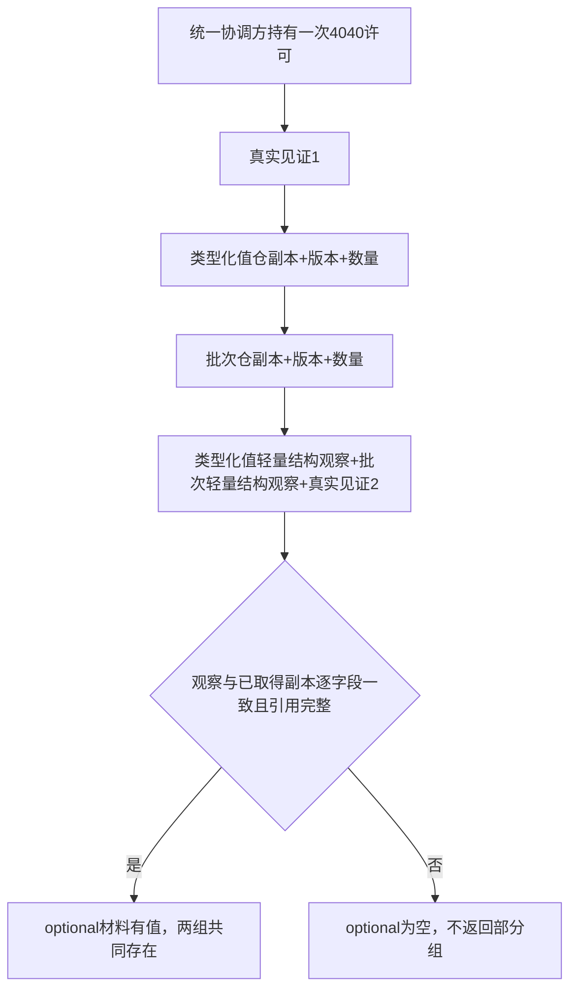

# WORLD-TREE-FEATURE-W-DP 特征批次账与领域事务参与者提供者函数结构知识图谱 v0.1

重做设计正式基线：`78418dc55002840a4c7efba25409e71d1dfa7ee5`

状态：待激活；图中“统一冻结合同”是具名后继门禁，不表示当前代码已实现。



## 类型所有权

```text
海中鱼巣.领域.参与者.节点直接特征批次记录
├─ 节点直接特征批次身份
├─ 节点直接特征批次项目种类
├─ 节点直接特征批次项目
├─ 节点直接特征批次记录
├─ 节点直接特征批次数据状态
├─ 节点直接特征批次引用
├─ 三类精确读写结果
├─ 节点直接特征同代次冻结材料/结果
├─ 节点直接特征批次记录仓
├─ 节点直接特征批次记录只读访问器
└─ 节点直接特征批次记录事务参与者

海中鱼巣.领域.数据操作.节点直接特征批次
└─ 节点直接特征批次数据操作
   ├─ 读取已发布批次
   ├─ 按特征值读取批次引用组
   └─ 复制同代次类型化值与批次记录
```

## 调用和生命周期



仓先于参与者、访问器和数据操作构造，后于三者析构。参与者由一次上层写调用栈拥有；数据操作只借用事务域、类型化值仓和批次仓，不保存许可、span、仓内迭代器或参与者地址。两个普通读取根由数据操作先取得事务域读取许可并持有到批次仓副本完成，因此参与者完成发布到4040代次推进之间没有普通可见窗口。

## 两个反向读取不变量

| 根 | 锁 | 成功 | 非成功 |
| --- | --- | --- | --- |
| `读取已发布批次` | 批次仓一次共享锁 | 唯一完整记录或合法未找到，均带真实版本 | 零记录、版本0 |
| `按特征值读取批次引用组` | 批次仓一次共享锁 | 新值XOR写前值命中；同项目至多一次；稳定排序 | 双角色命中、坏记录或资源失败均零引用、版本0 |

## 统一冻结依赖图



`节点直接统一冻结许可/见证` 与所属域根由执行器模块拥有；类型化值冻结DTO/访问器由 `海中鱼巣.核心.冻结.节点直接类型化值` 拥有。F0 v0.3 已发布但真实行为尚不存在。禁止把F0未实现、普通 `节点直接身份结构读取许可`、当前代次、仓向量大小或最大批次编号拼成真实成功合同。

R1前置不是一个泛称依赖，而是三个仍待用户裁决的语义节点：运行期域身份、类型化值仓结构版本、损坏隔离责任。三者必须先进入R1正式设计和真实代码；本图不为它们创建推导边。

错误边保持结构化：F0/R1 `未实现` -> 领域 `未实现(12)`；普通读取许可无效 -> `许可拒绝`；有效普通许可后的批次仓竞争 -> `许可竞争`；有效统一冻结许可后的子仓竞争或见证漂移 -> `内部不一致`。所有非成功都不携带业务载荷。

## 禁止边

```text
批次仓 -X-> 原始值本体副本
批次仓 -X-> 第四来源关系
批次仓 -X-> 无类型I64/variant通用值槽
数据操作 -X-> 自行取得第二冻结许可
冻结桥 -X-> 两个独立optional
新域账 -X-> 旧默认域账/SQL/日志回源
领域参与者 -X-> L2、I/O、日志或反向进入核心事务
```
