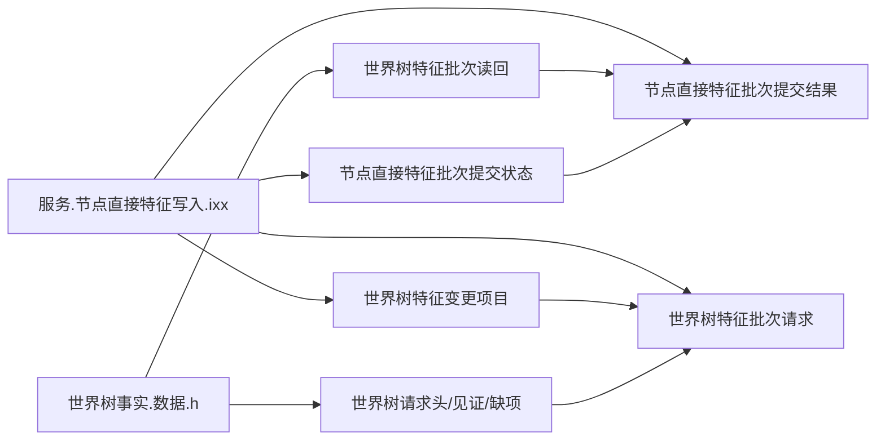
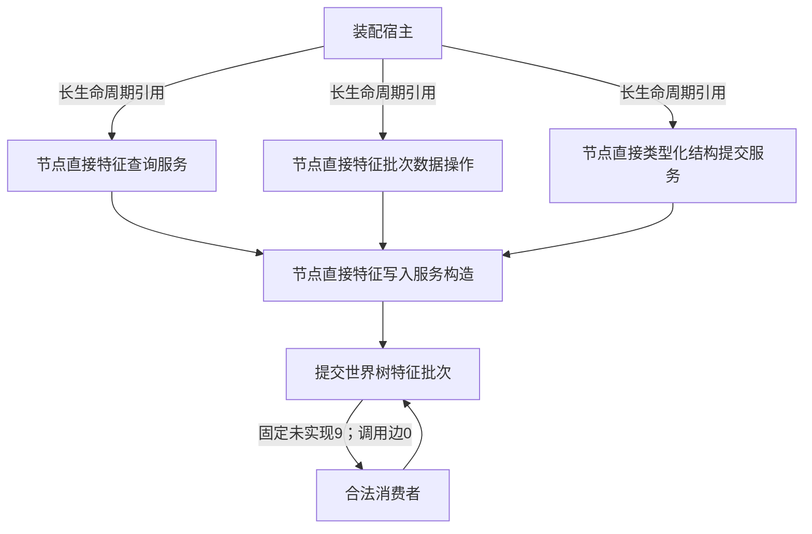

# WORLD-TREE-FEATURE-W-F 特征写入最终合同骨架函数结构知识图谱 v0.1

日期：2026-08-03

## 1. 根与物理归属

```text
WORLD-TREE-FEATURE-W-F
└─ 海中鱼巣.领域.服务.节点直接特征写入
   └─ 节点直接特征写入服务::提交世界树特征批次(const 世界树特征批次请求&) const noexcept
```

| 身份 | 物理位置 | 层级 | 现状 | 写所有者 |
| --- | --- | --- | --- | --- |
| 共享批次读回 | `领域/世界树事实.数据.h` | L2纯值事实 | 待新增 | FEATURE-W-F |
| 写请求/结果/服务 | `领域/服务.节点直接特征写入.ixx` | L2领域服务 | 待新增 | FEATURE-W-F |
| 骨架自检 | `领域/自检.节点直接特征写入骨架.ixx` | 自检 | 待新增 | FEATURE-W-F |

## 2. DTO 依赖图



## 3. 构造与调用图



骨架根函数没有项目内被调函数。三项构造依赖只为最终 ABI 保留，函数体对它们的调用数均为0。

## 4. 函数合同追踪

| 函数 | 唯一职责 | 参数 | 返回 | 读写 | 非成功 / 内部错误 | 对应流程节点 | 验证 |
| --- | --- | --- | --- | --- | --- | --- | --- |
| `节点直接特征写入服务::节点直接特征写入服务(查询&, 批次数据操作&, 提交&) noexcept` | 按声明顺序绑定最终非空引用 | 三项长生命周期引用 | 构造对象 | 零事实 | 不适用；装配前保证引用 | 业务B02 | 构造正向/禁止默认复制替代 |
| `提交世界树特征批次(const 世界树特征批次请求&) const noexcept` | 返回固定未实现 | 同步const借用，不保存 | 固定结果 | 零读零写 | 未实现9；无内部错误运行分支 | B03 / N01—N03 | AST、固定字段、权威导出前后相等 |

## 5. 提供者与消费者

| 上游 | 提供内容 | 本叶使用方式 | 当前门禁 |
| --- | --- | --- | --- |
| P1BF v0.4 | `世界树特征事实` | DTO编译依赖 | 真实代码结果未确认 |
| FEATURE-W-DP | `节点直接特征批次数据操作` | 构造类型依赖；骨架调用0 | 未发布WIP，不是当前能力 |
| L1提交服务 | 最终提交类型 | 构造类型依赖；骨架调用0 | 当前存在 |
| 4201 v0.5 | 未实现9稳定登记 | 枚举合法性 | 本设计包同步冻结 |

| 下游 | 消费内容 | 允许结论 |
| --- | --- | --- |
| FEATURE-W | 原位替换根函数体并扩充同一230自检 | 真实写候选，须另有计划 |
| P1C-WF | 写请求/结果/服务类型 | 可编译并在未实现停止 |
| P1C-W | 真实成功结果 | 必须等待FEATURE-W，不得消费骨架成功 |

## 6. 事务、版本与所有权边界

```text
本叶事务数=0；事实读写数=0；锁数=0；诊断数=0。
请求合同版本=1；业务规则版本唯一合法值=1，但骨架不裁决。
未实现=9由本设计包同步修订的正式4201 v0.5冻结；设计文件本身不替代该规范提交。
顺序230唯一归FEATURE-W-F/FEATURE-W；后继原位替换，不新增并列自检根。
SQL、日志、缓存、显示和旧栈均非依赖。
```
