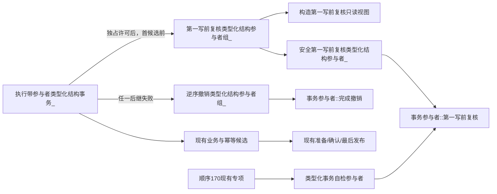

# WORLD-TREE-FEATURE-W-MC-PW 参与者第一写前复核提供者函数结构知识图谱 v0.1

日期：2026-08-03
创建侧正式代码基线：`9e9964693019c1827649224c92565d95e0b4504c`

## 1. 节点

| 身份 | 形态 | 物理所有者 | 责任 |
| --- | --- | --- | --- |
| `节点直接类型化结构第一写前复核只读视图` | final 值式借用视图 | `执行器.节点直接身份结构写入.ixx` | 暴露事务序号、当前/目标代次和不可变请求 |
| `节点直接类型化结构事务参与者状态::第一写前已复核` | 枚举值10 | 同上 | 唯一预复核成功状态 |
| `节点直接类型化结构事务参与者::第一写前复核` | private pure virtual | 同上 | 参与者真实预复核入口 |
| `安全第一写前复核类型化结构参与者_` | private static noexcept | 同上 | 捕获参与者异常并映射内部不一致 |
| `第一写前复核类型化结构参与者组_` | private static noexcept | 同上 | 登记序调用并维护已进入计数 |
| `逆序撤销类型化结构参与者组_` | 现有 private static noexcept | 同上 | 逆序尽力撤销已进入参与者 |
| `执行带参与者类型化结构事务_` | 现有 private 主算法 | 同上 | 在六分支持许可调用新阶段并统一收口 |
| `类型化事务自检参与者::第一写前复核` | test override | `自检.节点直接身份结构写入.ixx` | 记录顺序、视图和故障证据 |
| `WORLD-FEATURE-W-MC-A01—A12` | 现有顺序170专项 | 同上 | 原位扩展第一写前复核矩阵 |

## 2. 调用边



## 3. 数据边

| 来源 | 目标 | 材料 | 所有权/生命周期 |
| --- | --- | --- | --- |
| 执行器持有的独占许可 | 只读视图 | 事务序号、已发布代次 | 只复制数值，不暴露许可 |
| 当前请求 | 只读视图 | `const 节点直接类型化结构数据操作请求&` | 同步调用期借用，不得保存 |
| 组函数循环 | 失败收口 | 已进入事务参与者数量 | 调用前推进，贯穿候选/准备失败路径 |
| 参与者 | 组函数 | 单字段参与者状态 | 非10原样上送，异常转内部不一致 |
| 外层失败收口 | 逆序撤销函数 | span + 已进入数量 | 只撤销已经进入调用序列者 |

## 4. 六分支控制边

| 分支谓词 | 预复核前 | 预复核后首笔核心候选 |
| --- | --- | --- |
| `仅含类型合同` | 完整计划合同构造/排序、精确合同同义/异义读取、每域模拟高水位连续性 | `结构化发布合同未发布候选` |
| `仅含关系失效` | 全量当前关系预扫描 | `结构化失效已发布关系` |
| `仅含类型化值退役` | 全量当前值预扫描 | `结构化退役值未发布候选` |
| `仅含类型化值发布 && 读回仅含本次类型化值` | 全量值合同/来源/版本计划 | `结构化发布值未发布候选` |
| `仅含索引和节点删除 && 读回仅含索引` | 全量索引/删除计划、创建键未占用或同义/异义分类 | `结构化创建/移除索引候选` |
| `仅含节点关系和索引创建 && 读回仅含本次节点关系和当前索引` | 全量映射/端点/引用计划、创建键未占用或同义/异义分类 | `结构化创建节点未发布候选` |

## 5. 禁止边

```text
第一写前复核只读视图 -X-> 候选读回
第一写前复核只读视图 -X-> 计划身份见证
第一写前复核只读视图 -X-> 核心仓/许可/锁
参与者::第一写前复核 -X-> 默认成功实现
第一写前复核组 -X-> 核心候选建立
未调用参与者 -X-> 完成撤销
可只读预判的合同/索引冲突 -X-> 参与者第一写前复核
```

## 6. 依赖裁决

新合同只扩展执行器已有参与者协议，不引入新模块或数据操作依赖。正式代码只有一个自检派生类，所以执行器与核心自检两文件闭合；未来 FEATURE-W-DP 只能消费已发布合同，不能成为本提供者施工依赖或在本切片中落地。
