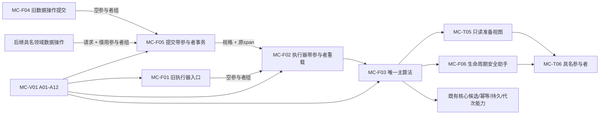

# WORLD-TREE-FEATURE-W-MC 类型化结构事务参与者桥接函数结构知识图谱 v0.1

日期：2026-08-03

基线：`4232074bafbcc0bb01ccad7b739851e9af547a36`

状态：目标函数知识图谱；代码待实现

## 1. 节点

| 身份 | 类型 | 完整身份 / 物理位置 | 状态 |
| --- | --- | --- | --- |
| MC-T01 | 类型 | `节点直接类型化结构事务参与者状态` / `核心/执行器.节点直接身份结构写入.ixx` | 待新增 |
| MC-T02 | 类型 | `节点直接类型化结构事务参与者结果` / 同上 | 待新增 |
| MC-T03 | 类型 | `节点直接类型化结构计划身份见证项` / 同上 | 待新增 |
| MC-T04 | 类型 | `节点直接类型化结构候选读回` / 同上 | 待新增 |
| MC-T05 | 类型 | `节点直接类型化结构提交准备只读视图` / 同上 | 待新增 |
| MC-T06 | 类型 | `节点直接类型化结构事务参与者` / 同上 | 待新增 |
| MC-F01 | 函数 | `节点直接身份结构写入执行器::执行节点直接类型化结构事务(const 节点直接类型化结构数据操作规格&) const` | 现有，目标修改 |
| MC-F02 | 函数 | `节点直接身份结构写入执行器::执行节点直接类型化结构事务(const 节点直接类型化结构数据操作规格&, span<节点直接类型化结构事务参与者* const>) const` | 待新增 |
| MC-F03 | 函数 | `节点直接身份结构写入执行器::执行带参与者类型化结构事务_(const 节点直接类型化结构数据操作请求&, bool, span<节点直接类型化结构事务参与者* const>) const` | 现有主算法原位改名/扩参 |
| MC-F04 | 函数 | `节点直接类型化结构数据操作::提交(const 节点直接类型化结构数据操作请求&) const` | 现有，目标修改 |
| MC-F05 | 函数 | `节点直接类型化结构数据操作::提交带参与者事务(const 节点直接类型化结构数据操作请求&, span<节点直接类型化结构事务参与者* const>) const` | 待新增 |
| MC-F06 | 函数组 | `有效/安全准备/安全确认/安全撤销/安全完成发布/逆序撤销` 私有简单助手 | 待新增 |
| MC-V01 | 验证 | `运行节点直接身份结构写入自检()` 的 `WORLD-FEATURE-W-MC-A01—A12` | 待新增 |

## 2. 调用与数据边



## 3. 所有权与生命周期边

| 来源 | 边 | 目标 | 合同 |
| --- | --- | --- | --- |
| 调用方 | 拥有 | 请求、参与者对象、地址数组 | 覆盖同步调用；执行器不保存 |
| 执行器 | 独占拥有 | 事务许可和事务顺序 | 不进入视图 |
| 各核心仓 | 拥有 | 核心候选 | 参与者只读值式见证 |
| 参与者 | 拥有 | 私有候选和内部锁 | 执行器只编排生命周期 |
| 只读视图 | 借用 | 请求、映射、候选读回 | 仅准备调用期间有效 |
| 事务域 | 发布 | 当前已发布代次 | 最后线性化点 |

## 4. 状态边

```text
参与者：未调用 -> 已准备 -> 已确认待发布 -> 已完成发布
                          \-> 已撤销
核心候选：业务候选与幂等候选均已形成 -> 参与者准备 -> 业务候选与幂等候选确认 -> 参与者确认 -> 业务候选与幂等候选完成发布 -> 参与者完成发布 -> 事务域代次推进
失败：准备/确认失败 -> 已触及参与者逆序撤销（含准备失败/异常当前项） -> 核心幂等候选撤销 -> 业务候选按分支逆序撤销 -> 三类撤销全成功才写持久未发布见证并清临时侧账
未知：任一撤销失败/未知 -> 保留临时侧账且不写未发布见证 -> 事务域隔离；见证失败/未知或清账失败 -> 保留可恢复侧账 -> 事务域隔离；最后发布失败 -> 事务域隔离
```

## 5. 双向追溯

| 对象 | 上游 | 下游 |
| --- | --- | --- |
| MC-F03 | 4040 §5；业务图 B05—B22 | 执行器函数图 N01—R06；MC-A01—A12 |
| MC-F05 | 4030 L1—领域边界；业务图 B01—B04 | 数据操作函数图 N01—N03 |
| MC-T05/T06 | 4040 参与者合同 | 后继 FEATURE-W-M 领域参与者；本叶子只提供桥 |
| MC-V01 | 详细设计 §9 | 计划验证矩阵 |

## 6. 禁止边

```text
L2服务 -X-> MC-F05 / MC-T06
参与者 -X-> 事务许可 / 仓库 / 会话 / 锁
核心执行器 -X-> 特征批次DTO / 领域variant / 无类型blob
MC-F03 -X-> 第二事务 / 第二发布代次
```
