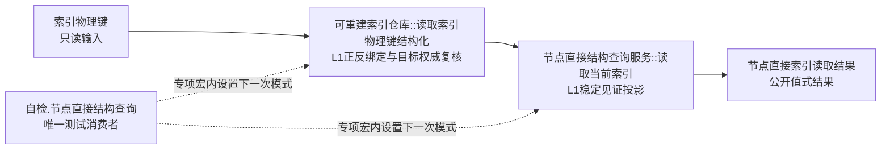
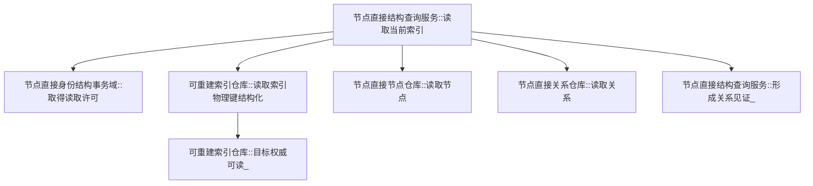
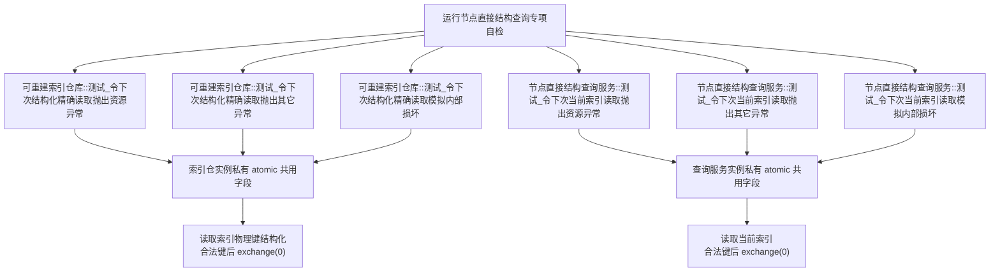
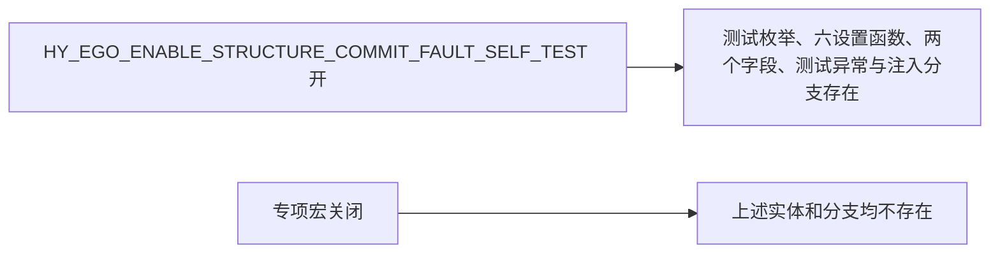

# WORLD-TREE-P1A2Q 精确索引读取防御谓词函数结构知识图谱 v0.1

日期：2026-08-03

设计身份：WORLD-TREE-P1A2Q

来源问题：`DRIFT-P1A2Q-INTERNAL-CORRUPTION-TEST-UNFORMABLE`

## 1. 模块、函数与所有权



索引仓拥有正向表、反向表和结构化精确读取的防御判断；查询服务拥有事务域许可、权威目标二次读取和稳定见证投影。专项自检只拥有测试指令，不取得容器、仓库事实或生产合同所有权。

## 2. 生产调用图



生产边保持详细设计 v0.2 的顺序。索引仓锁释放后才调用 `目标权威可读_`；查询服务的一份事务域共享许可覆盖代次、索引及目标复核。禁止从索引仓反向调用查询服务。

## 3. 专项宏内测试调用图



六个设置函数的唯一项目调用方是专项自检。每个对象只有一个宏内原子字段；后设模式覆盖尚未消费模式。非法键不消费，合法键后一次消费，第二次同输入自动恢复正常。

## 4. 稳定模式到生产检查节点

| 所有者 | 稳定值 | 设置合同 | 生产检查节点 | 首次结果 | 二次同输入 |
| --- | ---: | --- | --- | --- | --- |
| 索引仓 | 1 | 旧资源异常设置函数 | 取得仓锁前 | 资源失败、空记录 | 正常 |
| 索引仓 | 2 | 旧其它异常设置函数 | 取得仓锁前 | 内部不一致、空记录 | 正常 |
| 索引仓 | 3 | 候选事务序号非零 | 已发布记录 `候选事务序号 == 0` | 内部不一致、空记录 | 已读取 |
| 索引仓 | 4 | 记录键错配 | `记录.物理键 == 输入键` | 同上 | 已读取 |
| 索引仓 | 5 | 反向绑定缺失 | 反向目标组存在 | 同上 | 已读取 |
| 索引仓 | 6 | 反向绑定重复 | 输入键计数恰为1 | 同上 | 已读取 |
| 索引仓 | 7 | 目标权威不可读 | 解锁后的 `目标权威可读_` | 同上 | 已读取 |
| 查询服务 | 1 | 旧资源异常设置函数 | 取得事务域许可前 | 资源失败、代次0、空组 | 正常 |
| 查询服务 | 2 | 旧其它异常设置函数 | 取得事务域许可前 | 内部不一致、代次0、空组 | 正常 |
| 查询服务 | 3 | 节点目标权威读回缺失 | 节点记录存在 | 内部不一致、代次0、空组 | 成功 |
| 查询服务 | 4 | 关系目标权威读回缺失 | 关系记录存在 | 同上 | 成功 |
| 查询服务 | 5 | 关系端点见证不可形成 | `形成关系见证_` 完整 | 同上 | 成功 |

内部损坏模式只强制指定防御谓词失败，不改写对应事实。真实比较必须在生产函数中独立保留，测试模式不得代替生产判断。

## 5. 编译与禁止边



```text
专项自检 -X-> 直接写正向绑定_/反向绑定_/候选事务序号
专项自检 -X-> friend、可写容器引用、旧域索引仓
生产模块 -X-> 测试设置函数
测试模式 -X-> SQL、恢复、日志、全局或静态共享状态
索引仓锁持有区 -X-> 节点仓/关系仓读取
```

## 6. 结果追踪与完成边界

| 不变量 | 机械证明 |
| --- | --- |
| 内部损坏场景可构造 | 五个索引仓模式和三个查询服务模式逐项首次命中具名结果 |
| 零机器事实变化 | 每项调用前后事务域代次、六仓权威导出逐值相等 |
| 一次性和恢复 | 首次失败后第二次同输入返回原正常结果 |
| 入口顺序 | 非法键不消费，下一次匹配合法键仍命中预设模式 |
| 实例隔离 | 设置一个对象不改变另一个对象的读取 |
| 生产零调用 | 测试设置函数项目调用点只在专项自检 |
| 宏关闭零实体 | Debug/Release 对应宏矩阵和源级扫描均无测试实体 |

本图谱只冻结 P1A2Q 的函数关系、自检适配和防御谓词注入边界，不证明源码已经实现、构建、自检运行、P1A3 激活或生产世界树能力完成。
