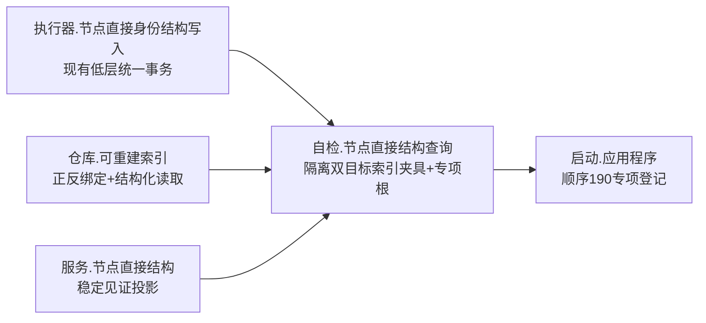
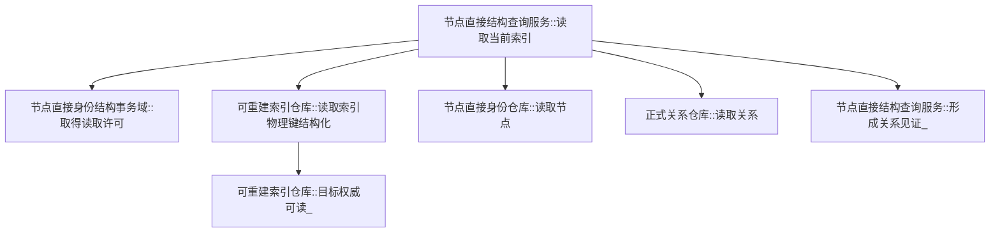
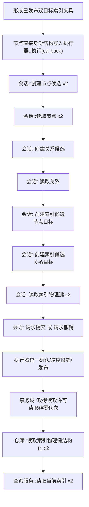
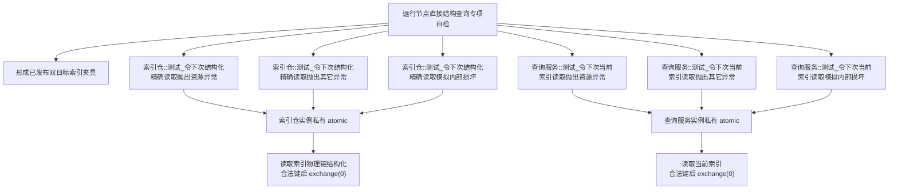

# WORLD-TREE-P1A2Q 精确索引读取防御谓词函数结构知识图谱 v0.2

日期：2026-08-03

设计身份：WORLD-TREE-P1A2Q

来源问题：`DRIFT-P1A2Q-RELATION-INDEX-FIXTURE-UNFORMABLE`

## 1. 模块与所有权



执行器、会话和三个权威仓继续拥有候选事务；P1A2Q 自检只拥有隔离对象、夹具编排和验证断言。公开 P1A2 提交服务只支持节点目标索引，不在关系夹具调用图中。

## 2. 生产读取调用图



生产边保持主详细设计 v0.2 和两张 v0.3 生产根函数图不变。索引仓锁释放后才调用 `目标权威可读_`；查询服务共享许可覆盖代次、索引及目标复核。

## 3. 隔离夹具形成调用图



同一次执行器事务拥有两节点、一关系和两索引候选。节点索引记录为 `{节点键, 节点, 文章节点, {}}`；关系索引记录为 `{关系键, 关系, {}, 关系句柄}`。禁止直接调用仓库确认、发布、恢复或私有容器。

## 4. 专项宏内测试调用图



六个设置函数唯一项目调用方是专项自检。非法键不消费；合法键后一次消费；第二次同输入恢复正常。两类关系服务模式只使用关系索引键，节点模式只使用节点索引键。

## 5. 模式、夹具与检查节点

| 所有者 | 稳定值 | 所需夹具 | 检查节点 | 首次结果 | 二次同输入 |
| --- | ---: | --- | --- | --- | --- |
| 索引仓 | 1/2 | 任一合法已发布索引 | 取得仓锁前异常边界 | 资源失败/内部不一致 | 正常 |
| 索引仓 | 3 | 任一已发布索引 | 候选事务序号为0 | 内部不一致、空记录 | 已读取 |
| 索引仓 | 4 | 任一已发布索引 | 记录键等于输入 | 同上 | 已读取 |
| 索引仓 | 5 | 任一已发布索引 | 反向组存在 | 同上 | 已读取 |
| 索引仓 | 6 | 任一已发布索引 | 同键计数恰一 | 同上 | 已读取 |
| 索引仓 | 7 | 任一已发布索引 | 解锁后目标权威可读 | 同上 | 已读取 |
| 查询服务 | 1/2 | 任一合法已发布索引 | 取得事务域许可前异常边界 | 资源失败/内部不一致 | 正常 |
| 查询服务 | 3 | 节点目标索引 | 节点记录存在 | 内部不一致、0、空组 | 成功 |
| 查询服务 | 4 | 关系目标索引 | 关系记录存在 | 同上 | 成功 |
| 查询服务 | 5 | 关系目标索引 | 关系端点见证完整 | 同上 | 成功 |

## 6. 禁止边

```text
专项自检 -X-> P1A2公开提交服务形成关系目标索引
专项自检 -X-> 扩展节点直接索引创建项/写项variant
专项自检 -X-> 正向绑定_/反向绑定_直接写入
专项自检 -X-> 仓库候选确认/发布/恢复入口
生产模块 -X-> 测试设置函数
测试模式 -X-> SQL、日志、缓存、全局/静态状态
低层夹具函数 -X-> L2或生产调用
```

## 7. 结果追踪与完成边界

| 不变量 | 机械证明 |
| --- | --- |
| 关系夹具可形成 | 单次低层执行器调用已提交，关系索引仓/服务基线读回均成功 |
| 节点关系同代次 | 两索引服务结果代次等于事务域同一非零发布代次 |
| 候选原子性 | 任一形成/读回失败时执行器撤销，零部分发布 |
| 防御场景可构造 | 五个索引仓模式和三个服务模式各到达匹配节点 |
| 注入零事实变化 | 每项调用前后代次和六仓权威导出逐值相等 |
| 一次性恢复 | 首次失败后第二次同输入返回基线结果 |
| 宏关闭零实体 | 测试枚举、六设置函数、两个字段和分支均不存在 |

本图谱完整替代 v0.1 的函数关系解释。它不证明 P1A2Q 代码已经完成、构建或运行，也不赋予生产提交服务关系索引发布能力。
