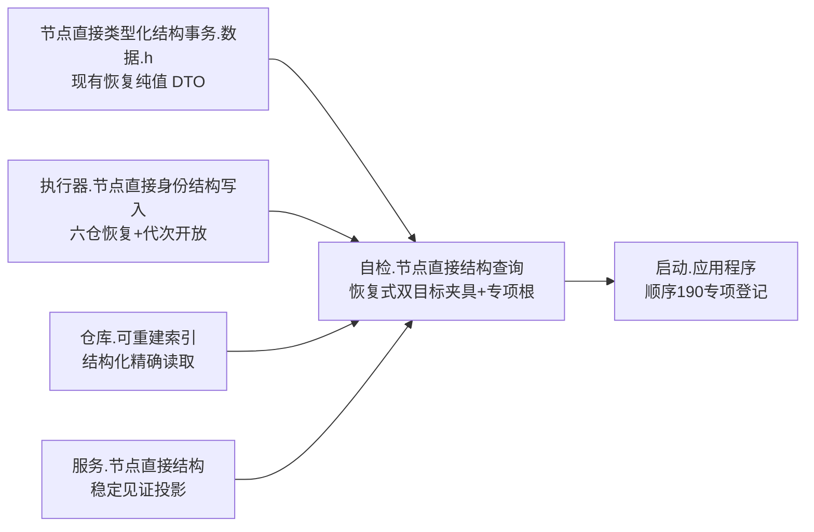
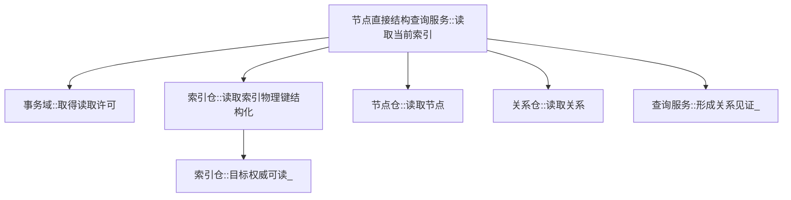
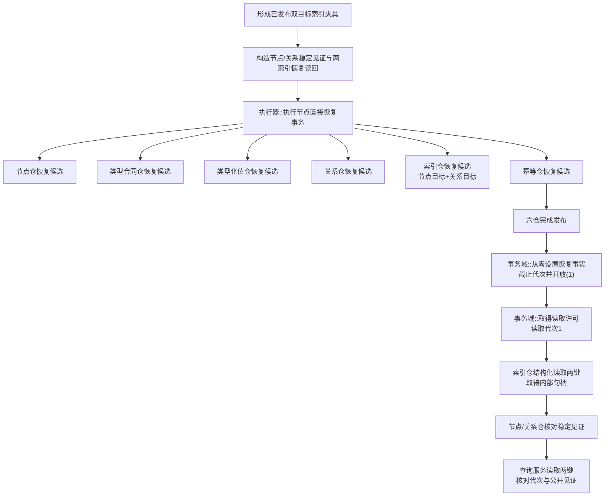
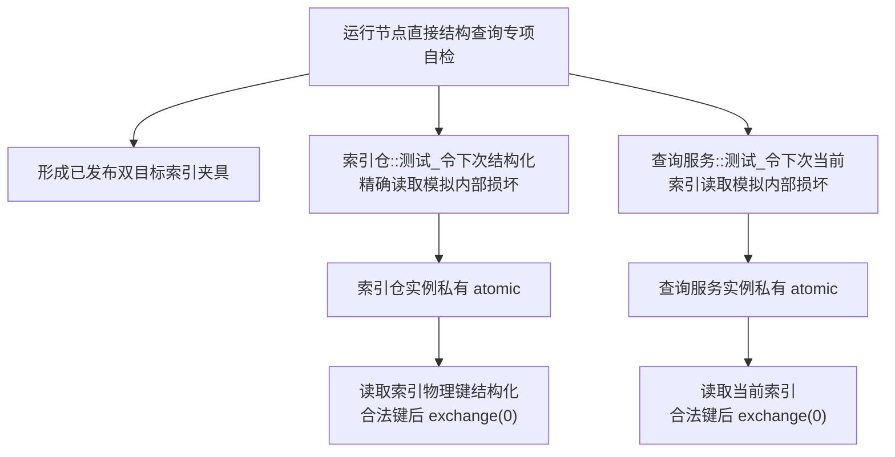

# WORLD-TREE-P1A2Q 精确索引读取防御谓词函数结构知识图谱 v0.3

日期：2026-08-03

设计身份：WORLD-TREE-P1A2Q

来源问题：`DRIFT-P1A2Q-LOWLEVEL-FIXTURE-PUBLISHED-GENERATION-UNFORMABLE`

## 1. 所有权与模块关系



P1A2Q 自检只拥有隔离对象、恢复请求编排和断言。执行器继续拥有六仓恢复事务和代次开放；
各仓继续拥有权威记录。共享恢复 DTO、执行器和仓库接口均为只读依赖。

## 2. 生产读取调用图



该图不因夹具修订而改变。查询服务共享许可覆盖代次、索引和目标复核。

## 3. 恢复式夹具调用图



低层 `执行(callback)` 不在本图中，因为它不推进运行期事实代次，不能作为本夹具发布提供者。

## 4. 故障谓词调用图



资源/其它异常设置函数继续共用各自字段。非法键不消费；合法键后一次消费；第二次恢复正常。

## 5. 字段来源与结果追踪

| 材料 | 唯一来源 | 最终消费者 |
| --- | --- | --- |
| 两节点/关系稳定见证 | 专项固定值 | 恢复请求、权威与服务读回核对 |
| 节点/关系索引键 | 专项固定互异值 | 恢复索引历史、仓/服务读取 |
| 内部节点/关系句柄 | 恢复后的索引仓结构化读回 | 权威记录读取、夹具返回 |
| 非零代次 | 恢复执行器最后发布边界 | 读取许可与两服务结果 |
| 防御测试模式 | 被测实例的宏内原子字段 | 对应生产检查节点 |

| 不变量 | 机械证明 |
| --- | --- |
| 双目标夹具可形成 | 单次恢复事务已恢复，仓/服务两类读回均成功 |
| 非零代次真实归属本夹具 | 六仓发布后同一恢复许可从0开放到1 |
| 内部句柄不伪造 | 只从两条结构化索引记录提取 |
| 防御注入零事实变化 | 每项调用前后代次和六仓导出逐值相等 |
| 一次性恢复 | 首次具名失败后第二次同输入返回基线 |
| 宏关闭零实体 | 测试枚举、设置函数、字段和分支均不存在 |

## 6. 禁止边

```text
专项自检 -X-> 执行器::执行(callback) 形成本夹具
专项自检 -X-> 无关普通事务补推代次
专项自检 -X-> 仓库恢复候选/确认/发布入口
专项自检 -X-> 推导或伪造内部句柄
专项自检 -X-> 扩展共享 DTO 或生产提交服务
生产模块 -X-> 测试设置函数
```

## 7. 完成边界

本图谱完整替代 v0.2 的夹具关系解释；生产读取与故障谓词关系保持。
它不证明 P1A2Q 已实现、构建、运行或进入后继世界树能力。
