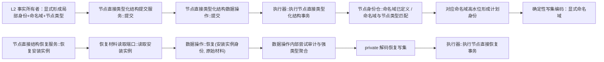

# WORLD-TREE-P1A2 显式命名域与恢复解码函数结构知识图谱 v0.2

日期：2026-08-03

状态：P1A2 修订目标设计图谱；待实现

## 1. 受影响调用子图



## 2. 所有权和数据边

| 数据 / 能力 | 唯一所有者 | 提供者 -> 消费者 | 禁止边 |
| --- | --- | --- | --- |
| 创建项显式命名域 | `节点直接结构合同.数据.h` | L2 -> 提交服务 -> 数据操作 -> 执行器 | L1 按节点类型猜测 |
| 命名域/类型合法性 | 节点身份仓 | 执行器 -> 仓库静态验证能力 | 第二运行期映射表 |
| 原始恢复材料 | 持久证据端口模块 | 恢复服务局部值 -> 数据操作只读引用 | 服务解码或聚合强类型请求 |
| 恢复解码 | 数据操作模块 | `恢复` -> private `解码恢复写集` | export/public/friend/第二解码器 |
| 强类型恢复请求 | 内部事务 DTO 头；值由数据操作形成 | 数据操作 -> 执行器规格 | L2/恢复服务构造 |
| 六仓恢复发布 | 执行器与六仓 | 数据操作 -> 执行器 | 服务直达执行器或仓库 |

## 3. 退役边

以下目标边在 P1A2 v0.2 中直接退出，不保留兼容路由：

```text
节点类型 -> 推断单一节点稳定主键命名域
恢复服务 -> 解码恢复写集
恢复服务 -> 构造节点直接恢复结构事务请求
外部模块 -> friend/public 解码器
服务恢复强类型入口 || 数据操作原始材料入口 的双路兼容
```

本图只替代 WORLD-TREE-P1 v0.1 图谱中上述受影响子图，其余世界树门面、提交事务、六仓发布和后继计划调用边继续沿用未漂移部分。
