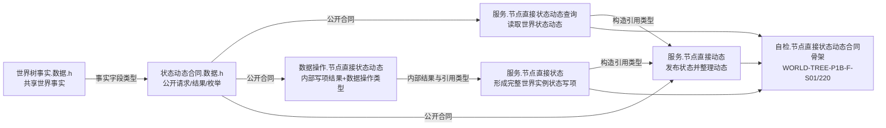
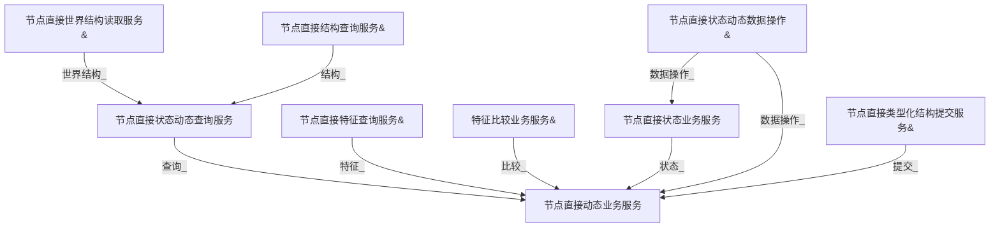
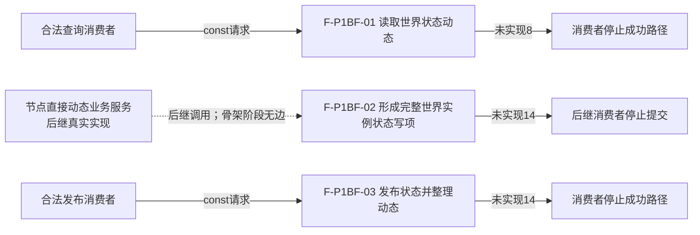

# WORLD-TREE-P1B-F 状态动态最终合同骨架函数结构知识图谱 v0.1

日期：2026-08-03

设计身份：WORLD-TREE-P1B-F

代码复核基线：`15a2fe877512c547c35369881a337af0c6b38926`

## 1. 图谱边界

本图谱冻结 P1B-F 的目标模块、类型所有权、构造依赖和三个根函数。所有类型和函数均为待实现合同；图中 `引用` 只表示构造期非空引用，不表示骨架函数发生调用。

## 2. 模块与类型

唯一所有权：

| 身份 | 唯一声明位置 | 允许消费者 |
| --- | --- | --- |
| 世界树状态事实、世界树动态事实、世界树状态动态读回、U64/I64类型化值事实 | `海中鱼巣/领域/世界树事实.数据.h` | 世界结构、特征、状态动态、快照和统一门面服务 |
| 状态动态查询/发布枚举、版本、公开请求和公开结果 | `海中鱼巣/领域/状态动态合同.数据.h` | 状态动态查询、状态、动态及合法上层消费者 |
| 节点直接状态写项形成结果 | `海中鱼巣/领域/数据操作.节点直接状态动态.ixx` | 节点直接状态业务服务、节点直接动态业务服务 |

## 3. 构造依赖

装配宿主拥有全部依赖并长于服务。成员、构造参数和初始化列表顺序必须与上图一致；禁止默认构造、指针、setter、可选依赖、运行期替换和兼容重载。

## 4. 根函数与调用边

| 根函数 | 完整签名 | 项目内被调函数 | 固定结果 | 后继替换者 |
| --- | --- | --- | --- | --- |
| F-P1BF-01 | `节点直接世界状态动态读取结果 节点直接状态动态查询服务::读取世界状态动态(const 节点直接世界状态动态读取请求& 请求) const noexcept` | 0 | 未实现8、代次0、三组空 | P1B-Q 原位替换 |
| F-P1BF-02 | `节点直接状态写项形成结果 节点直接状态业务服务::形成完整世界实例状态写项(const 世界树完整状态请求& 请求) const noexcept` | 0 | 未实现14、空局部身份/写项/读回规格 | P1B-W 原位替换 |
| F-P1BF-03 | `节点直接状态动态发布结果 节点直接动态业务服务::发布状态并整理动态(const 世界树状态动态请求& 请求) const noexcept` | 0 | 未实现14、代次0、不适用、空读回/缺项 | P1B-W 原位替换 |

虚线只表示后继 P1B-W 的目标调用关系，不是 P1B-F 骨架调用边。P1B-F 三个函数的直接调用、成员调用、回调和未解析调用均必须为0。

## 5. 数据、事务与版本闭合

| 维度 | P1B-F 固定值 | 禁止解释 |
| --- | --- | --- |
| 查询状态 | `未实现=8` | 已读取空组、未找到、资源失败 |
| 发布/写项状态 | `未实现=14` | 首状态成功、幂等读回、比较拒绝 |
| 查询/发布合同版本 | 1 | 运行期最大版本推断 |
| 事实/发布代次 | 0 | 当前代次或合法零世界 |
| 读回与缺项 | 空 | 默认事实或诊断成功 |
| 持久证据 | 不适用 | SQL成功、失败或恢复输入 |
| 事务 | 不取得、不建立、不发布 | 空事务成功 |

## 6. 验证追踪

| 设计不变量 | 机械证据 |
| --- | --- |
| 三个根函数身份各唯一 | Clang AST 目标模块函数身份计数各1 |
| 项目内调用边为0 | 每个根函数直接调用与未解析调用计数为0 |
| 最终构造完整 | 编译期 `is_constructible` 正例及默认/缺参/旧签名/指针反例 |
| 固定结果无抛 | 三个 `static_assert(noexcept(结果类型{...}))` |
| 零机器事实变化 | 调用前后 L1 权威仓、幂等账、持久侧账、发布代次逐值相等 |
| 消费者安全停止 | 未实现分支后的成功后继调用计数为0 |

## 7. 非完成声明

本图谱不证明任何状态、动态、比较、事务、恢复、SQL证据或生产入口已经实现。它只冻结最终 ABI 骨架及其零调用、零事实副作用边界。
