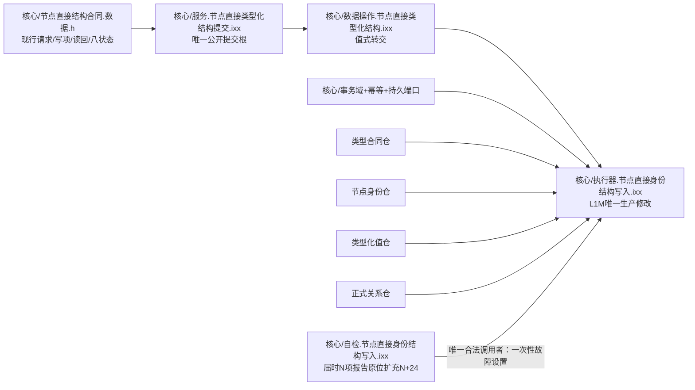
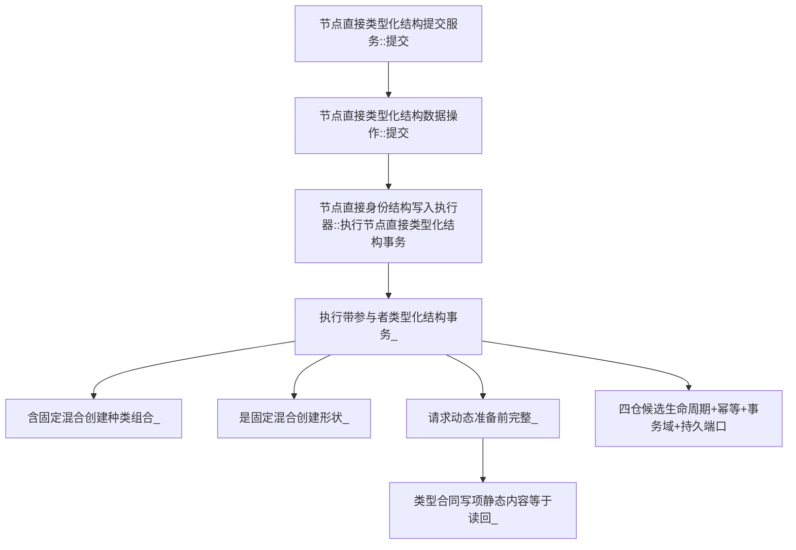
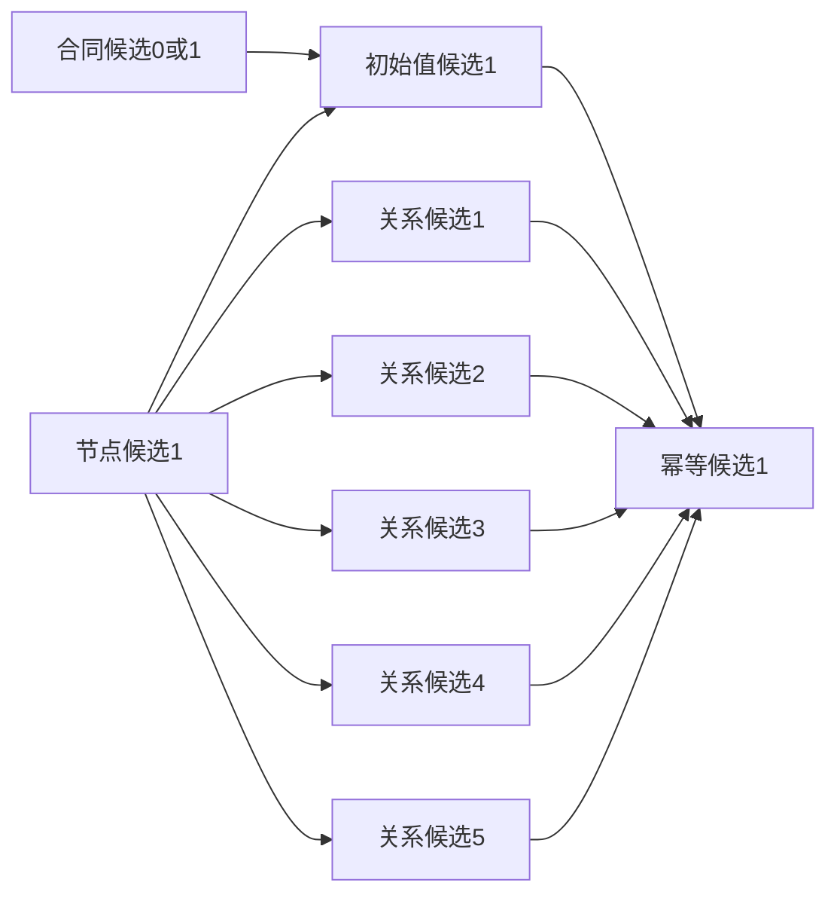
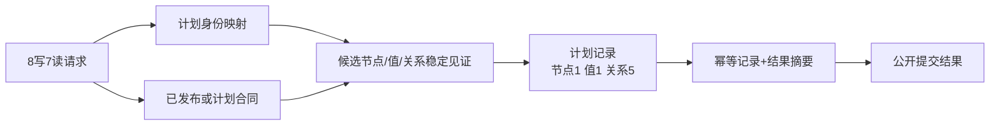

# WORLD-TREE-P1B-L1M 节点直接混合原子写集提供者函数结构知识图谱 v0.1

日期：2026-08-03

代码基线：`466d1ab0272ebb122203354a2a1e7be893db964a`

## 1. 模块和所有权



公开DTO、服务和数据操作模块只读不改。生产写权只在执行器；专项验证写权只在核心自检。

## 2. 目标调用图



S、D、E公开签名和函数体调用关系不变；P内新增目标分支及三个私有纯谓词。

## 3. 候选依赖图



确认和发布按 `CT→N→V→R1..R5→I`；撤销严格反向 `I→R5..R1→V→N→CT`。已发布静态同义合同不形成候选，因此不进入生命周期组。

## 4. 数据方向



稳定身份只由L1计划映射和仓候选形成；L2不能指定稳定主键。发布代次只来自事务域，持久证据不提供机器事实。

## 5. 状态映射图

| 下层事实 | 数据操作/公开状态 |
| --- | --- |
| 全部发布与读回一致 | 已提交1 |
| 同义已发布幂等 | 幂等读回2 |
| 静态/形状/端点/材料非法 | 入口拒绝3 |
| 异义幂等 | 幂等冲突4 |
| 代次/高水位/版本变化 | 版本漂移5 |
| 独占许可失败 | 许可拒绝6 |
| 可安全撤销的资源故障 | 资源失败7 |
| 撤销/发布/读回矛盾或同义未发布 | 内部不一致8并按需隔离 |

## 6. 禁止边

```text
L2消费者 -X-> 执行器/仓/许可/候选
提交服务 -X-> 第二提交入口
L1M -X-> SQL查询作为裁决
L1M -X-> 关系19或状态节点业务解释
L1M -X-> 非空领域参与者
L1M -X-> 任意其它混合写集扩张
L1M -X-> 多事务拆分
生产代码 -X-> 自检设置下一次混合原子写故障
```

## 7. 验证追踪

| 不变量 | 证明 |
| --- | --- |
| 唯一公开根 | 服务`提交`完整签名定义1次 |
| ABI零变化 | DTO/枚举/服务/data操作 blob不变 |
| 固定形状 | 8写7读逐位置负例 |
| 单一许可 | 事务根取得许可恰1次 |
| 候选不可见 | 确认前普通读0，事务内计划见证完整 |
| 逆序撤销 | 每个候选位置故障注入和高水位/占用读回 |
| 最后发布 | 代次只在全部发布后精确+1 |
| 通用读回 | 1节点+1值+5关系逐字段相等 |
| 幂等稳定 | 同义不再分配身份，异义零变化 |
| SQL非权威 | 持久端口故障不改已发布内存结果；无SQL读取边 |

本图谱是目标合同，不证明代码已实现或 W0 已可执行。
