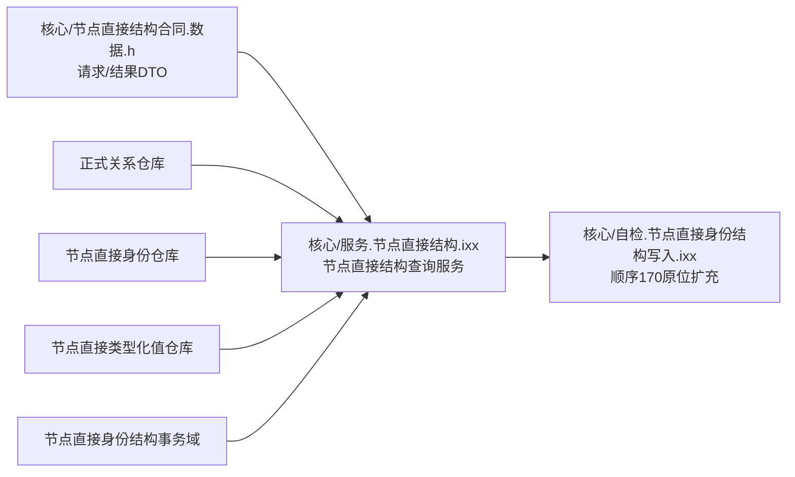
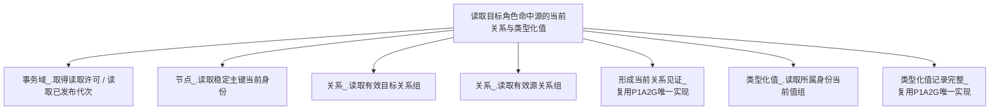
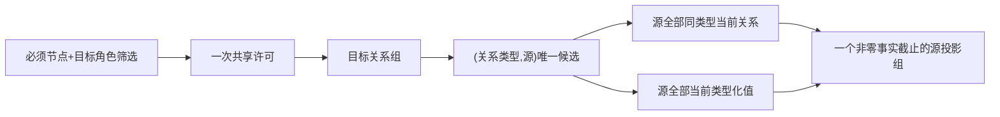

# WORLD-TREE-P1B-M 关系目标反向源同许可投影函数结构知识图谱 v0.1

日期：2026-08-03

设计身份：WORLD-TREE-P1B-M

## 1. 模块和身份

不新增模块、工程登记、服务类或构造依赖。

## 2. 函数依赖

禁止边：索引、类型合同、提交、恢复、执行器、SQL、材料、世界结构、特征、比较、状态动态服务。

## 3. 数据方向

P1A2G 输出关系目标的当前值；P1B-M 输出关系源自身的当前值。P1B-Q 消费 P1B-M 后解释关系19/20角色、类型化时间和值域。

## 4. 结果和错误

| 分支 | 结果 |
| --- | --- |
| 全部节点有效、零命中 | 成功+非零代次+空源组 |
| 当前源有关系、零当前值 | 成功+保留该源+空值组 |
| 未占用/历史占用 | 未找到+同次代次+首个未满足见证 |
| 当前主键类型/版本不同 | 版本漂移+同次代次+首个见证 |
| 非法请求 | 入口拒绝+全空 |
| 许可竞争 | 许可拒绝+全空 |
| 分配/长度异常 | 资源失败+全空 |
| 仓、端点、身份、当前值矛盾 | 内部不一致+全空 |

## 5. 验证追踪

| 不变量 | 机械证明 |
| --- | --- |
| 根函数身份唯一 | AST 完整限定签名计数1 |
| 一次许可 | `取得读取许可` 调用边计数1 |
| 方向正确 | 目标组读取后只以源调用源组读取 |
| 全角色保留 | 每个源结果含该类型全部当前源关系 |
| 一个事实截止 | 结果只使用许可读取的单一非零代次 |
| 零副作用 | 六仓、幂等、持久侧账和代次前后相等 |
| L1业务中性 | 生产代码不出现主体/场景/特征/前后状态/动态种类分支 |

## 6. 完成边界

本图谱只冻结 P1B-M 的 L1 目标反向源同许可投影，不证明 P1B-Q 或任何状态动态业务能力。
